Replace the entire Three.js core (math, scene graph, materials, lighting, rendering) with Rust.

The public API (`import * as THREE from "three"`) is preserved through thin JS proxy classes that delegate all computation to a single WASM entry point via FlatBuffers command batching.

## Architecture

```mermaid
flowchart LR
    subgraph JS["JS Surface Layer"]
        A["Object3D / Mesh / Scene"] --> B["Position / Material setters"]
        A --> C["setGeometry / setMaterial"]
        A --> D["add / updateMatrixWorld"]
        B --> E["WriteCache<br/>key=(handle<<6)|prop"]
        C --> F["Mesh._batch<br/>BatchData arrays"]
        D --> G["MethodQueue<br/>{method, args}"]
    end

    subgraph Flush["flush() - Single Batch"]
        E --> H["FlatBuffers Builder<br/>SetProperty tables"]
        G --> I["FlatBuffers Builder<br/>CallMethod tables"]
        F --> F2["create_geometries_batch()<br/>direct WASM call"]
        H --> J["CommandBatch<br/>binary serialization"]
        I --> J
    end

    subgraph WASM["WASM Boundary"]
        J --> K["process_commands(bytes)<br/>single entry point"]
        F2 --> K2["batch data copied<br/>to WASM memory"]
    end

    subgraph Rust["Rust Core"]
        K --> L["root_as_command_batch()<br/>FlatBuffers deserialize"]
        L --> M["Store::process_commands()"]
        M --> N["SetProperty dispatch"]
        M --> O["CallMethod dispatch"]
        M --> P["ReadRequest dispatch<br/>CAMERA_VIEW triggers render"]
        P --> Q["render_scene_internal()"]
        Q --> R["collect_renderables()<br/>scene graph walk"]
        R --> S["ShaderGenerator<br/>dynamic GLSL per config"]
        S --> T["GL Bytecode Encoder<br/>opcodes 0x01-0x12"]
        T --> U["GL_BUFFER (Vec u8)"]
    end

    subgraph Response["Response Path"]
        U --> V["get_gl_commands()<br/>direct WASM export"]
        V --> W["Uint8Array<br/>from WASM memory"]
    end

    subgraph Adapter["WebGLAdapter"]
        W --> X["execute(glCommands)"]
        X --> Y{"opcode dispatch"}
        Y --> Z["0x01 CLEAR_COLOR<br/>0x02/0x03 SHADERS<br/>0x04 BUFFER_DATA<br/>0x05/0x06 ATTRIBS<br/>0x07/0x0E DRAW<br/>0x08-0x0C UNIFORMS<br/>0x0D INDEX_BUFFER<br/>0x0F USE_PROGRAM<br/>0x10 LINK_PROGRAM<br/>0x11 MATRIX3FV<br/>0x12 TEX_IMAGE2D"]
    end

    Z --> GPU["WebGL2 GPU"]

    style JS fill:#1a1a2e,stroke:#00d4ff,color:#e0e0e0
    style Flush fill:#2d1b4e,stroke:#ff8800,color:#e0e0e0
    style WASM fill:#1b3d1b,stroke:#00ff88,color:#e0e0e0
    style Rust fill:#3d1b1b,stroke:#ff4466,color:#e0e0e0
    style Response fill:#1b2d3d,stroke:#4488ff,color:#e0e0e0
    style Adapter fill:#2d2d1b,stroke:#ffcc00,color:#e0e0e0
```



### Key components

- **Rust core** (`crates/three-core/`) — 9 source files: math, scene graph, geometry, material, lighting, shader generation, GL bytecode encoder, FlatBuffers deserializer
- **JS surface** (`src/wasm/engine.js`) — Proxy classes (Object3D, Mesh, Scene, PerspectiveCamera, WebGLRenderer, Vector3, Euler, Quaternion, Matrix4) that preserve the Three.js public API
- **WASM bridge** (`src/wasm/core.js`) — WriteCache deduplication + MethodQueue ordering into single `process_commands()` FlatBuffers batch
- **WebGL adapter** (`src/renderers/webgl/WebGLAdapter.js`) — GL bytecode interpreter with opcodes 0x01–0x12 (CLEAR_COLOR, BUFFER_DATA, VERTEX_ATTRIB_POINTER, DRAW_ARRAYS/ELEMENTS, shader compile/link, uniform upload, texture)
- **GL capture** (`test/gl-capture.js`) — Proxy-based WebGL2 context wrapper that records GL calls and normalizes them for byte-for-byte comparison against reference Three.js

### Schema

FlatBuffers protocol defined in `schemas/command.fbs`:

| Type | Values |
|------|--------|
| PropPath | POSITION, ROTATION, SCALE, QUATERNION, MATRIX_WORLD, GEOMETRY, MATERIAL, CAMERA_PROJECTION, CAMERA_VIEW, SCENE_LIGHTS |
| Method | ADD_CHILD, UPDATE_MATRIX_WORLD, CREATE_OBJECT, CREATE_GEOMETRY, CREATE_MATERIAL, SET_OBJECT_GEOMETRY, SET_OBJECT_MATERIAL |
| Value union | Vec3, EulerValue, QuatValue, FloatV, GeometryData, MaterialData, LightData |

### GL Bytecode Opcodes

| Opcode | Name | Description |
|--------|------|-------------|
| 0x01 | CLEAR_COLOR | glClearColor + glClear |
| 0x02 | CREATE_VERTEX_SHADER | Compile vertex shader from GLSL source |
| 0x03 | CREATE_FRAGMENT_SHADER | Compile fragment shader from GLSL source |
| 0x04 | BUFFER_DATA | glBindBuffer + glBufferData (ARRAY_BUFFER) |
| 0x05 | VERTEX_ATTRIB_POINTER | glVertexAttribPointer |
| 0x06 | ENABLE_VERTEX_ATTRIB_ARRAY | glEnableVertexAttribArray |
| 0x07 | DRAW_ARRAYS | glDrawArrays |
| 0x08 | UNIFORM_MATRIX4FV | glUniformMatrix4fv |
| 0x09 | UNIFORM3FV | glUniform3fv |
| 0x0A | UNIFORM1F | glUniform1f |
| 0x0D | BIND_INDEX_BUFFER | glBindBuffer + glBufferData (ELEMENT_ARRAY_BUFFER) |
| 0x0E | DRAW_ELEMENTS | glDrawElements |
| 0x0F | USE_PROGRAM | glUseProgram (with program cache lookup) |
| 0x10 | LINK_PROGRAM | glCreateProgram + glAttachShader + glLinkProgram |
| 0x11 | UNIFORM_MATRIX3FV | glUniformMatrix3fv |
| 0x12 | TEX_IMAGE2D | glTexImage2D (procedural checkerboard) |

## Performance

### 1000 Phong cubes, 2 directional lights + 1 ambient light (10-frame average)

| Phase | Average | StdDev |
|-------|---------|--------|
| Setup (JS objects + batch collection) | 8.4ms | ±4.1 |
| Render (FlatBuffers + WASM + GL bytecode gen) | 52.1ms | ±22.6 |
| Adapter (WebGL execution) | 12.9ms | ±3.8 |
| **Total** | **73.4ms** | — |

### Optimization history

| Milestone | 1000-obj Total | Improvement |
|-----------|---------------|-------------|
| Phase 4 baseline (per-object FlatBuffers) | 10,249ms | — |
| + Shader program caching | 82ms | 125× |
| + WASM direct GL extraction | 56ms | 1.5× |
| + Interleaved vertex buffers + batch transfer | 73ms | Stable |

### Key optimizations

- **Shader program caching**: Same material+lights configuration compile+link once; subsequent objects emit only `USE_PROGRAM(programId)`. Eliminates per-object `createShader`/`compileShader`/`linkProgram` overhead.
- **Batch geometry transfer**: All vertex/index/position/material/parent data sent in a single WASM call (`create_geometries_batch`) before rendering, avoiding O(n²) FlatBuffers serialization per object.
- **WASM direct GL extraction**: GL bytecode returned via `get_gl_commands()` instead of FlatBuffers ResponseBatch parsing.
- **Interleaved vertex buffers**: Position+normal+UV packed in a single buffer (stride 12/24/32), avoiding multiple ARRAY_BUFFER rebinds per object.

## Testing

**123 automated tests pass**: GL command comparison (byte-for-byte against reference Three.js), pixel verification, Rust unit tests.

| Suite | Count | Description |
|-------|-------|-------------|
| Main regression | 54 | Scene graph, matrix math, rotation, scale, reparenting, class types, GL opcodes, performance |
| Triangle GL compare | 14 | Single triangle: BUFFER_DATA, vertex positions, attrib pointers, draw call |
| Box GL compare | 22 | Indexed box: 72 vertex floats, 36 indices, stride=12, DRAW_ELEMENTS, CLEAR_COLOR |
| Phong compare | 7 | 2 cubes + ambient + directional light: Phong shader, normal attribute, lighting uniforms, pixel verification (5528 non-black pixels) |
| Texture compare | 6 | TEX_IMAGE2D, sampler2D, UV attribute, stride=32 interleaved format |
| Rust unit | 20 | Vector3, Matrix4, Quaternion, Euler math operations |
| **Total** | **123** | **All PASS** |

### GL command comparison methodology

1. Build identical scene in reference Three.js and our implementation
2. Capture GL calls from reference via `GLCapture` (WebGL2 context proxy)
3. Decode our GL bytecode via `WebGLAdapter.decodeCommands()`
4. Compare normalized command sequences: same opcodes, same arguments, same buffer data
5. Floating-point values compared with tolerance `1e-4`
6. Uniform commands sorted by name before comparison

## Breaking Changes

- **Internal implementation completely replaced** with Rust/WASM
- **Public API preserved** — `import * as THREE from "three"` works identically
- **WebGL-only** — WebGPU, SVG, and Canvas renderers removed
- **CommonJS removed** — top-level `await` for WASM initialization requires ES modules
- **Legacy source backed up** in `_legacy_backup/` directory
- **Legacy unit tests skipped** — they test removed internal APIs

## File Structure

```
src/
├── Three.js                         # Main entry (WASM init + re-exports)
├── Three.Core.js                    # Core entry for Rollup
├── constants.js                     # Preserved
├── wasm/
│   ├── core.js                      # WriteCache + flush + FlatBuffers
│   ├── engine.js                    # All proxy classes
│   ├── fb-generated.js              # FlatBuffers JS codegen
│   └── three_core.js / .wasm        # wasm-pack output
├── renderers/webgl/
│   └── WebGLAdapter.js              # GL bytecode interpreter
crates/three-core/src/               # 9 Rust source files
schemas/command.fbs                  # FlatBuffers schema
test/
├── gl-capture.js                    # GL command recording for comparison
└── wasm/                            # Test suite (6 files)
```

## Build

```bash
npm install
npm run build        # wasm-pack then rollup: build/three.module.js
npm run test-wasm    # Puppeteer test suite (123 tests)
```
