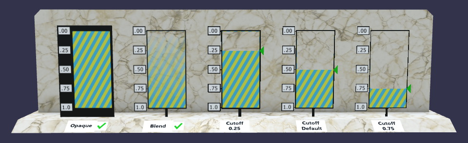
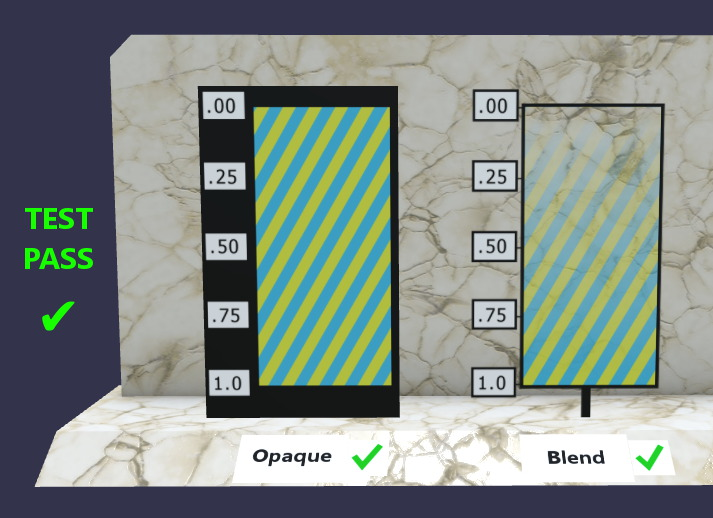
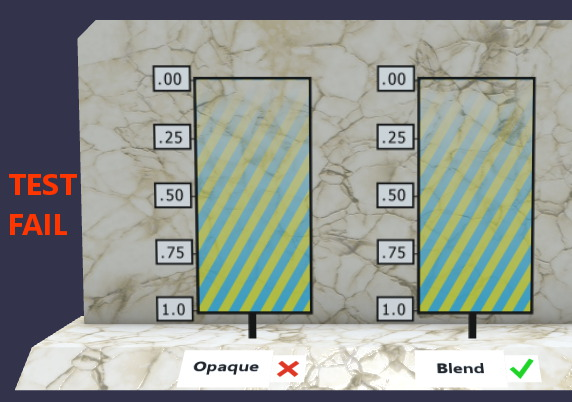
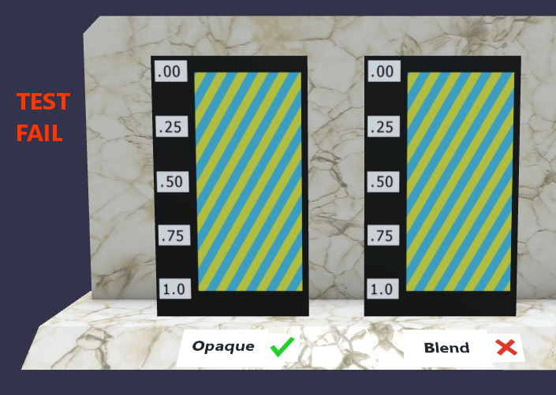
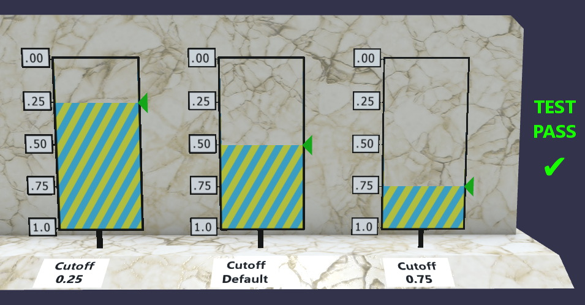
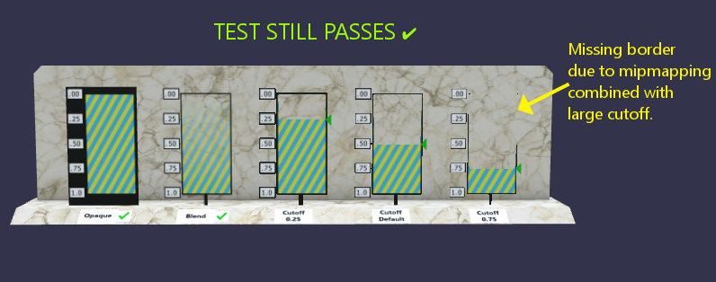
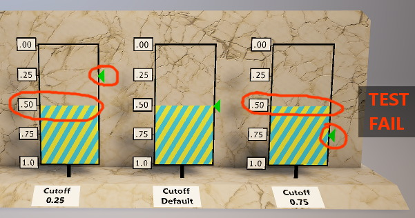
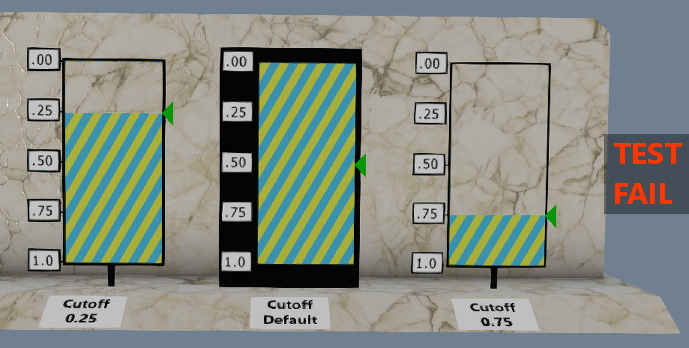

# Alpha Blend Mode Test

## Screenshot

## Description

This model tests the various alpha modes available in glTF 2.0.  There are three settings for `alphaMode`: `"OPAQUE"` (the default), `"BLEND"`, and `"MASK"`.  Of these, `"MASK"` takes an additional `alphaCutoff` value that modifies it.

## `OPAQUE` vs `BLEND`

The box on the far left uses the default alphaMode, `OPAQUE`.  Although the texturemap supplies an alpha channel, the alpha values are intentionally ignored here.

The next box shows the effects of alpha blending.  The texture contains a linear alpha ramp inside a black border, along with some labels.  At the bottom there are green check marks and hidden red X's, that will show check marks only when the requested mode is correctly applied.

## Problem: Alpha Values Used in Opaque Mode

The above screenshot shows what typically happens if a rendering engine decides to process alpha values from a texturemap without blending being specifically requested.  This is a test failure, and should be corrected in the engine.

Note that a red "X" mark has appeared next to `OPAQUE`, due to a green checkmark with zero alpha values being blended away.

# Problem: Lack of Alpha Blending

In the above screenshot, it appears that alpha blending is not available, or not enabled when a model requests it.  This is also a test failure, and could be due to a missing feature or other issues in the rendering engine.

Note that a red "X" mark has appeared next to `BLEND`.  This "X" has zero alpha values, and should be blended away, revealing a green checkmark behind it.

## `MASK` and `alphaCutoff`

This model tests `MASK` mode with the default value, shown in the middle box of three in the above screenshot, surrounded by cutoff values of `0.25` and `0.75`.

Because the alpha values in the box are a smooth linear ramp, we can expect the contents to be cut off at the corresponding values, as indicated by the green triangles.

Note that alpha blending should not be applied here:  Each texel is either fully opaque or discarded.  Depth buffering with writes enabled may be used in `MASK` mode.

## Known Mipmapping Issues

When a texture gets farther from the camera, a process called mipmapping may be used to blend texels (texturemap pixels) together.  This particular test model has a very thin opaque border adjacent to a lot of transparent texels.  When mipmapping blends these together, the resulting alpha values can land in the middle someplace.  Setting a high alpha mask cutoff value can cause these blended texels to be discarded.  This is not considered a failure for the purpose of this particular test.  However, if you see this effect in your own models, you may wish to set a lower cutoff value or increase the thickness of the affected area.

## Problem: `alphaCutoff` Not Respected

In the above screenshot, the requested `alphaCutoff` value is not being respected, and the default value of `0.5` appears to be applied regardless of the setting.  This is a test failure.

## Problem: No Default Cutoff

In this screenshot, it appears that the rendering engine is not using the value `0.5` for the default value of `alphaCutoff` when the model does not specify a particular value.  The glTF specification [names `0.5` as the default](https://github.com/KhronosGroup/glTF/blob/0890b76c62cc762ce82d4010df9bfebb1634839b/specification/2.0/schema/material.schema.json#L68), so this is a test failure.

## License Information

Copyright 2018 Analytical Graphics, Inc.
CC-BY 4.0 https://creativecommons.org/licenses/by/4.0/
Model and textures by Ed Mackey.
