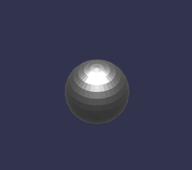

# Animated Morph Sphere

## Details

The sphere contains two morph targets in it:

  * **`blob`** : moves the vertices so that it becomes a somewhat amorphous fat, blob shape.
  * **`ship`** : moves the vertices so that it looks a bit like a spaceship, the goal being
    to just make it a much more complicated morph example than the [cube](../AnimatedMorphCube/README.md).

The animation loops, morphing between these two states.

## Screenshot

## License Information

Public domain ([CC0](https://creativecommons.org/publicdomain/zero/1.0/))

Donated by Howard Wolosky for glTF testing.
