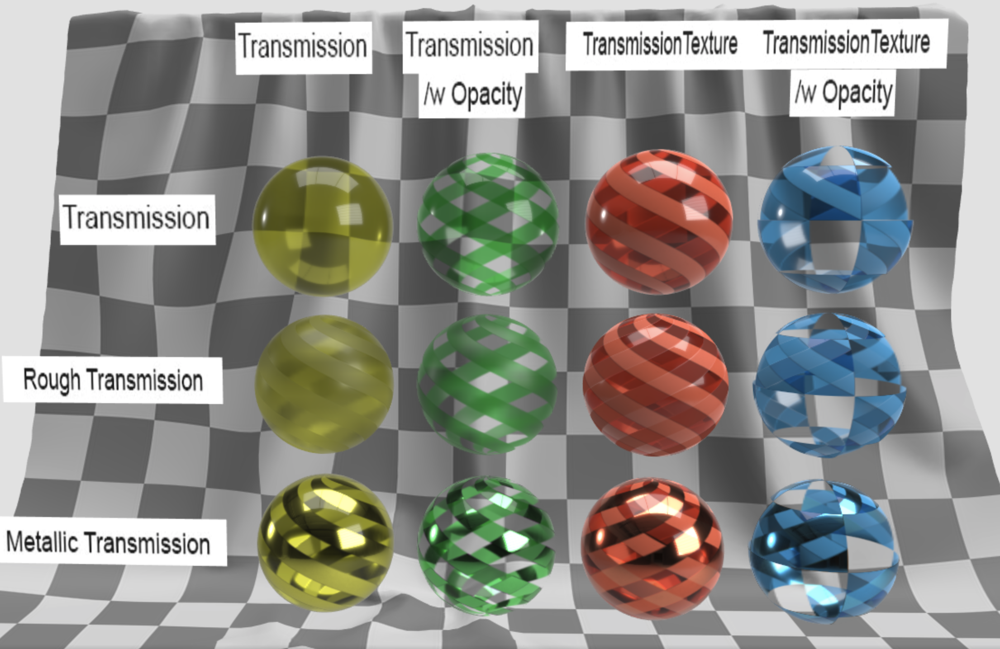

# Transmission Test

## Screenshot

## Description

This model demonstrates the usage of the `KHR_materials_transmission`. The grid of spheres demonstrate different combinations of uniform transmission and textured transmission and how they should render in conjunction with opacity (`baseColor.a`) and surface roughness/metalicity.

## License Information

  
To the extent possible under law, Adobe has waived all copyright and related or neighboring rights to this asset.
