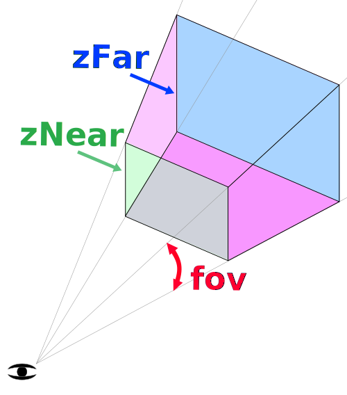

Title: Three.js Cameras
Description: How to use Cameras in Three.js

This article is one in a series of articles about three.js.
The first article was [about fundamentals](threejs-fundamentals.html).
If you haven't read that yet you might want to start there.

Let's talk about Cameras in three.js. We covered some of this in the [first article](threejs-fundamentals.html) but we'll cover it in more detail here.

The most common camera in three.js and the one we've been using up to this point is
the `PerspectiveCamera`. It gives a 3d view where things in the distance appear 
smaller than things up close.

The `PerspectiveCamera` defines a *frustum*. [A *frustum* is a solid pyramid shape with
the tip cut off](https://en.wikipedia.org/wiki/Frustum). 
By name of a solid I mean for example a cube, a cone, a sphere, a cylinder,
and a frustum are all names of different kinds of solids.

<div class="spread">
  <div><div data-diagram="shapeCube"></div><div>cube</div></div>
  <div><div data-diagram="shapeCone"></div><div>cone</div></div>
  <div><div data-diagram="shapeSphere"></div><div>sphere</div></div>
  <div><div data-diagram="shapeCylinder"></div><div>cylinder</div></div>
  <div><div data-diagram="shapeFrustum"></div><div>frustum</div></div>
</div>

I only point that out because I didn't know if for years. Some book or page would mention
*frustum* and my eyes would glaze over. Understanding it's the name of a type of solid
shape made those descriptions suddenly make more sense &#128517;

A `PerspectiveCamera` defines its frustum based on 4 properties. `near` defines where the
front of the frustum starts. `far` defines where it ends. `fov`, the field of view, defines 
how tall the front and back of the frustum are by computing the correct height to get 
the specified field of view at `near` units from the camera. The `aspect` defines how 
wide the front and back of the frustum are. The width of the frustum is just the height 
multiplied by the aspect.



Let's use the scene from [the previous article](threejs-lights.html) that has a ground
plane, a sphere, and a cube and make it so we can adjust the camera's settings

To do that we'll make a `MinMaxGUIHelper` for the `near` and `far` settings so `far` 
is always greater than `near`. It will have `min` and `max` properties that dat.GUI 
will adjust. When adjusted they'll set the 2 properties we specify.

```javascript
class MinMaxGUIHelper {
  constructor(obj, minProp, maxProp, minDif) {
    this.obj = obj;
    this.minProp = minProp;
    this.maxProp = maxProp;
    this.minDif = minDif;
  }
  get min() {
    return this.obj[this.minProp];
  }
  set min(v) {
    this.obj[this.minProp] = v;
    this.obj[this.maxProp] = Math.max(this.obj[this.maxProp], v + this.minDif);
  }
  get max() {
    return this.obj[this.maxProp];
  }
  set max(v) {
    this.obj[this.maxProp] = v;
    this.min = this.min;  // this will call the min setter
  }
}
```

Now we can setup our GUI like this

```javascript
function updateCamera() {
  camera.updateProjectionMatrix();
}

const gui = new dat.GUI();
gui.add(camera, 'fov', 1, 180).onChange(updateCamera);
const minMaxGUIHelper = new MinMaxGUIHelper(camera, 'near', 'far', 0.1);
gui.add(minMaxGUIHelper, 'min', 0.1, 50, 0.1).name('near').onChange(updateCamera);
gui.add(minMaxGUIHelper, 'max', 0.1, 50, 0.1).name('far').onChange(updateCamera);
```

Anytime the camera's settings change we need to call the camera's 
[`updateProjectionMatrix`](PerspectiveCamera.updateProjectionMatrix) function
so we made a function called `updateCamera` add passed it to dat.GUI to call it when things change.

{{{example url="../threejs-cameras-perspective.html" }}}

You can just the values and see how they work. Note we didn't make `aspect` setable since
it's taken from the size of the window so if you want to adjust the aspect open the example
in a new window and then size the window.

Still, I think it's a little hard to see so let's change the example so it has 2 cameras.
One will show our scene as we see it above, the other will show another camera looking at the
scene the first camera is drawing and showing that camera's frustum.

To do this we can use the scissor function of three.js.
Let's change it to draw 2 scenes with 2 cameras side by side using the scissor function

First off let's use some HTML and CSS to define 2 side by side elements. This will also
help us with events so both cameras can easily have their own `OrbitControls`.

```html
<body>
  <canvas id="c"></canvas>
+  <div class="split">
+     <div id="view1" tabindex="1"></div>
+     <div id="view2" tabindex="2"></div>
+  </div>
</body>
```

And the CSS that will make those 2 views show up side by side overlayed on top of
the canvas

```css
.split {
  position: absolute;
  left: 0;
  top: 0;
  width: 100%;
  height: 100%;
  display: flex;
}
.split>div {
  width: 100%;
  height: 100%;
}
```

Then in our code we'll add a `CameraHelper`. A `CameraHelper` draws the frustum for a `Camera`

```javascript
const cameraHelper = new THREE.CameraHelper(camera);

...

scene.add(cameraHelper);
```

Now let's look up the 2 view elements.

```javascript
const view1Elem = document.querySelector('#view1'); 
const view2Elem = document.querySelector('#view2');
```

And we'll set our existing `OrbitControls` to respond to the first
view element only.

```javascript
-const controls = new THREE.OrbitControls(camera, canvas);
+const controls = new THREE.OrbitControls(camera, view1Elem);
```

Let's make a second `PerspectiveCamera` and a second `OrbitControls`.
The second `OrbitControls` is tied to the second camera and gets input
from the second view element.

```
const camera2 = new THREE.PerspectiveCamera(
  60,  // fov
  2,   // aspect
  0.1, // near
  500, // far
);
camera2.position.set(40, 10, 30);
camera2.lookAt(0, 5, 0);

const controls2 = new THREE.OrbitControls(camera2, view2Elem);
controls2.target.set(0, 5, 0);
controls2.update();
```

Finally we need to render the scene from the point of view of each
camera using the scissor function to only render to part of the canvas.

Here is a function that given an element will compute the rectangle
of that element that overlaps the canvas. It will then set the scissor
and viewport to that rectangle and return the aspect for that size.

```javascript
function setScissorForElement(elem) {
  const canvasRect = canvas.getBoundingClientRect();
  const elemRect = elem.getBoundingClientRect();

  // compute a canvas relative rectangle
  const right = Math.min(elemRect.right, canvasRect.right) - canvasRect.left;
  const left = Math.max(0, elemRect.left - canvasRect.left);
  const bottom = Math.min(elemRect.bottom, canvasRect.bottom) - canvasRect.top;
  const top = Math.max(0, elemRect.top - canvasRect.top);

  const width = Math.min(canvasRect.width, right - left);
  const height = Math.min(canvasRect.height, bottom - top);

  // setup the scissor to only render to that part of the canvas
  renderer.setScissor(left, top, width, height);
  renderer.setViewport(left, top, width, height);

  // return the aspect
  return width / height;
}
```

And now we can use that function to draw the scene twice in our `render` function

```javascript
  function render() {

-    if (resizeRendererToDisplaySize(renderer)) {
-      const canvas = renderer.domElement;
-      camera.aspect = canvas.clientWidth / canvas.clientHeight;
-      camera.updateProjectionMatrix();
-    }

+    resizeRendererToDisplaySize(renderer);
+
+    // turn on the scissor
+    renderer.setScissorTest(true);
+
+    // render the original view
+    {
+      const aspect = setScissorForElement(view1Elem);
+
+      // adjust the camera for this aspect
+      camera.aspect = aspect;
+      camera.updateProjectionMatrix();
+      cameraHelper.update();
+
+      // don't draw the camera helper in the original view
+      cameraHelper.visible = false;
+
+      scene.background.set(0x000000);
+
+      // render
+      renderer.render(scene, camera);
+    }
+
+    // render from the 2nd camera
+    {
+      const aspect = setScissorForElement(view2Elem);
+
+      // adjust the camera for this aspect
+      camera2.aspect = aspect;
+      camera2.updateProjectionMatrix();
+
+      // draw the camera helper in the 2nd view
+      cameraHelper.visible = true;
+
+      scene.background.set(0x000040);
+
+      renderer.render(scene, camera2);
+    }

-    renderer.render(scene, camera);

    requestAnimationFrame(render);
  }

  requestAnimationFrame(render);
}
```

The code above sets the background color of the scene when rendering the
second view to dark blue just to make it easier to distinguish the two views.

We can also remove our `updateCamera` code since we're updating everything
in the `render` function.

```javascript
-function updateCamera() {
-  camera.updateProjectionMatrix();
-}

const gui = new dat.GUI();
-gui.add(camera, 'fov', 1, 180).onChange(updateCamera);
+gui.add(camera, 'fov', 1, 180);
const minMaxGUIHelper = new MinMaxGUIHelper(camera, 'near', 'far', 0.1);
-gui.add(minMaxGUIHelper, 'min', 0.1, 50, 0.1).name('near').onChange(updateCamera);
-gui.add(minMaxGUIHelper, 'max', 0.1, 50, 0.1).name('far').onChange(updateCamera);
+gui.add(minMaxGUIHelper, 'min', 0.1, 50, 0.1).name('near');
+gui.add(minMaxGUIHelper, 'max', 0.1, 50, 0.1).name('far');
```

And now you can use one view to see the frustum of the other.

{{{example url="../threejs-cameras-perspective-2-scenes.html" }}}

On the left you can see the original view and on the right you can
see a view showing the frustum of the camera on the left. As you adjust
`near`, `far`, `fov` and move the camera with mouse you can see that
only what's inside the frustum shown on the right appears in the scene on
the left.

Adjust `near` up to around 20 and you'll easily see the front of objects
disappear as they are no longer in the frustum. Adjust `far` below about 35
and you'll start to see the ground plane disappear as it's no longer in
the frustum.

This brings up the question, why not just set `near` to 0.0000000001 and `far`
to 10000000000000 or something like that so you can just see everything?
The reason is your GPU only has so much precision to decide if something 
is in front or behind something else. That precision is spread out between
`near` and `far`. Worse, by default the precision close the camera is detailed
and the precision far from the camera is course. The units use start with `near`
and slowly expand as they approach `far`.

Starting with the top example, let's change the code to insert 20 spheres in a
row.

```javascript
{
  const sphereRadius = 3;
  const sphereWidthDivisions = 32;
  const sphereHeightDivisions = 16;
  const sphereGeo = new THREE.SphereBufferGeometry(sphereRadius, sphereWidthDivisions, sphereHeightDivisions);
  const numSpheres = 20;
  for (let i = 0; i < numSpheres; ++i) {
    const sphereMat = new THREE.MeshPhongMaterial();
    sphereMat.color.setHSL(i * .73, 1, 0.5);
    const mesh = new THREE.Mesh(sphereGeo, sphereMat);
    mesh.position.set(-sphereRadius - 1, sphereRadius + 2, i * sphereRadius * -2.2);
    scene.add(mesh);
  }
}
```

and let's set `near` to 0.00001

```javascript
const fov = 45;
const aspect = 2;  // the canvas default
-const near = 0.1;
+const near = 0.00001;
const far = 100;
const camera = new THREE.PerspectiveCamera(fov, aspect, near, far);
```

We also need to tweak the GUI code a little to allow 0.00001 if the value is edited

```javascript
-gui.add(minMaxGUIHelper, 'min', 0.1, 50, 0.1).name('near').onChange(updateCamera);
+gui.add(minMaxGUIHelper, 'min', 0.00001, 50, 0.00001).name('near').onChange(updateCamera);
```

What do you think will happen?

{{{example url="../threejs-cameras-z-fighting.html" }}}

This is an example of *z fighting* where the GPU on your computer does not have
enough precision to decide which pixels are in front and which pixels are behind.

Just in case the issue doesn't show on your machine here's what I see on mine

<div class="threejs_center"></div>

One solution is to tell three.js use to a different method to compute which
pixels are in front and which are behind. We can do that by enabling 
`logarithmicDepthBuffer` when we create the `WebGLRenderer`

```javascript
-const renderer = new THREE.WebGLRenderer({canvas: canvas});
+const renderer = new THREE.WebGLRenderer({
+  canvas: canvas,
+  logarithmicDepthBuffer: true,
+});
```

and with that it might work

{{{example url="../threejs-cameras-logarithmic-depth-buffer.html" }}}

If this didn't fix the issue for you then you've run into one reason why
you can't always use this solution. That reason is because only certain GPUs 
support it. As of September 2018 almost no mobile devices support this
solution where as most desktops do.

Another reason not to choose this solution is it can be significantly slower
than the standard solution.

Even with this solution there is still limited resolution. Make `near` even
smaller or `far` even bigger and you'll eventually run into the same issues.

What that means is that you should always make an effort to choose a `near`
and `far` setting that fits your use case. Set `near` as far away from the camera
as you can and not have things disappear. Set `far` as close to the camera
as you can and not have things disappear. If you're trying to draw a giant
scene and show a close up of someone's face so you can see their eyelashes
while in the background you can see all the way to mountains 50 kilometers
in the distance well then you'll need to find other creative solutions that
maybe we'll go over later. For now, just be aware you should take care
to choose appropriate `near` and `far` values for your needs.

The 2nd most common camera is the `OrthographicCamera`. Rather than
specify a frustum it specfies a box with the settings `left`, `right`
`top`, `bottom`, `near`, and `far`. Because it's projecting a box
there is no perspective.

Let's change the 2 view example above to use an `OrthographicCamera`
in the first view.

First let's setup an `OrthographicCamera`.

```javascript
const left = -1;
const right = 1;
const top = 1;
const bottom = -1;
const near = 5;
const far = 50;
const camera = new THREE.OrthographicCamera(left, right, top, bottom, near, far);
camera.zoom = 0.2;
```

We set `left` and `bottom` to -1 and `right` and `top` to 1. This would make
a box 2 units wide and 2 units tall but we're going to adjust the `left` and `top`
by the aspect of the rectangle we're drawing to. We'll use the `zoom` property
to make it easy to adjust how many units are actually shown by the camera.

Let's add a GUI setting for `zoom`

```javascript
const gui = new dat.GUI();
+gui.add(camera, 'zoom', 0.01, 1, 0.01).listen();
```

The call to `listen` tells dat.GUI to watch for changes. This is here because
the `OrbitControls` can also control zoom. For example the scrollwheel on
a mouse will zoom via the `OrbitControls`.

Last we just need to change the part that renders the left
side to update the `OrthographicCamera`.

```javascript
{
  const aspect = setScissorForElement(view1Elem);

  // update the camera for this aspect
-  camera.aspect = aspect;
+  camera.left   = -aspect;
+  camera.right  =  aspect;
  camera.updateProjectionMatrix();
  cameraHelper.update();

  // don't draw the camera helper in the original view
  cameraHelper.visible = false;

  scene.background.set(0x000000);
  renderer.render(scene, camera);
}
```

and now you can see an `OrthographicCamera` at work.

{{{example url="../threejs-cameras-orthographic-2-scenes.html" }}}

An `OrthographicCamera` is most often used if using three.js
to draw 2D things. You'd decide how many units you want the camera
to show. For example if you want one pixel of canvas to match
one unit in the camera you could do something like

To put the origin at the center and have 1 pixel = 1 three.js unit
something like

```javascript
camera.left = -canvas.width / 2;
camera.right = canvas.width / 2;
camera.top = canvas.heigth / 2;
camera.bottom = -canvas.height / 2;
camera.near = -1;
camera.far = 1;
camera.zoom = 1;
```

Or if we wanted the origin to be in the top left just like a 
2D canvas we could use this

```javascript
camera.left = 0;
camera.right = canvas.width;
camera.top = 0;
camera.bottom = canvas.height;
camera.near = -1;
camera.far = 1;
camera.zoom = 1;
```

In which case the top left corner would be 0,0 just like a 2D canvas

Let's try it! First let's set the camera up

```javascript
const left = 0;
const right = 300;  // default canvas size
const top = 0;
const bottom = 150;  // default canvas size
const near = -1;
const far = 1;
const camera = new THREE.OrthographicCamera(left, right, top, bottom, near, far);
camera.zoom = 1;
```

Then let's load 6 textures and make 6 planes, one for each texture.
We'll parent each plane to a `THREE.Object3D` to make it easy to offset
the plane so it's center appears to be at it's top left corner.

```javascript
const loader = new THREE.TextureLoader();
const textures = [
  loader.load('resources/images/flower-1.jpg'),
  loader.load('resources/images/flower-2.jpg'),
  loader.load('resources/images/flower-3.jpg'),
  loader.load('resources/images/flower-4.jpg'),
  loader.load('resources/images/flower-5.jpg'),
  loader.load('resources/images/flower-6.jpg'),
];
const planeSize = 256;
const planeGeo = new THREE.PlaneBufferGeometry(planeSize, planeSize);
const planes = textures.map((texture) => {
  const planePivot = new THREE.Object3D();
  scene.add(planePivot);
  texture.magFilter = THREE.NearestFilter;
  const planeMat = new THREE.MeshBasicMaterial({
    map: texture,
    side: THREE.DoubleSide,
  });
  const mesh = new THREE.Mesh(planeGeo, planeMat);
  planePivot.add(mesh);
  // move plane so top left corner is origin
  mesh.position.set(planeSize / 2, planeSize / 2, 0);
  return planePivot;
});
```

and we need to update the camera if the size of the canvas
changes.

```javascript
function render() {

  if (resizeRendererToDisplaySize(renderer)) {
    camera.right = canvas.width;
    camera.bottom = canvas.height;
    camera.updateProjectionMatrix();
  }

  ...
```

`planes` is an array of `THREE.Mesh`, one for each plane.
Let's move them around based on the time.

```javascript
function render(time) {
  time *= 0.001;  // convert to seconds;

  ...

  const xRange = Math.max(20, canvas.width - planeSize) * 2;
  const yRange = Math.max(20, canvas.height - planeSize) * 2;

  planes.forEach((plane, ndx) => {
    const speed = 180;
    const t = time * speed + ndx * 300;
    const xt = t % xRange;
    const yt = t % yRange;

    const x = xt < xRange / 2 ? xt : xRange - xt;
    const y = yt < yRange / 2 ? yt : yRange - yt;

    plane.position.set(x, y, 0);
  });

  renderer.render(scene, camera);
```

And you can see the images bounce pixel perfect off the edges of the
canvas using pixel math just like a 2D canvas

{{{example url="../threejs-cameras-orthographic-canvas-top-left-origin.html" }}}

Another common use for an `OrthographicCamera` is to draw the
up, down, left, right, front, back views of a 3D modeling
program or a game engine's editor.

<div class="threejs_center"></div>

In the screenshot above you can see 1 view is a perspective view and 3 views are
orthographic views.

That's the fundamentals of cameras. We'll cover a few common ways to move cameras
in other articles. For now lets move on to [shadows](threejs-shadows.html).

<canvas id="c"></canvas>
<script src="../resources/threejs/r98/three.min.js"></script>
<script src="../resources/threejs/r98/js/controls/TrackballControls.js"></script>
<script src="resources/threejs-lesson-utils.js"></script>
<script src="resources/threejs-cameras.js"></script>
