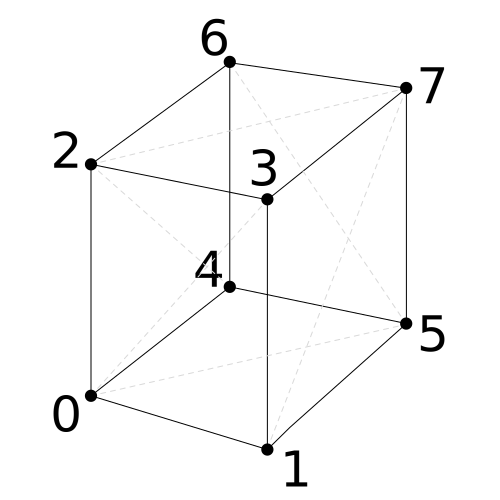
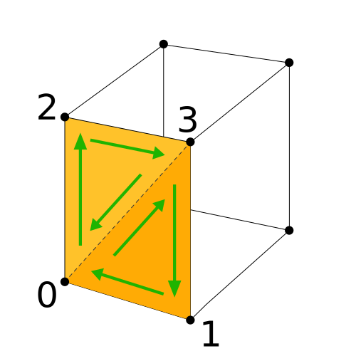

Title: Three.js Custom Geometry
Description: How to make your own geometry.

A [previous article](threejs-primitives.html) gave a tour of
the various built in primitives included in THREE.js. In this
article we'll cover making our own geometry.

Just to be clear, if you are serious about making 3D content,
the most common way is to use a 3D modeling package like
[Blender](https://blender.org),
[Maya](https://www.autodesk.com/products/maya/overview),
[3D Studio Max](https://www.autodesk.com/products/3ds-max/overview),
[Cinema4D](https://www.maxon.net/en-us/), etc...
You'd build a model and then export to [gLTF](threejs-load-gltf.html)
or [.obj](threejs-load-obj.html) and load them up.
Whichever one you choose, expect to spend 2 or 3 weeks going through
their respective tutorials as all of them have a learning curve
to be useful.

Still, there are times when we might want to generate our own
3D geometry in code instead of using a modeling package.

First let's just make a cube. Even though three.js already
provides us with `BoxGeometry` and `BoxBufferGeometry` a
cube is easy to understand so let's start there.

There are 2 ways to make custom geometry in THREE.js. One
is with the `Geometry` class, the other is `BufferGeometry`.
Each has their advantages. `Geometry` is arguably easier to
use but slower and uses more memory. For few 1000s triangles
it's a great choice but for 10s of thousands of triangles
it might be better to use `BufferGeometry`.

`BufferGeometry` is arguably harder to use but uses less
memory and is faster. If quick rule of thumb might be
if you're going to generate more than 10000 triangles
consider using `BufferGeometry`.

Note when I say `Geometry` is slower I mean it is slower to
start and slower to modify but it is not slower to draw so
if you're not planning on modifying your geometry then
as long as it's not too large there will only be slightly more
delay for your program to start using `Geometry` vs using
`BufferGeometry`. We'll go over both eventually. For now
though let's use geometry as it's easier to understand IMO.

First let's make a cube with `Geometry`. We'll start
with an example from [the article on responsiveness](threejs-responsive.html).

Let's remove the part that uses `BoxGeometry` and replace it with
a `Geometry`.

```js
-const boxWidth = 1;
-const boxHeight = 1;
-const boxDepth = 1;
-const geometry = new THREE.BoxGeometry(boxWidth, boxHeight, boxDepth);
+const geometry = new THREE.Geometry();
```

Now let's add the 8 corners of a cube. Here are the 8 corners.

<div class="threejs_center"></div>

Centered around the origin we can add the vertex positions like this

```js
const geometry = new THREE.Geometry();
+geometry.vertices.push(
+  new THREE.Vector3(-1, -1, -1),  // 0
+  new THREE.Vector3( 1, -1, -1),  // 1
+  new THREE.Vector3(-1,  1, -1),  // 2
+  new THREE.Vector3( 1,  1, -1),  // 3
+  new THREE.Vector3(-1, -1,  1),  // 4
+  new THREE.Vector3( 1, -1,  1),  // 5
+  new THREE.Vector3(-1,  1,  1),  // 6
+  new THREE.Vector3( 1,  1,  1),  // 7
+);
```

We then need to make triangles, 2 for each face of the cube

<div class="threejs_center"></div>

We do that by creating `Face3` objects and specifying the indices
of the 3 vertices that make up that face.

The order we specify the vertices is important. To be pointing toward the
outside of the cube they must be specified in a counter clockwise direction
when that triangle is facing the camera.

<div class="threejs_center"></div>

Following that pattern we can specify the 12 triangles that make
the cube like this

```js
geometry.faces.push(
   // front
   new THREE.Face3(0, 2, 3),
   new THREE.Face3(0, 3, 1),
   // right
   new THREE.Face3(1, 3, 7),
   new THREE.Face3(1, 7, 5),
   // back
   new THREE.Face3(5, 7, 6),
   new THREE.Face3(5, 6, 4),
   // left
   new THREE.Face3(4, 6, 2),
   new THREE.Face3(4, 2, 0),
   // top
   new THREE.Face3(2, 6, 7),
   new THREE.Face3(2, 7, 3),
   // bottom
   new THREE.Face3(4, 0, 1),
   new THREE.Face3(4, 1, 5),
);
```

A few other minor changes to the original code and it should
work.

These cubes are twice as large as the `BoxGeometry` we were
using before so let's move the camera back a little

```js
const fov = 75;
const aspect = 2;  // the canvas default
const near = 0.1;
-const far = 5;
+const far = 100;
const camera = new THREE.PerspectiveCamera(fov, aspect, near, far);
-camera.position.z = 2;
+camera.position.z = 5;
```

and let's separate them a little more and I changed their colors just because

```js
const cubes = [
-  makeInstance(geometry, 0x44aa88,  0),
-  makeInstance(geometry, 0x8844aa, -2),
-  makeInstance(geometry, 0xaa8844,  2),
+  makeInstance(geometry, 0x44FF44,  0),
+  makeInstance(geometry, 0x4444FF, -4),
+  makeInstance(geometry, 0xFF4444,  4),
];
```

One last thing is we haven't added normals yet so we
can't do any lighting. Let's change the material
to something that doesn't need lights.

```js
function makeInstance(geometry, color, x) {
-  const material = new THREE.MeshPhongMaterial({color});
+  const material = new THREE.MeshBasicMaterial({color});

  const cube = new THREE.Mesh(geometry, material);
  scene.add(cube);

  ...
```

and we get cubes we made ourselves.

{{{example url="../threejs-custom-geometry-cube.html" }}}

We can specify a color per face by setting the `color` property of
each face.

```js
geometry.faces[ 0].color = geometry.faces[ 1].color = new THREE.Color('red');
geometry.faces[ 2].color = geometry.faces[ 3].color = new THREE.Color('yellow');
geometry.faces[ 4].color = geometry.faces[ 5].color = new THREE.Color('green');
geometry.faces[ 6].color = geometry.faces[ 7].color = new THREE.Color('cyan');
geometry.faces[ 8].color = geometry.faces[ 9].color = new THREE.Color('blue');
geometry.faces[10].color = geometry.faces[11].color = new THREE.Color('magenta');
```

note we need to tell the material we want to use `FaceColors`

```js
-const material = new THREE.MeshBasicMaterial({color});
+const material = new THREE.MeshBasicMaterial({vertexColors: THREE.FaceColors});
```

{{{example url="../threejs-custom-geometry-cube-face-colors.html" }}}

We can instead set the color of each individual vertex by setting the `vertexColors`
property to an array of the 3 colors for the 3 vertices.

```js
geometry.faces.forEach((face, ndx) => {
  face.vertexColors = [
    (new THREE.Color()).setHSL(ndx / 12      , 1, 0.5),
    (new THREE.Color()).setHSL(ndx / 12 + 0.1, 1, 0.5),
    (new THREE.Color()).setHSL(ndx / 12 + 0.2, 1, 0.5),
  ];
});
```

and we need to tell the material to use vertex colors

```js
-const material = new THREE.MeshBasicMaterial({vertexColors: THREE.FaceColors});
+const material = new THREE.MeshBasicMaterial({vertexColors: THREE.VertexColors});
```

{{{example url="../threejs-custom-geometry-cube-vertex-colors.html" }}}

To use lighting we need normals. Normals are vectors that specify direction.
Just like the colors we can specify a normal for the face by setting the `normal`
property on each face with

```js
face.normal = new THREE.Vector3(...)
```

or we can specify a normal for each vertex by setting the `vertexNormals`
property with something like

```js
face.vertexNormals = [
  new THREE.Vector3(...),
  new THREE.Vector3(...),
  new THREE.Vector3(...),
]
```

but often it's much easier to just ask THREE.js to compute normals
for us based on the positions we specified.

For face normals we'd call `Geometry.computeFaceNormals` as in

```js
geometry.computeFaceNormals();
```

Removing the vertex color stuff and changing the material back to `MeshPhongMaterial`

```js
+const material = new THREE.MeshBasicMaterial({vertexColors: THREE.VertexColors});
-const material = new THREE.MeshPhongMaterial({color});
```

and now our cubes can be lit.

{{{example url="../threejs-custom-geometry-cube-face-normals.html" }}}

Using face normals will always give us a faceted look. We can use
vertex normals for a smoother look by calling `Geometry.computeVertexNormals`

```js
-geometry.computeFaceNormals();
+geometry.computeVertexNormals();
```

Unfortunately a cube is not a good candidate for vertex normals since it
means each vertex gets its normal from the
normals of all the faces it shares.

{{{example url="../threejs-custom-geometry-cube-vertex-normals.html" }}}

Adding texture coordinates, sometimes called UVs, is done via an array of
layers of parallel arrays to the `faces` array which is set via `Geometry.faceVertexUvs`.
For our cube we could do something like

```js
 geometry.faceVertexUvs[0].push(
   // front
   [ new THREE.Vector2(0, 0), new THREE.Vector2(0, 1), new THREE.Vector2(1, 1) ],
   [ new THREE.Vector2(0, 0), new THREE.Vector2(1, 1), new THREE.Vector2(1, 0) ],
   // right
   [ new THREE.Vector2(0, 0), new THREE.Vector2(0, 1), new THREE.Vector2(1, 1) ],
   [ new THREE.Vector2(0, 0), new THREE.Vector2(1, 1), new THREE.Vector2(1, 0) ],
   // back
   [ new THREE.Vector2(0, 0), new THREE.Vector2(0, 1), new THREE.Vector2(1, 1) ],
   [ new THREE.Vector2(0, 0), new THREE.Vector2(1, 1), new THREE.Vector2(1, 0) ],
   // left
   [ new THREE.Vector2(0, 0), new THREE.Vector2(0, 1), new THREE.Vector2(1, 1) ],
   [ new THREE.Vector2(0, 0), new THREE.Vector2(1, 1), new THREE.Vector2(1, 0) ],
   // top
   [ new THREE.Vector2(0, 0), new THREE.Vector2(0, 1), new THREE.Vector2(1, 1) ],
   [ new THREE.Vector2(0, 0), new THREE.Vector2(1, 1), new THREE.Vector2(1, 0) ],
   // bottom
   [ new THREE.Vector2(0, 0), new THREE.Vector2(0, 1), new THREE.Vector2(1, 1) ],
   [ new THREE.Vector2(0, 0), new THREE.Vector2(1, 1), new THREE.Vector2(1, 0) ],
);
```

It's important to notice `faceVertexUvs` is an array of layers. Each layer
is another set of UV coordinates. By default there is one layer of UV coordinates,
layer 0, so we just add our UVs to that layer.

Let's [add a texture](threejs-textures.html) to our material and switch back
back to compute face normals

```js
-geometry.computeVertexNormals();
+geometry.computeFaceNormals();

+const loader = new THREE.TextureLoader();
+const texture = loader.load('resources/images/star.png');

function makeInstance(geometry, color, x) {
-  const material = new THREE.MeshPhongMaterial({color});
+  const material = new THREE.MeshPhongMaterial({color, map: texture});

  const cube = new THREE.Mesh(geometry, material);
  scene.add(cube);

  ...
```

{{{example url="../threejs-custom-geometry-cube-texcoords.html" }}}

Putting that all together, let's make a simple heightmap based
terrain mesh.

A heightmap based terrain is where you have a 2D array of heights
that you apply them to a grid. An easy way to get a 2D array of heights
is to draw them in an image editing program. Here's an image I drew.
It's 64x64 pixels

<div class="threejs_center"></div>

We'll load that and then generate a heightmap mesh from it.
We can use the `ImageLoader` to load the image.

```js
const imgLoader = new THREE.ImageLoader();
imgLoader.load('resources/images/heightmap-64x64.png', createHeightmap);

function createHeightmap(image) {
  // extract the data from the image by drawing it to a canvas
  // and calling getImageData
  const ctx = document.createElement('canvas').getContext('2d');
  const {width, height} = image;
  ctx.canvas.width = width;
  ctx.canvas.height = height;
  ctx.drawImage(image, 0, 0);
  const {data} = ctx.getImageData(0, 0, width, height);

  const geometry = new THREE.Geometry();
```

We extracted the data from the image, now we'll make a grid of cells.
The cells are the squares formed by the center points of each pixel
from the image

<div class="threejs_center"></div>

For each cell we'll generate 5 vertices. One for each corner of the cell
and one at the center point of the cell with the average height of the 4
corner heights.

```js
const cellsAcross = width - 1;
const cellsDeep = height - 1;
for (let z = 0; z < cellsDeep; ++z) {
  for (let x = 0; x < cellsAcross; ++x) {
    // compute row offsets into the height data
    // we multiply by 4 because the data is R,G,B,A but we
    // only care about R
    const base0 = (z * width + x) * 4;
    const base1 = base0 + (width * 4);

    // look up the height for the for points
    // around this cell
    const h00 = data[base0] / 32;
    const h01 = data[base0 + 4] / 32;
    const h10 = data[base1] / 32;
    const h11 = data[base1 + 4] / 32;
    // compute the average height
    const hm = (h00 + h01 + h10 + h11) / 4;

    // the corner positions
    const x0 = x;
    const x1 = x + 1;
    const z0 = z;
    const z1 = z + 1;

    // remember the first index of these 5 vertices
    const ndx = geometry.vertices.length;

    // add the 4 corners for this cell and the midpoint
    geometry.vertices.push(
      new THREE.Vector3(x0, h00, z0),
      new THREE.Vector3(x1, h01, z0),
      new THREE.Vector3(x0, h10, z1),
      new THREE.Vector3(x1, h11, z1),
      new THREE.Vector3((x0 + x1) / 2, hm, (z0 + z1) / 2),
    );
```

We'll then make 4 triangles from those 5 vertices

<div class="threejs_center"></div>

```js
    // create 4 triangles
    geometry.faces.push(
      new THREE.Face3(ndx + 0, ndx + 4, ndx + 1),
      new THREE.Face3(ndx + 1, ndx + 4, ndx + 3),
      new THREE.Face3(ndx + 3, ndx + 4, ndx + 2),
      new THREE.Face3(ndx + 2, ndx + 4, ndx + 0),
    );

    // add the texture coordinates for each vertex of each face
    const u0 = x / cellsAcross;
    const v0 = z / cellsAcross;
    const u1 = (x + 1) / cellsDeep;
    const v1 = (z + 1) / cellsDeep;
    const um = (u0 + u1) / 2;
    const vm = (v0 + v1) / 2;
    geometry.faceVertexUvs[0].push(
      [ new THREE.Vector2(u0, v0), new THREE.Vector2(um, vm), new THREE.Vector2(u1, v0) ],
      [ new THREE.Vector2(u1, v0), new THREE.Vector2(um, vm), new THREE.Vector2(u1, v1) ],
      [ new THREE.Vector2(u1, v1), new THREE.Vector2(um, vm), new THREE.Vector2(u0, v1) ],
      [ new THREE.Vector2(u0, v1), new THREE.Vector2(um, vm), new THREE.Vector2(u0, v0) ],
    );
  }
}
```

and finish it up

```js
  geometry.computeFaceNormals();

  // center the geometry
  geometry.translate(width / -2, 0, height / -2);

  const loader = new THREE.TextureLoader();
  const texture = loader.load('resources/images/star.png');

  const material = new THREE.MeshPhongMaterial({color: 'green', map: texture});

  const cube = new THREE.Mesh(geometry, material);
  scene.add(cube);
}
```

A few minor changes to make it easier to view.

* include the `OrbitControls`

```html
<script src="resources/threejs/r105/three.min.js"></script>
+<script src="resources/threejs/r105/js/controls/OrbitControls.js"></script>
```

```js
const fov = 75;
const aspect = 2;  // the canvas default
const near = 0.1;
-const far = 100;
+const far = 200;
const camera = new THREE.PerspectiveCamera(fov, aspect, near, far);
-camera.position.z = 5;
+camera.position.set(20, 20, 20);

+const controls = new THREE.OrbitControls(camera, canvas);
+controls.target.set(0, 0, 0);
+controls.update();
```

add 2 lights

```js
-{
+function addLight(...pos) {
  const color = 0xFFFFFF;
  const intensity = 1;
  const light = new THREE.DirectionalLight(color, intensity);
-  light.position.set(-1, 2, 4\);
+  light.position.set(...pos);
  scene.add(light);
}

+addLight(-1, 2, 4);
+addLight(1, 2, -2);
```

and we deleted the code related to spinning the cubes.

{{{example url="../threejs-custom-geometry-heightmap.html" }}}

I hope that was a useful instruction to making your own
geometry using `Geometry`.

In [another article](threejs-custom-buffergeometry.html) we'll go over `BufferGeometry`.
