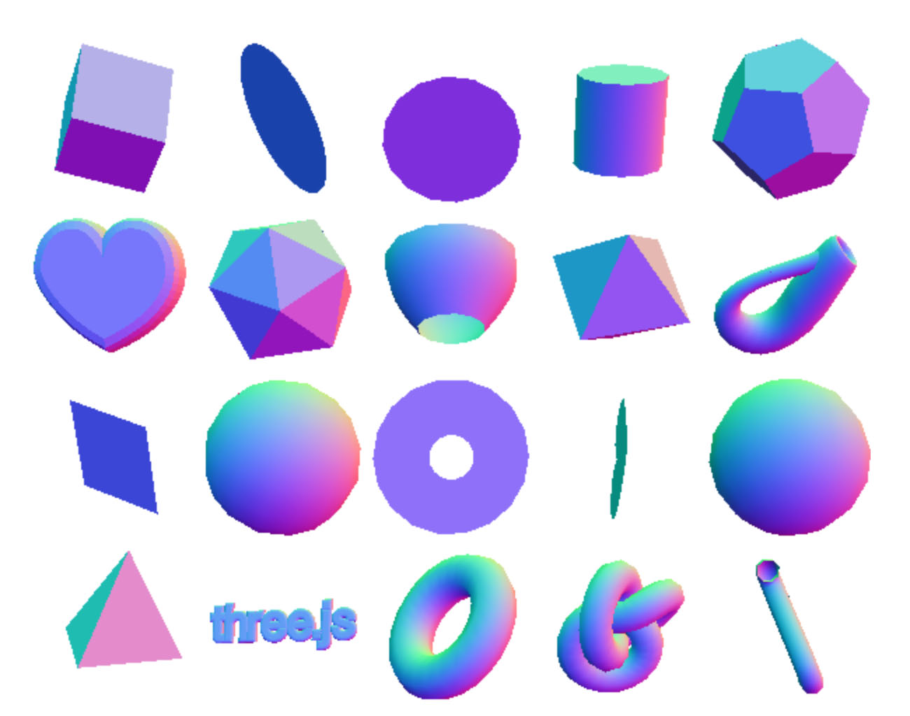

Title: Debugging Three.js - GLSL
Description: How to debug GLSL Shaders
Category: tips
TOC: Debugging GLSL

This site so far does not teach GLSL just like it does not teach JavaScript.
Those are really large topics. If you want to learn GLSL consider checking out
[these articles](https://webglfundamentals.org) as a starting place.

If you already know GLSL then here are a few tips for debugging.

When I'm making a new GLSL shader and nothing appears generally
the first thing I do is change the fragment shader to return a solid
color. For example at the very bottom of the shader I might put

```glsl
void main() {

  ...

  gl_FragColor = vec4(1, 0, 0, 1);  // red
}
```

If I see the object I was trying to draw then I know the issue is
related to my fragment shader. It could be anything like bad textures,
uninitialized uniforms, uniforms with the wrong values but at least
I have a direction to look.

To test some of those I might start trying to draw some of the inputs.
For example if I'm using normals in the fragment shader then I might
add

```glsl
gl_FragColor = vec4(vNormal * 0.5 + 0.5, 1);
```

Normals go from -1 to +1 so by multiplying by 0.5 and adding 0.5 we get
values that go from 0.0 to 1.0 which makes them useful for colors.

Try this with some things you know work and you'll start getting an idea
of what normals *normally* look like. If your normals don't look normal
then you have some clue where to look. If you're manipulating normals
in the fragments shader you can use the same technique to draw the
result of that manipulation.

<div class="threejs_center"></div>

Similarly if we're using textures there will be texture coordinates and we
can draw them with something like

```glsl
gl_FragColor = vec4(fract(vUv), 0, 1);
```

The `fract` is there in case we're using texture coordinates that go outside
the 0 to 1 range. This is common if `texture.repeat` is set to something greater
than 1.

<div class="threejs_center"></div>

You can do similar things for all values in your fragment shader. Figure out
what their range is likely to be, add some code to set `gl_FragColor` with
that range scaled to 0.0 to 1.0

To check textures try a `CanvasTexture` or a `DataTexture` that you 
know works.

Conversely, if after setting `gl_FragColor` to red I still see nothing
then I have a hint my issue might be in the direction of the things
related to the vertex shader. Some matrices might be wrong or my
attributes might have bad data or be setup incorrectly.

I'd first look at the matrices. I might put a breakpoint right after
my call to `renderer.render(scene, camera)` and then start expanding
things in the inspector. Is the camera's world matrix and projection
matrix at least not full of `NaN`s? Expanding the scene and looking
at its `children` I'd check that the world matrices look reasonable (no `NaN`s)
and last 4 values of each matrix look reasonable for my scene. If I 
expect my scene to be 50x50x50 units and some matrix shows 552352623.123 
clearly something is wrong there.

<div class="threejs_center"></div>

Just like we did for the fragment shader we can also draw values from the
vertex shader by passing them to the fragment shader. Declare a varying
in both and pass the value you're not sure is correct. In fact if my
shader use using normals I'll change the fragment shader to display them
like is mentioned above and then just set `vNormal` to the value I want 
to display but scaled so the values go from 0.0 to 1.0. I then look at the
results and see if they fit my expectations.

Another good thing to do is use a simpler shader. Can you draw your data
with `MeshBasicMaterial`? If you can then try it and make sure it shows
up as expected.

If not what's the simplest vertex shader that will let you visualize your
geometry? Usually it's as simple as

```glsl
gl_Position = projection * modelView * vec4(position.xyz, 1);
```

If that works start adding in your changes a little at a time.

Yet another thing you can do is use the
[Shader Editor extension for Chrome](https://chrome.google.com/webstore/detail/shader-editor/ggeaidddejpbakgafapihjbgdlbbbpob?hl=en)
or similar for other browsers. It's a great way to look at how other shaders
are working. It's also good as you can make some of the changes suggested above
live while the code is running.


