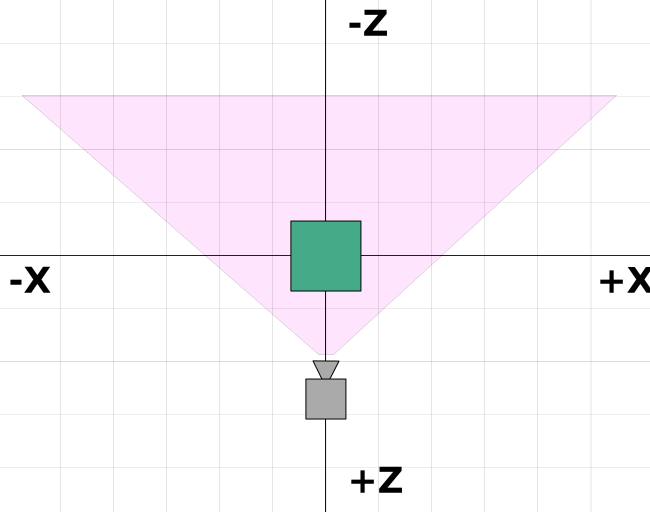

Title: Three.js Fundamentals
Description: Your first Three.js lesson starting with the fundamentals
Category: basics
TOC: Fundamentals

This is the first article in a series of articles about three.js.
[Three.js](http://threejs.org) is a 3D library that tries to make
it as easy as possible to get 3D content on a webpage.

Three.js is often confused with WebGL since more often than
not, but not always, three.js uses WebGL to draw 3D.
[WebGL is a very low-level system that only draws points, lines, and triangles](https://webglfundamentals.org).
To do anything useful with WebGL generally requires quite a bit of
code and that is where three.js comes in. It handles stuff
like scenes, lights, shadows, materials, textures, 3d math, all things that you'd
have to write yourself if you were to use WebGL directly.

These tutorials assume you already know JavaScript and, for the
most part they will use ES6 style. [See here for a
terse list of things you're expected to already know](threejs-prerequisites.html).
Most browsers that support three.js are auto-updated so most users should
be able to run this code. If you'd like to make this code run
on really old browsers look into a transpiler like [Babel](http://babel.io).
Of course users running really old browsers probably have machines
that can't run three.js.

When learning most programming languages the first thing people
do is make the computer print `"Hello World!"`. For 3D one
of the most common first things to do is to make a 3D cube.
So let's start with "Hello Cube!"

The first thing we need is a `<canvas>` tag so

```html
<body>
  <canvas id="c"></canvas>
</body>
```

Three.js will draw into that canvas so we need to look it up
and pass it to three.js.

```html
<script>
'use strict';

/* global THREE */

function main() {
  const canvas = document.querySelector('#c');
  const renderer = new THREE.WebGLRenderer({canvas});
  ...
</script>
```

Note there are some esoteric details here. If you don't pass a canvas
into three.js it will create one for you but then you have to add it
to your document. Where to add it may change depending on your use case
and you'll have to change your code so I find that passing a canvas
to three.js feels a little more flexible. I can put the canvas anywhere
and the code will find it where as if I had code to insert the canvas
into to the document I'd likely have to change that code if my use case
changed.

After we look up the canvas we create a `WebGLRenderer`. The renderer
is the thing responsible for actually taking all the data you provide
and rendering it to the canvas. In the past there have been other renderers
like `CSSRenderer`, a `CanvasRenderer` and in the future there may be a
`WebGL2Renderer` or `WebGPURenderer`. For now there's the `WebGLRenderer`
that uses WebGL to render 3D to the canvas.

Next up we need a camera.

```js
const fov = 75;
const aspect = 2;  // the canvas default
const near = 0.1;
const far = 5;
const camera = new THREE.PerspectiveCamera(fov, aspect, near, far);
```

`fov` is short for `field of view`. In this case 75 degrees in the vertical
dimension. Note that most angles in three.js are in radians but for some
reason the perspective camera takes degrees.

`aspect` is the display aspect of the canvas. We'll go over the details
in another article but by default a canvas is 300x150 pixels which makes
the aspect 300/150 or 2.

`near` and `far` represent the space in front of the camera
that will be rendered. Anything before that range or after that range
will be clipped (not drawn).

Those 4 settings define a *"frustum"*. A *frustum* is the name of
a 3d shape that is like a pyramid with the tip sliced off. In other
words think of the word "frustum" as another 3D shape like sphere,
cube, prism, frustum.


The height of the near and far planes are determined by the field of view.
The width of both planes is determined by the field of view and the aspect.

Anything inside the defined frustum will be be drawn. Anything outside
will not.

The camera defaults to looking down the -Z axis with +Y up. We'll put our cube
at the origin so we need to move the camera back a litte from the origin
in order to see anything.

```js
camera.position.z = 2;
```

Here's what we're aiming for.



In the diagram above we can see our camera is at `z = 2`. It's looking
down the -Z axis. Our frustum starts 0.1 units from the front of the camera
and goes to 5 units in front of the camera. Because in this diagram we are looking down,
the field of view is affected by the aspect. Our canvas is twice as wide
as it is tall so across view the field of view will be much wider than
our specified 75 degrees which is the vertical field of view.

Next we make a `Scene`. A `Scene` in three.js is the root of a form of scene graph.
Anything you want three.js to draw needs to be added to the scene. We'll
cover more details of [how scenes work in a future article](threejs-scenegraph.html).

```js
const scene = new THREE.Scene();
```

Next up we create a `BoxGeometry` which contains the data for a box.
Almost anything we want to display in Three.js needs geometry which defines
the vertices that make up our 3D object.

```js
const boxWidth = 1;
const boxHeight = 1;
const boxDepth = 1;
const geometry = new THREE.BoxGeometry(boxWidth, boxHeight, boxDepth);
```

We then create a basic material and set its color. Colors can
be specified using standard CSS style 6 digit hex color values.

```js
const material = new THREE.MeshBasicMaterial({color: 0x44aa88});
```

We then create a `Mesh`. A `Mesh` in three represents the combination
of a `Geometry` (the shape of the object) and a `Material` (how to draw
the object, shiny or flat, what color, what texture(s) to apply. Etc.)
as well as the position, orientation, and scale of that
object in the scene.

```js
const cube = new THREE.Mesh(geometry, material);
```

And finally we add that mesh to the scene

```js
scene.add(cube);
```

We can then render the scene by calling the renderer's render function
and passing it the scene and the camera

```js
renderer.render(scene, camera);
```

Here's a working example

{{{example url="../threejs-fundamentals.html" }}}

It's kind of hard to tell that is a 3D cube since we're viewing
it directly down the -Z axis and the cube itself is axis aligned
so we're only seeing a single face.

Let's animate it spinning and hopefully that will make
it clear it's being drawn in 3D. To animate it we'll render inside a render loop using
[`requestAnimationFrame`](https://developer.mozilla.org/en-US/docs/Web/API/window/requestAnimationFrame).

Here's our loop

```js
function render(time) {
  time *= 0.001;  // convert time to seconds

  cube.rotation.x = time;
  cube.rotation.y = time;

  renderer.render(scene, camera);

  requestAnimationFrame(render);
}
requestAnimationFrame(render);
```

`requestAnimationFrame` is a request to the browser that you want to animate something.
You pass it a function to be called. In our case that function is `render`. The browser
will call your function and if you update anything related to the display of the
page the browser will re-render the page. In our case we are calling three's
`renderer.render` function which will draw our scene.

`requestAnimationFrame` passes the time since the page loaded to
our function. That time is passed in milliseconds. I find it's much
easier to work with seconds so here we're converting that to seconds.

We then set the cube's X and Y rotation to the current time. These rotations
are in [radians](https://en.wikipedia.org/wiki/Radian). There are 2 pi radians
in a circle so our cube should turn around once on each axis in about 6.28
seconds.

We then render the scene and request another animation frame to continue
our loop.

Outside the loop we call `requestAnimationFrame` one time to start the loop.

{{{example url="../threejs-fundamentals-with-animation.html" }}}

It's a little better but it's still hard to see the 3d. What would help is to
add some lighting so let's add a light. There are many kinds of lights in
three.js which we'll go over in [a future article](threejs-lights.html). For now let's create a directional light.

```js
{
  const color = 0xFFFFFF;
  const intensity = 1;
  const light = new THREE.DirectionalLight(color, intensity);
  light.position.set(-1, 2, 4);
  scene.add(light);
}
```

Directional lights have a position and a target. Both default to 0, 0, 0. In our
case we're setting the light's position to -1, 2, 4 so it's slightly on the left,
above, and behind our camera. The target is still 0, 0, 0 so it will shine
toward the origin.

We also need to change the material. The `MeshBasicMaterial` is not affected by
lights. Let's change it to a `MeshPhongMaterial` which is affected by lights.

```js
-const material = new THREE.MeshBasicMaterial({color: 0x44aa88});  // greenish blue
+const material = new THREE.MeshPhongMaterial({color: 0x44aa88});  // greenish blue
```

And here it is working.

{{{example url="../threejs-fundamentals-with-light.html" }}}

It should now be pretty clearly 3D.

Just for the fun of it let's add 2 more cubes.

We'll use the same geometry for each cube but make a different
material so each cube can be a different color.

First we'll make a function that creates a new material
with the specified color. Then it creates a mesh using
the specified geometry and adds it to the scene and
sets its X position.

```js
function makeInstance(geometry, color, x) {
  const material = new THREE.MeshPhongMaterial({color});

  const cube = new THREE.Mesh(geometry, material);
  scene.add(cube);

  cube.position.x = x;

  return cube;
}
```

Then we'll call it 3 times with 3 different colors and X positions
saving the `Mesh` instances in an array.

```js
const cubes = [
  makeInstance(geometry, 0x44aa88,  0),
  makeInstance(geometry, 0x8844aa, -2),
  makeInstance(geometry, 0xaa8844,  2),
];
```

Finally we'll spin all 3 cubes in our render function. We
compute a slightly different rotation for each one.

```js
function render(time) {
  time *= 0.001;  // convert time to seconds

  cubes.forEach((cube, ndx) => {
    const speed = 1 + ndx * .1;
    const rot = time * speed;
    cube.rotation.x = rot;
    cube.rotation.y = rot;
  });

  ...
```

and here's that.

{{{example url="../threejs-fundamentals-3-cubes.html" }}}

If you compare it to the top down diagram above you can see
it matches our expectations. With cubes at X = -2 and X = +2
they are partially outside our frustum. They are also
somewhat exaggeratedly warped since the field of view
across the canvas is so extreme.

I hope this short intro helps to get things started. [Next up we'll cover
making our code responsive so it is adaptable to multiple situations](threejs-responsive.html).

