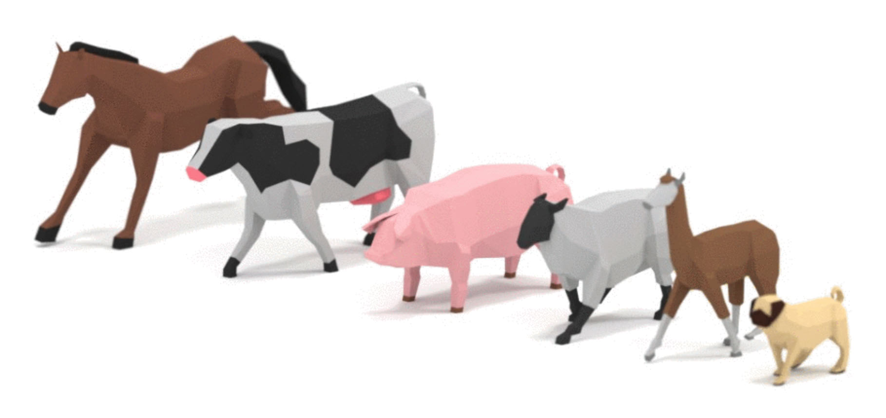

Title: Three.js Game
Description: Making a game with THREE.js
Category: solutions
TOC: Start making a Game.

Many people want to write games using three.js. This article
will hopefully give you some ideas on how to start.

At least at the time I'm writing this article it's probably going to be the
longest article on this site. It's possible the code here is massively over
engineered but as I wrote each new feature I'd run into needed a solution I'm
used to from other games I've written. In other words each new solution seemed
important so I'll try to show why. Of course the smaller your game the less you
might need some of the solutions shown here but this is a pretty small game and
yet with the complexities of 3D characters many things take more organization
than they might with 2D characters.

The majority of the code here will not really be three.js and
that's important to note, **three.js is not a game engine**.
Three.js is a 3D library. It provides a [scene graph](threejs-scenegraph.html)
and features for displaying 3D objects added to that scene graph
but it does not provide all the other things needed to make a game.
No collisions, no physics, no input systems, no path finding, etc, etc...
So, we'll have to provide those things ourselves.

I ended up writing quite a but of code to make this simple *unfinished* 
game like thing and again, it's certainly possible I over engineered and there
are simpler solutions but I feel like I actually didn't write
enough code and hopefully I can explain what I think is missing.

Many of the ideas here are heavily influenced by [Unity](https://unity.com).
If you're not familiar with Unity that probably does not matter.
I only bring it up as 10s of 1000s of games have shipped using
these ideas.

Let's start with the three.js parts. We need to load models for our game.

At [opengameart.org](https://opengameart.org) I found this [animated knight
model](https://opengameart.org/content/lowpoly-animated-knight) by [quaternius](https://opengameart.org/users/quaternius)

<div class="threejs_center"></div>

[quaternius](https://opengameart.org/users/quaternius) also made [these animated animals](https://opengameart.org/content/lowpoly-animated-farm-animal-pack).

<div class="threejs_center"></div>

These seem like good models to start with so the first thing we need to
do is load them.

We covered [loading glTF files before](threejs-load-gltf.html). 
The difference this time is we need to load multiple models and
we can't start the game until all the models are loaded.

Fortunately three.js provides the `LoadingManager` just for this purpose.
We create a `LoadingManager` and pass it to the other loaders. The
`LoadingManager` provides both [`onProgress`](LoadingManager.onProgress) and 
[`onLoad`](LoadingManager.onLoad) properties we can attach callbacks to.
The [`onLoad`](LoadingManager.onLoad) callback will be called when
all files have been loaded. The [`onProgress`](LoadingManager.onProgress) callback
as called after each individual file arrives to give as a chance to show
loading progress.

Starting with the code from [loading a glTF file](threejs-load-gltf.html) I removed all
the code related to framing the scene and added this code to load all models.

```js
const manager = new THREE.LoadingManager();
manager.onLoad = init;
const models = {
  pig:    { url: 'resources/models/animals/Pig.gltf' },
  cow:    { url: 'resources/models/animals/Cow.gltf' },
  llama:  { url: 'resources/models/animals/llama.gltf' },
  pug:    { url: 'resources/models/animals/pug.gltf' },
  sheep:  { url: 'resources/models/animals/sheep.gltf' },
  zebra:  { url: 'resources/models/animals/zebra.gltf' },
  horse:  { url: 'resources/models/animals/horse.gltf' },
  knight: { url: 'resources/models/knight/KnightCharacter.gltf' },
};
{
  const gltfLoader = new THREE.GLTFLoader(manager);
  for (const model of Object.values(models)) {
    gltfLoader.load(model.url, (gltf) => {
      model.gltf = gltf;
    });
  }
}

function init() {
  // TBD
}
```

This code will load all the models above and the `LoadingManager` will call
`init` when done. We'll use the `models` object later to let us access the
loaded models so the `GLTFLoader` callback for each individual model attaches
the loaded data to that model's info.

All the models with all their animation are currently about 6.6meg. That's a
pretty big download. Assuming your server supports compression (the server this
site runs on does) it's able to compress them to around 1.4meg. That's
definitely better than 6.6meg bit it's still not a tiny amount of data. It would
probably be good if we added a progress bar so the user has some idea how much
longer they have to wait.

So, let's add an [`onProgress`](LoadingManager.onProgress) callback. It will be
called with 3 arguments, the `url` of the last loaded object and then the number
of items loaded so far as well as the total number of items.

Let's setup some HTML for a loading bar

```html
<body>
  <canvas id="c"></canvas>
+  <div id="loading">
+    <div>
+      <div>...loading...</div>
+      <div class="progress"><div id="progressbar"></div></div>
+    </div>
+  </div>
</body>
```

We'll look up the `#progressbar` div and we can set the width from 0% to 100% 
to show our progress. All we need to do is set that in our callback.

```js
const manager = new THREE.LoadingManager();
manager.onLoad = init;

+const progressbarElem = document.querySelector('#progressbar');
+manager.onProgress = (url, itemsLoaded, itemsTotal) => {
+  progressbarElem.style.width = `${itemsLoaded / itemsTotal * 100 | 0}%`;
+};
```

We already setup `init` to be called when all the models are loaded so
we can turn off the progress bar by hiding the `#loading` element.

```js
function init() {
+  // hide the loading bar
+  const loadingElem = document.querySelector('#loading');
+  loadingElem.style.display = 'none';
}
```

Here's a bunch of CSS for styling the bar. The CSS makes the `#loading` `<div>`
the full size of the page and centers its children. The CSS makes a `.progress`
area to contain the progress bar. The CSS also gives the progress bar
a CSS animation of diagonal stripes.

```css
#loading {
  position: absolute;
  left: 0;
  top: 0;
  width: 100%;
  height: 100%;
  display: flex;
  align-items: center;
  justify-content: center;
  text-align: center;
  font-size: xx-large;
  font-family: sans-serif;
}
#loading>div>div {
  padding: 2px;
}
.progress {
  width: 50vw;
  border: 1px solid black;
}
#progressbar {
  width: 0;
  height: 1em;
  background-color: #888;
  background-image: linear-gradient(
    -45deg, 
    rgba(255, 255, 255, .5) 25%, 
    transparent 25%, 
    transparent 50%, 
    rgba(255, 255, 255, .5) 50%, 
    rgba(255, 255, 255, .5) 75%, 
    transparent 75%, 
    transparent
  );
  background-size: 50px 50px;
  animation: progressanim 2s linear infinite;
}

@keyframes progressanim {
  0% {
    background-position: 50px 50px;
  }
  100% {
    background-position: 0 0;
  }
}
```

Now that we have a progress bar let's deal with the models. These models
have animations and we want to be able to access those animations.
Animations are stored in an array by default be we'd like to be able to
easily access them by name so let's setup an `animations` property for
each model to do that. Note of course this means animations must have unique names.

```js
+function prepModelsAndAnimations() {
+  Object.values(models).forEach(model => {
+    const animsByName = {};
+    model.gltf.animations.forEach((clip) => {
+      animsByName[clip.name] = clip;
+    });
+    model.animations = animsByName;
+  });
+}

function init() {
  // hide the loading bar
  const loadingElem = document.querySelector('#loading');
  loadingElem.style.display = 'none';

+  prepModelsAndAnimations();
}
```

Let's display the animated models.

Unlike the [previous example of loading a glTF file](threejs-load-gltf.html)
This time we probably want to be able to display more than one instance
of each model. To do this, instead of adding
the loaded gltf scene directly like we did in [the article on loading a glTF](threejs-load-gltf.html),
we instead want to clone the scene and in particular we want to clone
it for skinned animated characters. Fortunately there's a utility function,
`SkeletonUtils.clone` we can use to do this. So, first we need to include
the utils.

```html
<script src="resources/threejs/r105/three.min.js"></script>
<script src="resources/threejs/r105/js/controls/OrbitControls.js"></script>
<script src="resources/threejs/r105/js/loaders/GLTFLoader.js"></script>
+<script src="resources/threejs/r105/js/utils/SkeletonUtils.js"></script>
```

Then we can clone the models we just loaded

```js
function init() {
  // hide the loading bar
  const loadingElem = document.querySelector('#loading');
  loadingElem.style.display = 'none';

  prepModelsAndAnimations();

+  Object.values(models).forEach((model, ndx) => {
+    const clonedScene = THREE.SkeletonUtils.clone(model.gltf.scene);
+    const root = new THREE.Object3D();
+    root.add(clonedScene);
+    scene.add(root);
+    root.position.x = (ndx - 3) * 3;
+  });
}
```

Above for each model we clone the `gltf.scene` we loaded and we parent that
to a new `Object3D`. We need to parent it to another object because when
we play animations the animation will apply animated positions to the nodes
in the loaded scene which means we won't have control over those positions.

To play the animations each model we clone needs an `AnimationMixer`.
An `AnimationMixer` contains 1 or more `AnimationAction`s. An
`AnimationAction` references an `AnimationClip`. `AnimationAction`s
have all kinds of settings for playing then chaining to another
action or cross fading between actions. Let's just get the first 
`AnimationClip` and create an action for it. The default is for
an action the play its clip in a loop forever.

```js
+const mixers = [];

function init() {
  // hide the loading bar
  const loadingElem = document.querySelector('#loading');
  loadingElem.style.display = 'none';

  prepModelsAndAnimations();

  Object.values(models).forEach((model, ndx) => {
    const clonedScene = THREE.SkeletonUtils.clone(model.gltf.scene);
    const root = new THREE.Object3D();
    root.add(clonedScene);
    scene.add(root);
    root.position.x = (ndx - 3) * 3;

+    const mixer = new THREE.AnimationMixer(clonedScene);
+    const firstClip = Object.values(model.animations)[0];
+    const action = mixer.clipAction(firstClip);
+    action.play();
+    mixers.push(mixer);
  });
}
```

We called [`play`](AnimationAction.play) to start the action and stored
off all the `AnimationMixers` in an array called `mixers`. Finally
we need to update each `AnimationMixer` in our render loop by computing
the time since the last frame and passing that to `AnimationMixer.update`.

```js
+let then = 0;
function render(now) {
+  now *= 0.001;  // convert to seconds
+  const deltaTime = now - then;
+  then = now;

  if (resizeRendererToDisplaySize(renderer)) {
    const canvas = renderer.domElement;
    camera.aspect = canvas.clientWidth / canvas.clientHeight;
    camera.updateProjectionMatrix();
  }

+  for (const mixer of mixers) {
+    mixer.update(deltaTime);
+  }

  renderer.render(scene, camera);

  requestAnimationFrame(render);
}
```

And with that we should get each model loaded and playing its first animation.

{{{example url="../threejs-game-load-models.html"}}}

Let's make it so we can check all of the animations.
We'll add all of the clips as actions and then enable just one at 
a time.

```js
-const mixers = [];
+const mixerInfos = [];

function init() {
  // hide the loading bar
  const loadingElem = document.querySelector('#loading');
  loadingElem.style.display = 'none';

  prepModelsAndAnimations();

  Object.values(models).forEach((model, ndx) => {
    const clonedScene = THREE.SkeletonUtils.clone(model.gltf.scene);
    const root = new THREE.Object3D();
    root.add(clonedScene);
    scene.add(root);
    root.position.x = (ndx - 3) * 3;

    const mixer = new THREE.AnimationMixer(clonedScene);
-    const firstClip = Object.values(model.animations)[0];
-    const action = mixer.clipAction(firstClip);
-    action.play();
-    mixers.push(mixer);
+    const actions = Object.values(model.animations).map((clip) => {
+      return mixer.clipAction(clip);
+    });
+    const mixerInfo = {
+      mixer,
+      actions,
+      actionNdx: -1,
+    };
+    mixerInfos.push(mixerInfo);
+    playNextAction(mixerInfo);
  });
}

+function playNextAction(mixerInfo) {
+  const {actions, actionNdx} = mixerInfo;
+  const nextActionNdx = (actionNdx + 1) % actions.length;
+  mixerInfo.actionNdx = nextActionNdx;
+  actions.forEach((action, ndx) => {
+    const enabled = ndx === nextActionNdx;
+    action.enabled = enabled;
+    if (enabled) {
+      action.play();
+    }
+  });
+}
```

The code above makes an array of `AnimationAction`s,
one for each `AnimationClip`. It makes an array of objects, `mixerInfos`,
with references to the `AnimationMixer` and all the `AnimationAction`s 
for each model. It then calls `playNextAction` which sets `enabled` on
all but one action for that mixer.

We need to update the render loop for the new array

```js
-for (const mixer of mixers) {
+for (const {mixer} of mixerInfos) {
  mixer.update(deltaTime);
}
```

Let's make it so pressing a key 1 to 8 will play the next animation
for each model

```js
window.addEventListener('keydown', (e) => {
  const mixerInfo = mixerInfos[e.keyCode - 49];
  if (!mixerInfo) {
    return;
  }
  playNextAction(mixerInfo);
});
```

Now you should be able to click on the example and then press keys 1 through 8
to cycle each of the models through their available animations.

{{{example url="../threejs-game-check-animations.html"}}}

So that is arguably the sum-total of the three.js portion of this
article. We covered loading multiple files, cloning skinned models,
and playing animations on them. In a real game you'd have to do a
ton more manipulation of `AnimationAction` objects.

Let's start making a game infrastructure

A common pattern for making a modern game is to use an
[Entity Component System](https://www.google.com/search?q=entity+component+system).
In an Entity Component System an object in a game is called an *entity* that consists
of a bunch of *components*. You build up entities by deciding which components to
attach to them. So, let's make an Entity Component System.

We'll call our entities `GameObject`. It's effectively just a collection
of components and a three.js `Object3D`.

```js
function removeArrayElement(array, element) {
  const ndx = array.indexOf(element);
  if (ndx >= 0) {
    array.splice(ndx, 1);
  }
}

class GameObject {
  constructor(parent, name) {
    this.name = name;
    this.components = [];
    this.transform = new THREE.Object3D();
    parent.add(this.transform);
  }
  addComponent(ComponentType, ...args) {
    const component = new ComponentType(this, ...args);
    this.components.push(component);
    return component;
  }
  removeComponent(component) {
    removeArrayElement(this.components, component);
  }
  getComponent(ComponentType) {
    return this.components.find(c => c instanceof ComponentType);
  }
  update() {
    for (const component of this.components) {
      component.update();
    }
  }
}
```

Calling `GameObject.update` calls `update` on all the components.

I included a name only to help in debugging so if I look at a `GameObject`
in the debugger I can see a name to help identify it.

Some things that might seem a little strange:

`GameObject.addComponent` is used to create components. Whether or not
this a good idea or a bad idea I'm not sure. My thinking was it makes
no sense for a component to exist outside of a gameobject so I thought
it might be good if creating a component automatically added that component
to the gameobject and passed the gameobject to the component's constructor.
In other words to add a component you do this

```js
const gameObject = new GameObject(scene, 'foo');
gameObject.addComponent(TypeOfComponent);
```

If I didn't do it this way you'd instead do something like this

```js
const gameObject = new GameObject(scene, 'foo');
const component = new TypeOfComponent(gameObject);
gameObject.addComponent(component);
```

Is it better that this is shorter and more automated or is it worse
because it looks out of the ordinary? I don't know.

`GameObject.getComponent` looks up components by type. That has
the implication that you can not have 2 components of the same
type on a single game object or at least if you do you can only
look up the first one without adding some other API.

It's common for one component to look up another and when looking them up they
have to match by type otherwise you might get the wrong one. We could instead
give each component a name and you could look them up by name. That would be
more flexible in that could have more than one component of the same type but it
would also be more tedious. Again, I'm not sure which is better.

On to the components themselves. Here is their base class.

```js
// Base for all components
class Component {
  constructor(gameObject) {
    this.gameObject = gameObject;
  }
  update() {
  }
}
```

Do components need a base class? JavaScript is not like most strictly 
typed languages so effectively we could have no base class and just 
leave it up to each component to do whatever it wants in its constructor
knowing that the first argument is always the component's gameobject.
If it doesn't care about gameobject it wouldn't store it. I kind of feel like this
common base is good though. It means if you have a reference to a
component you know you can find it's parent gameobject always and from its
parent you can easily look up other components as well is look at its
transform.

To manage the gameobjects we probably need some kind of gameobject manager. You
might think we could just keep an array of gameobjects but in a real game the
components of a gameobject might add and remove other gameobjects at runtime.
For example a gun gameobject might add a bullet gameobject ever time the gun
fires. A monster gameobject might remove itself if it has been killed. We then
would have an issue that we might have code like this

```js
for (const gameObject of globalArrayOfGameObjects) {
  gameObject.update();
}
```

The loop above would fail or do un-expected things if
gameobjects are added or removed from `globalArrayOfGameObjects`
in the middle of the loop in some component's `update` function.

To try to prevent that problem we need something a little safer.
Here's one attempt.

```js
class SafeArray {
  constructor() {
    this.array = [];
    this.addQueue = [];
    this.removeQueue = new Set();
  }
  get isEmpty() {
    return this.addQueue.length + this.array.length > 0;
  }
  add(element) {
    this.addQueue.push(element);
  }
  remove(element) {
    this.removeQueue.add(element);
  }
  forEach(fn) {
    this._addQueued();
    this._removeQueued();
    for (const element of this.array) {
      if (this.removeQueue.has(element)) {
        continue;
      }
      fn(element);
    }
    this._removeQueued();
  }
  _addQueued() {
    if (this.addQueue.length) {
      this.array.splice(this.array.length, 0, ...this.addQueue);
      this.addQueue = [];
    }
  }
  _removeQueued() {
    if (this.removeQueue.size) {
      this.array = this.array.filter(element => !this.removeQueue.has(element));
      this.removeQueue.clear();
    }
  }
}
```

The class above lets you add or remove elements from the `SafeArray`
but won't mess with the array itself while it's being iterated over. Instead
new elements get added to `addQueue` and removed elements to the `removeQueue`
and then added or removed outside of the loop.

Using that here is our class to manage gameobjects.

```js
class GameObjectManager {
  constructor() {
    this.gameObjects = new SafeArray();
  }
  createGameObject(parent, name) {
    const gameObject = new GameObject(parent, name);
    this.gameObjects.add(gameObject);
    return gameObject;
  }
  removeGameObject(gameObject) {
    this.gameObjects.remove(gameObject);
  }
  update() {
    this.gameObjects.forEach(gameObject => gameObject.update());
  }
}
```

With all that now let's make our first component. This component
will just manage a skinned three.js object like the ones we just created.
To keep it simple it will just have one method, `setAnimation` that
takes the name of the animation to play and plays it.

```js
class SkinInstance extends Component {
  constructor(gameObject, model) {
    super(gameObject);
    this.model = model;
    this.animRoot = THREE.SkeletonUtils.clone(this.model.gltf.scene);
    this.mixer = new THREE.AnimationMixer(this.animRoot);
    gameObject.transform.add(this.animRoot);
    this.actions = {};
  }
  setAnimation(animName) {
    const clip = this.model.animations[animName];
    // turn off all current actions
    for (const action of Object.values(this.actions)) {
      action.enabled = false;
    }
    // get or create existing action for clip
    const action = this.mixer.clipAction(clip);
    action.enabled = true;
    action.reset();
    action.play();
    this.actions[animName] = action;
  }
  update() {
    this.mixer.update(globals.deltaTime);
  }
}
```

You can see it's basically the code we had before that clones the scene we loaded,
then sets up an `AnimationMixer`. `setAnimation` adds a `AnimationAction` for a 
particular `AnimationClip` if one does not already exist and disables all
existing actions.

The code references `globals.deltaTime`. Let's make a globals object

```js
const globals = {
  time: 0,
  deltaTime: 0,
};
```

And update it in the render loop

```js
let then = 0;
function render(now) {
  // convert to seconds
  globals.time = now * 0.001;
  // make sure delta time isn't too big.
  globals.deltaTime = Math.min(globals.time - then, 1 / 20);
  then = globals.time;
```

The check above for making sure `deltaTime` is not more than 1/20th
of a second is because otherwise we'd get a huge value for `deltaTime`
if we hide the tab. We might hide it for seconds or minutes and then
when our tab was brought to the front `deltaTime` would be huge
and might teleport characters across our game world if we had code like

```js
position += velocity * deltaTime;
```

By limiting the maximum `deltaTime` that issue is prevented.

Now let's make a component for the player.

```js
class Player extends Component {
  constructor(gameObject) {
    super(gameObject);
    const model = models.knight;
    this.skinInstance = gameObject.addComponent(SkinInstance, model);
    this.skinInstance.setAnimation('Run');
  }
}
```

The player calls `setAnimation` with `'Run'`. To know which animations
are available I modified our previous example to print out the names of 
the animations

```js
function prepModelsAndAnimations() {
  Object.values(models).forEach(model => {
+    console.log('------->:', model.url);
    const animsByName = {};
    model.gltf.animations.forEach((clip) => {
      animsByName[clip.name] = clip;
+      console.log('  ', clip.name);
    });
    model.animations = animsByName;
  });
}
```

And running it got this list in [the JavaScript console](https://developers.google.com/web/tools/chrome-devtools/console/javascript).

```
 ------->:  resources/models/animals/Pig.gltf
    Idle
    Death
    WalkSlow
    Jump
    Walk
 ------->:  resources/models/animals/Cow.gltf
    Walk
    Jump
    WalkSlow
    Death
    Idle
 ------->:  resources/models/animals/llama.gltf
    Jump
    Idle
    Walk
    Death
    WalkSlow
 ------->:  resources/models/animals/pug.gltf
    Jump
    Walk
    Idle
    WalkSlow
    Death
 ------->:  resources/models/animals/sheep.gltf
    WalkSlow
    Death
    Jump
    Walk
    Idle
 ------->:  resources/models/animals/zebra.gltf
    Jump
    Walk
    Death
    WalkSlow
    Idle
 ------->:  resources/models/animals/horse.gltf
    Jump
    WalkSlow
    Death
    Walk
    Idle
 ------->:  resources/models/knight/KnightCharacter.gltf
    Run_swordRight
    Run
    Idle_swordLeft
    Roll_sword
    Idle
    Run_swordAttack
```

Fortunately the names of the animations for all the animals match
which will come in handy later. For now we only care the that the 
player has an animation called `Run`.

Let's use these components. Here's the updated init function.
All it does is create a `GameObject` and add a `Player` component to it.

```js
const globals = {
  time: 0,
  deltaTime: 0,
};
+const gameObjectManager = new GameObjectManager();

function init() {
  // hide the loading bar
  const loadingElem = document.querySelector('#loading');
  loadingElem.style.display = 'none';

  prepModelsAndAnimations();

+  {
+    const gameObject = gameObjectManager.createGameObject(scene, 'player');
+    gameObject.addComponent(Player);
+  }
}
```

And we need to call `gameObjectManager.update` in our render loop

```js
let then = 0;
function render(now) {
  // convert to seconds
  globals.time = now * 0.001;
  // make sure delta time isn't too big.
  globals.deltaTime = Math.min(globals.time - then, 1 / 20);
  then = globals.time;

  if (resizeRendererToDisplaySize(renderer)) {
    const canvas = renderer.domElement;
    camera.aspect = canvas.clientWidth / canvas.clientHeight;
    camera.updateProjectionMatrix();
  }

-  for (const {mixer} of mixerInfos) {
-    mixer.update(deltaTime);
-  }
+  gameObjectManager.update();

  renderer.render(scene, camera);

  requestAnimationFrame(render);
}
```

and if we run that we get a single player.

{{{example url="../threejs-game-just-player.html"}}}

That was a lot of code just for an entity component system but
it's infrastructure that most games need.

Let's add an input system. Rather than read keys directly we'll
make a class that other parts of the code can check `left` or `right`.
That way we can assign multiple ways to input `left` or `right` etc..
We'll start with just keys

```js
// Keeps the state of keys/buttons
//
// You can check
//
//   inputManager.keys.left.down
//
// to see if the left key is currently held down
// and you can check
//
//   inputManager.keys.left.justPressed
//
// To see if the left key was pressed this frame
//
// Keys are 'left', 'right', 'a', 'b', 'up', 'down'
class InputManager {
  constructor() {
    this.keys = {};
    const keyMap = new Map();

    const setKey = (keyName, pressed) => {
      const keyState = this.keys[keyName];
      keyState.justPressed = pressed && !keyState.down;
      keyState.down = pressed;
    };

    const addKey = (keyCode, name) => {
      this.keys[name] = { down: false, justPressed: false };
      keyMap.set(keyCode, name);
    };

    const setKeyFromKeyCode = (keyCode, pressed) => {
      const keyName = keyMap.get(keyCode);
      if (!keyName) {
        return;
      }
      setKey(keyName, pressed);
    };

    addKey(37, 'left');
    addKey(39, 'right');
    addKey(38, 'up');
    addKey(40, 'down');
    addKey(90, 'a');
    addKey(88, 'b');

    window.addEventListener('keydown', (e) => {
      setKeyFromKeyCode(e.keyCode, true);
    });
    window.addEventListener('keyup', (e) => {
      setKeyFromKeyCode(e.keyCode, false);
    });
  }
  update() {
    for (const keyState of Object.values(this.keys)) {
      if (keyState.justPressed) {
        keyState.justPressed = false;
      }
    }
  }
}
```

The code above tracks whether keys are up or down and you can check
if a key is currently pressed by checking for example
`inputManager.keys.left.down`. It also has a `justPressed` property
for each key so that you can check the user just pressed the key.
For example a jump key you don't want to know if the button is being 
held down, you want to know did the user press it now.

Let's create an instance of `InputManager`

```js
const globals = {
  time: 0,
  deltaTime: 0,
};
const gameObjectManager = new GameObjectManager();
+const inputManager = new InputManager();
```

and update it in our render loop

```js
function render(now) {

  ...

  gameObjectManager.update();
+  inputManager.update();

  ...
}
```

It needs to be called after `gameObjectManager.update` otherwise
`justPressed` would never be true inside a component's `update` function.

Let's use it in the `Player` component

```js
+const kForward = new THREE.Vector3(0, 0, 1);
const globals = {
  time: 0,
  deltaTime: 0,
+  moveSpeed: 16,
};

class Player extends Component {
  constructor(gameObject) {
    super(gameObject);
    const model = models.knight;
    this.skinInstance = gameObject.addComponent(SkinInstance, model);
    this.skinInstance.setAnimation('Run');
+    this.turnSpeed = globals.moveSpeed / 4;
  }
+  update() {
+    const {deltaTime, moveSpeed} = globals;
+    const {transform} = this.gameObject;
+    const delta = (inputManager.keys.left.down  ?  1 : 0) +
+                  (inputManager.keys.right.down ? -1 : 0);
+    transform.rotation.y += this.turnSpeed * delta * deltaTime;
+    transform.translateOnAxis(kForward, moveSpeed * deltaTime);
+  }
}
```

The code above uses `Object3D.transformOnAxis` to move the player
forward. `Object3D.transformOnAxis` works in local space so it only
works if the object in question is at the root of the scene, not if it's
parented to something else <a class="footnote" href="#parented" id="parented-backref">1</a>

We also added a global `moveSpeed` and based a `turnSpeed` on the move speed.
The turn speed is based on the move speed to try to make sure a character
can turn sharply enough to meet it's target. If turns speed so too small
a character will turn around and around circling it's target but never
hitting it. I didn't bother to do the math to calculate the required
turn speed for a given move speed. I just guessed.

The code so far would work but if the player runs off the screen there's no
way to find out where they are. Let's make it so if they are offscreen
for more than a certain time they get teleported back to the origin.
We can do that by using the three.js `Frustum` class to check if a point
is inside the camera's view frustum.

We need to build a frustum from the camera. We could do this in the Player
component but other objects might want to use this too so let's add another
gameobject with a component to manage a frustum.

```js
class CameraInfo extends Component {
  constructor(gameObject) {
    super(gameObject);
    this.projScreenMatrix = new THREE.Matrix4();
    this.frustum = new THREE.Frustum();
  }
  update() {
    const {camera} = globals;
    this.projScreenMatrix.multiplyMatrices(
        camera.projectionMatrix,
        camera.matrixWorldInverse);
    this.frustum.setFromMatrix(this.projScreenMatrix);
  }
}
```

Then let's setup another gameobject at init time.

```js
function init() {
  // hide the loading bar
  const loadingElem = document.querySelector('#loading');
  loadingElem.style.display = 'none';

  prepModelsAndAnimations();

+  {
+    const gameObject = gameObjectManager.createGameObject(camera, 'camera');
+    globals.cameraInfo = gameObject.addComponent(CameraInfo);
+  }

  {
    const gameObject = gameObjectManager.createGameObject(scene, 'player');
    gameObject.addComponent(Player);
  }
}
```

and now we can use it in the `Player` component.

```js
class Player extends Component {
  constructor(gameObject) {
    super(gameObject);
    const model = models.knight;
    this.skinInstance = gameObject.addComponent(SkinInstance, model);
    this.skinInstance.setAnimation('Run');
    this.turnSpeed = globals.moveSpeed / 4;
+    this.offscreenTimer = 0;
+    this.maxTimeOffScreen = 3;
  }
  update() {
-    const {deltaTime, moveSpeed} = globals;
+    const {deltaTime, moveSpeed, cameraInfo} = globals;
    const {transform} = this.gameObject;
    const delta = (inputManager.keys.left.down  ?  1 : 0) +
                  (inputManager.keys.right.down ? -1 : 0);
    transform.rotation.y += this.turnSpeed * delta * deltaTime;
    transform.translateOnAxis(kForward, moveSpeed * deltaTime);

+    const {frustum} = cameraInfo;
+    if (frustum.containsPoint(transform.position)) {
+      this.offscreenTimer = 0;
+    } else {
+      this.offscreenTimer += deltaTime;
+      if (this.offscreenTimer >= this.maxTimeOffScreen) {
+        transform.position.set(0, 0, 0);
+      }
+    }
  }
}
```

One more thing before we try it out, let's add touchscreen support
for mobile. First let's add some HTML to touch

```html
<body>
  <canvas id="c"></canvas>
+  <div id="ui">
+    <div id="left"></div>
+    <div style="flex: 0 0 40px;"></div>
+    <div id="right"></div>
+  </div>
  <div id="loading">
    <div>
      <div>...loading...</div>
      <div class="progress"><div id="progressbar"></div></div>
    </div>
  </div>
</body>
```

and some CSS to style it

```css
#ui {
  position: absolute;
  left: 0;
  top: 0;
  width: 100%;
  height: 100%;
  display: flex;
  justify-items: center;
  align-content: stretch;
}
#ui>div {
  display: flex;
  align-items: flex-end;
  flex: 1 1 auto;
}
.bright {
  filter: brightness(2);
}
#left {
  justify-content: flex-end;
}
#right {
  justify-content: flex-start;
}
#ui img {
  padding: 10px;
  width: 80px;
  height: 80px;
  display: block;
}
```

The idea here is there is one div, `#ui`, that 
covers the entire page. Inside will be 2 divs, `#left` and `#right`
both of which are almost half the page wide and the entire screen tall.
In between there is a 40px separator. If the user slides their finger
over the left or right side then we need up update `keys.left` and `keys.right`
in the `InputManager`. This makes the entire screen sensitive to being touched
which seemed better than just small arrows.

```js
class InputManager {
  constructor() {
    this.keys = {};
    const keyMap = new Map();

    const setKey = (keyName, pressed) => {
      const keyState = this.keys[keyName];
      keyState.justPressed = pressed && !keyState.down;
      keyState.down = pressed;
    };

    const addKey = (keyCode, name) => {
      this.keys[name] = { down: false, justPressed: false };
      keyMap.set(keyCode, name);
    };

    const setKeyFromKeyCode = (keyCode, pressed) => {
      const keyName = keyMap.get(keyCode);
      if (!keyName) {
        return;
      }
      setKey(keyName, pressed);
    };

    addKey(37, 'left');
    addKey(39, 'right');
    addKey(38, 'up');
    addKey(40, 'down');
    addKey(90, 'a');
    addKey(88, 'b');

    window.addEventListener('keydown', (e) => {
      setKeyFromKeyCode(e.keyCode, true);
    });
    window.addEventListener('keyup', (e) => {
      setKeyFromKeyCode(e.keyCode, false);
    });

+    const sides = [
+      { elem: document.querySelector('#left'),  key: 'left'  },
+      { elem: document.querySelector('#right'), key: 'right' },
+    ];
+
+    const clearKeys = () => {
+      for (const {key} of sides) {
+          setKey(key, false);
+      }
+    };
+
+    const checkSides = (e) => {
+      for (const {elem, key} of sides) {
+        let pressed = false;
+        const rect = elem.getBoundingClientRect();
+        for (const touch of e.touches) {
+          const x = touch.clientX;
+          const y = touch.clientY;
+          const inRect = x >= rect.left && x < rect.right &&
+                         y >= rect.top && y < rect.bottom;
+          if (inRect) {
+            pressed = true;
+          }
+        }
+        setKey(key, pressed);
+      }
+    };
+
+    const uiElem = document.querySelector('#ui');
+    uiElem.addEventListener('touchstart', (e) => {
+      e.preventDefault();
+      checkSides(e);
+    }, {passive: false});
+    uiElem.addEventListener('touchmove', (e) => {
+      e.preventDefault();  // prevent scroll
+      checkSides(e);
+    }, {passive: false});
+    uiElem.addEventListener('touchend', () => {
+      clearKeys();
+    });
+
+    function handleMouseMove(e) {
+      e.preventDefault();
+      checkSides({
+        touches: [e],
+      });
+    }
+
+    function handleMouseUp() {
+      clearKeys();
+      window.removeEventListener('mousemove', handleMouseMove, {passive: false});
+      window.removeEventListener('mouseup', handleMouseUp);
+    }
+
+    uiElem.addEventListener('mousedown', (e) => {
+      handleMouseMove(e);
+      window.addEventListener('mousemove', handleMouseMove);
+      window.addEventListener('mouseup', handleMouseUp);
+    }, {passive: false});
  }
  update() {
    for (const keyState of Object.values(this.keys)) {
      if (keyState.justPressed) {
        keyState.justPressed = false;
      }
    }
  }
}
```

And now we should be able to control the character with the left and right
cursor keys or with our fingers on a touchscreen

{{{example url="../threejs-game-player-input.html"}}}

Ideally we'd do something else if the player went off the screen like move
the camera or maybe offscreen = death but this article is already going to be
too long so for now teleporting to the middle was the simplest thing.

Lets add some animals. We can start it off similar to the `Player` by making
an `Animal` component.

```js
class Animal extends Component {
  constructor(gameObject, model) {
    super(gameObject);
    const skinInstance = gameObject.addComponent(SkinInstance, model);
    skinInstance.mixer.timeScale = globals.moveSpeed / 4;
    skinInstance.setAnimation('Idle');
  }
}
```

The code above sets the `AnimationMixer.timeScale` to set the playback
speed of the animations relative to the move speed.

To start we could setup one of each type of animal

```js
function init() {
  // hide the loading bar
  const loadingElem = document.querySelector('#loading');
  loadingElem.style.display = 'none';

  prepModelsAndAnimations();
  {
    const gameObject = gameObjectManager.createGameObject(camera, 'camera');
    globals.cameraInfo = gameObject.addComponent(CameraInfo);
  }

  {
    const gameObject = gameObjectManager.createGameObject(scene, 'player');
    globals.player = gameObject.addComponent(Player);
    globals.congaLine = [gameObject];
  }

+  const animalModelNames = [
+    'pig',
+    'cow',
+    'llama',
+    'pug',
+    'sheep',
+    'zebra',
+    'horse',
+  ];
+  animalModelNames.forEach((name, ndx) => {
+    const gameObject = gameObjectManager.createGameObject(scene, name);
+    gameObject.addComponent(Animal, models[name]);
+    gameObject.transform.position.x = (ndx + 1) * 5;
+  });
}
```

And that would get us animals standing on the screen but we want them to do
something.

Let's make them follow the player in a conga line but only if the player gets near enough.
To do this we need several states.

* Idle:

  Animal is waiting for player to get close

* Wait for End of Line:

  Animal was tagged by player but now needs to wait for the animal
  at the end of the line to come by so they can join the end of the line.

* Go to Last:

  Animal needs to walk to where the animal they are following was, at the same time recording
  a history of where the animal they are following is currently.

* Follow

  Animal needs to keep recording a history of where the animal they are following is while
  moving to where the animal they are following was before.

There are many ways to handle different states like this. A common one is to use
a [Finite State Machine](https://www.google.com/search?q=finite+state+machine) and
to build some class to help us manage the state.

So, let's do that.

```js
class FiniteStateMachine {
  constructor(states, initialState) {
    this.states = states;
    this.transition(initialState);
  }
  get state() {
    return this.currentState;
  }
  transition(state) {
    const oldState = this.states[this.currentState];
    if (oldState && oldState.exit) {
      oldState.exit.call(this);
    }
    this.currentState = state;
    const newState = this.states[state];
    if (newState.enter) {
      newState.enter.call(this);
    }
  }
  update() {
    const state = this.states[this.currentState];
    if (state.update) {
      state.update.call(this);
    }
  }
}
```

Here's a simple class. We pass it an object with a bunch of states.
Each state as 3 optional functions, `enter`, `update`, and `exit`.
To switch states we call `FiniteStateMachine.transition` and pass it
the name of the new state. If the current state has an `exit` function
it's called. Then if the new state has an `enter` function it's called.
Finally each frame `FiniteStateMachine.update` calls the `update` function
of the current state.

Let's use it to manage the states of the animals.

```js
// Returns true of obj1 and obj2 are close
function isClose(obj1, obj1Radius, obj2, obj2Radius) {
  const minDist = obj1Radius + obj2Radius;
  const dist = obj1.position.distanceTo(obj2.position);
  return dist < minDist;
}

// keeps v between -min and +min
function minMagnitude(v, min) {
  return Math.abs(v) > min
      ? min * Math.sign(v)
      : v;
}

const aimTowardAndGetDistance = function() {
  const delta = new THREE.Vector3();

  return function aimTowardAndGetDistance(source, targetPos, maxTurn) {
    delta.subVectors(targetPos, source.position);
    // compute the direction we want to be facing
    const targetRot = Math.atan2(delta.x, delta.z) + Math.PI * 1.5;
    // rotate in the shortest direction
    const deltaRot = (targetRot - source.rotation.y + Math.PI * 1.5) % (Math.PI * 2) - Math.PI;
    // make sure we don't turn faster than maxTurn
    const deltaRotation = minMagnitude(deltaRot, maxTurn);
    // keep rotation between 0 and Math.PI * 2
    source.rotation.y = THREE.Math.euclideanModulo(
        source.rotation.y + deltaRotation, Math.PI * 2);
    // return the distance to the target
    return delta.length();
  };
}();

class Animal extends Component {
  constructor(gameObject, model) {
    super(gameObject);
+    const hitRadius = model.size / 2;
    const skinInstance = gameObject.addComponent(SkinInstance, model);
    skinInstance.mixer.timeScale = globals.moveSpeed / 4;
+    const transform = gameObject.transform;
+    const playerTransform = globals.player.gameObject.transform;
+    const maxTurnSpeed = Math.PI * (globals.moveSpeed / 4);
+    const targetHistory = [];
+    let targetNdx = 0;
+
+    function addHistory() {
+      const targetGO = globals.congaLine[targetNdx];
+      const newTargetPos = new THREE.Vector3();
+      newTargetPos.copy(targetGO.transform.position);
+      targetHistory.push(newTargetPos);
+    }
+
+    this.fsm = new FiniteStateMachine({
+      idle: {
+        enter: () => {
+          skinInstance.setAnimation('Idle');
+        },
+        update: () => {
+          // check if player is near
+          if (isClose(transform, hitRadius, playerTransform, globals.playerRadius)) {
+            this.fsm.transition('waitForEnd');
+          }
+        },
+      },
+      waitForEnd: {
+        enter: () => {
+          skinInstance.setAnimation('Jump');
+        },
+        update: () => {
+          // get the gameObject at the end of the conga line
+          const lastGO = globals.congaLine[globals.congaLine.length - 1];
+          const deltaTurnSpeed = maxTurnSpeed * globals.deltaTime;
+          const targetPos = lastGO.transform.position;
+          aimTowardAndGetDistance(transform, targetPos, deltaTurnSpeed);
+          // check if last thing in conga line is near
+          if (isClose(transform, hitRadius, lastGO.transform, globals.playerRadius)) {
+            this.fsm.transition('goToLast');
+          }
+        },
+      },
+      goToLast: {
+        enter: () => {
+          // remember who we're following
+          targetNdx = globals.congaLine.length - 1;
+          // add ourselves to the conga line
+          globals.congaLine.push(gameObject);
+          skinInstance.setAnimation('Walk');
+        },
+        update: () => {
+          addHistory();
+          // walk to the oldest point in the history
+          const targetPos = targetHistory[0];
+          const maxVelocity = globals.moveSpeed * globals.deltaTime;
+          const deltaTurnSpeed = maxTurnSpeed * globals.deltaTime;
+          const distance = aimTowardAndGetDistance(transform, targetPos, deltaTurnSpeed);
+          const velocity = distance;
+          transform.translateOnAxis(kForward, Math.min(velocity, maxVelocity));
+          if (distance <= maxVelocity) {
+            this.fsm.transition('follow');
+          }
+        },
+      },
+      follow: {
+        update: () => {
+          addHistory();
+          // remove the oldest history and just put ourselves there.
+          const targetPos = targetHistory.shift();
+          transform.position.copy(targetPos);
+          const deltaTurnSpeed = maxTurnSpeed * globals.deltaTime;
+          aimTowardAndGetDistance(transform, targetHistory[0], deltaTurnSpeed);
+        },
+      },
+    }, 'idle');
+  }
+  update() {
+    this.fsm.update();
+  }
}
```

That was big chunk of code but it does what was described above.
Hopefully of you walk through each state it will be clear.

A few things we need to add. We need the player to add itself
to the globals so the animals can find it and we need to start the
conga line with the player's `GameObject`.

```js
function init() {

  ...

  {
    const gameObject = gameObjectManager.createGameObject(scene, 'player');
+    globals.player = gameObject.addComponent(Player);
+    globals.congaLine = [gameObject];
  }

}
```

We also need to compute a size for each model

```js
function prepModelsAndAnimations() {
+  const box = new THREE.Box3();
+  const size = new THREE.Vector3();
  Object.values(models).forEach(model => {
+    box.setFromObject(model.gltf.scene);
+    box.getSize(size);
+    model.size = size.length();
    const animsByName = {};
    model.gltf.animations.forEach((clip) => {
      animsByName[clip.name] = clip;
      // Should really fix this in .blend file
      if (clip.name === 'Walk') {
        clip.duration /= 2;
      }
    });
    model.animations = animsByName;
  });
}
```

And we need the player to record their size

```js
class Player extends Component {
  constructor(gameObject) {
    super(gameObject);
    const model = models.knight;
+    globals.playerRadius = model.size / 2;
```

Thinking about now it would probably have been smarter
for the animals to just target the head of the conga line
instead of the player specifically. Maybe I'll come back
and change that later.

When I first started this I used just one radius for all animals
but of course that was no good as the pug is much smaller than the horse.
So I added the difference sizes but I wanted to be able to visualize
things. To do that I made a `StatusDisplayHelper` component.

I uses a `PolarGridHelper` to draw a circle around each character
and it uses html elements to let each character show some status using
the techniques covered in [the article on aligning html elements to 3D](threejs-align-html-elements-to-3d).

First we need to add some HTML to host these elements

```html
<body>
  <canvas id="c"></canvas>
  <div id="ui">
    <div id="left"></div>
    <div style="flex: 0 0 40px;"></div>
    <div id="right"></div>
  </div>
  <div id="loading">
    <div>
      <div>...loading...</div>
      <div class="progress"><div id="progressbar"></div></div>
    </div>
  </div>
+  <div id="labels"></div>
</body>
```

And add some CSS for them

```css
#labels {
  position: absolute;  /* let us position ourself inside the container */
  left: 0;             /* make our position the top left of the container */
  top: 0;
  color: white;
  width: 100%;
  height: 100%;
  overflow: hidden;
  pointer-events: none;
}
#labels>div {
  position: absolute;  /* let us position them inside the container */
  left: 0;             /* make their default position the top left of the container */
  top: 0;
  font-size: large;
  font-family: monospace;
  user-select: none;   /* don't let the text get selected */
  text-shadow:         /* create a black outline */
    -1px -1px 0 #000,
     0   -1px 0 #000,
     1px -1px 0 #000,
     1px  0   0 #000,
     1px  1px 0 #000,
     0    1px 0 #000,
    -1px  1px 0 #000,
    -1px  0   0 #000;
}
```

Then here's the component

```js
const labelContainerElem = document.querySelector('#labels');

class StateDisplayHelper extends Component {
  constructor(gameObject, size) {
    super(gameObject);
    this.elem = document.createElement('div');
    labelContainerElem.appendChild(this.elem);
    this.pos = new THREE.Vector3();

    this.helper = new THREE.PolarGridHelper(size / 2, 1, 1, 16);
    gameObject.transform.add(this.helper);
  }
  setState(s) {
    this.elem.textContent = s;
  }
  setColor(cssColor) {
    this.elem.style.color = cssColor;
    this.helper.material.color.set(cssColor);
  }
  update() {
    const {pos} = this;
    const {transform} = this.gameObject;
    const {canvas} = globals;
    pos.copy(transform.position);

    // get the normalized screen coordinate of that position
    // x and y will be in the -1 to +1 range with x = -1 being
    // on the left and y = -1 being on the bottom
    pos.project(globals.camera);

    // convert the normalized position to CSS coordinates
    const x = (pos.x *  .5 + .5) * canvas.clientWidth;
    const y = (pos.y * -.5 + .5) * canvas.clientHeight;

    // move the elem to that position
    this.elem.style.transform = `translate(-50%, -50%) translate(${x}px,${y}px)`;
  }
}
```

And we can then add them to the animals like this

```js
class Animal extends Component {
  constructor(gameObject, model) {
    super(gameObject);
+    this.helper = gameObject.addComponent(StateDisplayHelper, model.size);

     ...

  }
  update() {
    this.fsm.update();
+    const dir = THREE.Math.radToDeg(this.gameObject.transform.rotation.y);
+    this.helper.setState(`${this.fsm.state}:${dir.toFixed(0)}`);
  }
}
```

While we're at it lets make it so we can turn them on/off using dat.GUI like
we've used else where

```html
<script src="resources/threejs/r105/three.min.js"></script>
<script src="resources/threejs/r105/js/controls/OrbitControls.js"></script>
<script src="resources/threejs/r105/js/loaders/GLTFLoader.js"></script>
<script src="resources/threejs/r105/js/utils/SkeletonUtils.js"></script>
+<script src="../3rdparty/dat.gui.min.js"></script>
```

```js
+const gui = new dat.GUI();
+gui.add(globals, 'debug').onChange(showHideDebugInfo);

const labelContainerElem = document.querySelector('#labels');
+function showHideDebugInfo() {
+  labelContainerElem.style.display = globals.debug ? '' : 'none';
+}
class StateDisplayHelper extends Component {

  ...

  update() {
+    this.helper.visible = globals.debug;
+    if (!globals.debug) {
+      return;
+    }

    ...
  }
}
```

And with that we get the kind of start of a game

{{{example url="../threejs-game-conga-line.html"}}}

Originally I set out to make a [snake game](https://www.google.com/search?q=snake+game)
where as you add animals to your line it gets harder because you need to avoid
them. I'd also have put some obstacles in the scene and maybe a fence or some
barrier around the perimeter.

Unfortunately the animals are long and thin. From above here's the zebra.

<div class="threejs_center"></div>

The code so far is using circle collisions which means if we had obstacles like a fence
then this would be considered a collision

<div class="threejs_center"></div>

That's no good. Even animal to animal we'd have the same issue

I thought about writing a 2D rectangle to rectangle collision system but I
quickly realized it could really be a lot of code. Checking that 2 arbitrarily
oriented boxes overlap is not too much code and for our game with just a few
objects it might work but looking into it after a few objects you quickly start
needing to optimize the collision checking. First you might go through all
objects that can possibly collide with each other and check their bounding
spheres or bounding circles or their axially aligned bounding boxes. Once you
know which objects *might* be colliding then you need to do more work to check if
they are *actually* colliding. Often even checking the bounding spheres is too
much work and you need some kind of better spacial structure for the objects so
you can more quickly only check objects possibly near each other.

Then, once you write the code to check if 2 objects collide you generally want
to make a collision system rather than manually asking "do I collide with these
objects". A collision system emits events or calls callbacks in relation to
things colliding. The advantage is it can check all the collisions at once so no
objects get checked more than once where as if you manually call some "am I
colliding" function often objects will be checked more than once wasting time.

Making that collision system would probably not be more than 100-300 lines of
code for just checking arbitrarily oriented rectangles but it's still a ton more
code so it seemed best to leave it out.

Another solution would have been to try to find other characters that are
mostly circular from the top. Other humanoid characters for example instead
of animals in which case the circle checking might work animal to animal. 
It would not work animal to fence, well we'd have to add circle to rectangle
checking. I thought about making the fence a fence of bushes or poles, something
circular but then I'd need probably 120 to 200 of them to surround the play area
which would run into the optimization issues mentioned above.

These are reasons many games use an existing solution. Often these solutions
are part of a physics library. The physical library needs to know if objects
collide with each other so on top of providing physics they can also be used
to detect collision.

If you're looking for a solution some of the three.js examples use
[ammo.js](https://github.com/kripken/ammo.js/) so that might be one.

One other solution might have been the place the obstacles on a grid
and try to make it so each animal and the player just need to look at
the grid. What would be performant I felt that's best left as an exercise
for the reader 😜

One more thing, many game systems have something called [*coroutines*](https://www.google.com/search?q=coroutines).
Coroutines are routines that and pause while running and continue later.

Let's make the main character emit musical notes like they are leading
the line by singing. There are many ways we could implement this but for now
let's do it using coroutines.

First, here's a class the manage coroutines

```js
function* waitSeconds(duration) {
  while (duration > 0) {
    duration -= globals.deltaTime;
    yield;
  }
}

class CoroutineRunner {
  constructor() {
    this.generatorStacks = [];
    this.addQueue = [];
    this.removeQueue = new Set();
  }
  isBusy() {
    return this.addQueue.length + this.generatorStacks.length > 0;
  }
  add(generator, delay = 0) {
    const genStack = [generator];
    if (delay) {
      genStack.push(waitSeconds(delay));
    }
    this.addQueue.push(genStack);
  }
  remove(generator) {
    this.removeQueue.add(generator);
  }
  update() {
    this._addQueued();
    this._removeQueued();
    for (const genStack of this.generatorStacks) {
      const main = genStack[0];
      // Handle if one coroutine removes another
      if (this.removeQueue.has(main)) {
        continue;
      }
      while (genStack.length) {
        const topGen = genStack[genStack.length - 1];
        const {value, done} = topGen.next();
        if (done) {
          if (genStack.length === 1) {
            this.removeQueue.add(topGen);
            break;
          }
          genStack.pop();
        } else if (value) {
          genStack.push(value);
        } else {
          break;
        }
      }
    }
    this._removeQueued();
  }
  _addQueued() {
    if (this.addQueue.length) {
      this.generatorStacks.splice(this.generatorStacks.length, 0, ...this.addQueue);
      this.addQueue = [];
    }
  }
  _removeQueued() {
    if (this.removeQueue.size) {
      this.generatorStacks = this.generatorStacks.filter(genStack => !this.removeQueue.has(genStack[0]));
      this.removeQueue.clear();
    }
  }
}
```

It does things similar to `SafeArray` to make sure that it's safe to add or remove
coroutines will other coroutines are running. It also handles nested coroutines.

To make a coroutine you make a [JavaScript generator function](https://developer.mozilla.org/en-US/docs/Web/JavaScript/Reference/Statements/function*).
A generator function has preceded by the keyword `function*` (the asterisk is important!)

Generator functions can `yield`. For example

```js
function* countOTo9() {
  for (let i = 0; i < 10; ++i) {
    console.log(i);
    yield;
  }
}
```

If we passed this function to the `CoroutineRunner` above it would print
out each number, 0 to 9, once per frame or rather once per time we called `runner.update`.

In the player let's use a coroutine to emit a note every half second to 1 second

```js
class Player extends Component {
  constructor(gameObject) {

    ...

+    this.runner = new CoroutineRunner();
+
+    function* emitNotes() {
+      for (;;) {
+        yield waitSeconds(rand(0.5, 1));
+        const noteGO = gameObjectManager.createGameObject(scene, 'note');
+        noteGO.transform.position.copy(gameObject.transform.position);
+        noteGO.transform.position.y += 5;
+        noteGO.addComponent(Note);
+      }
+    }
+
+    this.runner.add(emitNotes());
  }
  update() {
+    this.runner.update();

  ...

  }
}

function rand(min, max) {
  if (max === undefined) {
    max = min;
    min = 0;
  }
  return Math.random() * (max - min) + min;
}
```

You can see we make a `CoroutineRunner` and we add an `emitNotes` coroutine.
That function will run forever, waiting 0.5 to 1 seconds and then creating a game object
with a `Note` component.

For the `Note` component first lets make a texture with a note on it and 
instead of loading a note image let's make one using a canvas like we covered in [the article on canvas textures](threejs-canvas-textures.html).

```js
function makeTextTexture(str) {
  const ctx = document.createElement('canvas').getContext('2d');
  ctx.canvas.width = 64;
  ctx.canvas.height = 64;
  ctx.font = '60px sans-serif';
  ctx.textAlign = 'center';
  ctx.textBaseline = 'middle';
  ctx.fillText(str, ctx.canvas.width / 2, ctx.canvas.height / 2);
  return new THREE.CanvasTexture(ctx.canvas);
}
const noteTexture = makeTextTexture('♪');
```

Now that we have a noteTexture here's the `Note` component.
It uses `SpriteMaterial` and a `Sprite` like we covered in
[the article on billboards](threejs-billboards.html) 

```js
class Note extends Component {
  constructor(gameObject) {
    super(gameObject);
    const {transform} = gameObject;
    const noteMaterial = new THREE.SpriteMaterial({
      map: noteTexture,
      side: THREE.DoubleSide,
      transparent: true,
    });
    const note = new THREE.Sprite(noteMaterial);
    note.scale.setScalar(3);
    transform.add(note);
    this.runner = new CoroutineRunner();
    const direction = new THREE.Vector3(rand(-0.2, 0.2), 1, rand(-0.2, 0.2));

    function* moveAndRemove() {
      for (let i = 0; i < 60; ++i) {
        transform.translateOnAxis(direction, globals.deltaTime * 10);
        noteMaterial.opacity = 1 - (i / 60);
        yield;
      }
      transform.parent.remove(transform);
      gameObjectManager.removeGameObject(gameObject);
    }

    this.runner.add(moveAndRemove());
  }
  update() {
    this.runner.update();
  }
}
```

All it does is setup a `Sprite`, then pick a random velocity and move
the transform at that velocity for 60 frames while fading out the note
by setting the material's [`opacity`](Material.opacity). 
After the loop it the removes the transform
from the scene and the note itself from active gameobjects.

{{{example url="../threejs-game-conga-line-w-notes.html"}}}

You might be asking, why not use `setTimeout`? The problem with `setTimeout`
is it's not related to the game clock. For example above we make the maximum
amount of time allowed to elapse between frames is 1/20th of a second.
Our coroutine system will respect that limit but `setTimeout` would not.

Of course we could have made a simple timer ourselves

```js
class Player ... {
  update() {
    this.noteTimer -= globals.deltaTime;
    if (this.noteTimer <= 0) {
      this.noteTimer = rand(0.5, 1);
      // create a gameobject with a note component
    }
  }
```

And for this particular case that might have been better but as you add
more and things you'll get more and more variables added to your classes
where as with coroutines you can often just *fire and forget*.

Given our animal's simple states we could also have implemented them
with a coroutine in the form of

```js
// pseudo code!
function* animalCoroutine() {
   setAnimation('Idle');
   while(playerIsTooFar()) {
     yield;
   }
   const target = endOfLine;
   setAnimation('Jump');
   while(targetIsTooFar()) {
     aimAt(target);
     yield;
   }
   setAnimation('Walk')
   while(notAtOldestPositionOfTarget()) {
     addHistory();
     aimAt(target);
     yield;
   }
   for(;;) {
     addHistory();
     const pos = history.unshift();
     transform.position.copy(pos);
     aimAt(history[0]);
     yield;
   }
}
```

This would have worked but of course as soon as our states were not so linear
we'd have had to switch to a `FiniteStateMachine`.

There are lots more issues a
normal game engine would deal with. As it is there is no order to how
gameobjects or their components are run. They are just run in the order added.
Many game systems add a priority so the order can be set or changed.

Another issue we ran into is the `Note` removing its gameobject's transform from the scene.
That seems like something that should happen in `GameObject` since it was `GameObject`
that added the transform in the first place. Maybe `GameObject` should have
a `dispose` method that is called by `GameObjectManager.removeGameObject`?

Yet another is how we're manually calling `gameObjectManager.update` and `inputManager.update`.
Maybe there should be a `SystemManager` which these global services can add themselves
and each service will have its `update` function called. In this way if we added a new
service like `CollisionManager` we could just add it to the system manager and not
have to edit the render loop.

I'll leave those kinds of issues up to you.
I hope this article has given you some ideas for your own game engine.

<div class="footnotes">
[<a id="parented">1</a>]: technically it would still work if none of the parents have any translation, rotation, or scale <a href="#parented-backref">§</a>.
</div>