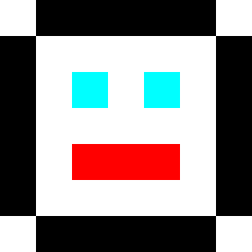

Title: Three.js Indexed Textures for Picking and Color
Description: Using Indexed Textures for Picking and Color
TOC: Using Indexed Textures for Picking and Color

This article is a continuation of [an article about aligning html elements to 3d](threejs-align-html-elements-to-3d.html).
If you haven't read that yet you should start there before continuing here.

Sometimes using three.js requires coming up with creative solutions.
I'm not sure this is a great solution but I thought I'd share it and
you can see if it suggests any solutions for your needs.

In the [previous article](threejs-align-html-elements-to-3d.html) we
displayed country names around a 3d globe. How would we go about letting
the user select a country and show their selection?

The first idea that comes to mind is to generate geometry for each country.
We could [use a picking solution](threejs-picking.html) like we covered before.
We'd build 3D geometry for each country. If the user clicks on the mesh for 
that country we'd know what country was clicked.

So, just to check that solution I tried generating 3D meshes of all the countries
using the same data I used to generate the outlines 
[in the previous article](threejs-align-html-elements-to-3d.html).
The result was a 15.5meg binary GLTF (.glb) file. Making the user download 15.5meg
sounds like too much to me.

There are lots of ways to compress the data. The first would probably be
to apply some algorithm to lower the resolution of the outlines. I didn't spend
any time pursuing that solution. For borders of the USA that's probably a huge
win. For a borders of Canada probably much less. 

Another solution would be to use just actual data compression. For example gzipping
the file brought it down to 11meg. That's 30% less but arguably not enough.

We could store all the data as 16bit ranged values instead of 32bit float values. 
Or we could use something like [draco compression](https://google.github.io/draco/)
and maybe that would be enough. I didn't check and I would encourage you to check 
yourself and tell me how it goes as I'd love to know. 😅

In my case I thought about [the GPU picking solution](threejs-picking.html) 
we covered at the end of [the article on picking](threejs-picking.html). In
that solution we drew every mesh with a unique color that represented that
mesh's id. We then drew all the meshes and looked at the color that was clicked
on.

Taking inspiration from that we could pre-generate a map of countries where
each country's color is its index number in our array of countries. We could
then use a similar GPU picking technique. We'd draw the globe off screen using
this index texture. Looking at the color of the pixel the user clicks would 
tell us the country id.

So, I [wrote some code](https://github.com/gfxfundamentals/threejsfundamentals/blob/master/threejs/lessons/tools/geo-picking/) 
to generate such a texture. Here it is. 

<div class="threejs_center"></div>

Note: The data used to generate this texture comes from [this website](http://thematicmapping.org/downloads/world_borders.php) 
and is therefore licensed as [CC-BY-SA](http://creativecommons.org/licenses/by-sa/3.0/).

It's only 217k, much better than the 14meg for the country meshes. In fact we could probably
even lower the resolution but 217k seems good enough for now.

So let's try using it for picking countries.

Grabbing code from the [gpu picking example](threejs-picking.html) we need
a scene for picking.

```js
const pickingScene = new THREE.Scene();
pickingScene.background = new THREE.Color(0);
```

and we need to add the globe with the our index texture to the
picking scene.

```js
{
  const loader = new THREE.TextureLoader();
  const geometry = new THREE.SphereBufferGeometry(1, 64, 32);

+  const indexTexture = loader.load('resources/data/world/country-index-texture.png', render);
+  indexTexture.minFilter = THREE.NearestFilter;
+  indexTexture.magFilter = THREE.NearestFilter;
+
+  const pickingMaterial = new THREE.MeshBasicMaterial({map: indexTexture});
+  pickingScene.add(new THREE.Mesh(geometry, pickingMaterial));

  const texture = loader.load('resources/data/world/country-outlines-4k.png', render);
  const material = new THREE.MeshBasicMaterial({map: texture});
  scene.add(new THREE.Mesh(geometry, material));
}
```

Then let's copy over the `GPUPickingHelper` class we used
before with a few minor changes.

```js
class GPUPickHelper {
  constructor() {
    // create a 1x1 pixel render target
    this.pickingTexture = new THREE.WebGLRenderTarget(1, 1);
    this.pixelBuffer = new Uint8Array(4);
-    this.pickedObject = null;
-    this.pickedObjectSavedColor = 0;
  }
  pick(cssPosition, scene, camera) {
    const {pickingTexture, pixelBuffer} = this;

    // set the view offset to represent just a single pixel under the mouse
    const pixelRatio = renderer.getPixelRatio();
    camera.setViewOffset(
        renderer.getContext().drawingBufferWidth,   // full width
        renderer.getContext().drawingBufferHeight,  // full top
        cssPosition.x * pixelRatio | 0,             // rect x
        cssPosition.y * pixelRatio | 0,             // rect y
        1,                                          // rect width
        1,                                          // rect height
    );
    // render the scene
    renderer.setRenderTarget(pickingTexture);
    renderer.render(scene, camera);
    renderer.setRenderTarget(null);
    // clear the view offset so rendering returns to normal
    camera.clearViewOffset();
    //read the pixel
    renderer.readRenderTargetPixels(
        pickingTexture,
        0,   // x
        0,   // y
        1,   // width
        1,   // height
        pixelBuffer);

+    const id =
+        (pixelBuffer[0] << 16) |
+        (pixelBuffer[1] <<  8) |
+        (pixelBuffer[2] <<  0);
+
+    return id;
-    const id =
-        (pixelBuffer[0] << 16) |
-        (pixelBuffer[1] <<  8) |
-        (pixelBuffer[2]      );
-    const intersectedObject = idToObject[id];
-    if (intersectedObject) {
-      // pick the first object. It's the closest one
-      this.pickedObject = intersectedObject;
-      // save its color
-      this.pickedObjectSavedColor = this.pickedObject.material.emissive.getHex();
-      // set its emissive color to flashing red/yellow
-      this.pickedObject.material.emissive.setHex((time * 8) % 2 > 1 ? 0xFFFF00 : 0xFF0000);
-    }
  }
}
```

Now we can use that to pick countries.

```js
const pickHelper = new GPUPickHelper();

function getCanvasRelativePosition(event) {
  const rect = canvas.getBoundingClientRect();
  return {
    x: (event.clientX - rect.left) * canvas.width  / rect.width,
    y: (event.clientY - rect.top ) * canvas.height / rect.height,
  };
}

function pickCountry(event) {
  // exit if we have not loaded the data yet
  if (!countryInfos) {
    return;
  }

  const position = getCanvasRelativePosition(event);
  const id = pickHelper.pick(position, pickingScene, camera);
  if (id > 0) {
    // we clicked a country. Toggle its 'selected' property
    const countryInfo = countryInfos[id - 1];
    const selected = !countryInfo.selected;
    // if we're selecting this country and modifiers are not
    // pressed unselect everything else.
    if (selected && !event.shiftKey && !event.ctrlKey && !event.metaKey) {
      unselectAllCountries();
    }
    numCountriesSelected += selected ? 1 : -1;
    countryInfo.selected = selected;
  } else if (numCountriesSelected) {
    // the ocean or sky was clicked
    unselectAllCountries();
  }
  requestRenderIfNotRequested();
}

function unselectAllCountries() {
  numCountriesSelected = 0;
  countryInfos.forEach((countryInfo) => {
    countryInfo.selected = false;
  });
}

canvas.addEventListener('mouseup', pickCountry);

let lastTouch;
canvas.addEventListener('touchstart', (event) => {
  // prevent the window from scrolling
  event.preventDefault();
  lastTouch = event.touches[0];
}, {passive: false});
canvas.addEventListener('touchmove', (event) => {
  lastTouch = event.touches[0];
});
canvas.addEventListener('touchend', () => {
  pickCountry(lastTouch);
});
```

The code above sets/unsets the `selected` property on
the array of countries. If `shift` or `ctrl` or `cmd`
is pressed then you can select more than one country.

All that's left is showing the selected countries. For now
let's just update the labels.

```js
function updateLabels() {
  // exit if we have not loaded the data yet
  if (!countryInfos) {
    return;
  }

  const large = settings.minArea * settings.minArea;
  // get a matrix that represents a relative orientation of the camera
  normalMatrix.getNormalMatrix(camera.matrixWorldInverse);
  // get the camera's position
  camera.getWorldPosition(cameraPosition);
  for (const countryInfo of countryInfos) {
-    const {position, elem, area} = countryInfo;
-    // large enough?
-    if (area < large) {
+    const {position, elem, area, selected} = countryInfo;
+    const largeEnough = area >= large;
+    const show = selected || (numCountriesSelected === 0 && largeEnough);
+    if (!show) {
      elem.style.display = 'none';
      continue;
    }

    ...
```

and with that we should be able to pick countries

{{{example url="../threejs-indexed-textures-picking.html" }}}

The code stills shows countries based on their area but if you
click one just that one will have a label.

So that seems like a reasonable solution for picking countries 
but what about highlighting the selected countries?

For that we can take inspiration from *paletted graphics*.

[Paletted graphics](https://en.wikipedia.org/wiki/Palette_%28computing%29)
or [Indexed Color](https://en.wikipedia.org/wiki/Indexed_color) is 
what older systems like the Atari 800, Amiga, NES, 
Super Nintendo, and even older IBM PCs used. Instead of storing bitmaps
as RGB colors 8bits per color, 24 bytes per pixel or more, they stored 
bitmaps as 8bit values or less. The value for each pixel was an index
into a palette. So for example a value
of 3 in the image means "display color 3". What color color#3 is is
defined somewhere else called a "palette".

In JavaScript you can think of it like this

```js
const face7x7PixelImageData = [
  0, 1, 1, 1, 1, 1, 0,
  1, 0, 0, 0, 0, 0, 1, 
  1, 0, 2, 0, 2, 0, 1,
  1, 0, 0, 0, 0, 0, 1,
  1, 0, 3, 3, 3, 0, 1,
  1, 0, 0, 0, 0, 0, 1,
  0, 1, 1, 1, 1, 1, 1,
];

const palette = [
  [255, 255, 255],  // white
  [  0,   0,   0],  // black
  [  0, 255, 255],  // cyan
  [255,   0,   0],  // red
];
```

Where each pixel in the image data is an index into palette. If you interpreted
the image data through the palette above you'd get this image

<div class="threejs_center"></div>

In our case we already have a texture above that has a different id
per country. So, we could use that same texture through a palette
texture to give each country its own color. By changing the palette
texture we can color each individual country. For example by setting
the entire palette texture to black and then for one country's entry
in the palette a different color, we can highlight just that country.

To do paletted index graphics requires some custom shader code. 
Let's modify the default shaders in three.js. 
That way we can use lighting and other features if we want.

Like we covered in [the article on animating lots of objects](threejs-optimize-lots-of-objects-animated.html)
we can modify the default shaders by adding a function to a material's
`onBeforeCompile` property.

The default fragment shader looks something like this before compiling.

```glsl
#include <common>
#include <color_pars_fragment>
#include <uv_pars_fragment>
#include <uv2_pars_fragment>
#include <map_pars_fragment>
#include <alphamap_pars_fragment>
#include <aomap_pars_fragment>
#include <lightmap_pars_fragment>
#include <envmap_pars_fragment>
#include <fog_pars_fragment>
#include <specularmap_pars_fragment>
#include <logdepthbuf_pars_fragment>
#include <clipping_planes_pars_fragment>
void main() {
	#include <clipping_planes_fragment>
	vec4 diffuseColor = vec4( diffuse, opacity );
	#include <logdepthbuf_fragment>
	#include <map_fragment>
	#include <color_fragment>
	#include <alphamap_fragment>
	#include <alphatest_fragment>
	#include <specularmap_fragment>
	ReflectedLight reflectedLight = ReflectedLight( vec3( 0.0 ), vec3( 0.0 ), vec3( 0.0 ), vec3( 0.0 ) );
	#ifdef USE_LIGHTMAP
		reflectedLight.indirectDiffuse += texture2D( lightMap, vUv2 ).xyz * lightMapIntensity;
	#else
		reflectedLight.indirectDiffuse += vec3( 1.0 );
	#endif
	#include <aomap_fragment>
	reflectedLight.indirectDiffuse *= diffuseColor.rgb;
	vec3 outgoingLight = reflectedLight.indirectDiffuse;
	#include <envmap_fragment>
	gl_FragColor = vec4( outgoingLight, diffuseColor.a );
	#include <premultiplied_alpha_fragment>
	#include <tonemapping_fragment>
	#include <encodings_fragment>
	#include <fog_fragment>
}
```

[Digging through all those snippets](https://github.com/mrdoob/three.js/tree/dev/src/renderers/shaders/ShaderChunk)
we find that three.js uses a variable called `diffuseColor` to manage the 
base material color. It sets this in the `<color_fragment>` [snippet](https://github.com/mrdoob/three.js/blob/dev/src/renderers/shaders/ShaderChunk/color_fragment.glsl.js)
so we should be able to modify it after that point.

`diffuseColor` at that point in the shader should already be the color from 
our outline texture so we can look up the color from a palette texture 
and mix them for the final result.

Like we [did before](threejs-optimize-lots-of-objects-animated.html) we'll make an array
of search and replacement strings and apply them to the shader in 
`Material.onBeforeCompile`.

```js
{
  const loader = new THREE.TextureLoader();
  const geometry = new THREE.SphereBufferGeometry(1, 64, 32);

  const indexTexture = loader.load('resources/data/world/country-index-texture.png', render);
  indexTexture.minFilter = THREE.NearestFilter;
  indexTexture.magFilter = THREE.NearestFilter;

  const pickingMaterial = new THREE.MeshBasicMaterial({map: indexTexture});
  pickingScene.add(new THREE.Mesh(geometry, pickingMaterial));

+  const fragmentShaderReplacements = [
+    {
+      from: '#include <common>',
+      to: `
+        #include <common>
+        uniform sampler2D indexTexture;
+        uniform sampler2D paletteTexture;
+        uniform float paletteTextureWidth;
+      `,
+    },
+    {
+      from: '#include <color_fragment>',
+      to: `
+        #include <color_fragment>
+        {
+          vec4 indexColor = texture2D(indexTexture, vUv);
+          float index = indexColor.r * 255.0 + indexColor.g * 255.0 * 256.0;
+          vec2 paletteUV = vec2((index + 0.5) / paletteTextureWidth, 0.5);
+          vec4 paletteColor = texture2D(paletteTexture, paletteUV);
+          // diffuseColor.rgb += paletteColor.rgb;   // white outlines
+          diffuseColor.rgb = paletteColor.rgb - diffuseColor.rgb;  // black outlines
+        }
+      `,
+    },
+  ];

  const texture = loader.load('resources/data/world/country-outlines-4k.png', render);
  const material = new THREE.MeshBasicMaterial({map: texture});
+  material.onBeforeCompile = function(shader) {
+    fragmentShaderReplacements.forEach((rep) => {
+      shader.fragmentShader = shader.fragmentShader.replace(rep.from, rep.to);
+    });
+  };
  scene.add(new THREE.Mesh(geometry, material));
}
```

Above can see above we add 3 uniforms, `indexTexture`, `paletteTexture`,
and `paletteTextureWidth`. We get a color from the `indexTexture`
and convert it to an index. `vUv` is the texture coordinates provided by 
three.js. We then use that index to get a color out of the palette texture.
We then mix the result with the current `diffuseColor`. The `diffuseColor`
at this point is our black and white outline texture so if we add the 2 colors
we'll get white outlines. If we subtract the current diffuse color we'll get
black outlines.

Before we can render we need to setup the palette texture
and these 3 uniforms.

For the palette texture it just needs to be wide enough to
hold one color per country + one for the ocean (id = 0).
There are 240 something countries. We could wait until the
list of countries loads to get an exact number or look it up.
There's not much harm in just picking some larger number so
let's choose 512.

Here's the code to create the palette texture

```js
const maxNumCountries = 512;
const paletteTextureWidth = maxNumCountries;
const paletteTextureHeight = 1;
const palette = new Uint8Array(paletteTextureWidth * 3);
const paletteTexture = new THREE.DataTexture(
    palette, paletteTextureWidth, paletteTextureHeight, THREE.RGBFormat);
paletteTexture.minFilter = THREE.NearestFilter;
paletteTexture.magFilter = THREE.NearestFilter;
```

A `DataTexture` let's us give a texture raw data. In this case
we're giving it 512 RGB colors, 3 bytes each where each byte is
red, green, and blue respectively using values that go from 0 to 255.

Let's fill it with random colors just to see it work

```js
for (let i = 1; i < palette.length; ++i) {
  palette[i] = Math.random() * 256;
}
// set the ocean color (index #0)
palette.set([100, 200, 255], 0);
paletteTexture.needsUpdate = true;
```

Anytime we want three.js to update the palette texture with
the contents of the `palette` array we need to set `paletteTexture.needsUpdate`
to `true`.

And then we still need to set the uniforms on the material.

```js
const geometry = new THREE.SphereBufferGeometry(1, 64, 32);
const material = new THREE.MeshBasicMaterial({map: texture});
material.onBeforeCompile = function(shader) {
  fragmentShaderReplacements.forEach((rep) => {
    shader.fragmentShader = shader.fragmentShader.replace(rep.from, rep.to);
  });
+  shader.uniforms.paletteTexture = {value: paletteTexture};
+  shader.uniforms.indexTexture = {value: indexTexture};
+  shader.uniforms.paletteTextureWidth = {value: paletteTextureWidth};
};
scene.add(new THREE.Mesh(geometry, material));
```

and with that we get randomly colored countries.

{{{example url="../threejs-indexed-textures-random-colors.html" }}}

Now that we can see the index and palette textures are working
let's manipulate the palette for highlighting.

First let's make function that will let us pass in a three.js
style color and give us values we can put in the palette texture.

```js
const tempColor = new THREE.Color();
function get255BasedColor(color) {
  tempColor.set(color);
  return tempColor.toArray().map(v => v * 255);
}
```

Calling it like this `color = get255BasedColor('red')` will
return an array like `[255, 0, 0]`.

Next let's use it to make a few colors and fill out the
palette.

```js
const selectedColor = get255BasedColor('red');
const unselectedColor = get255BasedColor('#444');
const oceanColor = get255BasedColor('rgb(100,200,255)');
resetPalette();

function setPaletteColor(index, color) {
  palette.set(color, index * 3);
}

function resetPalette() {
  // make all colors the unselected color
  for (let i = 1; i < maxNumCountries; ++i) {
    setPaletteColor(i, unselectedColor);
  }

  // set the ocean color (index #0)
  setPaletteColor(0, oceanColor);
  paletteTexture.needsUpdate = true;
}
```

Now let's use those functions to update the palette when a country
is selected

```js
function getCanvasRelativePosition(event) {
  const rect = canvas.getBoundingClientRect();
  return {
    x: (event.clientX - rect.left) * canvas.width  / rect.width,
    y: (event.clientY - rect.top ) * canvas.height / rect.height,
  };
}

function pickCountry(event) {
  // exit if we have not loaded the data yet
  if (!countryInfos) {
    return;
  }

  const position = getCanvasRelativePosition(event);
  const id = pickHelper.pick(position, pickingScene, camera);
  if (id > 0) {
    const countryInfo = countryInfos[id - 1];
    const selected = !countryInfo.selected;
    if (selected && !event.shiftKey && !event.ctrlKey && !event.metaKey) {
      unselectAllCountries();
    }
    numCountriesSelected += selected ? 1 : -1;
    countryInfo.selected = selected;
+    setPaletteColor(id, selected ? selectedColor : unselectedColor);
+    paletteTexture.needsUpdate = true;
  } else if (numCountriesSelected) {
    unselectAllCountries();
  }
  requestRenderIfNotRequested();
}

function unselectAllCountries() {
  numCountriesSelected = 0;
  countryInfos.forEach((countryInfo) => {
    countryInfo.selected = false;
  });
+  resetPalette();
}
```

and we that we should be able to highlight 1 or more countries.

{{{example url="../threejs-indexed-textures-picking-and-highlighting.html" }}}

That seems to work!

One minor thing is we can't spin the globe without changing
the selection state. If we select a country and then want to
rotate the globe the selection will change.

Let's try to fix that. Off the top of my head we can check 2 things.
How much time passed between clicking and letting go.
Another is did the user actually move the mouse. If the
time is short or if they didn't move the mouse then it
was probably a click. Otherwise they were probably trying
to drag the globe.

```js
+const maxClickTimeMs = 200;
+const maxMoveDeltaSq = 5 * 5;
+const startPosition = {};
+let startTimeMs;
+
+function recordStartTimeAndPosition(event) {
+  startTimeMs = performance.now();
+  const pos = getCanvasRelativePosition(event);
+  startPosition.x = pos.x;
+  startPosition.y = pos.y;
+}

function getCanvasRelativePosition(event) {
  const rect = canvas.getBoundingClientRect();
  return {
    x: (event.clientX - rect.left) * canvas.width  / rect.width,
    y: (event.clientY - rect.top ) * canvas.height / rect.height,
  };
}

function pickCountry(event) {
  // exit if we have not loaded the data yet
  if (!countryInfos) {
    return;
  }

+  // if it's been a moment since the user started
+  // then assume it was a drag action, not a select action
+  const clickTimeMs = performance.now() - startTimeMs;
+  if (clickTimeMs > maxClickTimeMs) {
+    return;
+  }
+
+  // if they moved assume it was a drag action
+  const position = getCanvasRelativePosition(event);
+  const moveDeltaSq = (startPosition.x - position.x) ** 2 +
+                      (startPosition.y - position.y) ** 2;
+  if (moveDeltaSq > maxMoveDeltaSq) {
+    return;
+  }

-  const position = {x: event.clientX, y: event.clientY};
  const id = pickHelper.pick(position, pickingScene, camera);
  if (id > 0) {
    const countryInfo = countryInfos[id - 1];
    const selected = !countryInfo.selected;
    if (selected && !event.shiftKey && !event.ctrlKey && !event.metaKey) {
      unselectAllCountries();
    }
    numCountriesSelected += selected ? 1 : -1;
    countryInfo.selected = selected;
    setPaletteColor(id, selected ? selectedColor : unselectedColor);
    paletteTexture.needsUpdate = true;
  } else if (numCountriesSelected) {
    unselectAllCountries();
  }
  requestRenderIfNotRequested();
}

function unselectAllCountries() {
  numCountriesSelected = 0;
  countryInfos.forEach((countryInfo) => {
    countryInfo.selected = false;
  });
  resetPalette();
}

+canvas.addEventListener('mousedown', recordStartTimeAndPosition);
canvas.addEventListener('mouseup', pickCountry);

let lastTouch;
canvas.addEventListener('touchstart', (event) => {
  // prevent the window from scrolling
  event.preventDefault();
  lastTouch = event.touches[0];
+  recordStartTimeAndPosition(event.touches[0]);
}, {passive: false});
canvas.addEventListener('touchmove', (event) => {
  lastTouch = event.touches[0];
});
```

and with those changes it *seems* like it works to me.

{{{example url="../threejs-indexed-textures-picking-debounced.html" }}}

I'm not a UX expert so I'd love to hear if there is a better
solution.

I hope that gave you some idea of how indexed graphics can be useful
and how you can modify the shaders three.js makes to add simple features.
How to use GLSL, the language the shaders are written in, is too much for
this article. There are a few links to some info in
[the article on post processing](threejs-post-processing.html).
