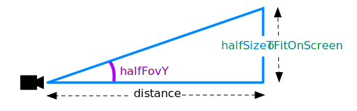

Title: Three.js Loading a .OBJ File
Description: Loading a .OBJ File
TOC: Load an .OBJ file

One of the most common things people want to do with three.js
is to load and display 3D models. A common format is the .OBJ
3D format so let's try loading one.

Searching the net I found [this CC-BY-NC 3.0 windmill 3D model](https://www.blendswap.com/blends/view/69174) by [ahedov](https://www.blendswap.com/user/ahedov).

<div class="threejs_center"></div>

I downloaded the .blend file from that site, loaded it into [Blender](https://blender.org)
and exported it as an .OBJ file.

<div class="threejs_center"></div>

> Note: If you've never used Blender you might be in for a surprise
in that Blender does things differently than just about every
other program you've ever used. Just be aware you might need to
set aside some time to read some basic UI navigation for Blender.

> Let me also add that 3D programs in general are giant beasts with
1000s of features. They are some of the most complicated software there
is. When I first learned 3D Studio Max in 1996 I read through 70% of the
600 page manual spending a few hours a day for around 3 weeks. That paid
off in that when I learned Maya a few years later some of the lessons
learned before were applicable to Maya. So, just be aware that if you
really want to be able to use 3D software to either build 3D assets
or to modify existing ones put it on your schedule and clear sometime
to really go through some lessons.

In any case I used these export options

<div class="threejs_center"></div>

Let's try to display it!

I started with the directional lighting example from 
[the lights article](threejs-lights.html) and I combined it with
the hemispherical lighting example so I ended up with one
`HemisphereLight` and one `DirectionalLight`. I also removed all the GUI stuff
related to adjusting the lights. I also removed the cube and sphere
that were being added to the scene.

From that the first thing we need to do is include the `OBJLoader` loader in our script.

```js
import {OBJLoader} from './resources/threejs/r127/examples/jsm/loaders/OBJLoader.js';
```

Then to load the .OBJ file we create an instance of `OBJLoader`,
pass it the URL of our .OBJ file, and pass in a callback that adds
the loaded model to our scene.

```js
{
  const objLoader = new OBJLoader();
  objLoader.load('resources/models/windmill/windmill.obj', (root) => {
    scene.add(root);
  });
}
```

If we run that what happens?

{{{example url="../threejs-load-obj-no-materials.html" }}}

Well it's close but we're getting errors about materials since we haven't
given the scene any materials and .OBJ files don't have material
parameters. 

The .OBJ loader can be passed an
object of name / material pairs. When it loads the .OBJ file,
any material name it finds it will look for the corresponding material
in the map of materials set on the loader. If it finds a
material that matches by name it will use that material. If
not it will use the loader's default material.

Sometimes .OBJ files come with a .MTL file that defines
materials. In our case the exporter also created a .MTL file.
.MTL format is plain ASCII so it's easy to look at. Looking at it here

```mtl
# Blender MTL File: 'windmill_001.blend'
# Material Count: 2

newmtl Material
Ns 0.000000
Ka 1.000000 1.000000 1.000000
Kd 0.800000 0.800000 0.800000
Ks 0.000000 0.000000 0.000000
Ke 0.000000 0.000000 0.000000
Ni 1.000000
d 1.000000
illum 1
map_Kd windmill_001_lopatky_COL.jpg
map_Bump windmill_001_lopatky_NOR.jpg

newmtl windmill
Ns 0.000000
Ka 1.000000 1.000000 1.000000
Kd 0.800000 0.800000 0.800000
Ks 0.000000 0.000000 0.000000
Ke 0.000000 0.000000 0.000000
Ni 1.000000
d 1.000000
illum 1
map_Kd windmill_001_base_COL.jpg
map_Bump windmill_001_base_NOR.jpg
map_Ns windmill_001_base_SPEC.jpg
```

We can see there are 2 materials referencing 5 jpg textures
but where are the texture files?

<div class="threejs_center"></div>

All we got was an .OBJ file and an .MTL file.

At least for this model it turns out the textures are embedded
in the .blend file we downloaded. We can ask blender to
export those files to by picking **File->External Data->Unpack All Into Files**

<div class="threejs_center"></div>

and then choosing **Write Files to Current Directory**

<div class="threejs_center"></div>

This ends up writing the files in the same folder as the .blend file 
in a sub folder called **textures**.

<div class="threejs_center"></div>

I copied those textures into the same folder I exported the .OBJ
file to.

<div class="threejs_center"></div>

Now that we have the textures available we can load the .MTL file.

First we need to include the `MTLLoader`;

```js
import * as THREE from './resources/three/r127/build/three.module.js';
import {OrbitControls} from './resources/threejs/r127/examples/jsm/controls/OrbitControls.js';
import {OBJLoader} from './resources/threejs/r127/examples/jsm/loaders/OBJLoader.js';
+import {MTLLoader} from './resources/threejs/r127/examples/jsm/loaders/MTLLoader.js';
```

Then we first load the .MTL file. When it's finished loading we add
the just loaded materials on to the `OBJLoader` itself via the `setMaterials`
and then load the .OBJ file.

```js
{
+  const mtlLoader = new MTLLoader();
+  mtlLoader.load('resources/models/windmill/windmill.mtl', (mtl) => {
+    mtl.preload();
+    objLoader.setMaterials(mtl);
    objLoader.load('resources/models/windmill/windmill.obj', (root) => {
      scene.add(root);
    });
+  });
}
```

And if we try that...

{{{example url="../threejs-load-obj-materials.html" }}}

Note that if we spin the model around you'll see the windmill cloth
disappears

<div class="threejs_center"></div>

We need the material on the blades to be double sided, something
we went over in [the article on materials](threejs-materials.html).
There is no easy way to fix this in the .MTL file. Off the top of my 
head I can think of 3 ways to fix this.

1. Loop over all the materials after loading them and set them all to double sided.

        const mtlLoader = new MTLLoader();
        mtlLoader.load('resources/models/windmill/windmill.mtl', (mtl) => {
          mtl.preload();
          for (const material of Object.values(mtl.materials)) {
            material.side = THREE.DoubleSide;
          }
          ...

   This solution works but ideally we only want materials that need
   to be double sided to be double sided because drawing double sided
   is slower than single sided.

2. Manually set a specific material

   Looking in the .MTL file there are 2 materials. One called `"windmill"`
   and the other called `"Material"`. Through trial and error I figured
   out the blades use the material called `"Material"`so we could set
   that one specifically 

        const mtlLoader = new MTLLoader();
        mtlLoader.load('resources/models/windmill/windmill.mtl', (mtl) => {
          mtl.preload();
          mtl.materials.Material.side = THREE.DoubleSide;
          ...

3. Realizing that the .MTL file is limited we could just not use it
   and instead create materials ourselves.

   In this case we'd need to look up the `Mesh` object after
   loading the obj file.

        objLoader.load('resources/models/windmill/windmill.obj', (root) => {
          const materials = {
            Material: new THREE.MeshPhongMaterial({...}),
            windmill: new THREE.MeshPhongMaterial({...}),
          };
          root.traverse(node => {
            const material = materials[node.material?.name];
            if (material) {
              node.material = material;
            }
          })
          scene.add(root);
        });

Which one you pick is up to you. 1 is easiest. 3 is most flexible.
2 somewhere in between. For now I'll pick 2.

And with that change you should still see the cloth on the blades
when looking from behind but there's one more issue. If we zoom in close
we see things are turning blocky.

<div class="threejs_center"></div>

What's going on?

Looking at the textures there are 2 textures labelled NOR for NORmal map.
And looking at them they look like normal maps. Normal maps are generally
purple where as bump maps are black and white. Normal maps represent
the direction of the surface where as bump maps represent the height of
the surface.

<div class="threejs_center"></div>

Looking at [the source for the MTLLoader](https://github.com/mrdoob/three.js/blob/1a560a3426e24bbfc9ca1f5fb0dfb4c727d59046/examples/js/loaders/MTLLoader.js#L432)
it expects the keyword `norm` for normal maps so let's edit the .MTL file

```mtl
# Blender MTL File: 'windmill_001.blend'
# Material Count: 2

newmtl Material
Ns 0.000000
Ka 1.000000 1.000000 1.000000
Kd 0.800000 0.800000 0.800000
Ks 0.000000 0.000000 0.000000
Ke 0.000000 0.000000 0.000000
Ni 1.000000
d 1.000000
illum 1
map_Kd windmill_001_lopatky_COL.jpg
-map_Bump windmill_001_lopatky_NOR.jpg
+norm windmill_001_lopatky_NOR.jpg

newmtl windmill
Ns 0.000000
Ka 1.000000 1.000000 1.000000
Kd 0.800000 0.800000 0.800000
Ks 0.000000 0.000000 0.000000
Ke 0.000000 0.000000 0.000000
Ni 1.000000
d 1.000000
illum 1
map_Kd windmill_001_base_COL.jpg
-map_Bump windmill_001_base_NOR.jpg
+norm windmill_001_base_NOR.jpg
map_Ns windmill_001_base_SPEC.jpg
```

and now when we load it it will be using the normal maps as normal maps and
we can see the back of the blades.

{{{example url="../threejs-load-obj-materials-fixed.html" }}}

Let's load a different file.

Searching the net I found this [CC-BY-NC](https://creativecommons.org/licenses/by-nc/4.0/) windmill 3D model made by [Roger Gerzner / GERIZ.3D Art](http://www.gerzi.ch/).

<div class="threejs_center"></div>

It had a .OBJ version already available. Let's load it up (note I removed the .MTL loader for now)

```js
-  objLoader.load('resources/models/windmill/windmill.obj', ...
+  objLoader.load('resources/models/windmill-2/windmill.obj', ...
```

{{{example url="../threejs-load-obj-wat.html" }}}

Hmmm, nothing appears. What's the problem? I wonder what size the model is?
We can ask THREE.js what size the model is and try to set our
camera automatically.

First off we can ask THREE.js to compute a box that contains the scene
we just loaded and ask for its size and center

```js
objLoader.load('resources/models/windmill_2/windmill.obj', (root) => {
  scene.add(root);

+  const box = new THREE.Box3().setFromObject(root);
+  const boxSize = box.getSize(new THREE.Vector3()).length();
+  const boxCenter = box.getCenter(new THREE.Vector3());
+  console.log(boxSize);
+  console.log(boxCenter);
```

Looking in [the JavaScript console](threejs-debugging-javascript.html) I see

```js
size 2123.6499788469982
center p {x: -0.00006103515625, y: 770.0909731090069, z: -3.313507080078125}
```

Our camera is currently only showing about 100 units with `near` at 0.1 and `far` at 100.
Our ground plane is only 40 units across so basically this windmill model is so big, 2000 units, 
that it's surrounding our camera and all parts of it our outside our frustum.

<div class="threejs_center"></div>

We could manually fix that but we could also make the camera auto frame our scene.
Let's try that. We can then use the box we just computed adjust the camera settings to
view the entire scene. Note that there is no *right* answer
on where to put the camera. We could be facing the scene from any direction at any
altitude so we'll just have to pick something.

As we went over in [the article on cameras](threejs-cameras.html) the camera defines a frustum.
That frustum is defined by the field of view (`fov`) and the `near` and `far` settings. We
want to know given whatever field of view the camera currently has, how far away does the camera
need to be so the box containing the scene fits inside the frustum assuming the frustum
extended forever. In other words let's assume `near` is 0.00000001 and `far` is infinity.

Since we know the size of the box and we know the field of view we have this triangle

<div class="threejs_center"></div>

You can see on the left is the camera and the blue frustum is projecting out in
front of it. We just computed the box that contains the the windmill. We need to
compute how far way the camera should be from the box so that the box appears
inside the frustum.

Using basic *right triangle* trigonometry and [SOHCAHTOA](https://www.google.com/search?q=SOHCAHTOA), 
given we know the field of view for the frustum and we know the size of the box we can compute the *distance*.

<div class="threejs_center"></div>

Based on that diagram the formula for computing distance is

```js
distance = halfSizeToFitOnScreen / tangent(halfFovY)
```

Let's translate that to code. First let's make a function that will compute `distance` and then move the
camera that `distance` units from the center of the box. We'll then point the
camera at the `center` of the box.

```js
function frameArea(sizeToFitOnScreen, boxSize, boxCenter, camera) {
  const halfSizeToFitOnScreen = sizeToFitOnScreen * 0.5;
  const halfFovY = THREE.MathUtils.degToRad(camera.fov * .5);
  const distance = halfSizeToFitOnScreen / Math.tan(halfFovY);

  // compute a unit vector that points in the direction the camera is now
  // from the center of the box
  const direction = (new THREE.Vector3()).subVectors(camera.position, boxCenter).normalize();

  // move the camera to a position distance units way from the center
  // in whatever direction the camera was from the center already
  camera.position.copy(direction.multiplyScalar(distance).add(boxCenter));

  // pick some near and far values for the frustum that
  // will contain the box.
  camera.near = boxSize / 100;
  camera.far = boxSize * 100;

  camera.updateProjectionMatrix();

  // point the camera to look at the center of the box
  camera.lookAt(boxCenter.x, boxCenter.y, boxCenter.z);
}
```

We pass in 2 sizes. The `boxSize` and the `sizeToFitOnScreen`. If we just passed in `boxSize`
and used that as `sizeToFitOnScreen` then the math would make the box fit perfectly inside
the frustum. We want a little extra space above and below so we'll pass in a slightly 
larger size. 

```js
{
  const objLoader = new OBJLoader();
  objLoader.load('resources/models/windmill_2/windmill.obj', (root) => {
    scene.add(root);
+    // compute the box that contains all the stuff
+    // from root and below
+    const box = new THREE.Box3().setFromObject(root);
+
+    const boxSize = box.getSize(new THREE.Vector3()).length();
+    const boxCenter = box.getCenter(new THREE.Vector3());
+
+    // set the camera to frame the box
+    frameArea(boxSize * 1.2, boxSize, boxCenter, camera);
+
+    // update the Trackball controls to handle the new size
+    controls.maxDistance = boxSize * 10;
+    controls.target.copy(boxCenter);
+    controls.update();
  });
}
```

You can see above we pass in `boxSize * 1.2` to give us 20% more space above and below the box when trying 
to fit it inside the frustum. We also updated the `OrbitControls` so the camera will orbit the center
of the scene.

Now if we try that we get...

{{{example url="../threejs-load-obj-auto-camera.html" }}}

This almost works. Use the mouse to rotate the camera and you
should see the windmill. The problem is the windmill is large and the box's center is at about (0, 770, 0). So, when we move the camera from where it
starts (0, 10, 20) to `distance` units way from the center in the direction the camera
is relative to the center that's moving the camera almost straight down below
the windmill.

<div class="threejs_center"></div>

Let's change it to move sideways from the center of the box to in whatever direction
the camera is from the center. All we need to do to do that is zero out the `y` component
of the vector from the box to the camera. Then, when we normalize that vector it will
become a vector parallel to the XZ plane. In other words parallel to the ground.

```js
-// compute a unit vector that points in the direction the camera is now
-// from the center of the box
-const direction = (new THREE.Vector3()).subVectors(camera.position, boxCenter).normalize();
+// compute a unit vector that points in the direction the camera is now
+// in the xz plane from the center of the box
+const direction = (new THREE.Vector3())
+    .subVectors(camera.position, boxCenter)
+    .multiply(new THREE.Vector3(1, 0, 1))
+    .normalize();
```

If you look at the bottom of the windmill you'll see a small square. That is our ground
plane. 

<div class="threejs_center"></div>

It's only 40x40 units and so is way too small relative to the windmill.
Since the windmill is over 2000 units big let's change the size of the ground plane to
something more fitting. We also need to adjust the repeat otherwise our checkerboard
will be so fine we won't even be able to see it unless we zoom way way in.

```js
-const planeSize = 40;
+const planeSize = 4000;

const loader = new THREE.TextureLoader();
const texture = loader.load('resources/images/checker.png');
texture.wrapS = THREE.RepeatWrapping;
texture.wrapT = THREE.RepeatWrapping;
texture.magFilter = THREE.NearestFilter;
-const repeats = planeSize / 2;
+const repeats = planeSize / 200;
texture.repeat.set(repeats, repeats);
```

and now we can see this windmill

{{{example url="../threejs-load-obj-auto-camera-xz.html" }}}

Let's add the materials back. Like before there is a .MTL file that references
some textures but looking at the files I quickly see an issue.

```shell
 $ ls -l windmill
 -rw-r--r--@ 1 gregg  staff       299 May 20  2009 windmill.mtl
 -rw-r--r--@ 1 gregg  staff    142989 May 20  2009 windmill.obj
 -rw-r--r--@ 1 gregg  staff  12582956 Apr 19  2009 windmill_diffuse.tga
 -rw-r--r--@ 1 gregg  staff  12582956 Apr 20  2009 windmill_normal.tga
 -rw-r--r--@ 1 gregg  staff  12582956 Apr 19  2009 windmill_spec.tga
```

There are TARGA (.tga) files and they are giant!

THREE.js actually has a TGA loader but it's arguably wrong to use it for most use cases.
If you're making a viewer where you want to allow users to view random 3D files they
find on the net then maybe, just maybe, you might want to load TGA files. ([*](#loading-scenes))

One problem with TGA files are they can't be compressed well at all. TGA only supports very
simple compression and looking above we can see the files are not compressed at all
as the odds of them being all exactly the same size are extremely low. Further they 
are 12 megabytes each!!! If we used those files the user would have to download 36meg
to see the windmill.

Another issue with TGA is the browser itself has no support for them so loading them 
is likely going to be slower than loading supported formats like .JPG and .PNG

I'm pretty sure for our purposes converting them to .JPG will be the best option.
Looking inside I see they are 3 channels each, RGB, there is no alpha channel. JPG
only supports 3 channels so that's a good fit. JPG also supports lossy compression
so we can make the files much smaller to download

Loading the files up they were each 2048x2048. That seemed like a waste to me but of
course it depends on your use case. I made them each 1024x1024 and saved them at a
50% quality setting in Photoshop. Getting a file listing

```shell
 $ ls -l ../threejsfundamentals.org/threejs/resources/models/windmill
 -rw-r--r--@ 1 gregg  staff     299 May 20  2009 windmill.mtl
 -rw-r--r--@ 1 gregg  staff  142989 May 20  2009 windmill.obj
 -rw-r--r--@ 1 gregg  staff  259927 Nov  7 18:37 windmill_diffuse.jpg
 -rw-r--r--@ 1 gregg  staff   98013 Nov  7 18:38 windmill_normal.jpg
 -rw-r--r--@ 1 gregg  staff  191864 Nov  7 18:39 windmill_spec.jpg
```

We went from 36meg to 0.55meg! Of course the artist might not be pleased
with this compression so be sure to consult with them to discuss the tradeoffs.

Now, to use the .MTL file we need to edit it to reference the .JPG files
instead of the .TGA files. Fortunately it's a simple text file so it's easy to edit

```mtl
newmtl blinn1SG
Ka 0.10 0.10 0.10

Kd 0.00 0.00 0.00
Ks 0.00 0.00 0.00
Ke 0.00 0.00 0.00
Ns 0.060000
Ni 1.500000
d 1.000000
Tr 0.000000
Tf 1.000000 1.000000 1.000000 
illum 2
-map_Kd windmill_diffuse.tga
+map_Kd windmill_diffuse.jpg

-map_Ks windmill_spec.tga
+map_Ks windmill_spec.jpg

-map_bump windmill_normal.tga 
-bump windmill_normal.tga 
+map_bump windmill_normal.jpg 
+bump windmill_normal.jpg 
```

Now that the .MTL file points to some reasonable size textures we need to load it so we'll just do like we did above, first load the materials
and then set them on the `OBJLoader`

```js
{
+  const mtlLoader = new MTLLoader();
+  mtlLoader.load('resources/models/windmill_2/windmill-fixed.mtl', (mtl) => {
+    mtl.preload();
+    const objLoader = new OBJLoader();
+    objLoader.setMaterials(mtl);
    objLoader.load('resources/models/windmill/windmill.obj', (root) => {
      root.updateMatrixWorld();
      scene.add(root);
      // compute the box that contains all the stuff
      // from root and below
      const box = new THREE.Box3().setFromObject(root);

      const boxSize = box.getSize(new THREE.Vector3()).length();
      const boxCenter = box.getCenter(new THREE.Vector3());

      // set the camera to frame the box
      frameArea(boxSize * 1.2, boxSize, boxCenter, camera);

      // update the Trackball controls to handle the new size
      controls.maxDistance = boxSize * 10;
      controls.target.copy(boxCenter);
      controls.update();
    });
+  });
}
```

Before we actually try it out I ran into some issues that rather than show a failure I'm just going to go over them.

Issue #1: The three `MTLLoader` creates materials that multiply the material's diffuse color by the diffuse texture map.

That's a useful feature but looking a the .MTL file above the line

```mtl
Kd 0.00 0.00 0.00
```

sets the diffuse color to 0. Texture map * 0 = black! It's possible the modeling tool used to make the windmill
did not multiply the diffuse texture map by the diffuse color. That's why it worked for the artists that made this windmill.

To fix this we can change the line to

```mtl
Kd 1.00 1.00 1.00
```

since Texture Map * 1 = Texture Map.

Issue #2: The specular color is also black

The line that starts with `Ks` specifies the specular color. It's likely the modeling software used to make the windmill
did something similar as it did with diffuse maps in that it used the specular map's color for specular highlights.
Three.js uses only the red channel of a specular map as input to how much of the specular color to reflect but three still
needs a specular color set.

Like above we can fix that by editing the .MTL file like this.

```mtl
-Ks 0.00 0.00 0.00
+Ks 1.00 1.00 1.00
```

Issue #3: The `windmill_normal.jpg` is a normal map not a bump map.

Just like above we just need to edit the .MTL file

```mtl
-map_bump windmill_normal.jpg 
-bump windmill_normal.jpg 
+norm windmill_normal.jpg 
```

Given all that if we now try it out it should load up with materials.

{{{example url="../threejs-load-obj-materials-windmill2.html" }}}

Loading models often runs into these kinds of issues. Common issues include:

* Needing to know the size

  Above we made the camera try to frame the scene but that's not always the appropriate thing to do. Generally the most appropriate thing
  to do is to make your own models or download the models, load them up in some 3D software and look at their scale and adjust if need be.

* Orientation Wrong

  THREE.js is generally Y = up. Some modeling packages default to Z = up, some Y = up. Some are settable. 
  If you run into this case where you load a model and it's on its side. You can either hack your code to rotate the model after loading (not recommended),
  or you can load the model into your favorite modeling package or use some command line tools to rotate the object in the orientation you need it to be
  just like you'd edit an image for your website rather than download it and apply code to adjust it. Blender even has options when you export to 
  change the orientation.

* No .MTL file or wrong materials or incompatible parameters

  Above we used a .MTL file above which helped us load materials but there were issues. We manually edited the .MTL file to fix.
  It's also common to look inside the .OBJ file to see what materials there are, or to load the .OBJ file in THREE.js and walk the
  scene and print out all the materials. Then, go modify the code to make custom materials and assign them where appropriate either
  by making a name/material pair object to pass to the loader instead of loading the .MTL file, OR, after the scene has loaded, walking the
  scene and fixing things.

* Textures too large

  Most 3D models are made for either architecture, movies and commercials, or
  games. For architecture and movies no one really cares about the size
  of the textures since. For games people care because games have limited
  memory but most games run locally. Webpages though you want to load
  as fast as possible and so you need to look at the textures and try
  to make them as small as possible and still look good. In fact the first windmill we should arguably done something about
  the textures. They are currently a total of 10meg!!!

  Also remember
  like we mentioned in the [article on textures](threejs-textures.html) that
  textures take memory so a 50k JPG that expands to 4096x4096 will download
  fast but still take a ton of memory.

The last thing I wanted to show is spinning the windmills. Unfortunately, .OBJ files have no hierarchy. That means all parts of each
windmill are basically considered 1 single mesh. You can't spin the blades of the mill as they aren't separated from the rest of the building.

This is one of the main reasons why .OBJ is not really a good format. If I was to guess, the reason it's more common than other formats
is because it's simple and doesn't support many features it works more often than not. Especially if you're making something still like
an architectural image and there's no need to animate anything it's not a bad way to get static props into a scene.

Next up we'll try [loading a gLTF scene](threejs-load-gltf.html). The gLTF format supports many more features.

