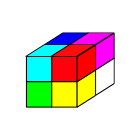
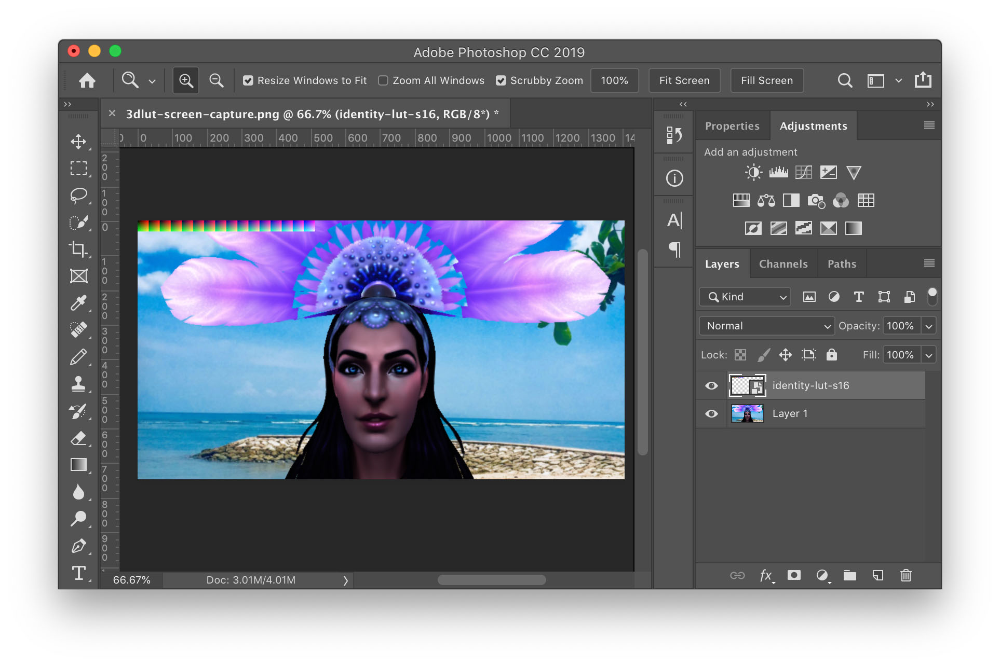
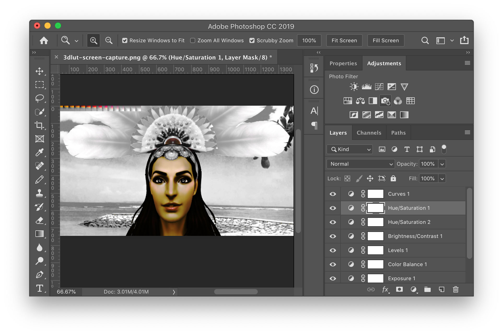

Title: Three.js Post Processing 3DLUT
Description: How to implement a 3DLUT Post Process in THREE.js
TOC: Applying a LUT File for effects

In the last article we went over [post processing](threejs-post-processing.html).
One of the common ways to post process is called a LUT or 3DLUT. LUT stands for LookUp Table. A 3DLUT is therefore a 3 dimensional look up table.

How it works is we make a cube of colors. Then we index the cube using the colors of our source image. For each pixel in the original image we look up a position in the cube based on the red, green, and blue colors of the original pixel. The value we pull out of the 3DLUT is the new color.

In Javascript we might do it like this. Imagine the colors are specified in integers from 0 to 255 and we have a large 3 dimensional array 256x256x256 in size. Then for to translate a color through the look up table

    const newColor = lut[origColor.red][origColor.green][origColor.bue]

Of course a 256x256x256 array would be rather large but as we pointed out in [the article on textures](threejs-textures.html) textures are referenced from values of 0.0 to 1.0 regardless of the dimensions of the texture.

Let's imagine an 8x8x8 cube.

<div class="threejs_center"></div>

First we might fill in the corners with 0,0,0 corner being pure black, the opposite 1,1,1 corner pure white. 1,0,0 being pure <span style="color:red;">red</span>. 0,1,0 being pure <span style="color:green;">green</span> and 0,0,1 being <span style="color:blue;">blue</span>. 

<div class="threejs_center"></div>

We'd add in the colors down each axis.

<div class="threejs_center"></div>

And the colors on edges that use 2 or more channels.

<div class="threejs_center"></div>

And finally fill in all the colors in between. This is an "identity" 3DLUT. It produces the exact same output as input. If you look up a color you'll get the same color out.

<div class="threejs_center"><object type="image/svg+xml" data="resources/images/3dlut-standard-lookup.svg" class="noinvertdark" data-diagram="lookup" style="width: 600px"></object></div>

If we change the cube to shades of amber though then as we look up colors, we look up the same locations in the 3D lookup table but they produce different output.

<div class="threejs_center"><object type="image/svg+xml" data="resources/images/3dlut-amber-lookup.svg" class="noinvertdark" data-diagram="lookup" style="width: 600px"></object></div>

Using this techinque by supplying a different lookup table we can apply all kinds of effects. Basically any effect that can be computed based only on a single color input. Those effects include adjusting hue, contrast, saturation, color cast, tint, brightness, exposure, levels, curves, posterize, shadows, highlghts, and many others. Even better they can all be combined into a single look up table.

To use it we need a scene to apply it to. Let's throw together a quick scene. We'll start with a glTF file and display it like we covered in [the article on loading a glTF](threejs-load-gltf.html). The model we're loading is [this model](https://sketchfab.com/models/a1d315908e9f45e5a3bc618bdfd2e7ee) by [The Ice Wolves](https://sketchfab.com/sarath.irn.kat005). It uses no lights so I removed the lights.

We'll also add a background image like we covered in [backgrounds and skyboxs](threejs-backgrounds.html).

{{{example url="../threejs-postprocessing-3dlut-prep.html" }}}

Now that we have a scene we need a 3DLUT. The simplest 3DLUT is a 2x2x2 identity LUT where *identity* means nothing happens. It's like multiplying by 1 or doing nothing, even though we're looking up colors in the LUT each color in maps to the same color out.

<div class="threejs_center"></div>

WebGL1 doesn't support 3D textures so we'll use 4x2 2D texture and treat it as a 3D texture inside a custom shader where each slice of the cube is spread out horizontally across the texture.

Here's the code to make 4x2 2D texture with the colors required for an identity LUT.

```js
const makeIdentityLutTexture = function() {
  const identityLUT = new Uint8Array([
      0,   0,   0, 255,  // black
    255,   0,   0, 255,  // red
      0,   0, 255, 255,  // blue
    255,   0, 255, 255,  // magenta
      0, 255,   0, 255,  // green
    255, 255,   0, 255,  // yellow
      0, 255, 255, 255,  // cyan
    255, 255, 255, 255,  // white
  ]);

  return function(filter) {
    const texture = new THREE.DataTexture(identityLUT, 4, 2, THREE.RGBAFormat);
    texture.minFilter = filter;
    texture.magFilter = filter;
    texture.needsUpdate = true;
    texture.flipY = false;
    return texture;
  };
}();
```

Let's make 2 of them, one filtered and one not

```js
const lutTextures = [
  { name: 'identity', size: 2, texture: makeIdentityLutTexture(THREE.LinearFilter) },
  { name: 'identity not filtered', size: 2, texture: makeIdentityLutTexture(THREE.NearestFilter) },
];
```

Taking the example using a custom shader from [the article on post processing](threejs-post-processing.html) lets use these 2 custom shaders instead.

```js
const lutShader = {
  uniforms: {
    tDiffuse: { value: null },
    lutMap:  { value: null },
    lutMapSize: { value: 1, },
  },
  vertexShader: `
    varying vec2 vUv;
    void main() {
      vUv = uv;
      gl_Position = projectionMatrix * modelViewMatrix * vec4( position, 1.0 );
    }
  `,
  fragmentShader: `
    #include <common>

    #define FILTER_LUT true

    uniform sampler2D tDiffuse;
    uniform sampler2D lutMap;
    uniform float lutMapSize;

    varying vec2 vUv;

    vec4 sampleAs3DTexture(sampler2D tex, vec3 texCoord, float size) {
      float sliceSize = 1.0 / size;                  // space of 1 slice
      float slicePixelSize = sliceSize / size;       // space of 1 pixel
      float width = size - 1.0;
      float sliceInnerSize = slicePixelSize * width; // space of size pixels
      float zSlice0 = floor( texCoord.z * width);
      float zSlice1 = min( zSlice0 + 1.0, width);
      float xOffset = slicePixelSize * 0.5 + texCoord.x * sliceInnerSize;
      float yRange = (texCoord.y * width + 0.5) / size;
      float s0 = xOffset + (zSlice0 * sliceSize);

      #ifdef FILTER_LUT

        float s1 = xOffset + (zSlice1 * sliceSize);
        vec4 slice0Color = texture2D(tex, vec2(s0, yRange));
        vec4 slice1Color = texture2D(tex, vec2(s1, yRange));
        float zOffset = mod(texCoord.z * width, 1.0);
        return mix(slice0Color, slice1Color, zOffset);

      #else

        return texture2D(tex, vec2( s0, yRange));

      #endif
    }

    void main() {
      vec4 originalColor = texture2D(tDiffuse, vUv);
      gl_FragColor = sampleAs3DTexture(lutMap, originalColor.xyz, lutMapSize);
    }
  `,
};

const lutNearestShader = {
  uniforms: {...lutShader.uniforms},
  vertexShader: lutShader.vertexShader,
  fragmentShader: lutShader.fragmentShader.replace('#define FILTER_LUT', '//'),
};
```

You can see in the fragment shader there is this line

```glsl
#define FILTER_LUT true
```

To generate the second shader we comment out that line.

Then we use them to make 2 custom effects

```js
const effectLUT = new THREE.ShaderPass(lutShader);
effectLUT.renderToScreen = true;
const effectLUTNearest = new THREE.ShaderPass(lutNearestShader);
effectLUTNearest.renderToScreen = true;
```

Translating our existing code that draws the background as a separate scene we a `RenderPass` for both the scene drawing the glTF and the scene drawing the background.

```js
const renderModel = new THREE.RenderPass(scene, camera);
renderModel.clear = false;  // so we don't clear out the background
const renderBG = new THREE.RenderPass(sceneBG, cameraBG);
```

and we can setup our `EffectComposer` to use all the passes

```js
const rtParameters = {
  minFilter: THREE.LinearFilter,
  magFilter: THREE.LinearFilter,
  format: THREE.RGBFormat,
};
const composer = new THREE.EffectComposer(renderer, new THREE.WebGLRenderTarget(1, 1, rtParameters));

composer.addPass(renderBG);
composer.addPass(renderModel);
composer.addPass(effectLUT);
composer.addPass(effectLUTNearest);
```

Let's make some GUI code to select one lut or the other

```js
const lutNameIndexMap = {};
lutTextures.forEach((info, ndx) => {
  lutNameIndexMap[info.name] = ndx;
});

const lutSettings = {
  lut: lutNameIndexMap.identity,
};
const gui = new GUI({ width: 300 });
gui.add(lutSettings, 'lut', lutNameIndexMap);
```

The last thing to do is turn on one effect or the other, depending on whether or not we want filtering, set the effect to use the selected texture, and render via the `EffectComposer`

```js
const lutInfo = lutTextures[lutSettings.lut];

const effect = lutInfo.filter ? effectLUT : effectLUTNearest;
effectLUT.enabled = lutInfo.filter;
effectLUTNearest.enabled = !lutInfo.filter;

const lutTexture = lutInfo.texture;
effect.uniforms.lutMap.value = lutTexture;
effect.uniforms.lutMapSize.value = lutInfo.size;

composer.render(delta);
```

Given it's the identity 3DLUT nothing changes

{{{example url="../threejs-postprocessing-3dlut-identity.html" }}}

but we select the unfiltered LUT we get something much more interesting

<div class="threejs_center"></div>

Why does this happen? Because with filtering on, the GPU linearly interpolates between the colors. With filtering off it does no interpolation so looking up colors in the 3DLUT only gives one of the exact colors in the 3DLUT.

So how do we go about making more interesting 3DLUTs?

First decide on the resolution of the table you want and generate the slices of the lookup cube using a simple script.

```js
const ctx = document.querySelector('canvas').getContext('2d');

function drawColorCubeImage(ctx, size) {
  const canvas = ctx.canvas;
  canvas.width = size * size;
  canvas.height = size;

  for (let zz = 0; zz < size; ++zz) {
    for (let yy = 0; yy < size; ++yy) {
      for (let xx = 0; xx < size; ++xx) {
        const r = Math.floor(xx / (size - 1) * 255);
        const g = Math.floor(yy / (size - 1) * 255);
        const b = Math.floor(zz / (size - 1) * 255);
        ctx.fillStyle = `rgb(${r},${g},${b})`;
        ctx.fillRect(zz * size + xx, yy, 1, 1);
      }
    }
  }
  document.querySelector('#width').textContent = canvas.width;
  document.querySelector('#height').textContent = canvas.height;
}

drawColorCubeImage(ctx, 8);
```

and we need a canvas 

```html
<canvas></canvas>
```

then we can generate a identity 3d lookup table for any size.

{{{example url="../3dlut-base-cube-maker.html" }}}

The larger the resolution the more fine adjustments we can make but being a cube of data the size required grows quickly. A size 8 cube only requires 2k but a size 64 cube requires 1meg. So use the smallest that reproduces the effect you want.

Let's set the size to 16 and then click save the file which gives us this file.

<div class="threejs_center"></div>

We also need to capture an image of the thing we want to apply the LUT to, in this case the scene we created above before applying any effects. Note that normally we could right click on the scene above and pick "Save As..." but the `OrbitControls` might be preventing right clicking depending on your OS. In my case I used my OSes screen capture feature to get a screenshot.

<div class="threejs_center"></div>

We then go it into an image editor, in my case Photoshop, load up the sample image, and paste the 3DLUT in the top left corner

> note: I first tried dragging and dropping the lut file on top of the image
> in Photoshop but that didn't work. Photoshop made the image twice a large.
> I'm guessing it was trying to match DPI or something. Loading the lut file
> separately and then copying and pasting it into the screen capture worked.

<div class="threejs_center"></div>

We then use any of the color based full image adjustments to adjust the image. For Photoshop most of the adjustments we can use are available under the Image->Adjustments menu.

<div class="threejs_center"></div>

After we've adjusted the image to our liking you can see the 3DLUT slices we placed in the top left corner have the same adjustments applied.

Okay but how do we use it?

First I saved it as a png `3dlut-red-only-s16.png`. To save memory we could have cropped it to just the 16x256 top left corner of the LUT table but just for fun we'll crop it after loading. The good thing about using this method is we can get some idea of the effective of the LUT just by looking at the .png file. The bad thing is of course wasted bandwidth.

Here's some code to load it. The code starts with an identity lut so the texture is usable immediately. It then loads the image, copies out only the 3DLUT part into a canvas, gets the data from the canvas, set it on the texture and sets `needsUpdate` to true to tell THREE.js to get the new data.

```js
const makeLUTTexture = function() {
  const imgLoader = new THREE.ImageLoader();
  const ctx = document.createElement('canvas').getContext('2d');

  return function(info) {
    const texture = makeIdentityLutTexture(
        info.filter ? THREE.LinearFilter : THREE.NearestFilter);

    if (info.url) {
      const lutSize = info.size;

      // set the size to 2 (the identity size). We'll restore it when the
      // image has loaded. This way the code using the lut doesn't have to
      // care if the image has loaded or not
      info.size = 2;

      imgLoader.load(info.url, function(image) {
        const width = lutSize * lutSize;
        const height = lutSize;
        info.size = lutSize;
        ctx.canvas.width = width;
        ctx.canvas.height = height;
        ctx.drawImage(image, 0, 0);
        const imageData = ctx.getImageData(0, 0, width, height);

        texture.image.data = new Uint8Array(imageData.data.buffer);
        texture.image.width = width;
        texture.image.height = height;
        texture.needsUpdate = true;
      });
    }

    return texture;
  };
}();
```

Let's use it to load the lut png we just created.

```js
const lutTextures = [
  { name: 'identity',           size: 2, filter: true , },
  { name: 'identity no filter', size: 2, filter: false, },
+  { name: 'custom',          url: 'resources/images/lut/3dlut-red-only-s16.png' },
];

+lutTextures.forEach((info) => {
+  // if not size set get it from the filename
+  if (!info.size) {
+    // assumes filename ends in '-s<num>[n]'
+    // where <num> is the size of the 3DLUT cube
+    // and [n] means 'no filtering' or 'nearest'
+    //
+    // examples:
+    //    'foo-s16.png' = size:16, filter: true
+    //    'bar-s8n.png' = size:8, filter: false
+    const m = /-s(\d+)(n*)\.[^.]+$/.exec(info.url);
+    if (m) {
+      info.size = parseInt(m[1]);
+      info.filter = info.filter === undefined ? m[2] !== 'n' : info.filter;
+    }
+  }
+
+  info.texture = makeLUTTexture(info);
+});
```

Above you can see we encoded the size of the LUT into the end of the filename. This makes it easier to pass around LUTs as pngs.

While we're at it lets add a bunch more existing lut png files.

```js
const lutTextures = [
  { name: 'identity',           size: 2, filter: true , },
  { name: 'identity no filter', size: 2, filter: false, },
  { name: 'custom',          url: 'resources/images/lut/3dlut-red-only-s16.png' },
+  { name: 'monochrome',      url: 'resources/images/lut/monochrome-s8.png' },
+  { name: 'sepia',           url: 'resources/images/lut/sepia-s8.png' },
+  { name: 'saturated',       url: 'resources/images/lut/saturated-s8.png', },
+  { name: 'posterize',       url: 'resources/images/lut/posterize-s8n.png', },
+  { name: 'posterize-3-rgb', url: 'resources/images/lut/posterize-3-rgb-s8n.png', },
+  { name: 'posterize-3-lab', url: 'resources/images/lut/posterize-3-lab-s8n.png', },
+  { name: 'posterize-4-lab', url: 'resources/images/lut/posterize-4-lab-s8n.png', },
+  { name: 'posterize-more',  url: 'resources/images/lut/posterize-more-s8n.png', },
+  { name: 'inverse',         url: 'resources/images/lut/inverse-s8.png', },
+  { name: 'color negative',  url: 'resources/images/lut/color-negative-s8.png', },
+  { name: 'high contrast',   url: 'resources/images/lut/high-contrast-bw-s8.png', },
+  { name: 'funky contrast',  url: 'resources/images/lut/funky-contrast-s8.png', },
+  { name: 'nightvision',     url: 'resources/images/lut/nightvision-s8.png', },
+  { name: 'thermal',         url: 'resources/images/lut/thermal-s8.png', },
+  { name: 'b/w',             url: 'resources/images/lut/black-white-s8n.png', },
+  { name: 'hue +60',         url: 'resources/images/lut/hue-plus-60-s8.png', },
+  { name: 'hue +180',        url: 'resources/images/lut/hue-plus-180-s8.png', },
+  { name: 'hue -60',         url: 'resources/images/lut/hue-minus-60-s8.png', },
+  { name: 'red to cyan',     url: 'resources/images/lut/red-to-cyan-s8.png' },
+  { name: 'blues',           url: 'resources/images/lut/blues-s8.png' },
+  { name: 'infrared',        url: 'resources/images/lut/infrared-s8.png' },
+  { name: 'radioactive',     url: 'resources/images/lut/radioactive-s8.png' },
+  { name: 'goolgey',         url: 'resources/images/lut/googley-s8.png' },
+  { name: 'bgy',             url: 'resources/images/lut/bgy-s8.png' },
];
```

And here's a bunch of luts to choose from.

{{{example url="../threejs-postprocessing-3dlut.html" }}}

One last thing, just for fun, it turns out there's a standard LUT format defined by Adobe. If you [search on the net you can find lots of these LUT files](https://www.google.com/search?q=lut+files).

I wrote a quick loader. Unfortunately there's 4 variations of the format but I could only find examples of 1 variation so I couldn't easily test that all variations work.

I also write a quick drag and drop library. Let's use both to make it so you can drag and drop an Adobe LUT file to see it take affect.

First we need the 2 libraries

```js
import * as lutParser from './resources/lut-reader.js';
import * as dragAndDrop from './resources/drag-and-drop.js';
```

Then we can use them like this

```js
dragAndDrop.setup({msg: 'Drop LUT File here'});
dragAndDrop.onDropFile(readLUTFile);

function readLUTFile(file) {
  const reader = new FileReader();
  reader.onload = (e) => {
    const lut = lutParser.lutTo2D3Drgb8(lutParser.parse(e.target.result));
    const {size, data, name} = lut;
    const texture = new THREE.DataTexture(data, size * size, size, THREE.RGBFormat);
    texture.minFilter = THREE.LinearFilter;
    texture.needsUpdate = true;
    texture.flipY = false;
    const lutTexture = {
      name: (name && name.toLowerCase().trim() !== 'untitled')
          ? name
          : file.name,
      size: size,
      filter: true,
      texture,
    };
    lutTextures.push(lutTexture);
    lutSettings.lut = lutTextures.length - 1;
    updateGUI();
  };

  reader.readAsText(file);
}
```

and we need to make the GUI update to include the new file(s)

```js
const lutSettings = {
  lut: lutNameIndexMap.thermal,
};
const gui = new GUI({ width: 300 });
gui.addFolder('Choose LUT or Drag&Drop LUT File(s)');

let lutGUI;
function updateGUI() {
  makeLutNameIndexMap();
  if (lutGUI) {
    gui.remove(lutGUI);
  }
  lutGUI = gui.add(lutSettings, 'lut', lutNameIndexMap);
}
updateGUI();
```

so you should be able to [download an Adobe LUT](https://www.google.com/search?q=lut+files) and then drag and drop it on the example below.

{{{example url="../threejs-postprocessing-3dlut-w-loader.html" }}}

Note that Adobe LUTs are not designed for online usage. They are large files. You can convert them to smaller files and save as our PNG format by dragging and dropping on the sample below, choosing a size and clicking "Save...".

The sample below is just a modification of the code above. We only draw the background picture, no glTF file. That picture is the an identity lut image created from the script above. We then use the effect to apply whatever LUT file is loaded so the result is the image we'd need to reproduce the LUT file as a PNG.

{{{example url="../threejs-postprocessing-adobe-lut-to-png-converter.html" }}}

One thing completely skipped is how the shader itself works. Hopefully we can cover a little more GLSL in the future. For now, if you're curious, you can follow the links in the [post processing article](threejs-post-processing.html) as well as maybe [take a look at this video](https://www.youtube.com/watch?v=rfQ8rKGTVlg#t=24m30s).

<script type="module" src="resources/threejs-post-processing-3dlut.js"></script>

