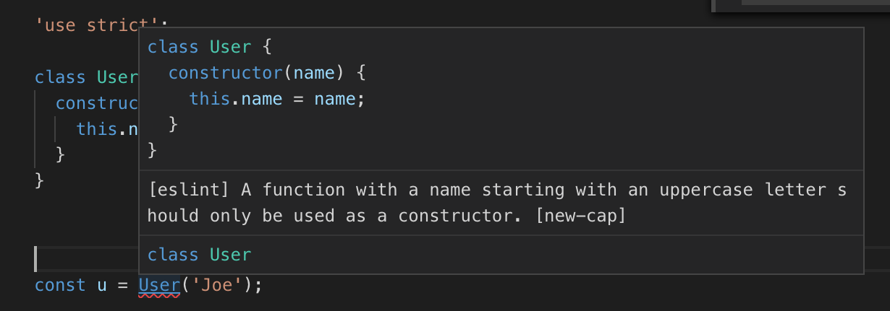

Title: Three.js Prerequisites
Description: What you need to know to use this site.
TOC: Prerequisites

These articles are meant to help you learn how to use three.js.
They assume you know how to program in JavaScript. They assume
you know what the DOM is, how to write HTML as well as create DOM elements
in JavaScript. They assume you know how to use
[es6 modules](https://developer.mozilla.org/en-US/docs/Web/JavaScript/Reference/Statements/import) 
via import and via `<script type="module">` tags.
They assume you know some CSS and that you know what
[CSS selectors are](https://developer.mozilla.org/en-US/docs/Learn/CSS/Introduction_to_CSS/Selectors). 
They also assume you know ES5, ES6 and maybe some ES7.
They assume you know that the browser runs JavaScript only via events and callbacks.
They assume you know what a closure is.

Here's some brief refreshers and notes

## es6 modules

es6 modules can be loaded via the `import` keyword in a script
or inline via a `<script type="module">` tag. Here's an example of
both

```html
<script type="module">
import * as THREE from './resources/threejs/r132/build/three.module.js';

...

</script>
```

Paths must be absolute or relative. Relative paths always start with `./` or `../`
which is different than other tags like `` and `<a>` and css references.

More details are mentioned at the bottom of [this article](threejs-fundamentals.html).

## `document.querySelector` and `document.querySelectorAll`

You can use `document.querySelector` to select the first element
that matches a CSS selector. `document.querySelectorAll` returns
all elements that match a CSS selector.

## You don't need `onload`

Lots of 20yr old pages use HTML like

    <body onload="somefunction()">

That style is deprecated. Put your scripts
at the bottom of the page.

```html
<html>
  <head>
    ...
  </head>
  <body>
     ...
  </body>
  <script>
    // inline javascript
  </script>
</html>
```

or [use the `defer` property](https://developer.mozilla.org/en-US/docs/Web/HTML/Element/script).

## Know how closures work

```js
function a(v) {
  const foo = v;
  return function() {
     return foo;
  };
}

const f = a(123);
const g = a(456);
console.log(f());  // prints 123
console.log(g());  // prints 456
```

In the code above the function `a` creates a new function every time it's called. That
function *closes* over the variable `foo`. Here's [more info](https://developer.mozilla.org/en-US/docs/Web/JavaScript/Closures).

## Understand how `this` works

`this` is not magic. It's effectively a variable that is automatically passed to functions just like
an argument is passed to function. The simple explanation is when you call a function directly
like

    somefunction(a, b, c);

`this` will be `null` (when in strict mode or in a module) where as when you call a function via the dot operator `.` like this

    someobject.somefunction(a, b, c);

`this` will be set to `someobject`.

The parts where people get confused is with callbacks.

     const callback = someobject.somefunction;
     loader.load(callback);

doesn't work as someone inexperienced might expect because when
`loader.load` calls the callback it's not calling it with the dot `.` operator
so by default `this` will be null (unless the loader explicitly sets it to something).
If you want `this` to be `someobject` when the callback happens you need to 
tell JavaScript that by binding it to the function.

     const callback = someobject.somefunction.bind(someobject);
     loader.load(callback);

[*this* article might help explain `this`](https://developer.mozilla.org/en-US/docs/Web/JavaScript/Reference/Operators/this).

## ES5/ES6/ES7 stuff

### `var` is deprecated. Use `const` and/or `let`

There is no reason to use `var` **EVER** and at this point it's considered bad practice
to use it at all. Use `const` if the variable will never be reassigned which is most of
the time. Use `let` in those cases where the value changes. This will help avoid tons of bugs.

### Use `for(elem of collection)` never `for(elem in collection)`

`for of` is new, `for in` is old. `for in` had issues that are solved by `for of`

As one example you can iterate over all the key/value pairs of an object with

```js
for (const [key, value] of Object.entries(someObject)) {
  console.log(key, value);
}
```

### Use `forEach`, `map`, and `filter`  where useful

Arrays added the functions [`forEach`](https://developer.mozilla.org/en-US/docs/Web/JavaScript/Reference/Global_Objects/Array/forEach), 
[`map`](https://developer.mozilla.org/en-US/docs/Web/JavaScript/Reference/Global_Objects/Array/map), and 
[`filter`](https://developer.mozilla.org/en-US/docs/Web/JavaScript/Reference/Global_Objects/Array/filter) and
are used fairly extensively in modern JavaScript.

### Use destructuring

Assume an object `const dims = {width: 300, height: 150}`

old code

```js
const width = dims.width;
const height = dims.height;
```

new code

```js
const {width, height} = dims;
```

Destructuring works with arrays too. Assume an array `const position = [5, 6, 7, 1]`;

old code

```js
const y = position[1];
const z = position[2];
```

new code

```js
const [, y, z] = position;
```

Destructuring also works in function arguments

```js
const dims = {width: 300, height: 150};
const vector = [3, 4];

function lengthOfVector([x, y]) {
  return Math.sqrt(x * x + y * y);
}

const dist = lengthOfVector(vector);  // dist = 5

function area({width, height}) {
  return width * height;
}
const a = area(dims);  // a = 45000
```

### Use object declaration short cuts

old code

```js
 const width = 300;
 const height = 150;
 const obj = {
   width: width,
   height: height,
   area: function() {
     return this.width * this.height
   },
 };
```

new code

```js
 const width = 300;
 const height = 150;
 const obj = {
   width,
   height,
   area() {
     return this.width * this.height;
   },
 };
```

### Use the rest parameter and the spread operator `...`

The rest parameter can be used to consume any number of parameters. Example

```js
 function log(className, ...args) {
   const elem = document.createElement('div');
   elem.className = className;
   elem.textContent = args.join(' ');
   document.body.appendChild(elem);
 }
```

The spread operator can be used to expand an iterable into arguments

```js
const position = [1, 2, 3];
someMesh.position.set(...position);
```

or copy an array

```js
const copiedPositionArray = [...position];
copiedPositionArray.push(4); // [1,2,3,4] 
console.log(position); // [1,2,3] position is unaffected
```

or to merge objects

```
const a = {abc: 123};
const b = {def: 456};
const c = {...a, ...b};  // c is now {abc: 123, def: 456}
```

### Use `class`

The syntax for making class like objects pre ES5 was unfamiliar to most
programmers. As of ES5 you can now [use the `class`
keyword](https://developer.mozilla.org/en-US/docs/Web/JavaScript/Reference/Classes)
which is closer to the style of C++/C#/Java.

### Understand getters and setters

[Getters](https://developer.mozilla.org/en-US/docs/Web/JavaScript/Reference/Functions/get) and
[setters](https://developer.mozilla.org/en-US/docs/Web/JavaScript/Reference/Functions/set) are
common in most modern languages. The `class` syntax
of ES5 makes them much easier than pre ES5.

### Use arrow functions where appropriate

This is especially useful with callbacks and promises.

```js
loader.load((texture) => {
  // use texture
});
```

Arrow functions bind `this` to the context in which you create the arrow function.

```js
const foo = (args) => {/* code */};
```

is a shortcut for

```js
const foo = (function(args) {/* code */}).bind(this));
```

See link above for more info on `this`.

### Promises as well as async/await

Promises help with asynchronous code. Async/await help
use promises.

It's too big a topic to go into here but you can [read up
on promises here](https://developer.mozilla.org/en-US/docs/Web/JavaScript/Guide/Using_promises)
and [async/await here](https://developer.mozilla.org/en-US/docs/Learn/JavaScript/Asynchronous/Async_await).

### Use Template Literals

Template literals are strings using backticks instead of quotes.

    const foo = `this is a template literal`;

Template literals have basically 2 features. One is they can be multi-line

```js
const foo = `this
is
a
template
literal`;
const bar = "this\nis\na\ntemplate\nliteral";
```

`foo` and `bar` above are the same.

The other is that you can pop out of string mode and insert snippets of
JavaScript using `${javascript-expression}`. This is the template part. Example:

```js
const r = 192;
const g = 255;
const b = 64;
const rgbCSSColor = `rgb(${r},${g},${b})`;
```

or

```js
const color = [192, 255, 64];
const rgbCSSColor = `rgb(${color.join(',')})`;
```

or

```js
const aWidth = 10;
const bWidth = 20;
someElement.style.width = `${aWidth + bWidth}px`;
```

# Learn JavaScript coding conventions.

While you're welcome to format your code any way you chose there is at least one
convention you should be aware of. Variables, function names, method names, in
JavaScript are all lowerCasedCamelCase. Constructors, the names of classes are
CapitalizedCamelCase. If you follow this rule you code will match most other
JavaScript. Many [linters](https://eslint.org), programs that check for obvious errors in your code,
will point out errors if you use the wrong case since by following the convention
above they can know when you're using something incorrectly.

```js
const v = new vector(); // clearly an error if all classes start with a capital letter
const v = Vector();     // clearly an error if all functions start with a lowercase latter. 
```

# Consider using Visual Studio Code

Of course use whatever editor you want but if you haven't tried it consider
using [Visual Studio Code](https://code.visualstudio.com/) for JavaScript and
after installing it [setup
eslint](https://marketplace.visualstudio.com/items?itemName=dbaeumer.vscode-eslint).
It might take a few minutes to setup but it will help you immensely with finding
bugs in your JavaScript.

Some examples

If you enable [the `no-undef` rule](https://eslint.org/docs/rules/no-undef) then
VSCode via ESLint will warn you of many undefined variables. 

<div class="threejs_center"></div>

Above you can see I mis-spelled `doTheThing` as `doThing`. There's a red squiggle
under `doThing` and hovering over it it tells me it's undefined. One error
avoided.

If you're using `<script>` tags to include three.js you'll get warnings using `THREE` so add `/* global THREE */` at the top of your
JavaScript files to tell eslint that `THREE` exists. (or better, use `import` 😉)

<div class="threejs_center"></div>

Above you can see eslint knows the rule that `UpperCaseNames` are constructors
and so you should be using `new`. Another error caught and avoided. This is [the
`new-cap` rule](https://eslint.org/docs/rules/new-cap).

There are [100s of rules you can turn on or off or
customize](https://eslint.org/docs/rules/). For example above I mentioned you
should use `const` and `let` over `var`.

Here I used `var` and it warned me I should use `let` or `const`

<div class="threejs_center"></div>

Here I used `let` but it saw I never change the value so it suggested I use `const`.

<div class="threejs_center"></div>

Of course if you'd prefer to keep using `var` you can just turn off that rule.
As I said above though I prefer to use `const` and `let` over `var` as they just
work better and prevent bugs.

For those cases where you really need to override a rule [you can add comments
to disable
them](https://eslint.org/docs/user-guide/configuring#disabling-rules-with-inline-comments)
for a single line or a section of code.

# If you really need to support legacy browsers use a transpiler

Most modern browsers are auto-updated so using all these features will help you 
be productive and avoid bugs. That said, if you're on a project that absolutely
must support old browsers there are [tools that will take your ES5/ES6/ES7 code
and transpile the code back to pre ES5 Javascript](https://babeljs.io).
