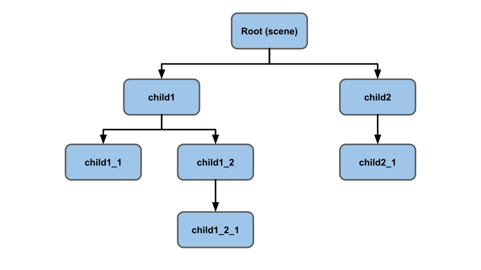
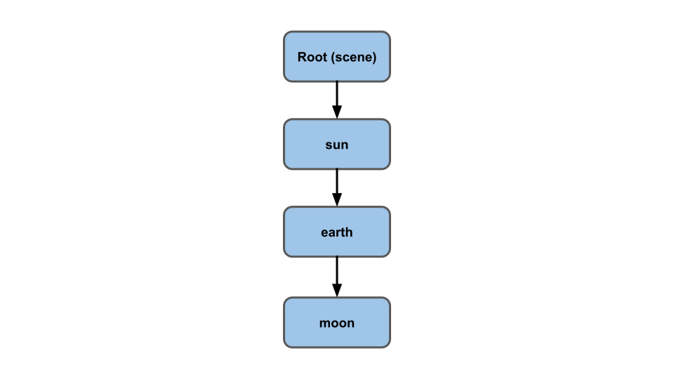
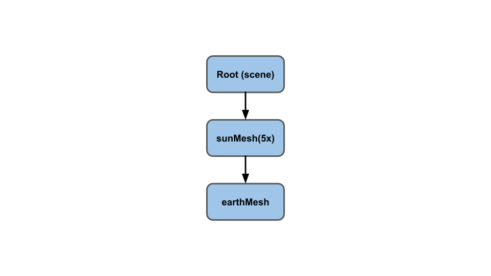
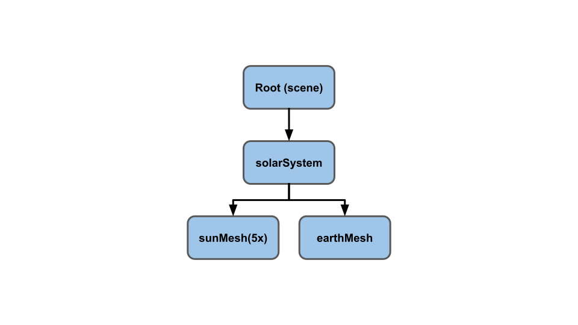
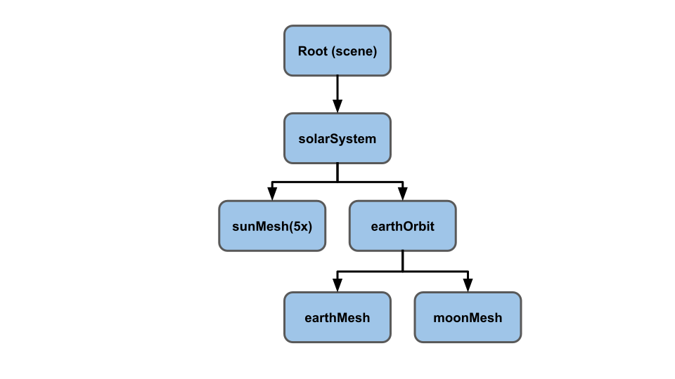
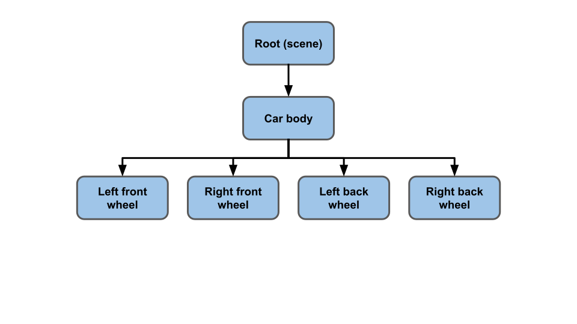
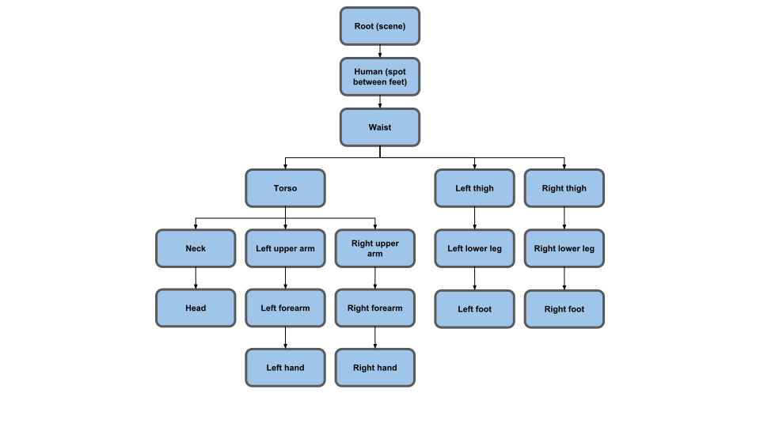
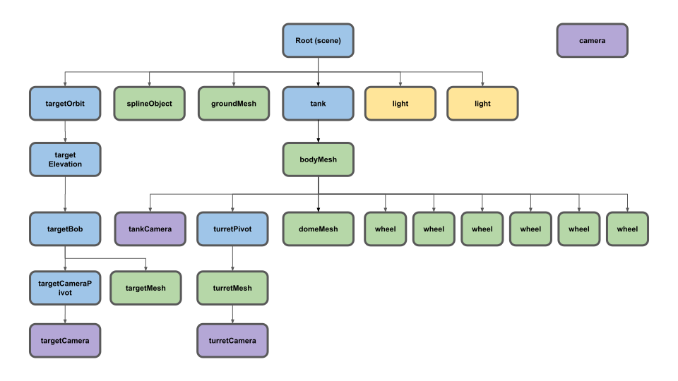

Title: Three.js Scene Graph
Description: What's a scene graph?
TOC: Scenegraph

This article is part of a series of articles about three.js. The
first article is [three.js fundamentals](threejs-fundamentals.html). If
you haven't read that yet you might want to consider starting there.

Three.js's core is arguably its scene graph. A scene graph in a 3D
engine is a hierarchy of nodes in a graph where each node represents
a local space.



That's kind of abstract so let's try to give some examples.

One example might be solar system, sun, earth, moon.



The Earth orbits the Sun. The Moon orbits the Earth. The Moon
moves in a circle around the Earth. From the Moon's point of
view it's rotating in the "local space" of the Earth. Even though
its motion relative to the Sun is some crazy spirograph like
curve from the Moon's point of view it just has to concern itself with rotating
around the Earth's local space.

{{{diagram url="resources/moon-orbit.html" }}}

To think of it another way, you living on the Earth do not have to think
about the Earth's rotation on its axis nor its rotation around the
Sun. You just walk or drive or swim or run as though the Earth is
not moving or rotating at all. You walk, drive, swim, run, and live
in the Earth's "local space" even though relative to the sun you are
spinning around the earth at around 1000 miles per hour and around
the sun at around 67,000 miles per hour. Your position in the solar
system is similar to that of the moon above but you don't have to concern
yourself. You just worry about your position relative to the earth in its
"local space".

Let's take it one step at a time. Imagine we want to make
a diagram of the sun, earth, and moon. We'll start with the sun by
just making a sphere and putting it at the origin. Note: We're using
sun, earth, moon as a demonstration of how to use a scene graph. Of course
the real sun, earth, and moon use physics but for our purposes we'll
fake it with a scene graph.

```js
// an array of objects whose rotation to update
const objects = [];

// use just one sphere for everything
const radius = 1;
const widthSegments = 6;
const heightSegments = 6;
const sphereGeometry = new THREE.SphereBufferGeometry(
    radius, widthSegments, heightSegments);

const sunMaterial = new THREE.MeshPhongMaterial({emissive: 0xFFFF00});
const sunMesh = new THREE.Mesh(sphereGeometry, sunMaterial);
sunMesh.scale.set(5, 5, 5);  // make the sun large
scene.add(sunMesh);
objects.push(sunMesh);
```

We're using a really low-polygon sphere. Only 6 subdivisions around its equator.
This is so it's easy to see the rotation.

We're going to reuse the same sphere for everything so we'll set a scale
for the sun mesh of 5x.

We also set the phong material's `emissive` property to yellow. A phong material's
emissive property is basically the color that will be drawn with no light hitting
the surface. Light is added to that color.

Let's also put a single point light in the center of the scene. We'll go into more
details about point lights later but for now the simple version is a point light
represents light that eminates from a single point.

```js
{
  const color = 0xFFFFFF;
  const intensity = 3;
  const light = new THREE.PointLight(color, intensity);
  scene.add(light);
}
```

To make it easy to see we're going to put the camera directly above the origin
looking down. The easist way to do that is to use the `lookAt` function. The `lookAt`
function will orient the camera from its position to "look at" the position
we pass to `lookAt`. Before we do that though we need to tell the camera
which way the top of the camera is facing or rather which way is "up" for the
camera. For most situations positive Y being up is good enough but since
we are looking straight down we need to tell the camera that positive Z is up.

```js
const camera = new THREE.PerspectiveCamera(fov, aspect, near, far);
camera.position.set(0, 50, 0);
camera.up.set(0, 0, 1);
camera.lookAt(0, 0, 0);
```

In the render loop, adapted from previous examples, we're rotating all
objects in our `objects` array with this code.

```js
objects.forEach((obj) => {
  obj.rotation.y = time;
});
```

Since we added the `sunMesh` to the `objects` array it will rotate.

{{{example url="../threejs-scenegraph-sun.html" }}}

Now let's add in the earth.

```js
const earthMaterial = new THREE.MeshPhongMaterial({color: 0x2233FF, emissive: 0x112244});
const earthMesh = new THREE.Mesh(sphereGeometry, earthMaterial);
earthMesh.position.x = 10;
scene.add(earthMesh);
objects.push(earthMesh);
```

We make a material that is blue but we gave it a small amount of *emissive* blue
so that it will show up against our black background.

We use the same `sphereGeometry` with our new blue `earthMaterial` to make
an `earthMesh`. We position that 10 units to the left of the sun
and add it to the scene.  Since we added it to our `objects` array it will
rotate too.

{{{example url="../threejs-scenegraph-sun-earth.html" }}}

You can see both the sun and the earth are rotating but the earth is not
going around the sun. Let's make the earth a child of the sun

```js
-scene.add(earthMesh);
+sunMesh.add(earthMesh);
```

and...

{{{example url="../threejs-scenegraph-sun-earth-orbit.html" }}}

What happened? Why is the earth the same size as the sun and why is it so far away?
I actually had to move the camera from 50 units above to 150 units above to see the earth.

We made the `earthMesh` a child of the `sunMesh`. The `sunMesh` has
its scale set to 5x with `sunMesh.scale.set(5, 5, 5)`. That means the
`sunMesh`s local space is 5 times as big. Anything put in that space
 will be multiplied by 5. That means the earth is now 5x larger and
 it's distance from the sun (`earthMesh.position.x = 10`) is also
 5x as well.

 Our scene graph currently looks like this



To fix it let's add an empty scene graph node. We'll parent both the sun and the earth
to that node.

```js
+const solarSystem = new THREE.Object3D();
+scene.add(solarSystem);
+objects.push(solarSystem);

const sunMaterial = new THREE.MeshPhongMaterial({emissive: 0xFFFF00});
const sunMesh = new THREE.Mesh(sphereGeometry, sunMaterial);
sunMesh.scale.set(5, 5, 5);
-scene.add(sunMesh);
+solarSystem.add(sunMesh);
objects.push(sunMesh);

const earthMaterial = new THREE.MeshPhongMaterial({color: 0x2233FF, emissive: 0x112244});
const earthMesh = new THREE.Mesh(sphereGeometry, earthMaterial);
earthMesh.position.x = 10;
-sunMesh.add(earthMesh);
+solarSystem.add(earthMesh);
objects.push(earthMesh);
```

Here we made an `Object3D`. Like a `Mesh` it is also a node in the scene graph
but unlike a `Mesh` it has no material or geometry. It just represents a local space.

Our new scene graph looks like this



Both the `sunMesh` and the `earthMesh` are children of the `solarSystem`. All 3
are being rotated and now because the `earthMesh` is not a child of the `sunMesh`
it is no longer scaled by 5x.

{{{example url="../threejs-scenegraph-sun-earth-orbit-fixed.html" }}}

Much better. The earth is smaller than the sun and it's rotating around the sun
and rotating itself.

Continuing that same pattern let's add a moon.

```js
+const earthOrbit = new THREE.Object3D();
+earthOrbit.position.x = 10;
+solarSystem.add(earthOrbit);
+objects.push(earthOrbit);

const earthMaterial = new THREE.MeshPhongMaterial({color: 0x2233FF, emissive: 0x112244});
const earthMesh = new THREE.Mesh(sphereGeometry, earthMaterial);
-solarSystem.add(earthMesh);
+earthOrbit.add(earthMesh);
objects.push(earthMesh);

+const moonOrbit = new THREE.Object3D();
+moonOrbit.position.x = 2;
+earthOrbit.add(moonOrbit);

+const moonMaterial = new THREE.MeshPhongMaterial({color: 0x888888, emissive: 0x222222});
+const moonMesh = new THREE.Mesh(sphereGeometry, moonMaterial);
+moonMesh.scale.set(.5, .5, .5);
+moonOrbit.add(moonMesh);
+objects.push(moonMesh);
```

Again we added another invisible scene graph node, an `Object3D` called `earthOrbit`
and added both the `earthMesh` and the `moonMesh` to it. The new scene graph looks like
this.



and here's that

{{{example url="../threejs-scenegraph-sun-earth-moon.html" }}}

You can see the moon follows the spirograph pattern shown at the top
of this article but we didn't have to manually compute it. We just
setup our scene graph to do it for us.

It is often useful to draw something to visualize the nodes in the scene graph.
Three.js has some helpful ummmm, helpers to ummm, ... help with this.

One is called an `AxesHelper`. It draws 3 lines representing the local
<span style="color:red">X</span>,
<span style="color:green">Y</span>, and
<span style="color:blue">Z</span> axes. Let's add one to every node we
created.

```js
// add an AxesHelper to each node
objects.forEach((node) => {
  const axes = new THREE.AxesHelper();
  axes.material.depthTest = false;
  axes.renderOrder = 1;
  node.add(axes);
});
```

On our case we want the axes to appear even though they are inside the spheres.
To do this we set their material's `depthTest` to false which means they will
not check to see if they are drawing behind something else. We also
set their `renderOrder` to 1 (the default is 0) so that they get drawn after
all the spheres. Otherwise a sphere might draw over them and cover them up.

{{{example url="../threejs-scenegraph-sun-earth-moon-axes.html" }}}

We can see the
<span style="color:red">x (red)</span> and
<span style="color:blue">z (blue)</span> axes. Since we are looking
straight down and each of our objects is only rotating around its
y axis we don't see much of the <span style="color:green">y (green)</span> axes.

It might be hard to see some of them as there are 2 pairs of overlapping axes. Both the `sunMesh`
and the `solarSystem` are at the same position. Similarly the `earthMesh` and
`earthOrbit` are at the same position. Let's add some simple controls to allow us
to turn them on/off for each node.
While we're at it let's also add another helper called the `GridHelper`. It
makes a 2D grid on the X,Z plane. By default the grid is 10x10 units.

We're also going to use [dat.GUI](https://github.com/dataarts/dat.gui) which is
a UI library that is very popular with three.js projects. dat.GUI takes an
object and a property name on that object and based on the type of the property
automatically makes a UI to manipulate that property.

We want to make both a `GridHelper` and an `AxesHelper` for each node. We need
a label for each node so we'll get rid of the old loop and switch to calling
some function to add the helpers for each node

```js
-// add an AxesHelper to each node
-objects.forEach((node) => {
-  const axes = new THREE.AxesHelper();
-  axes.material.depthTest = false;
-  axes.renderOrder = 1;
-  node.add(axes);
-});

+function makeAxisGrid(node, label, units) {
+  const helper = new AxisGridHelper(node, units);
+  gui.add(helper, 'visible').name(label);
+}
+
+makeAxisGrid(solarSystem, 'solarSystem', 25);
+makeAxisGrid(sunMesh, 'sunMesh');
+makeAxisGrid(earthOrbit, 'earthOrbit');
+makeAxisGrid(earthMesh, 'earthMesh');
+makeAxisGrid(moonMesh, 'moonMesh');
```

`makeAxisGrid` makes an `AxisGridHelper` which is a class we'll create
to make dat.GUI happy. Like it says above dat.GUI
will automagically make a UI that manipulates the named property
of some object. It will create a different UI depending on the type
of property. We want it to create a checkbox so we need to specify
a `bool` property. But, we want both the axes and the grid
to appear/disappear based on a single property so we'll make a class
that has a getter and setter for a property. That way we can let dat.GUI
think it's manipulating a single property but internally we can set
the visible property of both the `AxesHelper` and `GridHelper` for a node.

```js
// Turns both axes and grid visible on/off
// dat.GUI requires a property that returns a bool
// to decide to make a checkbox so we make a setter
// and getter for `visible` which we can tell dat.GUI
// to look at.
class AxisGridHelper {
  constructor(node, units = 10) {
    const axes = new THREE.AxesHelper();
    axes.material.depthTest = false;
    axes.renderOrder = 2;  // after the grid
    node.add(axes);

    const grid = new THREE.GridHelper(units, units);
    grid.material.depthTest = false;
    grid.renderOrder = 1;
    node.add(grid);

    this.grid = grid;
    this.axes = axes;
    this.visible = false;
  }
  get visible() {
    return this._visible;
  }
  set visible(v) {
    this._visible = v;
    this.grid.visible = v;
    this.axes.visible = v;
  }
}
```

One thing to notice is we set the `renderOrder` of the `AxesHelper`
to 2 and for the `GridHelper` to 1 so that the axes get drawn after the grid.
Otherwise the grid might overwrite the axes.

{{{example url="../threejs-scenegraph-sun-earth-moon-axes-grids.html" }}}

Turn on the `solarSystem` and you'll see how the earth is exactly 10
units out from the center just like we set above. You can see how the
earth is in the *local space* of the `solarSystem`. Similary if you
turn on the `earthOrbit` you'll see how the moon is exactly 2 units
from the center of the *local space* of the `earthOrbit`.

A few more examples of scene graphs. An automobile in a simple game world might have a scene graph like this



If you move the car's body all the wheels will move with it. If you wanted the body
to bounce separate from the wheels you might parent the body and the wheels to a "frame" node
that represents the car's frame.

Another example is a human in a game world.



You can see the scene graph gets pretty complex for a human. In fact
that scene graph above is simplified. For example you might extend it
to cover every finger (at least another 28 nodes) and every toe
(yet another 28 nodes) plus ones for the face and jaw, the eyes and maybe more.

Let's make one semi-complex scene graph. We'll make a tank. The tank will have
6 wheels and a turret. The tank will follow a path. There will be a sphere that
moves around and the tank will target the sphere.

Here's the scene graph. The meshes are colored in green, the `Object3D`s in blue,
the lights in gold, and the cameras in purple. One camera has not been added
to the scene graph.

<div class="threejs_center"></div>

Look in the code to see the setup of all of these nodes.

For the target, the thing the tank is aiming at, there is a `targetOrbit`
(`Object3D`) which just rotates similar to the `earthOrbit` above. A
`targetElevation` (`Object3D`) which is a child of the `targetOrbit` provides an
offset from the `targetOrbit` and a base elevation. Childed to that is another
`Object3D` called `targetBob` which just bobs up and down relative to the
`targetElevation`. Finally there's the `targetMesh` which is just a cube we
rotate and change it's colors

```js
// move target
targetOrbit.rotation.y = time * .27;
targetBob.position.y = Math.sin(time * 2) * 4;
targetMesh.rotation.x = time * 7;
targetMesh.rotation.y = time * 13;
targetMaterial.emissive.setHSL(time * 10 % 1, 1, .25);
targetMaterial.color.setHSL(time * 10 % 1, 1, .25);
```

For the tank there's an `Object3D` called `tank` which is used to move everything
below it around. The code uses a `SplineCurve` which it can ask for positions
along that curve. 0.0 is the start of the curve. 1.0 is the end of the curve. It
asks for the current position where it puts the tank. It then asks for a
position slightly further down the curve and uses that to point the tank in that
direction using `Object3D.lookAt`.

```js
const tankPosition = new THREE.Vector2();
const tankTarget = new THREE.Vector2();

...

// move tank
const tankTime = time * .05;
curve.getPointAt(tankTime % 1, tankPosition);
curve.getPointAt((tankTime + 0.01) % 1, tankTarget);
tank.position.set(tankPosition.x, 0, tankPosition.y);
tank.lookAt(tankTarget.x, 0, tankTarget.y);
```

The turret on top of the tank is moved automatically by being a child
of the tank. To point it at the target we just ask for the target's world position
and then again use `Object3D.lookAt`

```js
const targetPosition = new THREE.Vector3();

...

// face turret at target
targetMesh.getWorldPosition(targetPosition);
turretPivot.lookAt(targetPosition);
```

There's a `turretCamera` which is a child of the `turretMesh` so
it will move up and down and rotate with the turret. We make that
aim at the target.

```js
// make the turretCamera look at target
turretCamera.lookAt(targetPosition);
```

There is also a `targetCameraPivot` which is a child of `targetBob` so it floats
around with the target. We aim that back at the tank. It's purpose is to allow the
`targetCamera` to be offset from the target itself. If we instead made the camera
a child of `targetBob` and just aimed the camera itself it would be inside the
target.

```js
// make the targetCameraPivot look at the tank
tank.getWorldPosition(targetPosition);
targetCameraPivot.lookAt(targetPosition);
```

Finally we rotate all the wheels

```js
wheelMeshes.forEach((obj) => {
  obj.rotation.x = time * 3;
});
```

For the cameras we setup an array of all 4 cameras at init time with descriptions.

```js
const cameras = [
  { cam: camera, desc: 'detached camera', },
  { cam: turretCamera, desc: 'on turret looking at target', },
  { cam: targetCamera, desc: 'near target looking at tank', },
  { cam: tankCamera, desc: 'above back of tank', },
];

const infoElem = document.querySelector('#info');
```

and cycle through our cameras at render time.

```js
const camera = cameras[time * .25 % cameras.length | 0];
infoElem.textContent = camera.desc;
```

{{{example url="../threejs-scenegraph-tank.html"}}}

I hope this gives some idea of how scene graphs work and how you might use them.
Making `Object3D` nodes and parenting things to them is an important step to using
a 3D engine like three.js well. Often it might seem like some complex math is necessary
to make something move and rotate the way you want. For example without a scene graph
computing the motion of the moon or where to put the wheels of the car relative to its
body would be very complicated but using a scene graph it becomes much easier.

[Next up we'll go over materials](threejs-materials.html).
