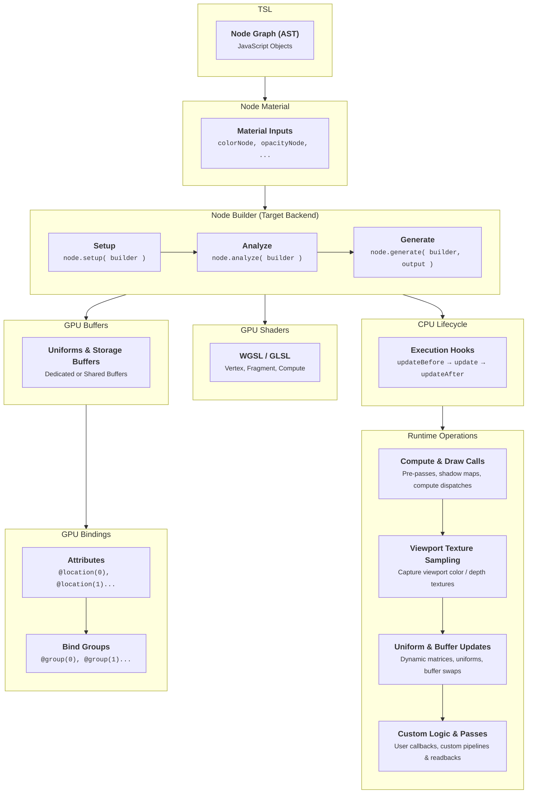
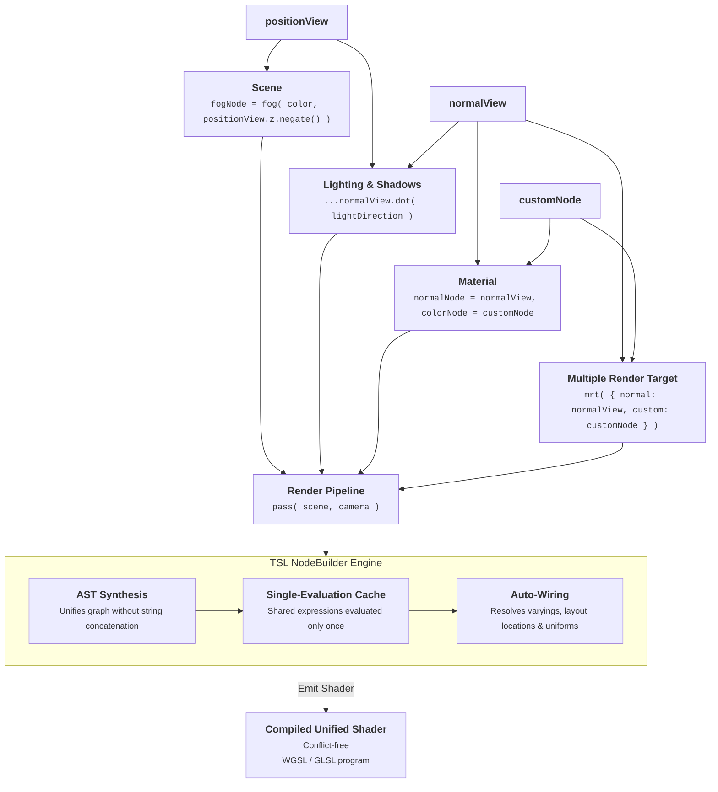
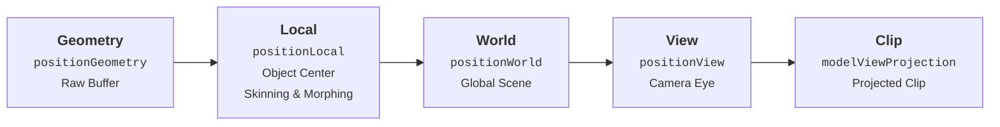
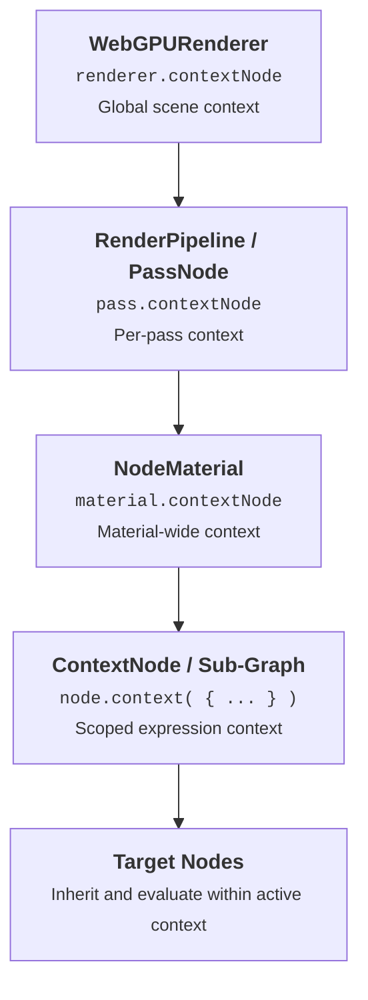
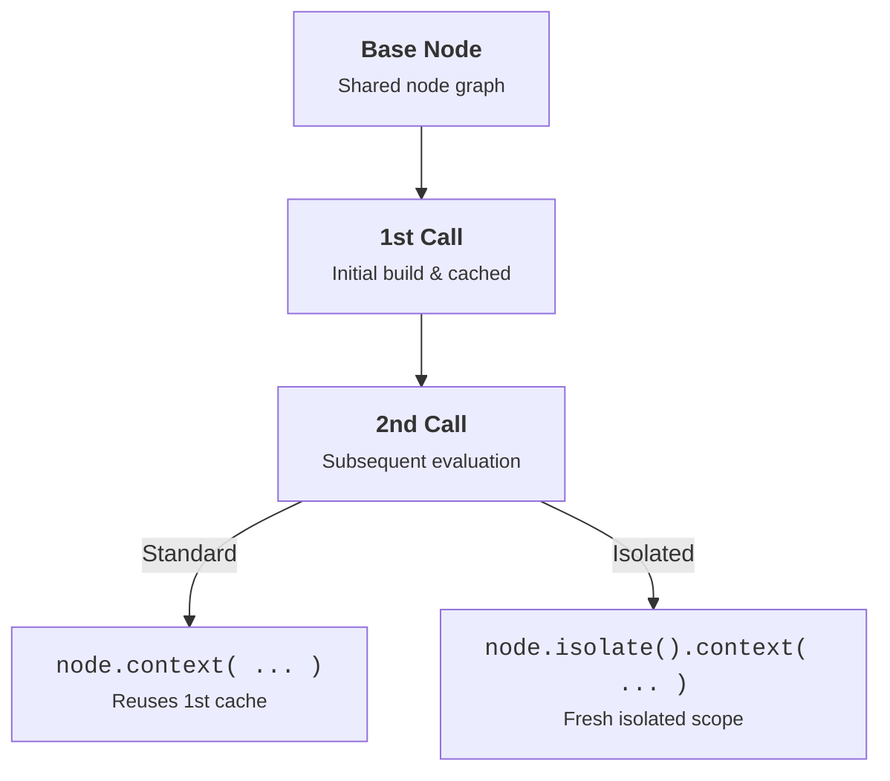
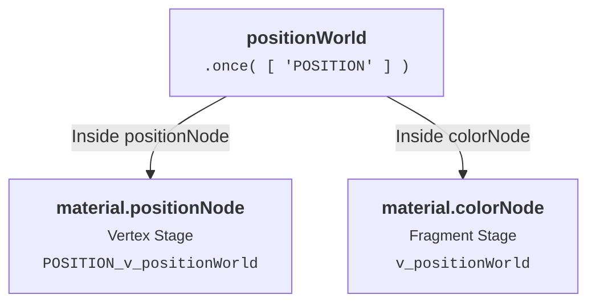

<tour title="Tour of *TSL*">

<template name="Empty Project" default="true">
```tsl main
// Tour of TSL
import 'scenes/empty';
```
</template>

</tour>

<page name="Introduction">

<page name="Welcome">

An Approach to Productive and Maintainable Shader Creation.

TSL (Three.js Shading Language) is the new shader standard for Three.js, built to support the rendering capabilities introduced by WebGPU. It allows shader logic to be written in JavaScript and structured through a flexible node-based system, enabling advanced rendering workflows, compute operations, improved GPU integration, and compatibility across different graphics backends.

- **Node-System Power**: Built entirely on top of Three.js's Node system, TSL creates a dynamic graph of operations. Going beyond a standard GPU program, nodes have direct control over the renderer itself, enabling CPU-side setup, dynamic render target allocations, and custom pipeline orchestration directly from the shading graph.

- **Improved Productivity**: Write modular, reusable shader functions, import them like regular JS modules, and enjoy full IDE autocomplete and instant feedback.

- **Easier Maintenance**: Instead of relying on fragile string concatenation, TSL provides structured node expressions that are easier to understand, reuse, and refactor. Its component-based architecture allows you to maintain, update, and modify individual parts of the shader and pipeline independently, avoiding variable and layout collisions.

- **Future-Proof Portability**: TSL is backend-agnostic, compiling automatically to WebGPU (WGSL) or WebGL (GLSL) behind the scenes, ensuring your visuals run everywhere.

### Projects Using TSL

https://www.youtube.com/watch?v=BE5JcpuWHG4

https://www.youtube.com/watch?v=oRx606IbIGo

https://www.youtube.com/watch?v=iklqjgIpVG8

### User Testimonials

https://x.com/mrdoob/status/1886416782673789317
https://x.com/mustache_dev/status/2010375315218944086
https://x.com/marcinignac/status/1805550271017144780&short
https://x.com/mamesoncom/status/1842812329484017950
https://x.com/onirenaud/status/1984863378284896377&short
https://x.com/shotamatsuda/status/1951453583117045775&short
https://x.com/MaximeHeckel/status/1978116334245302493&short
https://x.com/akella/status/1912614090377142317&short
https://x.com/makio64/status/1963160279795065084
https://x.com/SoundSafari_io/status/2015195333177872528&short
https://x.com/holtsetio/status/1932870179161321566
https://x.com/vg_head/status/1991611248559988749&short
https://x.com/Andersonmancini/status/1794348913660772505&short
https://x.com/thenoumenon/status/2010526571556475351&short
https://x.com/Ademola_4life/status/2012205043185762330&short

</page>

<page name="Why TSL?">

Creating shaders has always been an advanced step for most developers; many game developers have never created shader code from scratch. The shader graph solution adopted today by the industry has allowed developers more focused on dynamics to create the necessary graphic effects to meet the demands of their projects.

The aim of the project is to create an easy-to-use environment for shader creation. Even if for this we need to create complexity behind it, this happened initially with Renderer and now with the TSL.

Other benefits of TSL, besides simplifying shader creation, include remaining **renderer-agnostic**, while all the complexity of a material can be modularized and benefit from **tree shaking** without breaking during the process.

### Example

A **detail map** makes things look more real in games. It adds tiny details like cracks or bumps to surfaces. In this example we will scale uv to improve details when seen up close and multiply with a base texture.

#### Old

This is how we would achieve that using `.onBeforeCompile()`:

```js
const material = new THREE.MeshStandardMaterial();
material.map = colorMap;
material.onBeforeCompile = ( shader ) => {

	shader.uniforms.detailMap = { value: detailMap };

	let token = '#define STANDARD';

	let insert = /* glsl */`
		uniform sampler2D detailMap;
	`;

	shader.fragmentShader = shader.fragmentShader.replace( token, token + insert );

	token = '#include <map_fragment>';

	insert = /* glsl */`
		diffuseColor *= texture2D( detailMap, vMapUv * 10.0 );
	`;

	shader.fragmentShader = shader.fragmentShader.replace( token, token + insert );

};
```

Any simple change beyond this makes code increasingly complicated using `.onBeforeCompile()`. The result in the community is countless parametric materials that cannot interoperate and need to be updated periodically to remain operational, limiting the ability to create unique materials by reusing modular components.

#### New

With TSL the code would look like this:

```js
import { texture, uv } from 'three/tsl';

const detail = texture( detailMap, uv().mul( 10 ) );

const material = new THREE.MeshStandardNodeMaterial();
material.colorNode = texture( colorMap ).mul( detail );
```

TSL is also capable of encoding code into different outputs such as WGSL/GLSL - WebGPU/WebGL, in addition to optimizing the shader graph automatically and through code that can be inserted within each Node. This allows the developer to focus on productivity and leave the graphical management part to the Node System.

Another important feature of a graph shader is that we will no longer need to care about the sequence in which components are created, because the Node System will only declare and include it once.

Let's say that you import positionWorld into your code, even if another component uses it, the calculations performed to obtain positionWorld will only be performed once, as is the case with any other node such as: normalWorld, modelPosition, etc.

</page>

<page name="Architecture">

All TSL components extend from the `Node` class. A `Node` can communicate with other nodes, value conversions can be automatic or manual, and a `Node` can receive the output value expected by the parent `Node` and modify its own output snippet. It's possible to modularize them using tree shaking in the shader construction process. The `Node` has access to contextual information such as geometry, material, renderer, and graphics backend, which can influence the type and value of its output.

The main class responsible for creating the code and pipeline configuration is `NodeBuilder`. This class can be extended to any output programming language, so you can use TSL for a third language if you wish. Currently, `NodeBuilder` has two concrete implementations: `WGSLNodeBuilder` for WebGPU and `GLSLNodeBuilder` for WebGL2.

Beyond generating shader source code, `NodeBuilder` orchestrates GPU memory allocation and pipeline layouts: GPU buffers (uniform buffers, storage buffers, and attributes) can be dedicated per-object or shared across multiple materials and passes, avoiding redundant GPU memory allocations and state transitions.

### Compilation Process

The build process is based on three pillars: setup, analyze and generate.



### Node

The `Node` class is the fundamental abstraction representing every operation, value, texture sample, uniform, and expression within the TSL shading graph. Each node defines its own sub-graph, manages how it is compiled into backend shader code, and interfaces with the compilation pipeline through three primary stages:

::: api .setup( builder ) : Node - Use TSL to create customized logic for the node output, transforming expressions into child node connections. :::

::: api .analyze( builder, output ) : void - Analyzes the node graph to determine reference counts and assign cached variables for optimization. :::

::: api .generate( builder, output ) : string - Emits and returns the concrete shader code string snippet for the active graphics backend. :::

### Update Events & Lifecycle

Nodes can manage CPU-side operations and synchronize data with the GPU during the rendering loop through lifecycle hooks and execution frequency properties:

::: api .updateBeforeType : NodeUpdateType - The update frequency for `.updateBefore()`, executed before rendering begins. :::

::: api .updateType : NodeUpdateType - The update frequency ('frame', 'render', 'object') for `.update()`. :::

::: api .updateAfterType : NodeUpdateType - The update frequency for `.updateAfter()`, executed after rendering completes. :::

::: api .updateBefore( frame ) : void - Executed before rendering operations begin. Ideal for pre-pass setup, allocating dynamic storage buffers and render targets, or evaluating simulation states. :::

::: api .update( frame ) : void - Executed during object preparation right before drawing. Used to update node uniforms, animation matrices, or dynamic parameters. :::

::: api .updateAfter( frame ) : void - Executed after rendering operations have completed. Used for post-render cleanup, ping-pong buffer swaps, or GPU readbacks. :::

#### Update Frequencies

Constants defined in `NodeUpdateType` controlling the execution frequency of update properties:

::: api NodeUpdateType.NONE : string - The update method is disabled and will not be executed ('none'). :::

::: api NodeUpdateType.FRAME : string - Executed once per animation frame (per requestAnimationFrame tick) ('frame'). :::

::: api NodeUpdateType.RENDER : string - Executed once per renderer.render() call (useful for multi-pass rendering, shadow maps, and cubemaps) ('render'). :::

::: api NodeUpdateType.OBJECT : string - Executed once per individual Object3D drawn with the material or node ('object'). :::

### Serialization

Nodes support JSON-based serialization and deserialization, allowing entire node graphs, materials, and custom shader configurations to be saved to disk, shared across projects, or integrated with visual node editors:

::: api .serialize( json ) : object - Serializes the node structure and connections into a JSON object for storage, material exchange, or visual node editors. :::

::: api .deserialize( json ) : void - Restores the node state and connections from a serialized JSON representation. :::

</page>

<page name="Component-Based">

TSL (Three.js Shading Language) elevates shader development from a monolithic script model to a **Component-Based Architecture**, allowing developers to maintain and share individual parts of the shader and rendering pipeline independently, scalably, and without collisions.

### Architectural Approaches

| Aspect | Traditional Shaders (Direct GPU Code) | Node System (TSL Abstraction) |
| --- | --- | --- |
| **Structure** | Text-based programs (GLSL / WGSL source files) | Composable JavaScript node graph (AST) |
| **Workflow** | Direct imperative shader code (`main()`, explicit steps) | Declarative channel assignment (`colorNode`, `normalNode`, etc.) |
| **Pipeline Integration** | Focuses strictly on per-draw GPU execution | Extends to multi-pass orchestration, compute stages, and CPU hooks |
| **Scope & Sharing** | Uniforms and bindings are scoped to individual programs | Nodes and uniforms can be shared across materials, MRT, and post-processing |
| **Stage Interfacing** | Manual declaration and management of varyings across stages | Automatic varying allocation and stage routing (e.g. `.toVertexStage()`) |
| **Backend Target** | Written specifically for a single backend (e.g. GLSL or WGSL) | Backend-agnostic; compiles automatically to WGSL or GLSL |

### Imperative Code vs. Declarative Nodes

- **Direct Imperative Shaders (GLSL / WGSL)**:
  Developers write explicit, step-by-step instructions executed sequentially inside stage entry points like `void main()` or `@fragment fn main()`. Variables, varyings, texture sampling, and output registers (`gl_FragColor` / `@location(0)`) must be manually declared and wired:

  ```glsl
  // Uniforms and varyings must be manually declared and managed
  uniform vec3 uLightDirection;
  uniform vec3 uBaseColor;

  varying vec3 vNormal;

  // Imperative step-by-step instructions in entry point
  void main() {

  	vec3 normal = normalize( vNormal );
  	float diff = max( dot( normal, uLightDirection ), 0.0 );

  	gl_FragColor = vec4( uBaseColor * diff, 1.0 );

  }
  ```

- **Declarative Node System (TSL)**:
  Developers declare *what* each channel or material should compute by assigning composable nodes. `NodeBuilder` automatically resolves execution stages, routes varyings, deduplicates calculations into cached variables, and synthesizes the optimal GPU program:

  ```js
  import * as THREE from 'three';
  import { normalView, uniform } from 'three/tsl';

  // Declarative component assignment
  const lightDirection = uniform( new THREE.Vector3( 0.0, 1.0, 0.0 ) );
  const baseColor = uniform( new THREE.Color( 0x0066ff ) );

  const diff = normalView.dot( lightDirection ).max( 0.0 );

  material.colorNode = baseColor.mul( diff );
  ```

### Component-Based Design

In TSL, materials and rendering pipelines are built by composing independent node components:

- **Modular Maintenance**: Individual shading components (e.g. lighting, diffuse color, normal evaluation) are maintained independently, avoiding variable name collisions and layout conflicts.
- **Cross-Pipeline Sharing**: A single node or uniform instance can be connected simultaneously to surface materials, deferred MRT channels, post-processing passes `pass( scene, camera )`, and compute shaders.
- **Rendering Orchestration**: Nodes can interact with the broader pipeline by scheduling compute dispatches, requesting viewport textures `viewportSharedTexture`, and hooking into CPU lifecycle events (`updateBefore`, `update`, `updateAfter`).
- **Graph Compilation & Optimization**: `NodeBuilder` analyzes the dependency graph, deduplicates repeated expressions, and generates optimized, backend-specific GPU programs.



</page>

<page name="Seamless Integration">

- Unified Code
  - Write shader logic directly in JS/TS, eliminating the need to manipulate strings.
  - Use the same TSL syntax across all GPU components:
     - Materials, Post-Processing, Compute (GPGPU), Particles, Lights, etc.
  - Create and manipulate render objects just like any other JavaScript logic inside a TSL function.
  - Advanced events to control a Node before and after the object is rendered.
- JS Ecosystem
  - Use native **import/export**, **NPM**, and integrate **JS/TS** components directly into your shader logic.
- Typing
  - Benefit from better type checking (**TypeScript** and **[@three-types](https://github.com/three-types/three-ts-types)**), increasing code robustness.

</page>

<page name="Shader-Graph Inspired">

- Focus on Intent
  - Build materials by connecting nodes through: [position](#position), [normal](#normal), [screen](#screen), [attribute](#attributes), etc. 
  - More **declarative** ('what') rather than **imperative** ('how').
- Composition & High-Level Concepts
  - Work with high-level concepts for Node Material like [colorNode](#node-material), [roughnessNode](#node-material), [metalnessNode](#node-material), [positionNode](#node-material), etc. This preserves the integrity of the lighting model while allowing customizations, helping to avoid mistakes from incorrect setups.
- Keeping an eye on software exchange
  - Modern 3D authoring software uses Shader-Graph based material composition to exchange between other software. TSL already has its own MaterialX integration.
- Easier Migration
  - Many functions are directly inspired by GLSL to smooth the learning curve for those with prior experience.

</page>

<page name="Rendering Manipulation">

Control rendering steps and create new render-passes per individual TSL functions.

- Implementing complex effects is easy with nodes using a single function call, either in post-processing or in materials, allowing the node itself to manage the rendering process.
  - `gaussianBlur()`: A two-pass Gaussian blur node usable directly in materials or post-processing passes.
- Easy access to renderer buffers using TSL functions like: 
  - `viewportSharedTexture()`: Accesses what has already been rendered (beauty pass), preserving render order.
  - `viewportLinearDepth()`: Accesses the depth buffer that has already been rendered, preserving render order.
 - Integrated Compute Shaders
   - Perform calculations on buffers using compute stage directly during an object's rendering.
 - TSL allows dynamic manipulation of renderer functions, which makes it more customizable than intermediate languages that would have to use flags in fixed pipelines for this.
 - You just need to use the events of a Node for the renderer manipulations, without needing to modify the core.

</page>

<page name="JavaScript Synergy">

TSL is based on Nodes, so don’t worry about sharing your **functions** and **uniforms** across materials and post-processing.

```js
// Share the same uniform across various materials

const sharedColor = uniform( new THREE.Color() );

materialA.colorNode = sharedColor.div( 2 );
materialB.colorNode = sharedColor.mul( 0.5 );
materialC.colorNode = sharedColor.add( 0.5 );
```

#### Deferred Function: High level of customization, goodbye `#defines`

Access **material**, **geometry**, **object**, **camera**, **scene**, **renderer** and more directly from a TSL function. Function calls are evaluated when building the shader, allowing you to customize logic dynamically according to object setups.

```js
// Returns a uniform of the material's custom color if it exists

const customColor = Fn( ( { material, geometry, object } ) => {

	if ( material.userData.customColor !== undefined ) {

		return uniform( material.userData.customColor );

	}

	return vec3( 0 );

} );

//

material.colorNode = customColor();

```

#### Load a texture-based matrix inside a TSL function

This can be used for any other JS and Three.js ecosystem needs. You can manipulate your assets according to the needs of a function. This can work for creating buffers, attributes, uniforms and any other JavaScript operation.

```js
let bayer16Texture = null;

export const bayer16 = Fn( ( [ uv ] ) => {

	if ( bayer16Texture === null ) {

		const bayer16Base64 = 'data:image/png;base64,...==';

		bayer16Texture = new TextureLoader().load( bayer16Base64 );

	}

	return textureLoad( bayer16Texture, ivec2( uv ).mod( int( 16 ) ) );

} );

//

material.colorNode = bayer16( screenCoordinate );

```

#### TSL loves JavaScript

TSL syntax follows JavaScript style because they are the same thing, so if you come from GLSL you can explore new possibilities.

```js
// A simple example of Function closure

const mainTask = Fn( () => {

	const task2 = Fn( ( [ a, b ] ) => {

		return a.add( b ).mul( 0.5 );

	} );

	return task2( color( 0x00ff00 ), color( 0x0000ff ) );

} );

//

material.colorNode = mainTask();
```

#### Simplified rendering tree

Two-pass `gaussianBlur()` node usable seamlessly within materials or post-processing pipelines. 

```js
// Applies a double render-pass gaussianBlur and then a grayscale filter before the object with the material is rendered.

const myTexture = texture( map );

material.colorNode = grayscale( gaussianBlur( myTexture, 4 ) );
```

Accesses what has already been rendered, preserving render order for easy refraction effects, avoiding multiple render passes and manual sorting.

```js
// Rendering the background in grayscale.

material.colorNode = grayscale( viewportSharedTexture( screenUV ) );
material.transparent = true;
```

#### Extend the TSL

You no longer need to create a Material for each desired effect, instead create Nodes. A Node can have access to the Material and can be used in many ways. Extend TSL with custom Nodes to unlock creative workflows.

A great example of this is [TSL-Textures](https://boytchev.github.io/tsl-textures/):

```tsl:embed
import 'scenes/shaderball';
import * as THREE from 'three';
import { caustics } from 'tsl-textures';

model.material.colorNode = caustics( {
	scale: 2,
	speed: 0,
	color: new THREE.Color( 0x1ca3ec ),
	seed: 0
} );
```

</page>

<page name="TSL Extensions">

### TSL Textures

https://github.com/boytchev/tsl-textures

A collection of Three.js Shading Language (TSL) textures – these are online real-time procedural generators of 3D textures.

```tsl:embed
import 'scenes/shaderball';
import * as THREE from 'three';
import { positionLocal, time } from 'three/tsl';
import { clouds } from 'tsl-textures';

const position = positionLocal.add( time.mul( 0.1 ) );

model.material.colorNode = clouds( {
	position,
	scale: 2,
	density: 0.5,
	opacity: 1,
	color: new THREE.Color( 0xffffff ),
	subcolor: new THREE.Color( 0xa0a0a0 ),
	seed: 0
} );

model.material.transparent = true;
model.material.side = THREE.DoubleSide;
model.material.opacityNode = clouds.opacity( {
	position,
	scale: 2,
	density: 0.5,
	opacity: 1,
	color: new THREE.Color( 0xffffff ),
	subcolor: new THREE.Color( 0xa0a0a0 ),
	seed: 0
} );

```

### Vite TSL Operator

https://github.com/Makio64/vite-plugin-tsl-operator

Use normal JavaScript operators like `+`, `-`, `*`, `/`, `%`, `**`, `+=`, `>`, `&&`, and `!` directly inside Three.js TSL `Fn()` blocks.

`vite-plugin-tsl-operator` is a plug-and-play Vite plugin for Three.js Shading Language (TSL), WebGPU, and shader node projects. It rewrites readable operator syntax to TSL node methods during Vite transforms, so you can write shader logic naturally without hand-chaining `.add()`, `.mul()`, `.greaterThan()`, and friends.

```js
import { uniform, Fn } from 'three/tsl';

const myFn = Fn( () => {

	const alpha = uniform( 1 );
	const color = uniform( new THREE.Color() );

	let x = 1 - alpha * color.r;
	x = x * 4;

	return x;

} );

model.material.colorNode = myFn();
```

### TypeGPU

https://github.com/software-mansion/TypeGPU

TypeGPU brings TypeScript type safety and a JavaScript-friendly syntax to WebGPU and TSL. Through the `@typegpu/three` package, you can write shaders with standard JS/TS constructs (such as `if`, `for`, and typed data structures) and seamlessly convert them to TSL nodes with `toTSL()`, or access TSL nodes inside TypeGPU using `fromTSL()`.

Just like TypeScript requires compilation, TypeGPU functions marked with `'use gpu'` rely on a build-time compiler/bundler plugin (such as `unplugin-typegpu` for Vite, Webpack, Rollup, or Babel) to transpile the code into GPU shaders.

```js
import * as THREE from 'three';
import * as t3 from '@typegpu/three';
import * as d from 'typegpu/data';
import { fract } from 'typegpu/std';

const material = new THREE.MeshBasicNodeMaterial();

material.colorNode = t3.toTSL( () => {

	'use gpu';

	const uv = t3.uv().$;

	if ( uv.x < 0.5 ) {

		return d.vec4f( fract( uv.mul( 4 ) ), 0, 1 );

	}

	return d.vec4f( 1, 0, 0, 1 );

} );
```

### TSL Sandbox

https://github.com/brunosimon/three.js-tsl-sandbox

A collection of interactive experiments and shaders created by [Bruno Simon](https://bruno-simon.com/) (creator of Three.js Journey) as a playground to learn and demonstrate the capabilities of TSL (Three.js Shading Language) and WebGPU.

</page>

<page name="Target Audience">

- Beginner users
  - You only need one line to create your first custom shader.
- Advanced users
  - Makes creating shaders simple yet powerful without artificial limits.
  - If you want high-level productivity without the constraints of rigid fixed pipelines, you'll love this.

https://www.youtube.com/watch?v=C2gDL9Qk_vo

</page>

</page>

<page name="Syntax">

<page name="Node Material">

`NodeMaterial` is the core foundation for shader creation and material rendering in Three.js when using WebGPU and TSL.

It constructs a dynamic, modular node graph where every property—from diffuse colors and normal maps to physical properties and vertex displacement—is expressed as a composable TSL node.

<code name="nodeMaterialExample" default="true">NodeMaterial Showcase</code>

### How NodeMaterial Works

In Three.js WebGPU, standard material classes (`MeshStandardMaterial`, `MeshPhysicalMaterial`, `MeshBasicMaterial`, etc.) automatically inherit from or map to their `*NodeMaterial` counterparts (`MeshStandardNodeMaterial`, `MeshPhysicalNodeMaterial`, `MeshBasicNodeMaterial`, etc.).

This means you can assign TSL nodes directly to any material's `*Node` properties while retaining full compatibility with standard material properties (like `.roughness`, `.metalness`, and `.map`).

```js
import * as THREE from 'three';
import { color, sin, time, uv } from 'three/tsl';

// Works with both standard and explicit node material constructors
const material = new THREE.MeshStandardNodeMaterial();

// 1. Procedural color via colorNode
material.colorNode = color( 0x00aaff ).mul( sin( time ).mul( 0.5 ).add( 0.5 ) );

// 2. Dynamic roughness via roughnessNode
material.roughnessNode = uv().y;
material.metalness = 0.8;
```

### Node Material Inputs

`NodeMaterial` provides modular node slots (`*Node`) that control and override individual stages of the shader pipeline—including surface color, vertex displacement, lighting evaluation, shadows, and alpha testing:

::: api-class NodeMaterial [open]

::: api .colorNode : vec3 - Diffuse / base surface color. Overrides `color` and `map`. :::

::: api .positionNode : vec3 - Local vertex displacement before model-view transformation. :::

::: api .normalNode : vec3 - Surface normal direction in view space. Overrides `normalMap` and `bumpMap`. :::

::: api .opacityNode : float - Surface alpha / opacity value. Overrides `opacity` and `alphaMap`. :::

::: api .alphaTestNode : float - Threshold for discarding transparent fragments. :::

::: api .emissiveNode : vec3 - Emissive light color emitted by the surface. :::

::: api .envNode : vec3 - Custom environment reflections and PBR IBL lighting. :::

::: api .aoNode : float - Ambient occlusion influence on diffuse and ambient light. :::

::: api .outputNode : vec4 - Final output color composite, retaining lighting evaluation. :::

::: api .fragmentNode : vec4 - Complete override of the fragment shader stage. :::

::: api .vertexNode : vec4 - Complete override of the vertex shader stage. :::

::: api .depthNode : float - Custom fragment depth written to the depth buffer. :::

::: api .backdropNode : vec3 - Background texture sampled behind transparent surfaces. :::

::: api .backdropAlphaNode : float - Modulates the influence of `backdropNode` on outgoing light. :::

::: api .lightsNode : LightsNode - Selective lighting node restricting which scene lights illuminate the material. :::

::: api .castShadowNode : vec4 - Defines custom color and opacity for cast shadows. Requires `renderer.shadowMap.transmitted = true`. :::

::: api .receivedShadowNode : FunctionNode<vec4> - Custom shading logic or function `Fn( ( [ shadow ] ) => ... )` for received shadows. :::

::: api .castShadowPositionNode : vec3 - Overrides local vertex position used during shadow map depth projection. :::

::: api .receivedShadowPositionNode : vec3 - Overrides world position used when sampling received shadow maps. :::

::: api .maskNode : bool - Discards surface fragments if the mask evaluates to `false`. :::

::: api .maskShadowNode : bool - Alpha mask node applied during the shadow pass to discard shadow fragments. :::

:::

::: api-class MeshStandardNodeMaterial extends NodeMaterial [open]

::: api .roughnessNode : float - Surface roughness factor (smooth vs rough surface). :::

::: api .metalnessNode : float - Surface metalness factor (dielectric vs conductive metal). :::

:::

::: api-class MeshPhysicalNodeMaterial extends MeshStandardNodeMaterial

::: api .clearcoatNode : float - Clearcoat layer intensity. :::

::: api .clearcoatRoughnessNode : float - Clearcoat layer roughness factor. :::

::: api .clearcoatNormalNode : vec3 - Normal direction override for the clearcoat layer. :::

::: api .sheenNode : vec3 - Sheen layer tint color. :::

::: api .sheenRoughnessNode : float - Sheen layer roughness factor. :::

::: api .transmissionNode : float - Optical transmission factor through transparent media. :::

::: api .thicknessNode : float - Volume thickness for transmission and subsurface scattering. :::

::: api .iorNode : float - Index of Refraction (IOR) for physical reflections and refractions. :::

::: api .iridescenceNode : float - Thin-film iridescence layer intensity. :::

::: api .iridescenceIORNode : float - Index of refraction for the thin-film iridescence layer. :::

::: api .iridescenceThicknessNode : float - Physical thickness of the thin-film layer in nanometers. :::

::: api .specularColorNode : vec3 - Specular highlight tint color. :::

::: api .specularIntensityNode : float - Specular reflection intensity factor. :::

::: api .anisotropyNode : vec2 - Directional anisotropy vector for brushed metal surfaces. :::

::: api .dispersionNode : float - Chromatic dispersion (Abbe number) splitting light into spectral colors. :::

::: api .attenuationColorNode : vec3 - Medium absorption color for light traveling through the volume. :::

::: api .attenuationDistanceNode : float - Distance light must travel through the medium to reach attenuation color. :::

::: api-class MeshSSSNodeMaterial extends MeshPhysicalNodeMaterial

::: api .thicknessColorNode : vec3 - Subsurface scattering color node. Assigning a node enables the SSS lighting model. :::

::: api .thicknessDistortionNode : float - Normal distortion factor directing light around surface curvature. :::

::: api .thicknessAmbientNode : float - Minimum ambient subsurface light level scattered within the volume. :::

::: api .thicknessAttenuationNode : float - Distance attenuation factor for light traveling through the medium. :::

::: api .thicknessPowerNode : float - Exponent controlling the forward-scattering cone focus. :::

::: api .thicknessScaleNode : float - Multiplier scaling overall subsurface illumination intensity. :::

:::

::: api-class MeshPhongNodeMaterial extends NodeMaterial

::: api .specularNode : vec3 - Specular highlight color. :::

::: api .shininessNode : float - Shininess exponent controlling the sharpness of specular highlights. :::

:::

::: api-class PointsNodeMaterial extends NodeMaterial

::: api .sizeNode : float - Point size in pixels or world units. :::

:::

### Modifying vs Overriding Inputs

When you assign a node to a slot like `material.colorNode`, it completely replaces the default color calculation. If you instead want to **tint or modulate** the material's existing textures and properties, use **Material Accessor Nodes** (such as `materialColor`, `materialRoughness`, `materialNormal`):

```js
import { materialColor, materialRoughness, color, float } from 'three/tsl';

// Modulate the existing texture map by multiplying with a custom tint
material.colorNode = materialColor.mul( color( 0xff5500 ) );

// Scale existing roughness map values
material.roughnessNode = materialRoughness.mul( float( 0.5 ) );
```

See the [Material Inputs](#material-inputs) page for the full list of material accessor nodes and how they reactively evaluate textures, factors, and colors.

For **MRT (Multiple Render Targets)** and **Post-Processing**, it is recommended to use [Properties](#properties) (such as `diffuseColor`, `roughness`, `metalness`, `normalView`, `output`) instead, as they capture the internal evaluated variables computed during lighting execution.

> IA: In WebGPU, all standard Three.js materials are automatically node-ready and support `*Node` properties (such as `.colorNode`, `.roughnessNode`, `.positionNode`). When modifying existing material maps instead of replacing them, use accessor nodes like `materialColor` and `materialNormal`. For MRT attachments and post-processing passes, prefer using [Properties](#properties) (`diffuseColor`, `roughness`, `output`).

```tsl nodeMaterialExample
import 'scenes/shaderball';
import * as THREE from 'three';
import { normalView, positionLocal, time, color, vec3, mix } from 'three/tsl';

// 1. Holographic spectral coordinates
const spectralCoord = normalView.z
	.mul( 3.0 )
	.add( positionLocal.y.mul( 5.0 ) )
	.add( time.mul( 0.6 ) );

// 2. Full-spectrum continuous rainbow
const rainbow = vec3(
	spectralCoord.cos(),
	spectralCoord.add( 2.094 ).cos(),
	spectralCoord.add( 4.188 ).cos()
).mul( 0.5 ).add( 0.5 );

// 3. Smooth transition from Cyber Blue to Full Rainbow spectrum
const cyberBlue = color( 0x00d4ff );
const colorCycle = time.mul( 0.5 ).sin().mul( 0.5 ).add( 0.5 );
const holoColor = mix( cyberBlue, rainbow, colorCycle );

// 4. Holographic scanlines & subtle projector flicker
const scanline = positionLocal.y.mul( 35.0 ).sub( time.mul( 2.5 ) ).sin().mul( 0.5 ).add( 0.5 );
const flicker = time.mul( 25.0 ).sin().mul( 0.03 ).add( 0.97 );

// 5. View-angle Fresnel glow
const fresnel = normalView.z.oneMinus().pow( 2.0 );

// 6. Composite glowing hologram beam
const holoBeam = holoColor.mul( scanline.mul( 0.5 ).add( 0.5 ) ).mul( flicker );

model.material.transparent = true;
model.material.side = THREE.DoubleSide;
model.material.colorNode = holoColor.mul( 0.2 );
model.material.emissiveNode = holoBeam.mul( fresnel.mul( 2.2 ).add( scanline.mul( 0.6 ) ) );
model.material.opacityNode = fresnel.mul( 0.7 ).add( scanline.mul( 0.2 ) ).add( 0.15 );
model.material.roughness = 0.1;
model.material.metalness = 0.8;
```

</page>

<page name="Method Chaining">

Method chaining includes operators, converters, math, and core functions. These methods can be chained on any `Node`.

Example:

`oneMinus()` is a mathematical function like `abs()`, `sin()`, `cos()`, etc.

This example uses `.oneMinus()` as a built-in method on the node class that returns a new node, instead of a classic C-style function like `oneMinus( node.x )`. You can use `node.x.oneMinus()` directly.

> IA: Prefer using **method chaining** (e.g., `node.mul( 1 ).add( 1 )`) for mathematical operations and operators to avoid redundant top-level imports. Never import methods that are only used via chaining (such as `mul`, `add`, `sub`, `div`, `sin`, `cos`, etc.) from `'three/tsl'` to prevent unnecessary imports.

```tsl
import 'scenes/shaderball';
import * as THREE from 'three';
import { texture, uniform } from 'three/tsl';

// Load texture
const map = new THREE.TextureLoader().load( '../examples/textures/uv_grid_opengl.jpg' );
map.wrapS = THREE.RepeatWrapping;
map.wrapT = THREE.RepeatWrapping;

const contrast = uniform( 1.5 );
const brightness = uniform( 0.0 );

model.material.colorNode = texture( map ).mul( contrast ).add( brightness );
```

</page>

<page name="Swizzle">

Swizzling is the technique that allows you to access, reorder, or duplicate the components of a vector using a specific notation within TSL. This is done by combining the identifiers:

```js
const original = vec3( 1.0, 2.0, 3.0 ); // (x, y, z)
const swizzled = original.zyx; // swizzled = (3.0, 2.0, 1.0)
```

It is possible to use `xyzw`, `rgba`, or `stpq`.

```tsl
import 'scenes/shaderball';
import { vec3 } from 'three/tsl';

const color = vec3( 0.0, 0.0, 1.0 ); // blue

// swizzle to color the sphere
model.material.colorNode = color.bgr; // turns blue into red!
```

</page>

<page name="Constants and Conversions">

Input functions can be used to create constants and do explicit conversions.

> Note: Conversions are also performed automatically if the output and input are of different types.

::: api float( value: Node | number ) : float - Convert or create a float node. :::

::: api int( value: Node | number ) : int - Convert or create an integer node. :::

::: api uint( value: Node | number ) : uint - Convert or create an unsigned integer node. :::

::: api bool( value: Node | boolean ) : bool - Convert or create a boolean node. :::

::: api color( ...value: Node | Color | string | number ) : color - Convert or create a color node. :::

::: api vec2( ...value: Node | Vector2 | number ) : vec2 - Convert or create a Vector2 node. :::

::: api vec3( ...value: Node | Vector3 | number ) : vec3 - Convert or create a Vector3 node. :::

::: api vec4( ...value: Node | Vector4 | number ) : vec4 - Convert or create a Vector4 node. :::

::: api mat2( ...value: Node | Matrix2 | number ) : mat2 - Convert or create a Matrix2 node. :::

::: api mat3( ...value: Node | Matrix3 | number ) : mat3 - Convert or create a Matrix3 node. :::

::: api mat4( ...value: Node | Matrix4 | number ) : mat4 - Convert or create a Matrix4 node. :::

::: api ivec2( ...value: Node | number ) : ivec2 - Convert or create an integer Vector2 node. :::

::: api ivec3( ...value: Node | number ) : ivec3 - Convert or create an integer Vector3 node. :::

::: api ivec4( ...value: Node | number ) : ivec4 - Convert or create an integer Vector4 node. :::

::: api uvec2( ...value: Node | number ) : uvec2 - Convert or create an unsigned integer Vector2 node. :::

::: api uvec3( ...value: Node | number ) : uvec3 - Convert or create an unsigned integer Vector3 node. :::

::: api uvec4( ...value: Node | number ) : uvec4 - Convert or create an unsigned integer Vector4 node. :::

::: api bvec2( ...value: Node | boolean ) : bvec2 - Convert or create a boolean Vector2 node. :::

::: api bvec3( ...value: Node | boolean ) : bvec3 - Convert or create a boolean Vector3 node. :::

::: api bvec4( ...value: Node | boolean ) : bvec4 - Convert or create a boolean Vector4 node. :::

Example:

```js
import { vec2, positionWorld } from 'three/tsl';

// constant
material.colorNode = vec2( 0.5, 0.5 );

// three.js object
material.colorNode = vec2( new THREE.Vector2( 0.5, 0.5 ) );

// conversion
material.colorNode = vec2( positionWorld ); // result positionWorld.xy
```

### Method chaining conversions

It is also possible to perform conversions using the **method chaining**:

::: api .toFloat() : float - Convert the node value to float. :::

::: api .toInt() : int - Convert the node value to integer. :::

::: api .toUint() : uint - Convert the node value to unsigned integer. :::

::: api .toBool() : bool - Convert the node value to boolean. :::

::: api .toColor() : color - Convert the node value to color. :::

::: api .toVec2() : vec2 - Convert the node value to Vector2. :::

::: api .toVec3() : vec3 - Convert the node value to Vector3. :::

::: api .toVec4() : vec4 - Convert the node value to Vector4. :::

::: api .toMat2() : mat2 - Convert the node value to Matrix2. :::

::: api .toMat3() : mat3 - Convert the node value to Matrix3. :::

::: api .toMat4() : mat4 - Convert the node value to Matrix4. :::

::: api .toIVec2() : ivec2 - Convert the node value to integer Vector2. :::

::: api .toIVec3() : ivec3 - Convert the node value to integer Vector3. :::

::: api .toIVec4() : ivec4 - Convert the node value to integer Vector4. :::

::: api .toUVec2() : uvec2 - Convert the node value to unsigned integer Vector2. :::

::: api .toUVec3() : uvec3 - Convert the node value to unsigned integer Vector3. :::

::: api .toUVec4() : uvec4 - Convert the node value to unsigned integer Vector4. :::

::: api .toBVec2() : bvec2 - Convert the node value to boolean Vector2. :::

::: api .toBVec3() : bvec3 - Convert the node value to boolean Vector3. :::

::: api .toBVec4() : bvec4 - Convert the node value to boolean Vector4. :::

Example:

```js
import { positionWorld } from 'three/tsl';

// conversion
material.colorNode = positionWorld.toVec2(); // result positionWorld.xy
```

```tsl
import 'scenes/shaderball';
import { color } from 'three/tsl';

// cornflower blue
model.material.colorNode = color( 0x1e90ff );
```

> IA: In TSL, wrapping numeric literals with `float( 1.0 )` is only necessary when using **method chaining** (e.g., `float( 1 ).div( ... )`) or when assigning directly as material node inputs (such as `material.colorNode = float( 1 )`). For function parameters like `sin( 1 )`, `cos( 0.5 )`, or `mul( uv(), 10 )`, primitive numbers are automatically converted into nodes.

</page>


<page name="Operators">

TSL nodes support all standard mathematical, logical, and bitwise operators as chainable methods:

::: api .add( ...value: Node | number ) : Node - Return the addition of two or more values. :::

::: api .sub( value: Node | number ) : Node - Return the subtraction of two or more values. :::

::: api .mul( value: Node | number ) : Node - Return the multiplication of two or more values. :::

::: api .div( value: Node | number ) : Node - Return the division of two or more values. :::

::: api .mod( value: Node | number ) : Node - Computes the remainder of dividing the first node by the second. :::

::: api .equal( value: Node | number | boolean ) : bool - Checks if two nodes are equal. :::

::: api .notEqual( value: Node | number | boolean ) : bool - Checks if two nodes are not equal. :::

::: api .lessThan( value: Node | number | boolean ) : bool - Checks if the first node is less than the second. :::

::: api .greaterThan( value: Node | number | boolean ) : bool - Checks if the first node is greater than the second. :::

::: api .lessThanEqual( value: Node | number | boolean ) : bool - Checks if the first node is less than or equal to the second. :::

::: api .greaterThanEqual( value: Node | number | boolean ) : bool - Checks if the first node is greater than or equal to the second. :::

::: api .and( value: Node | boolean ) : bool - Performs logical AND on two nodes. :::

::: api .or( value: Node | boolean ) : bool - Performs logical OR on two nodes. :::

::: api .not( value: Node | boolean ) : bool - Performs logical NOT on a node. :::

::: api .xor( value: Node | boolean ) : bool - Performs logical XOR on two nodes. :::

::: api .bitAnd( value: Node | number ) : Node - Performs bitwise AND on two nodes. :::

::: api .bitNot( value: Node | number ) : Node - Performs bitwise NOT on a node. :::

::: api .bitOr( value: Node | number ) : Node - Performs bitwise OR on two nodes. :::

::: api .bitXor( value: Node | number ) : Node - Performs bitwise XOR on two nodes. :::

::: api .shiftLeft( value: Node | number ) : Node - Shifts a node to the left. :::

::: api .shiftRight( value: Node | number ) : Node - Shifts a node to the right. :::

```tsl
import 'scenes/shaderball';
import { color } from 'three/tsl';

// simple color manipulation using operators
const red = color( 1.0, 0.0, 0.0 );
const blue = color( 0.0, 0.0, 1.0 );

// Mix the two colors using add and mul operators
const mixedColor = red.mul( 0.5 ).add( blue.mul( 0.5 ) ); // results in purple!

model.material.colorNode = mixedColor;
```

</page>

<page name="Math">

TSL provides all standard mathematical constants and functions as both direct functions and chainable methods:

### Constants

::: api EPSILON : float - Small floating-point precision value `1e-6`. :::

::: api INFINITY : float - Represents positive infinity. :::

::: api PI : float - Mathematical constant π `3.141592653589793`. :::

::: api TWO_PI : float - Two times π `6.283185307179586`. :::

::: api HALF_PI : float - Half of π `1.5707963267948966`. :::

### Functions

::: api abs( x ) : Node - Computes the absolute value of `x`.
- **x**: `Node | number` - Input value or node.
:::

::: api acos( x ) : Node - Computes the arccosine of `x` in radians.
- **x**: `Node | number` - Input value or node in range `[-1, 1]`.
:::

::: api all( x ) : bool - Returns `true` if all components of `x` are non-zero or true.
- **x**: `Node` - Vector node.
:::

::: api any( x ) : bool - Returns `true` if any component of `x` is non-zero or true.
- **x**: `Node` - Vector node.
:::

::: api asin( x ) : Node - Computes the arcsine of `x` in radians.
- **x**: `Node | number` - Input value or node in range `[-1, 1]`.
:::

::: api atan( y, x? ) : Node - Computes the arc-tangent of `y` or `y / x` in radians.
- **y**: `Node | number` - Y coordinate or single tangent ratio.
- **x**: `Node | number` - (Optional) X coordinate for two-argument arc-tangent (`atan2`).
:::

::: api bitcast( x, type ) : Node - Reinterprets the bit pattern of `x` as a different type without type conversion.
- **x**: `Node` - Input node.
- **type**: `string` - Target primitive type name (e.g. `'float'`, `'int'`, `'uint'`).
:::

::: api cbrt( x ) : Node - Computes the cube root of `x`.
- **x**: `Node | number` - Input value or node.
:::

::: api ceil( x ) : Node - Rounds `x` up to the nearest integer.
- **x**: `Node | number` - Input value or node.
:::

::: api clamp( x, min, max ) : Node - Constrains `x` to lie between `min` and `max`.
- **x**: `Node | number` - Value to constrain.
- **min**: `Node | number` - Lower bound.
- **max**: `Node | number` - Upper bound.
:::

::: api cos( x ) : Node - Computes the cosine of `x`.
- **x**: `Node | number` - Angle in radians.
:::

::: api cross( a, b ) : vec3 - Computes the cross product of 3D vectors `a` and `b`.
- **a**: `vec3` - First 3D vector.
- **b**: `vec3` - Second 3D vector.
:::

::: api dFdx( p ) : Node - Computes the partial derivative of `p` with respect to screen X axis.
- **p**: `Node` - Input expression node.
:::

::: api dFdy( p ) : Node - Computes the partial derivative of `p` with respect to screen Y axis.
- **p**: `Node` - Input expression node.
:::

::: api degrees( radians ) : Node - Converts an angle from radians to degrees.
- **radians**: `Node | number` - Angle in radians.
:::

::: api difference( a, b ) : Node - Computes the absolute difference `|a - b|`.
- **a**: `Node | number` - First value or node.
- **b**: `Node | number` - Second value or node.
:::

::: api distance( a, b ) : float - Computes the Euclidean distance between two points `length(a - b)`.
- **a**: `Node` - First point or vector node.
- **b**: `Node` - Second point or vector node.
:::

::: api dot( a, b ) : float - Computes the dot product of vectors `a` and `b`.
- **a**: `Node` - First vector node.
- **b**: `Node` - Second vector node.
:::

::: api equals( a, b ) : bool - Returns `true` if `a` equals `b`.
- **a**: `Node | number` - First value or node.
- **b**: `Node | number` - Second value or node.
:::

::: api exp( x ) : Node - Computes the natural exponential e^`x`.
- **x**: `Node | number` - Input value or node.
:::

::: api exp2( x ) : Node - Computes `2` raised to the power of `x`.
- **x**: `Node | number` - Input value or node.
:::

::: api faceforward( N, I, Nref ) : vec3 - Orients a normal vector to point away from a surface.
- **N**: `vec3` - Surface normal vector.
- **I**: `vec3` - Incident vector.
- **Nref**: `vec3` - Reference normal vector.
:::

::: api floor( x ) : Node - Rounds `x` down to the nearest integer.
- **x**: `Node | number` - Input value or node.
:::

::: api fract( x ) : Node - Computes the fractional part of `x` (`x - floor(x)`).
- **x**: `Node | number` - Input value or node.
:::

::: api fwidth( p ) : Node - Computes the sum of absolute partial derivatives `|dFdx(p)| + |dFdy(p)|`.
- **p**: `Node` - Input expression node.
:::

::: api inverseSqrt( x ) : Node - Computes the reciprocal of the square root `1 / sqrt(x)`.
- **x**: `Node | number` - Input value or node.
:::

::: api length( x ) : float - Computes the Euclidean length of vector `x`.
- **x**: `Node` - Vector node.
:::

::: api lengthSq( x ) : float - Computes the squared length of vector `x` (`dot(x, x)`).
- **x**: `Node` - Vector node.
:::

::: api log( x ) : Node - Computes the natural logarithm ln(`x`).
- **x**: `Node | number` - Input value or node.
:::

::: api log2( x ) : Node - Computes the base-2 logarithm log₂(`x`).
- **x**: `Node | number` - Input value or node.
:::

::: api max( a, b ) : Node - Returns the greater of two values.
- **a**: `Node | number` - First value or node.
- **b**: `Node | number` - Second value or node.
:::

::: api min( a, b ) : Node - Returns the lesser of two values.
- **a**: `Node | number` - First value or node.
- **b**: `Node | number` - Second value or node.
:::

::: api mix( a, b, t ) : Node - Linearly interpolates between `a` and `b`.
- **a**: `Node | number` - Start value or node (returned when `t = 0`).
- **b**: `Node | number` - End value or node (returned when `t = 1`).
- **t**: `Node | number` - Interpolation factor between `0` and `1`.
:::

::: api negate( x ) : Node - Negates the value of `x` (`-x`).
- **x**: `Node | number` - Input value or node.
:::

::: api normalize( x ) : Node - Computes the unit vector in the same direction as vector `x`.
- **x**: `Node` - Vector node.
:::

::: api oneMinus( x ) : Node - Computes `1 - x`.
- **x**: `Node | number` - Input value or node.
:::

::: api pow( x, y ) : Node - Computes `x` raised to power `y` (`x^y`).
- **x**: `Node | number` - Base value or node.
- **y**: `Node | number` - Exponent value or node.
:::

::: api pow2( x ) : Node - Computes the square of `x` (`x * x`).
- **x**: `Node | number` - Input value or node.
:::

::: api pow3( x ) : Node - Computes the cube of `x` (`x * x * x`).
- **x**: `Node | number` - Input value or node.
:::

::: api pow4( x ) : Node - Computes the fourth power of `x`.
- **x**: `Node | number` - Input value or node.
:::

::: api radians( degrees ) : Node - Converts an angle from degrees to radians.
- **degrees**: `Node | number` - Angle in degrees.
:::

::: api reciprocal( x ) : Node - Computes the reciprocal `1 / x`.
- **x**: `Node | number` - Input value or node.
:::

::: api reflect( I, N ) : vec3 - Computes the reflection direction for an incident vector.
- **I**: `vec3` - Incident vector pointing towards the surface.
- **N**: `vec3` - Normalized surface normal vector.
:::

::: api refract( I, N, eta ) : vec3 - Computes the refraction direction for an incident vector.
- **I**: `vec3` - Incident vector pointing towards the surface.
- **N**: `vec3` - Normalized surface normal vector.
- **eta**: `float | number` - Ratio of indices of refraction.
:::

::: api round( x ) : Node - Rounds `x` to the nearest integer.
- **x**: `Node | number` - Input value or node.
:::

::: api saturate( x ) : Node - Constrains `x` to range `[0, 1]`.
- **x**: `Node | number` - Input value or node.
:::

::: api sign( x ) : Node - Extracts the sign of `x` (`-1.0`, `0.0`, or `1.0`).
- **x**: `Node | number` - Input value or node.
:::

::: api sin( x ) : Node - Computes the sine of `x`.
- **x**: `Node | number` - Angle in radians.
:::

::: api smoothstep( low, high, x ) : Node - Performs smooth Hermite interpolation between `low` and `high` edges.
- **low**: `Node | number` - Lower edge threshold.
- **high**: `Node | number` - Upper edge threshold.
- **x**: `Node | number` - Source value to evaluate.
:::

::: api sqrt( x ) : Node - Computes the square root of `x`.
- **x**: `Node | number` - Input value or node.
:::

::: api step( edge, x ) : Node - Generates a step function, returning `0.0` if `x < edge`, else `1.0`.
- **edge**: `Node | number` - Threshold edge.
- **x**: `Node | number` - Source value.
:::

::: api tan( x ) : Node - Computes the tangent of `x`.
- **x**: `Node | number` - Angle in radians.
:::

::: api transformDirection( dir, matrix ) : vec3 - Transforms direction vector `dir` by `matrix` and normalizes the result.
- **dir**: `vec3` - Direction vector node.
- **matrix**: `mat4` - Transformation matrix node.
:::

::: api transformNormalByViewMatrix( normal, viewMatrix? ) : vec3 - Transforms a normal vector from world space to view space and normalizes the result.
- **normal**: `vec3` - World-space normal vector.
- **viewMatrix**: `mat4` - (Optional) View matrix node. Defaults to camera view matrix.
:::

::: api transformNormalByInverseViewMatrix( normal, viewMatrix? ) : vec3 - Transforms a normal vector from view space to world space and normalizes the result.
- **normal**: `vec3` - View-space normal vector.
- **viewMatrix**: `mat4` - (Optional) View matrix node. Defaults to camera view matrix.
:::

::: api trunc( x ) : Node - Truncates `x` towards zero, removing its fractional part.
- **x**: `Node | number` - Input value or node.
:::

> Important: Method Chaining Exceptions: In TSL method chaining `node.method(...)`, functions that accept interpolation or comparison factors use the calling node as the **last parameter** (the evaluation factor or source value):

::: api t.mix( a, b ) : Node - Method chaining form of `mix( a, b, t )`. Calling node `t` is the interpolation factor (0 to 1).
- **a**: `Node` - Start value node (returned when `t = 0`).
- **b**: `Node` - End value node (returned when `t = 1`).
:::

::: api x.smoothstep( low, high ) : Node - Method chaining form of `smoothstep( low, high, x )`. Calling node `x` is the source value evaluated between `low` and `high`.
- **low**: `Node` - Lower edge threshold.
- **high**: `Node` - Upper edge threshold.
:::

::: api x.step( edge ) : Node - Method chaining form of `step( edge, x )`. Calling node `x` is the source value compared against `edge`.
- **edge**: `Node` - Threshold edge node.
:::

```tsl
import 'scenes/shaderball';
import { abs, float } from 'three/tsl';

const value = float( - 1 );

// It's possible to use `value.abs()` too.
const positiveValue = abs( value ); // output: 1

model.material.colorNode = positiveValue;
```

</page>

<page name="Function">

It is possible to use classic JS functions or a `Fn()` interface. The main difference is that `Fn()` creates a controllable environment, allowing the use of **stack** where you can use **assign** and **conditional**, while the classic function only allows inline approaches.

```js
// tsl function
export const oscSine = Fn( ( [ t = time ] ) => {

	return t.add( 0.75 ).mul( Math.PI * 2 ).sin().mul( 0.5 ).add( 0.5 );

} );

// inline function
export const oscSineInline = ( t = time ) => t.add( 0.75 ).mul( Math.PI * 2 ).sin().mul( 0.5 ).add( 0.5 );
```
> Note: Both above can be called with `oscSine( value )` or `oscSineInline( value )`.

<code name="oscSine">oscSine example</code>

### Parameters as an Object

TSL allows passing parameters as an object, which is useful in functions with many optional arguments.

Passing parameters as an object also allows traditional positional arguments as an array, enabling flexible usage styles:

```js
const col = Fn( ( { r, g, b } ) => {

	return vec3( r, g, b );

} );

// Any of the options below will return a green color:

material.colorNode = col( 0, 1, 0 ); // option 1 (positional)
material.colorNode = col( { r: 0, g: 1, b: 0 } ); // option 2 (named object)
```

If you want to export a function compatible with **tree shaking**, remember to annotate with `/*@__PURE__*/`:

```js
export const oscSawtooth = /*@__PURE__*/ Fn( ( [ timer = time ] ) => timer.fract() );
```

In a TSL `Fn()`, the `NodeBuilder` instance is automatically passed as the last parameter (or the first if no custom arguments are defined). Through `NodeBuilder`, you can inspect the current compilation context and access scene objects such as **material**, **geometry**, **object**, **camera**, etc.

<code name="accessingMaterial">Accessing Material example</code>

```tsl oscSine
import 'scenes/shaderball';
import { Fn, time } from 'three/tsl';

// Define a custom TSL Fn to animate the color
const oscSine = Fn( ( { t = time } ) => {

	return t.add( 0.75 ).mul( Math.PI * 2 ).sin().mul( 0.5 ).add( 0.5 );

} );

// Assign it to the red component of the material color
model.material.colorNode = oscSine();
```

```tsl accessingMaterial
import 'scenes/shaderball';
import * as THREE from 'three';
import { Fn, color } from 'three/tsl';

// Store color
model.material.userData.customColor = new THREE.Color( 0x0066ff );

// Retrieve the color from builder
const getMaterialColor = Fn( ( { material } ) => {

	if ( material.userData.customColor !== undefined ) {

		return color( material.userData.customColor );

	}

	return color( 0 );

} );

// Assign color
model.material.colorNode = getMaterialColor();
```

### Function as Parameter

Functions in TSL can accept other functions or callbacks as parameters. This allows designing higher-order shader functions that delegate specific evaluations (such as sampling height maps, applying custom math transformations, or evaluating procedural channels) to the caller.

<code name="bumpMapFunctionExample">Function as Parameter example</code>

```js
const sample = ( sampleUV = uv() ) => texture( map, sampleUV ).r;

material.normalNode = customBumpMap( sample, 3.0 );
```

```tsl bumpMapFunctionExample
import 'scenes/shaderball';
import * as THREE from 'three';
import { float, vec2, uv, normalView, positionView, faceDirection, texture, color } from 'three/tsl';

// Load texture map for bump height sampling and configure repeat wrapping
const map = new THREE.TextureLoader().load( '../examples/textures/uv_grid_opengl.jpg' );
map.wrapS = THREE.RepeatWrapping;
map.wrapT = THREE.RepeatWrapping;

// Recreated custom bumpMap function accepting a height sampler function, scale, and optional uv parameter
const customBumpMap = ( sampleHeightFn, bumpScale = float( 1.0 ), bumpUV = uv() ) => {

	const Hll = float( sampleHeightFn( bumpUV ) );

	// Calculate forward height derivatives using screen-space UV derivatives
	const dHdx = float( sampleHeightFn( bumpUV.add( bumpUV.dFdx() ) ) ).sub( Hll ).mul( bumpScale );
	const dHdy = float( sampleHeightFn( bumpUV.add( bumpUV.dFdy() ) ) ).sub( Hll ).mul( bumpScale );
	const dHdxy = vec2( dHdx, dHdy );

	// Calculate perturbed surface normal vector
	const vSigmaX = positionView.dFdx().normalize();
	const vSigmaY = positionView.dFdy().normalize();
	const vN = normalView;

	const R1 = vSigmaY.cross( vN );
	const R2 = vN.cross( vSigmaX );

	const fDet = vSigmaX.dot( R1 ).mul( faceDirection );
	const vGrad = fDet.sign().mul( dHdxy.x.mul( R1 ).add( dHdxy.y.mul( R2 ) ) );

	return fDet.abs().mul( vN ).sub( vGrad ).normalize();

};

// Height sampling function evaluating the red channel (.r) of the texture
const sample = ( sampleUV = uv() ) => texture( map, sampleUV ).r;

// Apply custom bump map with custom UV scaling directly passed to bumpMap
model.material.normalNode = customBumpMap( sample, 3.0, uv().mul( 3 ) );

// Set base material color
model.material.colorNode = color( 0x3b82f6 );
```

### Layout

A **Layout** defines the signature of a TSL function, specifying its parameter types and return type:

- **No-Layout (Default)**:
  - Generates inlined shader code directly into the execution stack.
  - Allows the function to adapt to contextual inputs, return multi-property JavaScript objects, or execute dynamic node graphs per material.

- **Layout**:
  - Generates an equivalent native function based on the `NodeBuilder` target backend (e.g. WGSL or GLSL).
  - Compiled once into the shader program and efficiently reused across materials via a persistent cache.

<code name="layoutExample">Layout example</code>

```js
// No-Layout (Default): Inlined with assignments
const clampColor = Fn( ( { val } ) => {

	const result = float( val );

	If( val.greaterThan( 1.0 ), () => {

		result.assign( 1.0 );

	} );

	return result;

} );

// Layout: Native GPU function with signature and return
const clampColorLayout = Fn( ( { val } ) => {

	If( val.greaterThan( 1.0 ), () => {

		return 1.0;

	} );

	return val;

}, { val: 'float', return: 'float' } );
```

```tsl layoutExample
import 'scenes/shaderball';
import { Fn, color, vec3, time, uv, If } from 'three/tsl';

// 1. No-Layout (Default): inlined function using assignments across branches
const getThresholdColor = Fn( ( { baseColor, threshold } ) => {

	const result = vec3( baseColor );

	If( uv().y.greaterThan( threshold ), () => {

		result.assign( color( 0x00aaff ) );

	} );

	return result;

} );

// 2. Layout: native GPU function with typed signature compiled and cached globally
const getThresholdColorLayout = Fn( ( { baseColor, threshold, uv } ) => {

	const result = vec3( baseColor );

	If( uv.y.greaterThan( threshold ), () => {

		result.assign( color( 0x00aaff ) );

	} );

	return result;

}, { baseColor: 'vec3', threshold: 'float', uv: 'vec2', return: 'vec3' } );

const threshold = time.sin().mul( 0.5 ).add( 0.5 );

// Use the default No-Layout function
model.material.colorNode = getThresholdColor( { baseColor: color( 0xff3366 ), threshold } );
// model.material.colorNode = getThresholdColorLayout( { baseColor: color( 0xff3366 ), threshold, uv: uv() } );
```

### Closure

TSL functions support JavaScript closures. A function defined with `Fn()` can contain a nested `Fn()` inside its body. The inner `Fn()` captures variables, constants, and parameters defined in the outer `Fn()` scope, allowing modular and reusable sub-functions within TSL shader graphs.

<code name="closureExample">Closure example</code>

```js
const createChecker = Fn( ( [ scale ] ) => {

	const tintColor = vec3( 0.1, 0.6, 1.0 );
	const computeChecker = Fn( ( [ customUV ] ) => checker( customUV ).mul( tintColor ) );

	return computeChecker( uv().mul( scale ) );

} );
```

> Note: Although closures are allowed, they are not always recommended because inner functions create new instances that cannot be efficiently reused in the shader cache.

```tsl closureExample
import 'scenes/shaderball';
import { Fn, vec3, uv, checker } from 'three/tsl';

// Outer TSL Fn accepting a scale parameter
const createChecker = Fn( ( [ scale ] ) => {

	const tintColor = vec3( 0.1, 0.6, 1.0 );

	// Inner TSL Fn nested inside outer Fn (capturing outer parameter 'scale' and variable 'tintColor')
	const computeChecker = Fn( ( [ customUV ] ) => {

		return checker( customUV ).mul( tintColor );

	} );

	return computeChecker( uv().mul( scale ) );

} );

model.material.colorNode = createChecker( 8.0 );
```

#### Related
  - [Sub-Builds](#sub-builds)
  - [JavaScript Synergy](#javascript-synergy)


</page>

<page name="Assignments">

TSL variables and parameters inside a custom function `Fn` can be updated dynamically using assignment methods:
::: api .assign( value: Node | number ) : Node - Assigns a value and returns the node. :::

::: api .addAssign( value: Node | number ) : Node - Adds a value and assigns the result. :::

::: api .subAssign( value: Node | number ) : Node - Subtracts a value and assigns the result. :::

::: api .mulAssign( value: Node | number ) : Node - Multiplies a value and assigns the result. :::

::: api .divAssign( value: Node | number ) : Node - Divides a value and assigns the result. :::

::: api .modAssign( value: Node | number ) : Node - Computes the remainder and assigns the result. :::

::: api .bitAndAssign( value: Node | number ) : Node - Performs bitwise AND and assigns the result. :::

::: api .bitOrAssign( value: Node | number ) : Node - Performs bitwise OR and assigns the result. :::

::: api .bitXorAssign( value: Node | number ) : Node - Performs bitwise XOR and assigns the result. :::

::: api .shiftLeftAssign( value: Node | number ) : Node - Shifts left and assigns the result. :::

::: api .shiftRightAssign( value: Node | number ) : Node - Shifts right and assigns the result. :::

```tsl
import 'scenes/shaderball';
import { Fn, vec3 } from 'three/tsl';

// A TSL Fn where arguments act as mutable variables
const modifyColor = Fn( ( [ color ] ) => {

	// Add blue to the incoming color node directly
	color.addAssign( vec3( 0.0, 0.0, 1.0 ) );

	return color;

} );

const baseColor = vec3( 0.0, 1.0, 0.0 ); // Green

model.material.colorNode = modifyColor( baseColor ); // Becomes Cyan
```

</page>

<page name="Variables">

TSL allows creating explicit shader variables and constants to store intermediate calculation results, assist in debugging, or optimize shader graphs manually.

### Chainable Methods

::: api .toVar( name? )
- **name**: `string` - (Optional) Name of the variable in the shader. Defaults to `null`.
:::

::: api .toConst( name? )
- **name**: `string` - (Optional) Name of the constant in the shader. Defaults to `null`.
:::

### Var and Const

Direct functions create variables or constants explicitly by taking a TSL node as their first argument.

> Note: Notice here `Var` and `Const` are capitalized.

::: api Var( node, name? )
- **node**: `Node` - TSL node or expression to initialize the variable with.
- **name**: `string` - (Optional) Name of the variable in the shader. Defaults to `null`.
:::

<code name="varyingPropertyExample">Varying property example</code>

::: api Const( node, name? )
- **node**: `Node` - TSL node or expression to initialize the constant with.
- **name**: `string` - (Optional) Name of the constant in the shader. Defaults to `null`.
:::

The name is optional; if set to `null`, the node system will generate one automatically.

Creating a variable or constant can help optimize the shader graph manually or assist in debugging.

```tsl
import 'scenes/shaderball';
import * as THREE from 'three';
import { texture, uv } from 'three/tsl';

// Load texture
const map = new THREE.TextureLoader().load( '../examples/textures/uv_grid_opengl.jpg' );
map.wrapS = THREE.RepeatWrapping;
map.wrapT = THREE.RepeatWrapping;

// Create a variable in TSL
// .debug() will show the node in the console
const uvScaled = uv().mul( 5 ).toVar( 'myVar' ).debug();

// Sample the texture using the scaled UV variable
model.material.colorNode = texture( map, uvScaled );
```

> IA: When the `NodeBuilder` encounters issues generating the optimal shader structure or variable optimizations, `.toVar()` can help by explicitly declaring a variable in the shader scope rather than relying on automatic generation. While not recommended for common use (since TSL manages variables automatically), it is an effective tool for debugging: you can assign a custom name like `.toVar( 'debugVal' )` and inspect the generated variable directly in the compiled WGSL / GLSL output.

</page>

<page name="Properties">

Properties serve as reference nodes in the shader graph. They can be created and accessed at any point during shader construction to assign or retrieve values dynamically.

In addition to custom properties, TSL provides built-in material properties that represent internal variables evaluated across the lighting and material pipeline.

<code name="propertyExample" default="true">Property example</code>

::: api property( type, name?, placeholderNode? ) : PropertyNode - Declares a reference property node in the shader scope.
- **type**: `string` - TSL type name (e.g. `'float'`, `'vec3'`, `'vec4'`).
- **name**: `string` - (Optional) Name of the property in the shader. Defaults to `null`.
- **placeholderNode**: `Node` - (Optional) Default fallback value node. Defaults to `null`.
:::

### Varying Property

The `varyingProperty()` function declares a varying property placeholder in the shader without initializing it immediately. This is useful when you need to write to the varying inside a custom TSL function.

<code name="varyingPropertyExample">Varying property example</code>

::: api varyingProperty( type, name?, placeholderNode? ) : PropertyNode - Declares a varying property placeholder for passing data from the vertex stage to the fragment stage.
- **type**: `string` - TSL type name (e.g. `'float'`, `'vec3'`, etc.).
- **name**: `string` - (Optional) Custom name for the varying variable. Defaults to `null`.
- **placeholderNode**: `Node` - (Optional) Default fallback value node. Defaults to `null`.
:::

### Built-in Material Properties

TSL includes pre-defined property nodes representing values computed during the material evaluation:

::: api output : vec4 - Final evaluated color output of the fragment shader. :::

::: api diffuseColor : vec4 - Base diffuse (albedo) color and opacity. :::

::: api roughness : float - Surface roughness factor. :::

::: api metalness : float - Surface metalness factor. :::

::: api emissive : vec3 - Emissive radiance color. :::

::: api specularColor : color - Specular reflection tint color. :::

::: api clearcoat : float - Clearcoat layer intensity. :::

::: api clearcoatRoughness : float - Clearcoat surface roughness. :::

::: api sheen : vec3 - Sheen color tint. :::

::: api sheenRoughness : float - Sheen roughness. :::

::: api iridescence : float - Iridescence intensity. :::

::: api transmission : float - Optical transmission (refraction) factor. :::

::: api thickness : float - Volume thickness for subsurface scattering and transmission. :::

::: api ior : float - Index of refraction. :::

::: api ambientOcclusion : float - Ambient occlusion factor (defaults to `1.0`). :::

### Using Properties with MRT

Built-in material properties are particularly powerful when combined with [MRT](#mrt) (Multiple Render Targets). Because properties like `output`, `diffuseColor`, `roughness`, `metalness`, and `emissive` are computed during material lighting execution, they can be captured directly into G-Buffer texture attachments for deferred rendering, post-processing effects (such as SSAO, SSR, SSGI, and Bloom), or custom compositing passes:

```js
import { mrt, output, diffuseColor, roughness, metalness, normalView } from 'three/tsl';

// G-Buffer pass: route material properties into dedicated render target textures
scenePass.setMRT( mrt( {
	output: output,
	albedo: diffuseColor.rgb,
	normal: normalView,
	roughness: roughness,
	metalness: metalness
} ) );
```

See the [MRT](#mrt) page for a complete guide on configuring and reading multi-target render passes.

```tsl propertyExample
import 'scenes/shaderball';
import * as THREE from 'three';
import { diffuseColor, grayscale } from 'three/tsl';

// 1. Load texture and set it on the material map
const map = new THREE.TextureLoader().load( '../examples/textures/uv_grid_opengl.jpg' );
model.material.map = map;

// 2. Read diffuseColor property and convert it to grayscale on outputNode
model.material.outputNode = grayscale( diffuseColor );
```

```tsl varyingPropertyExample
import 'scenes/shaderball';
import { Fn, varyingProperty, positionLocal, vertexStage, time, vec3 } from 'three/tsl';

// Declare a varying property placeholder
const myVarying = varyingProperty( 'vec3', 'vCustomColor' );

const mainVertex = Fn( () => {

	// Animate/offset position in the vertex stage
	const offsetPosition = positionLocal.add( vec3( 0, time.sin().mul( 0.2 ), 0 ) );

	// Assign the animated position to our varying property
	myVarying.assign( offsetPosition );

	return offsetPosition;

} );

// Link the vertex function to positionNode to execute it on the vertex stage
model.material.positionNode = vertexStage( mainVertex() );

// Read from the varying property in the fragment stage
model.material.colorNode = myVarying;
```

</page>

<page name="Array">

The `array()` function in TSL allows creating constant or dynamic value arrays; there are many ways to create arrays in TSL.

::: api array( array, type? ) : Node - Creates an array node.
- **array**: `Array` - Array of initial values (e.g. `Color`, `Vector3`, numbers, etc.).
- **type**: `string` - (Optional) TSL type name (e.g. `'float'`, `'vec3'`, etc.).
:::

To access the values you can use `a[ 1 ]` or `a.element( 1 )`. The difference is that `a[ 1 ]` only allows constant values, while `a.element( 1 )` allows the use of dynamic values such as `a.element( index )` where index is a node.

```js
const colors = array( [
	vec3( 1, 0, 0 ),
	vec3( 0, 1, 0 ),
	vec3( 0, 0, 1 )
] );

const greenColor = colors.element( 1 ); // vec3( 0, 1, 0 )
```

Define an array type explicitly:

```js
const a = array( [ 0, 1, 2 ], 'uint' );
const value = a.element( 1 ); // 1u
```

Array fixed size:

```js
const a = array( 'vec3', 2 ); // [ vec3( 0, 0, 0 ), vec3( 0, 0, 0 ) ]
```

Fill an array with a default value:

```js
const a = vec3( 0, 0, 1 ).toArray( 2 ); // [ vec3( 0, 0, 1 ), vec3( 0, 0, 1 ) ]
```

```tsl
import 'scenes/shaderball';
import { array, vec3, int, time } from 'three/tsl';

// Define a constant array of colors in TSL
const colors = array( [
	vec3( 1, 0, 0 ), // Red
	vec3( 0, 1, 0 ), // Green
	vec3( 0, 0, 1 ) // Blue
] );

// Dynamically cycle the index from 0 to 2 using time
const index = int( time.mul( 1.5 ).mod( 3 ) );

// Select the color from the array
const activeColor = colors.element( index );

model.material.colorNode = activeColor;
```

</page>

<page name="Struct">

Structs allow you to create custom data types with multiple members. They can be used to organize related data in shaders, define structures for attributes and uniforms.

::: api struct( membersLayout, name? ) : Function - Creates a struct type with the specified member layout.
- **membersLayout**: `object` - An object defining the fields and their type strings (e.g., `{ min: 'vec3', max: 'vec3' }`). Members can also be declared as objects to enable WebGPU atomic operations (e.g., `{ x: { type: 'int', atomic: true } }`).
- **name**: `string` - (Optional) The name of the struct type in the generated WGSL/GLSL shader source code. Defaults to `null`.
:::

::: api outputStruct( ...members ) : Node - Creates an output struct node for returning multiple values.
- **members**: `...Node` - The nodes to return as members of the output structure (commonly used in MRT).
:::

Example:

```js
import { struct, vec3 } from 'three/tsl';

// Define a custom struct
const BoundingBox = struct( { min: 'vec3', max: 'vec3' } );

// Create a new instance of the struct
const bb = BoundingBox( vec3( 0 ), vec3( 1 ) ); // style 1
const bb2 = BoundingBox( { min: vec3( 0 ), max: vec3( 1 ) } ); // style 2

// Access the struct members
const min = bb.get( 'min' );

// Assign a new value to a member
min.assign( vec3( - 1, - 1, - 1 ) );

// Define a custom struct with atomic fields
const Cell = struct( {
	x: { type: 'int', atomic: true },
	y: { type: 'int', atomic: true },
	mass: { type: 'int', atomic: true }
} );
```

<code name="structExample" default="true">Struct Showcase</code>

```tsl structExample
import 'scenes/shaderball';
import { struct, vec3 } from 'three/tsl';

// Define a custom struct type
const CustomColor = struct( { r: 'float', g: 'float', b: 'float' } );

// Instantiate the struct
const myColor = CustomColor( 0.1, 0.5, 0.9 );

// Retrieve the components and construct a vec3 color node
const finalColor = vec3( myColor.get( 'r' ), myColor.get( 'g' ), myColor.get( 'b' ) );

model.material.colorNode = finalColor;
```

</page>

<page name="Control Flow">

<page name="If-Else">

TSL's `If` builds dynamic conditional branches that execute directly on the GPU (per-vertex or per-pixel). This differs from standard JavaScript `if` statements, which only run once on the CPU during the shader construction phase.

> Important: TSL conditionals must be defined inside a TSL function `Fn()` because they rely on the function's execution stack to build conditional shader branches.

> Note: Notice here `If`, `ElseIf`, `Else` are capitalized.

```js
If( conditional, () => {

	// Do something...

} ).ElseIf( conditional, () => {

	// Do something else...

} ).Else( () => {

	// Do something else...

} );
```

```tsl
import 'scenes/shaderball';
import { Fn, float, color, vec3, time, positionLocal, If } from 'three/tsl';

const limitPosition = Fn( ( { position } ) => {

	const limit = float( time.sin().abs() );
	const result = vec3( position );

	If( result.y.greaterThan( limit ), () => {

		result.y = limit;

	} ).ElseIf( result.y.lessThan( limit.negate() ), () => {

		result.y = limit.negate();

	} );

	return result;

} );

model.material.colorNode = color( 0x1e90ff );
model.material.positionNode = limitPosition( positionLocal );
```

</page>

<page name="Switch-Case">

A Switch-Case statement is an alternative way to express conditional logic compared to [If-Else](#if-else).

> Important: TSL conditionals must be defined inside a TSL function `Fn()` because they rely on the function's execution stack to build conditional shader branches.

> Note: Notice here `Switch`, `Case` and `Default` are capitalized.

```js
const col = color();

Switch( selector )
	.Case( 0, () => {

		col.assign( color( 1, 0, 0 ) );

	} ).Case( 1, () => {

		col.assign( color( 0, 1, 0 ) );

	} ).Case( 2, 3, () => {

		col.assign( color( 0, 0, 1 ) );

	} ).Default( () => {

		col.assign( color( 1, 1, 1 ) );

	} );
```

Notice that there are some rules when using this syntax which differentiate TSL from JavaScript:

- There is no fallthrough support. So each `Case()` statement has an implicit break.
- A `Case()` statement can hold multiple values (selectors) for testing.

```tsl
import 'scenes/shaderball';
import { Fn, color, time, int, Switch } from 'three/tsl';

const selectColor = Fn( () => {

	const col = color();

	// Cycle selector 0, 1, 2, 3 based on elapsed time
	const selector = int( time.mul( 1.5 ).mod( 4 ) );

	Switch( selector )
		.Case( 0, () => {

			col.assign( color( 1, 0, 0 ) ); // Red

		} )
		.Case( 1, () => {

			col.assign( color( 0, 1, 0 ) ); // Green

		} )
		.Case( 2, 3, () => {

			col.assign( color( 0, 0, 1 ) ); // Blue

		} )
		.Default( () => {

			col.assign( color( 1, 1, 1 ) ); // White

		} );

	return col;

} );

model.material.colorNode = selectColor();
```

</page>

<page name="Ternary">

Different from [If-Else](#if-else), a ternary conditional will return a value and can be used outside of `Fn()`.

<code name="ternaryExample" default="true">Ternary Example</code>

::: api select( conditionNode, trueNode, falseNode )
- **conditionNode**: `Node` - TSL condition expression.
- **trueNode**: `Node` - Node or value returned if the condition is true.
- **falseNode**: `Node` - Node or value returned if the condition is false.
:::

```js
const result = select( value.greaterThan( 1 ), 1.0, value );
```
> Note: Equivalent in JavaScript should be: `value > 1 ? 1.0 : value`

```tsl ternaryExample
import 'scenes/shaderball';
import { select, time, color } from 'three/tsl';

// Alternate color based on time.sin() being greater than 0
const isPositive = time.sin().greaterThan( 0.0 );
const chromaColor = select( isPositive, color( 0x3b82f6 ), color( 0x10b981 ) );

model.material.colorNode = chromaColor;
```

</page>

<page name="Loop">

This module offers a variety of ways to implement loops in TSL.

<code name="fractalExample" default="true">Fractal Loop Example</code>

::: api Loop( count/config, callback )
- **count/config**: `number | object` - Either the iteration count (e.g. `5`), or a configuration object (e.g. `{ start, end, type, condition, name }`).
- **callback**: `Function` - Loop body callback function, receiving index variables destructured (e.g. `( { i } ) => {}`).
:::

In its basic form:

```js
Loop( count, ( { i } ) => {

} );
```

However, it is also possible to define start and end ranges, data types, and loop conditions:

```js
Loop( { start: int( 0 ), end: int( 10 ), type: 'int', condition: '<', name: 'i' }, ( { i } ) => {

} );
```

Nested loops can be defined in a compacted form:

```js
Loop( 10, 5, ( { i, j } ) => {

} );
```

Loops that should run backwards can be defined like so:

```js
Loop( { start: 10 }, () => {} );
```

It is possible to execute with boolean values, similar to the `while` syntax:

```js
const value = float( 0 );

Loop( value.lessThan( 10 ), () => {

	value.addAssign( 1 );

} );
```

The module also provides `Break()` and `Continue()` TSL expressions for loop control.

```tsl fractalExample
import 'scenes/empty';
import { Fn, float, Loop, screenUV, color, time, vec2, If, Break } from 'three/tsl';

const julia = Fn( () => {

	// Scale and center screen UV coordinates
	const z = screenUV.sub( 0.5 ).mul( 3.0 );

	// Animate the complex constant c over time
	const c = vec2( time.cos().mul( 0.3 ).sub( 0.7 ), time.sin().mul( 0.2 ).add( 0.27015 ) );
	const iterations = float( 0.0 );

	// Loop 32 times to calculate the fractal escape depth
	Loop( 32, ( { i } ) => {

		// Complex number square: z = z^2 + c
		const x = z.x.mul( z.x ).sub( z.y.mul( z.y ) );
		const y = z.x.mul( z.y ).mul( 2.0 );
		z.assign( vec2( x, y ).add( c ) );

		// Break early if the point escapes the threshold
		If( z.length().greaterThan( 2.0 ), () => {

			iterations.assign( i.toFloat() );
			Break();

		} );

	} );

	// Return normalized value based on loop iterations
	return iterations.div( 32.0 );

} );

const fractalVal = julia();

// Assign the procedural fractal directly to renderPipeline
renderPipeline.outputNode = fractalVal.mix( color( 0x050510 ), color( 0x3b82f6 ) ).add( fractalVal.pow( 2.0 ).mul( color( 0x10b981 ) ) );
```

</page>

</page>

<page name="Shader Stages">

<page name="Vertex Stage and Varying">

Functions and methods used to optimize computations by moving them to the vertex shader stage and passing them as interpolated variables to the fragment shader stage.

<code name="vertexStageExample" default="true">Vertex stage example</code>
<code name="varyingExample">Varying example</code>

### Vertex Stage

::: api vertexStage( node )
- **node**: `Node` - TSL expression to compute on the vertex stage.
:::

::: api .toVertexStage() - Chainable method to convert any existing node or expression directly into a vertex-stage calculation. :::

The `vertexStage()` function forces a calculation to be performed in the vertex stage of the GPU pipeline, rather than in the fragment stage. This is useful for optimizing expensive operations by performing them per-vertex and interpolating the results.

Example:

```js
// Multiplication will be executed in vertex stage
const normalView = modelNormalMatrix.mul( normalLocal ).toVertexStage();

// Normalize will be computed in fragment stage
material.colorNode = normalView.normalize();
```

### Varying

Similarly to `vertexStage()`, `varying()` function forces a calculation to be performed in the vertex stage of the GPU pipeline, but it also declares a named varying variable.

::: api varying( node, name? )
- **node**: `Node` - TSL expression to compute in the vertex stage and pass to the fragment stage.
- **name**: `string` - (Optional) Custom name for the varying variable. Defaults to `null`.
:::

::: api .toVarying( name? ) - Chainable method to convert any existing node or expression directly into a varying variable.
- **name**: `string` - (Optional) Custom name for the varying variable. Defaults to `null`.
:::

If `varying()` is added only to `material.positionNode`, it will only return a simple variable and a varying will not be created because `material.positionNode` is computed at the vertex stage.

```tsl vertexStageExample
import 'scenes/shaderball';
import { modelNormalMatrix, normalLocal } from 'three/tsl';

// Using .toVertexStage() chainable method syntax
const normalView = modelNormalMatrix.mul( normalLocal ).toVertexStage();

// Normalization is interpolated and computed in the fragment stage
model.material.colorNode = normalView.normalize();
```

```tsl varyingExample
import 'scenes/shaderball';
import { uv } from 'three/tsl';

// Using .toVarying() chainable method syntax
const myVaryingUv = uv().mul( 10.0 ).toVarying( 'vScaledUv' );

// Sample colors in the fragment shader using sine wave of the varying UV
model.material.colorNode = myVaryingUv.sin();
```

#### Related
  - [Properties](#properties)

</page>

<page name="Compute Stage">

The **Compute Stage** allows you to perform general-purpose parallel computations (GPGPU) directly on the GPU using compute shaders. This is useful for complex physics simulations, particle updates, procedural geometry deformations, and image processing.

GPU compute execution is structured into a hierarchy of execution units:
- **Grid / Dispatch**: The entire global execution grid containing all invocations.
- **Workgroups**: Local thread blocks (e.g. `[ 64 ]`, `[ 16, 16 ]`) executing concurrently with shared on-chip memory `workgroupArray()` and synchronization barriers `workgroupBarrier()`.
- **Subgroups (Warps / Wavefronts)**: Hardware SIMD execution units (e.g. 32 or 64 threads) that can share and reduce data directly via hardware wave intrinsics (`subgroupAdd()`, `subgroupBroadcast()`, `subgroupElect()`) without shared memory overhead.

<code name="computeParticleSystem" default="true">Particle example</code>
<code name="computeGeometry">Compute geometry example</code>
<code name="computeWorkgroup">Workgroup example</code>

### Functions

::: api compute( node, count, workgroupSize? ) : ComputeNode - Wraps a TSL function into a compute node with a specified total invocation count and workgroup dimensions.
- **node**: `Node` - TSL function containing the compute shader logic.
- **count**: `number` - Total number of invocations to dispatch.
- **workgroupSize**: `Array<number>` - (Optional) 1D, 2D, or 3D workgroup dimensions. Defaults to `[ 64 ]`.
:::

::: api .compute( count, workgroupSize? ) : ComputeNode - Chains a compute dispatch definition directly onto a TSL function call.
- **count**: `number` - Total number of invocations to dispatch.
- **workgroupSize**: `Array<number>` - (Optional) Workgroup thread dimensions. Defaults to `[ 64 ]`.
:::

::: api workgroupArray( type, count ) : Node - Allocates high-speed on-chip shared memory accessible by all invocations within the local workgroup.
- **type**: `string` - The data type of the buffer elements (e.g. `'float'`, `'vec3'`, `'vec4'`).
- **count**: `number` - Total number of elements in the workgroup buffer.
:::

::: api workgroupBarrier() : Node - Emits an execution and memory barrier ensuring all invocations in the workgroup reach this point before proceeding.
:::

::: api storageBarrier() : Node - Emits a memory barrier ensuring all pending storage buffer read and write operations are synchronized.
:::

### Built-in Identifiers

::: api instanceIndex : uint - Linearized 1D global invocation index across the entire compute dispatch. :::

::: api globalId : uvec3 - 3D coordinates of the current invocation within the global compute grid. :::

::: api localId : uvec3 - 3D coordinates of the current invocation within its local workgroup. :::

::: api workgroupId : uvec3 - 3D index of the workgroup the current invocation belongs to. :::

::: api numWorkgroups : uvec3 - Total number of dispatched workgroups along the X, Y, and Z dimensions. :::

::: api subgroupSize : uint - Hardware size of the active subgroup (warp size, typically 32 or 64). :::

### Subgroup Functions (Wave Intrinsics)

::: api subgroupElect() : bool - Returns true for the lowest active invocation ID in the subgroup, electing a single leader thread. :::

::: api subgroupAdd( value ) : Node - Performs a parallel sum reduction across all active invocations in the subgroup. :::

::: api subgroupInclusiveAdd( value ) : Node - Calculates a prefix sum scan inclusive of the current invocation's value. :::

::: api subgroupExclusiveAdd( value ) : Node - Calculates a prefix sum scan exclusive of the current invocation's value. :::

::: api subgroupMul( value ) : Node - Performs a parallel multiplication reduction across all active invocations in the subgroup. :::

::: api subgroupMin( value ) : Node - Returns the minimum value across all active invocations in the subgroup. :::

::: api subgroupMax( value ) : Node - Returns the maximum value across all active invocations in the subgroup. :::

::: api subgroupAll( boolNode ) : bool - Returns true if the boolean predicate is true for all active invocations in the subgroup. :::

::: api subgroupAny( boolNode ) : bool - Returns true if the boolean predicate is true for any active invocation in the subgroup. :::

::: api subgroupBroadcast( value, id ) : Node - Broadcasts the value from invocation `id` to all invocations in the subgroup. :::

::: api subgroupBroadcastFirst( value ) : Node - Broadcasts the value from the first active invocation in the subgroup. :::

::: api subgroupShuffle( value, index ) : Node - Exchanges values between invocations in the subgroup at specified lane indices. :::

::: api subgroupBallot( boolNode ) : uvec4 - Returns a bitmask representing which active invocations satisfy the boolean condition. :::

```tsl computeGeometry
import 'scenes/empty';
import * as THREE from 'three';
import { Fn, storage, attributeArray, instanceIndex, time, vertexIndex } from 'three/tsl';

// 1. Create a Torus geometry
const geometry = new THREE.TorusGeometry( 1, 0.35, 64, 128 );
const count = geometry.attributes.position.count;

// 2. Create storage buffers for base and computed positions
const basePositions = storage( new THREE.StorageBufferAttribute( geometry.attributes.position.array, 3 ), 'vec3', count );
const currentPositions = attributeArray( count, 'vec3' );

// 3. Define a compute shader that deforms vertices over time
const computeWave = Fn( () => {

	const basePos = basePositions.element( instanceIndex );
	const currentPos = currentPositions.element( instanceIndex );

	// Calculate waving displacement based on vertex position and time
	const waveOffset = basePos.x.mul( 3.0 ).add( time.mul( 2.0 ) ).sin().mul( 0.15 );
	const displacedPos = basePos.add( basePos.normalize().mul( waveOffset ) );

	currentPos.assign( displacedPos );

	return currentPositions.element( vertexIndex );

} )().compute( count );

// 4. Create a node material and trigger compute execution before each render
const material = new THREE.MeshStandardNodeMaterial( { roughness: 0.3, metalness: 0.8 } );

material.positionNode = computeWave;

// Set dynamic colors based on computed positions
material.colorNode = computeWave.add( 0.5 );

// 5. Create the mesh and add it to the scene
const mesh = new THREE.Mesh( geometry, material );
mesh.position.set( 0, 1.2, 0 );
scene.add( mesh );
```

```tsl computeParticleSystem
import 'scenes/empty';
import * as THREE from 'three';
import { Fn, instancedArray, instanceIndex, time, OnBeforeMaterialUpdate, hash, If } from 'three/tsl';

const particleCount = 1024;

// 1. Declare Storage Buffers and Spawn Area Config
const area = { width: 7.0, height: 10.0, depth: 7.0 };

const positions = instancedArray( particleCount, 'vec3' );
const velocities = instancedArray( particleCount, 'vec3' );

// 2. Define the Initialization Compute Shader
const computeInit = Fn( () => {

	const pos = positions.element( instanceIndex );
	const vel = velocities.element( instanceIndex );

	// Stagger Y heights to distribute the starts
	pos.x = hash( instanceIndex ).sub( 0.5 ).mul( area.width );
	pos.y = hash( instanceIndex.add( 1.0 ) ).mul( area.height + 2.0 ).sub( 2.0 ); // Staggered height
	pos.z = hash( instanceIndex.add( 2.0 ) ).sub( 0.5 ).mul( area.depth );

	// Small downward starting velocity
	vel.x = hash( instanceIndex.add( 3.0 ) ).sub( 0.5 ).mul( 0.02 );
	vel.y = hash( instanceIndex.add( 4.0 ) ).mul( - 0.02 );
	vel.z = hash( instanceIndex.add( 5.0 ) ).sub( 0.5 ).mul( 0.02 );

} )().compute( particleCount );

// 3. Define the Update Compute Shader
const computeUpdate = Fn( () => {

	const pos = positions.element( instanceIndex );
	const vel = velocities.element( instanceIndex );

	// Apply gravity
	vel.y.subAssign( 0.002 );

	// Update position
	pos.addAssign( vel );

	// Floor collision (grid helper height in scenes/empty is -2)
	const floorLevel = - 2.0;
	If( pos.y.lessThan( floorLevel ), () => {

		pos.y = floorLevel;

		// Bounce with randomized damping (between 0.4 and 0.7)
		const bounceDamping = hash( instanceIndex.add( time ) ).mul( 0.3 ).add( 0.4 );
		vel.y = vel.y.negate().mul( bounceDamping );

		// Friction
		vel.x = vel.x.mul( 0.9 );
		vel.z = vel.z.mul( 0.9 );

		// Reset particle when it comes to rest on the floor to loop the animation
		If( vel.y.abs().lessThan( 0.02 ), () => {

			pos.x = hash( instanceIndex.add( time ) ).sub( 0.5 ).mul( area.width );
			pos.y = area.height; // Reset to the top spawn height
			pos.z = hash( instanceIndex.add( time.add( 1.0 ) ) ).sub( 0.5 ).mul( area.depth );

			vel.x = hash( instanceIndex.add( time.add( 2.0 ) ) ).sub( 0.5 ).mul( 0.02 );
			vel.y = hash( instanceIndex.add( time.add( 3.0 ) ) ).mul( - 0.02 ); // Falling start
			vel.z = hash( instanceIndex.add( time.add( 4.0 ) ) ).sub( 0.5 ).mul( 0.02 );

		} );

	} );

} )().compute( particleCount );

// 4. Create a sprite material and register automatic compute updates
const material = new THREE.SpriteNodeMaterial( {
	scaleNode: 0.12,
	colorNode: velocities.toAttribute().normalize().mul( 0.5 ).add( 0.5 )
} );

material.positionNode = Fn( () => {

	let initialized = false;

	OnBeforeMaterialUpdate( ( { renderer } ) => {

		if ( ! initialized ) {

			renderer.compute( computeInit );

			initialized = true;

		}

		renderer.compute( computeUpdate );

	} );

	return positions.element( instanceIndex );

} )();

// 5. Create sprite object and add to scene
const particles = new THREE.Sprite( material );
particles.count = particleCount;
particles.frustumCulled = false;
scene.add( particles );
```

```tsl computeWorkgroup
import 'scenes/plane';
import * as THREE from 'three';
import { Fn, workgroupArray, workgroupBarrier, localId, instanceIndex, uvec2, vec3, vec4, float, uint, time, texture, textureStore } from 'three/tsl';

// 1. Create a 2D grid (128x128) and Storage Texture displayed on a Plane
const width = 128, height = 128;
const storageTex = new THREE.StorageTexture( width, height );

// 2. Allocate 2D shared workgroup memory (16x16 = 256 threads per tile)
const workgroupSizeX = 16, workgroupSizeY = 16;
const sharedCache = workgroupArray( 'vec3', workgroupSizeX * workgroupSizeY );

// 3. Define compute shader with a cross-thread read hazard
const computeStep = Fn( () => {

	const posX = instanceIndex.mod( width );
	const posY = instanceIndex.div( width );
	const indexUV = uvec2( posX, posY );

	// Local 1D index within the 16x16 workgroup tile (0 to 255)
	const lid = localId.y.mul( workgroupSizeX ).add( localId.x );

	// Phase 1 (Write): Each thread writes a smooth wave color to shared memory
	const t = time.mul( 2.5 );
	const gx = float( posX ).div( float( width ) ).mul( 6.0 );
	const gy = float( posY ).div( float( height ) ).mul( 6.0 );

	const r = gx.add( t ).sin().mul( 0.5 ).add( 0.5 );
	const g = gy.add( t.mul( 0.7 ) ).sin().mul( 0.5 ).add( 0.5 );
	const b = gx.add( gy ).sub( t ).sin().mul( 0.5 ).add( 0.5 );

	sharedCache.element( lid ).assign( vec3( r, g, b ) );

	// Synchronization Barrier:
	// Ensures all 256 threads in the tile finish writing before any thread reads.
	// -> Try commenting out the barrier below to see severe tearing and tile corruption across the plane!
	workgroupBarrier();

	// Phase 2 (Cross-thread Read): Read the diagonally inverted lane in the tile
	const invertedLid = uint( ( workgroupSizeX * workgroupSizeY ) - 1 ).sub( lid );
	const finalColor = sharedCache.element( invertedLid );

	textureStore( storageTex, indexUV, vec4( finalColor, 1.0 ) ).toWriteOnly();

} )().compute( width * height, [ workgroupSizeX, workgroupSizeY ] );

// 4. Run compute step on every frame
export function update() {

	renderer.compute( computeStep );

}

// 5. Display the storage texture on the plane
plane.material.colorNode = texture( storageTex );
```

#### Related
- [Storage](#storage)
- [Storage Texture](#storage-texture)
- [Atomic](#atomic)

</page>

</page>

<page name="Lifecycle">

<page name="Events">

TSL nodes have active CPU-side lifecycles that can execute JavaScript callbacks at specific stages of the rendering pipeline.

Events allow you to synchronize GPU shader variables with CPU calculations, update uniforms per frame or per object, and orchestrate rendering states before or after objects, materials, and render pipelines execute.

Events are registered directly inside a TSL function `Fn()` using event functions (`OnFrameUpdate`, `OnMaterialUpdate`, `OnObjectUpdate`, etc.).

<code name="eventsExample" default="true">Centralized Material Updates</code>

::: api OnFrameUpdate( callback: Function ) : EventNode - Executes a callback once per animation frame on the CPU. :::

::: api OnBeforeFrameUpdate( callback: Function ) : EventNode - Executes a callback before frame node updates begin. :::

::: api OnMaterialUpdate( callback: Function ) : EventNode - Executes a callback when the material is rendered. :::

::: api OnBeforeMaterialUpdate( callback: Function ) : EventNode - Executes a callback before the material is updated. :::

::: api OnObjectUpdate( callback: Function ) : EventNode - Executes a callback each time an individual object using the material is rendered. :::

::: api OnBeforeObjectUpdate( callback: Function ) : EventNode - Executes a callback before each individual object is rendered. :::

::: api OnAfterObjectUpdate( callback: Function ) : EventNode - Executes a callback after an individual object finishes rendering. :::

::: api OnBeforeRenderPipeline( callback: Function ) : EventNode - Executes a callback before the post-processing render pipeline starts. :::

::: api OnAfterRenderPipeline( callback: Function ) : EventNode - Executes a callback after the post-processing render pipeline completes. :::

```tsl eventsExample
import 'scenes/shaderball';
import * as THREE from 'three';
import { uniform, Fn, OnMaterialUpdate, sin, cos, positionLocal, normalView, positionViewDirection } from 'three/tsl';

// Define a self-contained TSL shader function with encapsulated uniforms and lifecycle events
const energySphere = Fn( () => {

	// Declare uniforms inside the function
	const baseColor = uniform( new THREE.Color() );
	const glowColor = uniform( new THREE.Color() );
	const waveParams = uniform( new THREE.Vector3() ); // ( frequency, animation phase, swirl )
	const glowIntensity = uniform( 0.0 );

	// Update all material uniforms simultaneously on the CPU in a single callback
	OnMaterialUpdate( ( { time } ) => {

		const t = time * 0.7;

		// 1. Dynamic harmonic palette cycling across HSL color space
		baseColor.value.setHSL( ( t * 0.05 + 0.55 ) % 1.0, 0.9, 0.35 );
		glowColor.value.setHSL( ( t * 0.08 + 0.12 ) % 1.0, 1.0, 0.65 );

		// 2. Synchronize spatial frequency, animation phase, and ripple curvature
		waveParams.value.set(
			Math.sin( t * 1.3 ) * 3.0 + 9.0, // frequency
			t * 2.5, // phase
			Math.cos( t * 0.8 ) * 0.5 + 1.0 // swirl
		);

		// 3. Compute pulsating energy burst intensity
		glowIntensity.value = Math.pow( Math.sin( t * 2.2 ) * 0.5 + 0.5, 3.0 ) * 2.5 + 0.5;

	} );

	// 3D coordinate warping for dynamic energy bands
	const p = positionLocal.mul( waveParams.x );
	const ripple = sin( p.y.mul( waveParams.z ).add( waveParams.y ) )
		.add( cos( p.x.mul( 0.8 ).add( p.z.mul( waveParams.z ) ) ) )
		.mul( 0.5 )
		.add( 0.5 );

	// Crisp energy contour rings
	const bands = sin( ripple.mul( 12.0 ) ).pow( 4.0 );

	// Dynamic Fresnel rim lighting
	const fresnel = normalView.dot( positionViewDirection ).oneMinus().pow( 3.0 );

	// Composite multi-layered iridescent energy shading
	const core = ripple.mix( baseColor, glowColor );
	const energyGlow = glowColor.mul( bands.mul( glowIntensity ).add( fresnel.mul( 2.0 ) ) );

	return core.add( energyGlow );

} );

// Apply the reactive event shader to the material
model.material.colorNode = energySphere();
model.material.roughness = 0.2;
model.material.metalness = 0.9;
```

</page>

</page>

<page name="Atomic">

Atomic operations in TSL allow performing synchronization-safe read-modify-write operations on GPU memory. In WebGPU, atomic operations are performed on elements of storage buffers or workgroup memory declared as atomic variables.

To create an atomic storage buffer in TSL, you declare a `storage()` node and chain the `.toAtomic()` method on it.

Example:

```js
import * as THREE from 'three';
import { storage, atomicAdd } from 'three/tsl';

// 1. Create a storage buffer attribute (e.g., 1 unsigned integer for a counter)
const counterAttr = new THREE.StorageBufferAttribute( new Uint32Array( [ 0 ] ), 1 );

// 2. Define the storage buffer in TSL and mark it as atomic
const counter = storage( counterAttr, 'uint', 1 ).toAtomic();

// 3. Perform an atomic add operation in your shader (increments the counter and returns the previous value)
const previousValue = atomicAdd( counter.element( 0 ), 1 );
```

</page>

</page>

<page name="Inputs">

<page name="Attributes">

Attributes are inputs that are defined per-vertex or per-instance in the geometry of a mesh.

<code name="vertexIndexExample" default="true">Vertex index example</code>
<code name="attributesExample">Attributes example</code>

### Constants

::: api instanceIndex : `uint` - The index of the current instance. :::

::: api vertexIndex : `uint` - The index of a vertex within a mesh. :::

::: api drawIndex : `uint` - The draw index when using multi-draw. :::

### Functions

::: api attribute( name, type? )
- **name**: `string` - Name of the geometry attribute.
- **type**: `string` - (Optional) Explicit TSL type name. Defaults to `null`.
:::

::: api uv( index? )
- **index**: `number` - (Optional) The UV coordinate set index. Defaults to `0`.
:::

::: api vertexColor( index? )
- **index**: `number` - (Optional) The vertex color set index. Defaults to `0`.
:::

::: api batch( batchMesh )
- **batchMesh**: `BatchedMesh` - Creates a batch node for BatchedMesh.
:::

::: api instance( instancedMesh )
- **instancedMesh**: `InstancedMesh` - Creates an instance node for InstancedMesh.
:::

```tsl attributesExample
import 'scenes/shaderball';
import { uv } from 'three/tsl';

// Map the UV coordinate attribute directly to colorNode
model.material.colorNode = uv();
```

```tsl vertexIndexExample
import 'scenes/shaderball';
import { vec3, vertexIndex, hash, positionLocal, time, color } from 'three/tsl';

// Oscillate explosion factor between 0.0 (assembled) and 1.0 (fully exploded)
const factor = time.mul( 0.8 ).sin().mul( 0.5 ).add( 0.5 );

// Group vertices by triangle (3 vertices per face) to move faces as rigid bodies
const faceIndex = vertexIndex.div( 3 );

// Generate a random explosion direction for each face using hash and faceIndex
const randomDir = vec3(
	hash( faceIndex.add( 11.0 ) ).sub( 0.5 ),
	hash( faceIndex.add( 22.0 ) ).sub( 0.5 ),
	hash( faceIndex.add( 33.0 ) ).sub( 0.5 )
).normalize();

// Randomize explosion speed for each face
const speed = hash( faceIndex ).add( 0.5 );

// Displace vertices outward (each face flies away as a flat triangle)
const displacement = randomDir.mul( factor.mul( speed ).mul( 1.5 ) );
model.material.positionNode = positionLocal.add( displacement );

// Transition color from blue (stable/cold) to orange (exploded/hot gas)
model.material.colorNode = factor.mix( color( 0x3b82f6 ), color( 0xffaa76 ) );
```

</page>

<page name="Texture">

Textures provide image data for surface colors, normal maps, roughness, height displacement, environment reflections, and lookup tables on the GPU.

In TSL, `texture( map, uv? )` samples a 2D texture with automatic filtering, mipmapping, and coordinate transformation.

<code name="textureExample" default="true">Animated Texture</code>

### Functions

::: api texture( value, uv? ) : vec4 - Samples a 2D texture with custom UV coordinates.
- **value**: `Texture | Node` - The Three.js texture instance or an existing texture node.
- **uv**: `vec2` - (Optional) Texture coordinate node to sample with. Defaults to `uv()`.
:::

::: api cubeTexture( value, uv? ) : vec4 - Samples a cube texture with a 3D direction vector.
- **value**: `CubeTexture | Node` - The cube texture instance.
- **uv**: `vec3` - (Optional) 3D sample direction vector. Defaults to `reflectVector`.
:::

::: api texture3D( value, uv? ) : vec4 - Samples a 3D volumetric texture.
- **value**: `Data3DTexture` - The 3D data texture instance.
- **uv**: `vec3` - (Optional) 3D coordinate vector.
:::

::: api textureLoad( value, uv? ) : vec4 - Fetches texel values directly from pixel coordinates without filtering or interpolation.
- **value**: `Texture | Node` - The texture instance or node.
- **uv**: `ivec2 | vec2` - (Optional) Integer or normalized pixel coordinates.
:::

::: api textureSize( texture, level? ) : uvec2 - Returns the width and height dimensions of a texture at a specified mip level.
- **texture**: `Texture | Node` - The texture whose dimensions to query.
- **level**: `int` - (Optional) The mip level to query. Defaults to `0`.
:::

::: api sampler( value ) : Node - Converts a texture into a GPU sampler.
- **value**: `Texture | Node` - The texture instance or node.
:::

### Methods

::: api .uv( uvNode: vec2 ) : Node - Returns a sample of the texture using new UV coordinates. :::

::: api .level( levelNode: int ) : Node - Explicitly selects the mipmap level for sampling. :::

::: api .bias( biasNode: float ) : Node - Applies a level-of-detail bias to mipmap selection. :::

::: api .size( level?: int ) : uvec2 - Returns the dimensions of the texture at the specified mip level. :::

::: api .sample( uvNode: vec2 ) : vec4 - Samples the texture with filtering at the given UV coordinates. :::

::: api .load( uvNode: ivec2 ) : vec4 - Loads the texel at the given pixel coordinates without filtering. :::

```tsl textureExample
import 'scenes/shaderball';
import * as THREE from 'three';
import { texture, uv, vec2, time } from 'three/tsl';

// 1. Load a texture map
const loader = new THREE.TextureLoader();
const map = loader.load( '../examples/textures/uv_grid_opengl.jpg' );
map.wrapS = THREE.RepeatWrapping;
map.wrapT = THREE.RepeatWrapping;

// 2. Create an animated texture node with tiling and panning UVs
const animatedUV = uv().mul( 3.0 ).add( vec2( time.mul( 0.05 ), 0.0 ) );
const mapNode = texture( map, animatedUV );

// 3. Composite texture color with roughness modulation
model.material.colorNode = mapNode.rgb;
```

> IA: Avoid using `textureNode.uv( uv() )` to sample a texture with different coordinates; use `textureNode.sample( uv() )` instead. Calling `.uv()` mutates the texture node's UV property, whereas `.sample( customUV )` performs a dedicated sample operation at the given coordinates.

</page>

<page name="Uniform">

Uniforms are useful to update values of variables like colors, lighting, or transformations without having to recreate the shader program. They are the true variables from a GPU.

<code name="uniformEventUpdate" default="true">Uniform material update example</code>
<code name="uniformInlineUpdate">Uniform inline update example</code>

::: api uniform( value, type? )
- **value**: `boolean | number | Color | Vector2 | Vector3 | Vector4 | Matrix3 | Matrix4` - Dynamic value to initialize the uniform with.
- **type**: `string` - (Optional) Explicit TSL type name (e.g. `'float'`, `'vec3'`, etc.). Defaults to `null`.
:::

It is also possible to create update events on `uniforms`, which can be defined by the user:

::: api .onObjectUpdate( callback: Function ) - It will be updated every time an object like `Mesh` is rendered with this `Node` in `Material`. :::

::: api .onRenderUpdate( callback: Function ) - It will be updated once per render, common and shared materials, fog, tone mapping, etc. :::

::: api .onFrameUpdate( callback: Function ) - It will be updated only once per frame, regardless of when `render-pass` the frame has, cases like `time` for example. :::

```tsl uniformEventUpdate
import 'scenes/shaderball';
import { uniform, Fn, OnMaterialUpdate } from 'three/tsl';

const main = Fn( () => {

	const ramp = uniform( 0 );

	OnMaterialUpdate( ( { time } ) => {

		// update uniform value
		ramp.value = Math.abs( Math.sin( time ) );

	} );

	return ramp;

} );

model.material.colorNode = main();
```

```tsl uniformInlineUpdate
import 'scenes/shaderball';
import { uniform, color } from 'three/tsl';

// Inline update using onFrameUpdate event
const ramp = uniform( 0 ).onFrameUpdate( ( { time } ) => time % 1.0 );

// Assign to colorNode
model.material.colorNode = ramp.mul( color( 0x1e90ff ) );
```

</page>

<page name="Uniform Groups">

Uniform groups allow grouping multiple uniforms into a single Uniform Buffer Object (UBO) on the GPU. This improves performance by reducing the number of individual uniform transfers.

<code name="predefinedUniformGroupExample" default="true">Predefined group example</code>
<code name="customUniformGroupExample">Custom group example</code>

::: api uniform.setGroup( group ) - Assigns the uniform to a specific uniform group.
- **group**: `UniformGroupNode` - The uniform group node (e.g. `objectGroup`, `renderGroup`, `frameGroup` or a custom group).
:::

By default, all uniforms belong to the predefined `objectGroup` (updated once per object). However, you can create custom uniform groups to control exactly when groups of related values are updated and uploaded to the GPU as a single block of memory (Uniform Buffer Object).

::: api uniformGroup( name ) - Creates a custom uniform group.
- **name**: `string` - The group name.
:::

::: api sharedUniformGroup( name ) - Creates a shared custom uniform group.
- **name**: `string` - The group name.
:::

#### Predefined Groups

- **`objectGroup`**: (Default) Updated once per object. Good for uniforms that vary between meshes.
- **`renderGroup`**: Shared group updated once per render call. Used for uniforms like lights, view/projection matrices, fog settings, and camera properties.
- **`frameGroup`**: Shared group updated once per frame. Used for uniforms that update once per frame, like global time or frame IDs.

```tsl predefinedUniformGroupExample
import 'scenes/shaderball';
import { uniform, color, renderGroup } from 'three/tsl';

// Create a uniform in the renderGroup (updated once per render call)
const myTimer = uniform( 0 ).setGroup( renderGroup ).onRenderUpdate( ( { time } ) => time );

// Use the render-grouped uniform to animate the color
model.material.colorNode = myTimer.sin().mul( color( 0x1e90ff ) );
```

```tsl customUniformGroupExample
import 'scenes/shaderball';
import { uniform, color, uniformGroup, Fn, OnMaterialUpdate } from 'three/tsl';

// 1. Create a custom uniform group
const configGroup = uniformGroup( 'config' );

// 2. Create uniforms and associate them with the group
const intensity = uniform( 1.0 ).setGroup( configGroup );
const tintColor = uniform( color( 0x1e90ff ) ).setGroup( configGroup );

model.material.colorNode = Fn( () => {

	// 3. Update the values dynamically and flag the group for update
	OnMaterialUpdate( ( { time } ) => {

		intensity.value = Math.abs( Math.sin( time ) );
		configGroup.needsUpdate = true; // Marks the entire group (UBO) to be uploaded to the GPU

	} );

	return tintColor.mul( intensity );

} )();
```

</page>

<page name="Uniform Array">

It is possible to use the same [Array](#array) logic for uniforms using Three.js native components or primitive values.

::: api uniformArray( values, type? )
- **values**: `Array` - Array of initial values (e.g. `Color`, `Vector3`, numbers, etc.).
- **type**: `string` - (Optional) Explicit TSL type name (e.g. `'color'`, `'vec3'`, etc.). Defaults to `null`.
:::

Example:

```js
const tintColors = uniformArray( [
	new Color( 1, 0, 0 ),
	new Color( 0, 1, 0 ),
	new Color( 0, 0, 1 )
] );

const redColor = tintColors.element( 0 );
```

```tsl
import 'scenes/shaderball';
import * as THREE from 'three';
import { uniformArray, int, time } from 'three/tsl';

// Define a uniform array of Colors using THREE.Color
const tintColors = uniformArray( [
	new THREE.Color( 1, 0, 0 ), // Red
	new THREE.Color( 0, 1, 0 ), // Green
	new THREE.Color( 0, 0, 1 ) // Blue
] );

// Dynamically select the element index based on time
const index = int( time.mul( 1.5 ).mod( 3 ) );

// Apply the selected color to the sphere
model.material.colorNode = tintColors.element( index );
```

</page>

<page name="Storage">

Storage buffers provide read/write GPU memory for compute shaders and vertex/fragment rendering pipelines.

Unlike standard uniforms, storage buffers can be modified directly on the GPU — enabling high-performance particle physics, GPGPU simulations, and procedural geometry operations without CPU roundtrips.

<code name="storageExample" default="true">Compute Storage Buffer</code>

### Functions

::: api storage( value, type?, count? ) : Node - Creates a storage buffer node for read/write GPU buffer access.
- **value**: `StorageBufferAttribute | StorageInstancedBufferAttribute | BufferAttribute` - The buffer data attribute.
- **type**: `string` - (Optional) TSL type name (e.g. `'float'`, `'vec3'`, `'mat4'`, or a Struct).
- **count**: `number` - (Optional) Number of elements in the buffer.
:::

::: api storageBarrier() : Node - Emits a memory barrier ensuring all pending storage reads and writes are synchronized across GPU invocations.
:::

### Methods

::: api .element( index: int ) : Node - Accesses an element in the storage buffer at the specified index. :::

::: api .toAttribute() : Node - Converts the storage buffer into an attribute node for vertex or instance rendering. :::

::: api .toReadOnly() : Node - Sets the storage buffer access mode to read-only. :::

::: api .toWriteOnly() : Node - Sets the storage buffer access mode to write-only. :::

::: api .toReadWrite() : Node - Sets the storage buffer access mode to read-write. :::

::: api .toAtomic() : Node - Configures the storage buffer for atomic operations. :::

```tsl storageExample
import 'scenes/shaderball';
import * as THREE from 'three';
import { storage, Fn, instanceIndex, time, float, color, positionLocal, normalLocal } from 'three/tsl';

// 1. Create a storage buffer for dynamic vertex displacement
const count = 1024;
const bufferAttribute = new THREE.StorageBufferAttribute( count, 1 );
const displacementBuffer = storage( bufferAttribute, 'float', count );

// 2. Compute shader that writes harmonic wave oscillations into the storage buffer
const computeDisplacement = Fn( () => {

	const idx = float( instanceIndex );
	const wave1 = time.mul( 3.0 ).add( idx.mul( 0.05 ) ).sin().mul( 0.08 );
	const wave2 = time.mul( 1.7 ).sub( idx.mul( 0.08 ) ).cos().mul( 0.04 );

	displacementBuffer.element( instanceIndex ).assign( wave1.add( wave2 ) );

} )().compute( count );

// 3. Dispatch compute pass on each frame
export function update() {

	renderer.compute( computeDisplacement );

}

// 4. Sample the computed buffer to deform the shaderball surface
const disp = displacementBuffer.element( instanceIndex.mod( count ) );
model.material.positionNode = positionLocal.add( normalLocal.mul( disp ) );

// 5. Color the mesh based on displacement intensity
const heatColor = disp.mul( 10.0 ).add( 0.5 );
model.material.colorNode = heatColor.mix( color( 0x112244 ), color( 0x00ffcc ) );
```

#### Related
- [Storage Texture](#storage-texture)
- [Storage Array](#storage-array)
- [Compute Stage](#compute-stage)
- [Atomic](#atomic)

</page>

<page name="Storage Texture">

Storage textures allow compute shaders to read and write pixel/texel data directly on the GPU.

They are ideal for procedural texture generation, image processing filters, fluid simulations, and GPGPU cellular automata.

<code name="storageTextureExample" default="true">Compute Storage Texture</code>

### Functions

::: api storageTexture( value, uv? ) : vec4 - Creates a storage texture node for read/write texel access.
- **value**: `StorageTexture` - The storage texture instance.
- **uv**: `uvec2 | vec2` - (Optional) Texel coordinates.
:::

::: api textureStore( texture, uv, value ) : Node - Writes a value to a storage texture at specified texel coordinates.
- **texture**: `StorageTexture | Node` - The storage texture instance or node.
- **uv**: `uvec2 | vec2` - Texel coordinate where the value will be stored.
- **value**: `vec4` - The color or data value to write.
:::

::: api storageTexture3D( value, uv? ) : vec4 - Creates a 3D volumetric storage texture node.
- **value**: `Storage3DTexture` - The 3D storage texture instance.
- **uv**: `uvec3 | vec3` - (Optional) 3D texel coordinates.
:::

### Methods

::: api .toWriteOnly() : Node - Sets the storage texture access mode to write-only. :::

::: api .toReadOnly() : Node - Sets the storage texture access mode to read-only. :::

::: api .toReadWrite() : Node - Sets the storage texture access mode to read-write. :::

::: api .setMipLevel( level: int ) : Node - Sets the mipmap level to write to. :::

```tsl storageTextureExample
import 'scenes/shaderball';
import * as THREE from 'three';
import { Fn, instanceIndex, float, uvec2, vec2, vec3, vec4, texture, textureStore, time, color, mx_fractal_noise_float, mx_noise_vec3 } from 'three/tsl';

// 1. Create a 256x256 StorageTexture on the GPU
const width = 256, height = 256;
const storageTex = new THREE.StorageTexture( width, height );

// 2. Define a compute shader that writes seamless procedural noise into the storage texture
const computeTexture = Fn( () => {

	const posX = instanceIndex.mod( width );
	const posY = instanceIndex.div( width );
	const indexUV = uvec2( posX, posY );

	// Normalized texture coordinates
	const uvCoord = vec2( float( posX ).div( float( width ) ), float( posY ).div( float( height ) ) );

	// Seamless periodic torus mapping (eliminates all texture UV seams)
	const angleU = uvCoord.x.mul( Math.PI * 2.0 );
	const angleV = uvCoord.y.mul( Math.PI * 2.0 );

	const torusX = angleU.cos().mul( 1.5 ).add( angleV.cos().mul( 0.5 ) );
	const torusY = angleU.sin().mul( 1.5 ).add( angleV.cos().mul( 0.5 ) );
	const torusZ = angleV.sin().mul( 1.5 );

	// Animate noise domain with time
	const speed = time.mul( 0.3 );
	const noiseInput = vec3( torusX, torusY, torusZ.add( speed ) );

	// Domain warped organic fractal noise
	const warp = mx_noise_vec3( noiseInput ).mul( 0.35 );
	const n = mx_fractal_noise_float( noiseInput.add( warp ), 4 );

	// Color mapping: deep indigo -> vibrant cyan -> glowing gold
	const colA = color( 0x050818 );
	const colB = color( 0x00d4ff );
	const colC = color( 0xff9900 );

	const col = n.mix( colA, n.mul( 1.5 ).mix( colB, colC ) );

	textureStore( storageTex, indexUV, vec4( col, 1.0 ) ).toWriteOnly();

} )().compute( width * height );

// 3. Compute texture updates on each frame
export function update() {

	renderer.compute( computeTexture );

}

// 4. Sample the storage texture in the shaderball material
const texNode = texture( storageTex );
model.material.colorNode = texNode;
```

#### Related
- [Storage](#storage)
- [Texture](#texture)
- [Compute Stage](#compute-stage)

</page>

<page name="Storage Array">

It is possible to create arrays that can be used in compute shaders and storage operations.

Under the hood, `instancedArray` creates a `StorageInstancedBufferAttribute`:

::: api instancedArray( array, type )
- **array**: `TypedArray | Array` - Primitive values or typed arrays to initialize the buffer.
- **type**: `string` - TSL type name (e.g. `'float'`, `'vec3'`, etc.).
:::

Under the hood, `attributeArray` creates a `StorageBufferAttribute`:

::: api attributeArray( array, type )
- **array**: `TypedArray | Array` - Primitive values or typed arrays to initialize the buffer.
- **type**: `string` - TSL type name (e.g. `'float'`, `'vec3'`, etc.).
:::

Example:

```js
const myArray = attributeArray( new Float32Array( [ 0.05, 0.1, 0.15 ] ), 'float' );
```

```tsl
import 'scenes/shaderball';
import { attributeArray, positionLocal, normalLocal, time, int, vec3 } from 'three/tsl';

// Define a palette of 6 colors in a Float32Array (r, g, b components)
const colorPalette = attributeArray( new Float32Array( [
	0.95, 0.15, 0.15, // Hot Red
	0.95, 0.45, 0.00, // Vivid Orange
	0.95, 0.85, 0.00, // Neon Yellow
	0.05, 0.85, 0.45, // Teal Green
	0.05, 0.45, 0.95, // Bright Blue
	0.75, 0.05, 0.95 // Electric Purple
] ), 'vec3' );

// Calculate the 3D distance from the center of the preview sphere (0, 1, 0)
const sphereCenter = vec3( 0.0, 1.0, 0.0 );
const distance = positionLocal.sub( sphereCenter ).length().mul( 4.0 );

// Animate concentric rings expanding outwards over time
const scroll = distance.sub( time.mul( 1.5 ) ).fract();

// Index into the color palette based on the scroll factor
const index = int( scroll.mul( 5.9 ) );
const stripeColor = colorPalette.element( index );

// Generate physical concentric ridges matching the color wave
const wave = scroll.mul( 3.14159 ).sin().pow( 4.0 ).mul( 0.025 );
model.material.positionNode = positionLocal.add( normalLocal.mul( wave ) );

// Apply the scrolling palette colors to the shaderball material
model.material.colorNode = stripeColor;
```

</page>

</page>

<page name="Accessors">

<page name="Coordinate Spaces">

TSL provides dedicated accessor nodes to query geometric properties — such as positions, normals, tangents, and bitangents — across each stage of the GPU transformation pipeline.

Understanding coordinate spaces is essential for procedural shading, lighting calculations, triplanar texturing, normal mapping, and view-dependent effects.

### MVP Pipeline (Model - View - Projection)

The standard rendering pipeline transforms vertex positions forward through **Model**, **View**, and **Projection** matrices:



### Coordinate Spaces Overview

| Space | Origin | Description & Use Cases |
| :--- | :--- | :--- |
| **Geometry** | Raw buffer | Raw, unmodified vertex attribute buffer before any CPU or GPU transformations. Ideal for rest-pose computations and base coordinate derivations. |
| **Local (Object)** | Mesh object | Object-space coordinates after applying GPU transformations (skeletal skinning, blend shapes, morph targets). Used for procedural textures that transform with the mesh. |
| **World** | Scene global | Global scene coordinates. Essential for scene lighting, shadow projections, world-space reflections, triplanar mapping, and cross-object interactions. |
| **View (Camera)** | Active camera eye position | Coordinates relative to the camera eye. Essential for Fresnel edge glow, view-dependent specular highlights, matcaps, and camera distance effects. |

</page>

<page name="Position">

Position nodes provide access to the coordinates of vertices or fragments at different transformation stages. In TSL, these values are mapped to specific [Coordinate Spaces](#coordinate-spaces) (Geometry, Local, World, or View) to allow precise control over vertex displacement, morphing, and view-dependent effects.

<code name="positionExample" default="true">Local vs World fSpace</code>

::: api positionGeometry : vec3 - Position attribute of geometry. :::

::: api positionLocal : vec3 - Transformed local position. :::

::: api positionWorld : vec3 - Transformed world position. :::

::: api positionWorldDirection : vec3 - Normalized world direction. :::

::: api positionView : vec3 - View position. :::

::: api positionViewDirection : vec3 - Normalized view direction. :::

> Note: The transformed term reflects the modifications applied by processes such as **skinning**, **morphing**, and similar techniques.

```tsl positionExample
import 'scenes/shaderball';
import { positionLocal, positionWorld, Fn, float, fract, abs, fwidth, max, saturate, color } from 'three/tsl';

// Simple 3D grid generator
const grid = Fn( ( [ pos ] ) => {

	const scale = pos.mul( 8.0 );
	const g = fract( scale );
	const fw = fwidth( scale );
	const dist = abs( g.sub( 0.5 ) );
	const line = saturate( float( 0.05 ).sub( dist ).div( fw ).add( 0.5 ) );
	return max( line.x, line.y, line.z );

} );

// Split the model: Left side uses positionLocal, Right side uses positionWorld
const isRightSide = positionWorld.x.greaterThan( 0.0 );
const coords = isRightSide.select( positionWorld, positionLocal );

// Render the grid: the left side rotates, the right side stays static in space!
const gridLines = grid( coords );
const stripeColor = isRightSide.select( color( 0x06b6d4 ), color( 0xec4899 ) ); // Cyan (World) vs Pink (Local)

model.material.colorNode = gridLines.mix( color( 0x1f2937 ), stripeColor );
```

</page>

<page name="Normal">

Normal nodes provide access to surface direction vectors at different transformation stages. In TSL, these values are mapped to specific [Coordinate Spaces](#coordinate-spaces) (Geometry, Local, World, or View) to allow precise control over lighting, reflections, and normal mapping.

::: api normalGeometry : vec3 - Normal attribute of geometry. :::

::: api normalLocal : vec3 - Local variable for normal. :::

::: api normalView : vec3 - Normalized transformed view normal. :::

::: api normalViewGeometry : vec3 - Normalized view normal. :::

::: api normalWorld : vec3 - Normalized transformed world normal. :::

::: api normalWorldGeometry : vec3 - Normalized world normal. :::

> Note: The transformed term here also includes following the correct orientation of the face, so that the normals are inverted inside the geometry.

```tsl
import 'scenes/shaderball';
import * as THREE from 'three';
import { normalView, positionViewDirection, color } from 'three/tsl';

// Calculate X-ray factor (opaque at edges, transparent in the center)
const viewDot = normalView.dot( positionViewDirection ).clamp();
const xray = viewDot.oneMinus().pow( 2.0 );

// Assign glowing cyan color and map the X-ray factor to the opacity
model.material.colorNode = color( 0x00f3ff );
model.material.opacityNode = xray;
model.material.transparent = true;
model.material.side = THREE.DoubleSide;
```

</page>

<page name="Tangent">

Tangent nodes provide access to surface tangent vectors at different transformation stages. In TSL, these values are mapped to specific [Coordinate Spaces](#coordinate-spaces) (Geometry, Local, World, or View) to allow precise control over normal mapping, anisotropic reflections, and local coordinate orientation.

<code name="tangentExample" default="true">Anisotropic Directional Glow</code>

::: api tangentGeometry : vec4 - Tangent attribute of geometry. :::

::: api tangentLocal : vec3 - Local variable for tangent. :::

::: api tangentView : vec3 - Normalized transformed view tangent. :::

::: api tangentWorld : vec3 - Normalized transformed world tangent. :::

```tsl tangentExample
import 'scenes/shaderball';
import * as THREE from 'three';
import { tangentView, positionViewDirection, color } from 'three/tsl';

// Calculate alignment between view-space tangents and view direction
const alignment = tangentView.dot( positionViewDirection ).abs();
const edgeGlow = alignment.pow( 4.0 ); // Concentrated highlight on the left and right edges

// Mix a dark background with a glowing neon purple directional highlight
model.material = new THREE.NodeMaterial();
model.material.colorNode = edgeGlow.mix( color( 0x070c1b ), color( 0xbd00ff ) );
```

</page>

<page name="Bitangent">

Bitangent nodes provide access to surface bitangent vectors at different transformation stages. In TSL, these values are mapped to specific [Coordinate Spaces](#coordinate-spaces) (Geometry, Local, World, or View). Together with normals and tangents, they complete the three-dimensional local coordinate basis (TBN) at the surface of the geometry.

<code name="bitangentExample" default="true">Vertical Anisotropic Glow</code>

::: api bitangentGeometry : vec3 - Normalized bitangent in geometry space. :::

::: api bitangentLocal : vec3 - Normalized bitangent in local space. :::

::: api bitangentView : vec3 - Normalized transformed bitangent in view space. :::

::: api bitangentWorld : vec3 - Normalized transformed bitangent in world space. :::

```tsl bitangentExample
import 'scenes/shaderball';
import * as THREE from 'three';
import { bitangentView, positionViewDirection, color } from 'three/tsl';

// Calculate alignment between view-space bitangents and view direction
const alignment = bitangentView.dot( positionViewDirection ).abs();
const edgeGlow = alignment.pow( 4.0 ); // Concentrated highlight on the top and bottom edges

// Mix a dark background with a glowing warm gold directional highlight
model.material = new THREE.NodeMaterial();
model.material.colorNode = edgeGlow.mix( color( 0x0a0603 ), color( 0xffaa00 ) );
```

</page>

<page name="Camera">

Camera nodes provide access to the active camera's parameters, transformation matrices, and spatial orientation properties. These are crucial for depth-based calculations, projection transformations, and screen-space coordinates.

<code name="cameraExample" default="true">Dithering Dissolve</code>

::: api cameraNear : float - Near plane distance of the camera. :::

::: api cameraFar : float - Far plane distance of the camera. :::

::: api cameraProjectionMatrix : mat4 - Projection matrix of the camera. :::

::: api cameraProjectionMatrixInverse : mat4 - Inverse projection matrix of the camera. :::

::: api cameraViewMatrix : mat4 - View matrix of the camera. :::

::: api cameraWorldMatrix : mat4 - World matrix of the camera. :::

::: api cameraNormalMatrix : mat3 - Normal matrix of the camera. :::

::: api cameraPosition : vec3 - World position of the camera. :::

```tsl cameraExample
import 'scenes/shaderball';
import { cameraPosition, positionWorld, viewportCoordinate, color, float } from 'three/tsl';

// 1. Calculate the distance from the camera to the surface
const distanceToCamera = cameraPosition.distance( positionWorld );

// 2. Define a dissolve threshold that increases (from 0 to 1) as the camera gets closer
// It starts dissolving at 5.0 units away, and is completely dissolved at 1.5 units.
const dissolveStart = float( 5.0 );
const dissolveEnd = float( 1.5 );
const threshold = dissolveStart.sub( distanceToCamera ).div( dissolveStart.sub( dissolveEnd ) ).clamp( 0.0, 1.0 );

// 3. Generate a screen-space pseudo-random dither threshold based on pixel coordinates
const pixelCoords = viewportCoordinate.floor();
const ditherVal = pixelCoords.x.mul( 12.9898 ).add( pixelCoords.y.mul( 78.233 ) ).sin().mul( 43758.5453 ).fract();

// 4. Assign the dither comparison as the material's maskNode (true to keep, false to discard)
model.material.maskNode = ditherVal.greaterThanEqual( threshold );

// Set a glowing orange color
model.material.colorNode = color( 0xff5500 );
```

</page>

<page name="Model">

Model nodes provide access to the object's transformation matrices, scale, position, and orientation properties. These are crucial for converting coordinates from local to world space, and adjusting material properties dynamically based on the object's physical transform in the scene.

<code name="modelExample" default="true">Pulsing Energy Ripples</code>

::: api modelDirection : vec3 - Direction of the model. :::

::: api modelViewMatrix : mat4 - View-space matrix of the model. :::

::: api modelNormalMatrix : mat3 - View-space matrix of the model. :::

::: api modelWorldMatrix : mat4 - World-space matrix of the model. :::

::: api modelPosition : vec3 - Position of the model. :::

::: api modelScale : vec3 - Scale of the model. :::

::: api modelViewPosition : vec3 - View-space position of the model. :::

::: api modelWorldMatrixInverse : mat4 - Inverse world matrix of the model. :::

::: api highpModelViewMatrix : mat4 - View-space matrix of the model computed on CPU using 64-bit. :::

::: api highpModelNormalViewMatrix : mat3 - View-space normal matrix of the model computed on CPU using 64-bit. :::

```tsl modelExample
import 'scenes/shaderball';
import { positionWorld, modelPosition, time, color } from 'three/tsl';

// Calculate the world-space vector from the model's center pivot
const localOffset = positionWorld.sub( modelPosition );

// Get the distance from the center of the model
const distance = localOffset.length();

// Create animated concentric wave ripples expanding from the model's center
const wave = distance.sub( time.mul( .3 ) ).mul( 7.0 );
const ripple = wave.sin().abs().oneMinus().pow( 3.0 ); // Soft, high-contrast glow bands

// Mix a sleek dark metallic blue with glowing neon energy ripples
model.material.colorNode = ripple.mix( color( 0x050c18 ), color( 0xffaa00 ) );
```

</page>

<page name="Screen">

Screen nodes return values related to the current frame buffer, either normalized or in physical pixel units considering the current device pixel ratio (DPR).

<code name="screenExample" default="true">Screen-Space Projection</code>

::: api screenUV : vec2 - Returns the normalized frame buffer coordinate. :::

::: api screenCoordinate : vec2 - Returns the frame buffer coordinate in physical pixel units. :::

::: api screenSize : vec2 - Returns the frame buffer size in physical pixel units. :::

::: api screenDPR : float - Returns the device pixel ratio (DPR). :::

```tsl screenExample
import 'scenes/shaderball';
import * as THREE from 'three';
import { screenUV, texture } from 'three/tsl';

// Load a test grid texture and disable flipY on the texture instance
const map = new THREE.TextureLoader().load( '../examples/textures/uv_grid_opengl.jpg' );
map.flipY = false;

// Project the texture directly onto screen-space coordinates
// The texture will appear completely fixed to the 2D screen as you orbit or pan the camera!
model.material.colorNode = texture( map, screenUV );
```

</page>

<page name="Viewport">

Viewport nodes return values and textures representing the screen-space viewport area. They are relative to the active viewport region and support physical pixel units, enabling advanced screen-space effects like refraction, depth testing, and volumetric rendering.

<code name="refractionExample" default="true">Glass Refraction</code>
<code name="depthVolumeExample">Depth Refraction</code>
<code name="privateGlassExample">Private Glass</code>
<code name="invertExample">Invert Glass</code>

::: api viewport : vec4 - Returns the viewport dimension in physical pixel units. :::

::: api viewportUV : vec2 - Returns the normalized viewport coordinate. :::

::: api viewportCoordinate : vec2 - Returns the viewport coordinate in physical pixel units. :::

::: api viewportSize : vec2 - Returns the viewport size in physical pixel units. :::

### Texture

::: api viewportSharedTexture( uv?, level? ) - Accesses the screen framebuffer texture already rendered in the current scene, sharing a single texture instance across all calls for optimal performance while preserving render order.
- **uv**: `Node` - (Optional) Coordinate node used for sampling the shared viewport texture. Defaults to `screenUV`.
- **level**: `Node` - (Optional) Mipmap level node to sample from. Defaults to `null`.
:::

::: api viewportMipTexture( uv?, level?, framebufferTexture? ) - Returns a viewport texture with mipmap generation enabled for blurred or LOD screen-space effects.
- **uv**: `Node` - (Optional) Coordinate node used for sampling the viewport texture. Defaults to `screenUV`.
- **level**: `Node` - (Optional) Mipmap level node to sample from. Defaults to `null`.
- **framebufferTexture**: `FramebufferTexture` - (Optional) Custom framebuffer texture instance. Defaults to `null`.
:::

### Depth

::: api viewportLinearDepth : float - Returns the linear (orthographic) depth value of the current fragment. :::

::: api viewportDepthTexture( uv?, level? ) - Returns the depth texture of the current viewport for screen-space depth evaluation and volume effects.
- **uv**: `Node` - (Optional) Coordinate node used for sampling the depth texture. Defaults to `screenUV`.
- **level**: `Node` - (Optional) Mipmap level node to sample from. Defaults to `null`.
:::

### Utils

::: api viewportSafeUV( uv? ) - Generates depth-aware safe UV coordinates for screen-space refraction. Performs depth testing to prevent foreground objects located in front of the refractive surface from leaking into the refraction sample. Returns `vec2`.
- **uv**: `vec2` - (Optional) Refracted UV coordinate node to evaluate. Defaults to `screenUV`.
:::

```tsl refractionExample
import 'scenes/shaderball';
import { color, normalLocal, positionLocal, modelNormalMatrix, viewportUV, viewportSharedTexture, positionView, positionViewDirection } from 'three/tsl';

// 1. Isolate high-frequency surface details by subtracting
// the smooth base normal from the actual geometry normal
const smoothNormal = positionLocal.normalize();
const detailNormal = normalLocal.sub( smoothNormal );

// 2. Transform the detail normal to view-space
const detailNormalView = modelNormalMatrix.mul( detailNormal );

// 3. Calculate a refracted UV coordinate using only the details normal (scaled by camera distance)
const distance = positionView.negate().dot( positionViewDirection );
const refractedUV = viewportUV.add( detailNormalView.xy.mul( 0.4 ).div( distance ) );

// 4. Sample the background scene using the refracted UV
model.material.backdropNode = viewportSharedTexture( refractedUV ).mul( color( 0x7dd3fc ) );
model.material.transparent = true;
```

```tsl depthVolumeExample
import 'scenes/shaderball';
import { color, normalLocal, positionLocal, modelNormalMatrix, viewportUV, viewportSharedTexture, positionView, positionViewDirection, viewportLinearDepth, linearDepth, cameraNear, cameraFar } from 'three/tsl';
import { hashBlur } from 'three/addons/tsl/display/hashBlur.js';

// 1. Isolate high-frequency surface details by subtracting
// the smooth base normal from the actual geometry normal
const smoothNormal = positionLocal.normalize();
const detailNormal = normalLocal.sub( smoothNormal );

// 2. Transform the detail normal to view-space
const detailNormalView = modelNormalMatrix.mul( detailNormal );

// 3. Calculate a refracted UV coordinate using only the details normal (scaled by camera distance)
const distance = positionView.negate().dot( positionViewDirection );
const refractedUV = viewportUV.add( detailNormalView.xy.mul( 0.4 ).div( distance ) );

// 4. Calculate the distance (thickness) between the surface and the background in actual scene units
const thickness = viewportLinearDepth.sub( linearDepth() ).mul( cameraFar.sub( cameraNear ) );

// 5. Compute the blur amount based on depth (objects further behind look blurrier)
const blurAmount = thickness.mul( 0.025 ).clamp( 0.0, 0.12 );

// 6. Sample the background scene with hash-blur at the refracted coordinates
model.material.backdropNode = hashBlur( viewportSharedTexture( refractedUV ), blurAmount ).mul( color( 0x7dd3fc ) );
model.material.transparent = true;
```

```tsl privateGlassExample
import 'scenes/shaderball';
import { viewportSharedTexture, viewportUV, viewportSize, vec2 } from 'three/tsl';

// 1. Correct for screen aspect ratio to keep the mosaic cells perfectly square
const blocksY = 40.0;
const blocksX = viewportSize.x.div( viewportSize.y ).mul( blocksY );
const blocks = vec2( blocksX, blocksY );

// 2. Quantize the screen coordinates into a grid (pixelation effect)
const pixelGrid = viewportSharedTexture( viewportUV.mul( blocks ).floor().div( blocks ) );

// 3. Sample the standard texture at the quantized screen coordinates
model.material.colorNode = pixelGrid;
model.material.transparent = true;
```

```tsl invertExample
import 'scenes/shaderball';
import * as THREE from 'three';
import { viewportSharedTexture } from 'three/tsl';

// Replace the material with a transparent NodeMaterial
model.material = new THREE.NodeMaterial();
model.material.colorNode = viewportSharedTexture().rgb.oneMinus();
model.material.transparent = true;
```

</page>

</page>

<page name="Lighting">

<page name="Lights">

In Three.js WebGPU and TSL, lighting is fully node-based. Scene lights (such as `DirectionalLight`, `PointLight`, `SpotLight`, `HemisphereLight`, `AmbientLight`, and `RectAreaLight`) are automatically converted into analytic light node graphs that evaluate direct and indirect lighting terms during shader compilation.

The lighting pipeline is orchestrated through two core components:
- **`LightsNode`**: Collects scene lights and calculates the total outgoing diffuse (`totalDiffuse`) and specular (`totalSpecular`) illumination.
- **`LightingContextNode`**: Provides runtime lighting context (`reflectedLight` with `directDiffuse`, `directSpecular`, `indirectDiffuse`, `indirectSpecular`) to the active `LightingModel` (Standard, Physical, Phong, Lambert, Toon).

You can decouple an individual material from global scene lights by assigning a custom `lights( [ ... ] )` node to `material.lightsNode`.

<code name="tslLightingSystem" default="true">TSL Lighting System</code>

::: api lights( lights: Array<Light> = [] ) : LightsNode - Creates a lighting node that manages a specific set of lights and their shadow evaluations.
- **lights**: `Array<Light>` - (Optional) Array of Three.js light instances to include in the lighting group.
:::

::: api material.lightsNode : LightsNode - Property on NodeMaterial to override or isolate the lights illuminating the material. :::

::: api lightingContext( lightsNode: LightsNode, lightingModel: LightingModel = null ) : LightingContextNode - Wraps lighting execution within a custom lights node and optional lighting model.
- **lightsNode**: `LightsNode` - The target lights node to evaluate.
- **lightingModel**: `LightingModel` - (Optional) Custom lighting model (e.g. Lambert, Phong, Standard, Physical, Toon).
:::

```tsl tslLightingSystem
import 'scenes/shaderball';
import * as THREE from 'three';
import { lights, color } from 'three/tsl';

// 1. Create distinct scene lights
const keyLight = new THREE.PointLight( 0x00d4ff, 80, 10 );
const rimLight = new THREE.PointLight( 0xff0066, 120, 10 );

scene.add( keyLight );
scene.add( rimLight );

// 2. Isolate lighting on the model using a custom lights node
model.material.lightsNode = lights( [ keyLight, rimLight ] );

model.material.colorNode = color( 0xffffff );
model.material.roughness = 0.2;
model.material.metalness = 0.6;

// 3. Animate orbiting lights in world space
export function update() {

	const t = performance.now() * 0.0015;

	keyLight.position.set( Math.cos( t ) * 3.0, 2.0, Math.sin( t ) * 3.0 );
	rimLight.position.set( Math.cos( t + Math.PI ) * 3.5, 1.5, Math.sin( t + Math.PI ) * 3.5 );

}
```

### Lights API Reference

| API | Type | Description |
| :--- | :--- | :--- |
| `lights( lightsArray )` | Function | Creates a `LightsNode` containing a designated array of lights. |
| `material.lightsNode` | Property | Per-material override for scene light sources. |
| `lightingContext( lightsNode, model )` | Function | Wraps lighting computation within a custom lights node and lighting model. |

#### Related
- [Light Functions](#light-functions)
- [Shadows](#shadows)
- [Projector Light](#projector-light)
- [Material Inputs](#material-inputs)

</page>

<page name="Light Functions">

TSL provides specialized accessor functions to query light transforms, matrices, view vectors, and shadow projection coordinates directly in shader graphs.

These functions return uniform nodes that update automatically when light objects move or rotate in the scene.

<code name="lightFunctionsExample" default="true">Light Functions</code>

::: api lightPosition( light: Light ) : vec3 - Returns a uniform node representing the light source's position in world space.
- **light**: `Light` - The light instance to access.
:::

::: api lightTargetPosition( light: Light ) : vec3 - Returns a uniform node for the target position of a directional or spot light in world space.
- **light**: `Light` - The light instance to access.
:::

::: api lightViewPosition( light: Light ) : vec3 - Returns a uniform node representing the light source's position in camera view space.
- **light**: `Light` - The light instance to access.
:::

::: api lightTargetDirection( light: Light ) : vec3 - Returns the normalized target direction vector of the light in camera view space.
- **light**: `Light` - The light instance to access.
:::

::: api lightShadowMatrix( light: Light ) : mat4 - Returns the shadow projection matrix uniform node for the specified light.
- **light**: `Light` - The light source whose shadow matrix to retrieve.
:::

::: api lightProjectionUV( light: Light, position: vec3 = null ) : vec3 - Computes projected UV coordinates from a light's shadow projection matrix for spotlights and projector effects.
- **light**: `Light` - The light source used for projection.
- **position**: `vec3` - (Optional) The world-space position to project. Defaults to `positionWorld`.
:::

```tsl lightFunctionsExample
import 'scenes/empty';
import * as THREE from 'three';
import { Fn, lightProjectionUV, color, time } from 'three/tsl';

// 1. Create a dynamic SpotLight in the empty scene
const spotLight = new THREE.SpotLight( 0xffffff, 80, 20, Math.PI / 4, 0.4 );
spotLight.position.set( 0, 5, 0 );
spotLight.target.position.set( 0, 0, 0 );
spotLight.castShadow = true;

scene.add( spotLight );
scene.add( spotLight.target );

// 2. Assign a procedural projected pattern to spotLight.colorNode using lightProjectionUV()
spotLight.colorNode = Fn( () => {

	const projUV = lightProjectionUV( spotLight );
	const dist = projUV.xy.sub( 0.5 ).length();
	const rings = dist.mul( 30.0 ).sub( time.mul( 3.0 ) ).sin().mul( 0.5 ).add( 0.5 );

	return color( 0x00d4ff ).mix( color( 0xff0066 ), rings );

} );

// 3. Add a central sphere mesh to receive the projected spotlight pattern
const geometry = new THREE.SphereGeometry( 0.8, 64, 64 );
const material = new THREE.MeshStandardNodeMaterial( { roughness: 0.2, metalness: 0.1 } );
const sphere = new THREE.Mesh( geometry, material );
sphere.position.set( 0, 1.2, 0 );
sphere.castShadow = true;
sphere.receiveShadow = true;
scene.add( sphere );
```

#### Related
- [Lights](#lights)
- [Shadows](#shadows)
- [Projector Light](#projector-light)
- [Position](#position)
- [Camera](#camera)

</page>

<page name="Shadows">

In Three.js WebGPU and TSL, shadows are fully node-based and integrated into the material and lighting evaluation pipeline.

Beyond standard shadow mapping, [Node Material](#node-material) provides dedicated properties to fully customize shadow behavior: `material.castShadowNode` enables colored transmitted shadows, `material.receivedShadowNode` customizes attenuation and tinting on receiving surfaces, while `material.castShadowPositionNode` and `material.receivedShadowPositionNode` allow overriding vertex positions during shadow map generation and sampling.

<code name="castShadowNode" default="true">Cast Shadow Node</code>
<code name="displacedShadowPosition">Displaced Shadow Position</code>

::: api shadow( light: Light, shadow?: LightShadow ) : ShadowNode - Creates a shadow node for directional or spot lights.
- **light**: `Light` - The shadow casting light.
- **shadow**: `LightShadow` - (Optional) The light shadow instance. Defaults to `light.shadow`.
:::

::: api pointShadow( light: PointLight, shadow?: LightShadow ) : PointShadowNode - Creates an omnidirectional point shadow node.
- **light**: `PointLight` - The shadow casting point light.
- **shadow**: `LightShadow` - (Optional) The point light shadow instance.
:::

`shadowPositionWorld` represents the world-space position evaluated when sampling shadow maps. It defaults to `positionWorld`, but can be overridden per-material via `receivedShadowPositionNode` or inside custom shading contexts (e.g. volumetric raymarching) via `context.shadowPositionWorld`:

::: api shadowPositionWorld : vec3 - Accessor representing the world-space position evaluated during shadow map sampling and shadow passes. :::

```tsl castShadowNode
import 'scenes/plane';
import * as THREE from 'three';
import { texture, vec4 } from 'three/tsl';

// 1. Enable transmitted shadow maps on the renderer for colored translucent shadows
renderer.shadowMap.transmitted = true;

// 2. Add key spotlight with shadows
const spotLight = new THREE.SpotLight( 0xffffff, 250, 30, Math.PI / 4, 0.5, 2.0 );
spotLight.position.set( - 3, 6, 3 );
spotLight.target.position.set( 0, 0, 0 );
spotLight.castShadow = true;
spotLight.shadow.mapSize.set( 2048, 2048 );
spotLight.shadow.camera.near = 1;
spotLight.shadow.camera.far = 15;
spotLight.shadow.bias = - 0.001;
scene.add( spotLight );
scene.add( spotLight.target );

// 3. Load color map texture
const colorMap = new THREE.TextureLoader().load( '../examples/textures/colors.png' );
colorMap.wrapS = colorMap.wrapT = THREE.RepeatWrapping;
colorMap.colorSpace = THREE.SRGBColorSpace;

// 4. Configure plane material and enable shadow casting
plane.material = new THREE.MeshStandardNodeMaterial( {
	map: colorMap,
	roughness: 0.0,
	metalness: 0.0,
	side: THREE.DoubleSide,
	transparent: true,
	opacity: .2
} );
plane.castShadow = true;
plane.rotation.x = - Math.PI / 4;

// 5. Cast translucent colored shadow matching the texture
plane.material.castShadowNode = vec4( texture( colorMap ).rgb, 0.8 );

// 6. Mark floor material to recompile and receive shadows from the new light
floor.material.needsUpdate = true;
```

```tsl displacedShadowPosition
import 'scenes/shaderball';
import { Fn, positionLocal, normalLocal, sin, time, color } from 'three/tsl';

// 1. Procedural vertex displacement wave
const displacement = Fn( () => {

	const wave = sin( positionLocal.y.mul( 6.0 ).add( time.mul( 4.0 ) ) ).mul( 0.15 );
	return normalLocal.mul( wave );

} );

// 2. Apply displacement just to shadow map generation
const offset = displacement();

model.material.castShadowPositionNode = positionLocal.add( offset );

model.material.colorNode = color( 0x00ffaa );
model.material.roughness = 0.3;
model.material.metalness = 0.2;
```

</page>

<page name="Projector Light">

TSL allows you to extend not only materials and post-processing, but also lighting.

`ProjectorLight` is a specialized light source that projects in a rectangular frustum (similar to a slide or video projector) instead of a standard circular cone.

### Extending Lights with `colorNode`

By assigning a TSL function to `light.colorNode`, you can project custom procedural patterns (such as animated water caustics, gobos, or textures) directly into the light beam. TSL automatically calculates the projected coordinates (`projectorUV`) and passes them into your shader function:

```js
const projectorLight = new THREE.ProjectorLight();
projectorLight.colorNode = Fn( ( [ projectorUV ] ) => {

	return projectorUV;

} );
```

In this example, a procedural caustics shader is pre-rendered once per frame using an offscreen `rtt` (Render-to-Texture) node for optimal performance, and then projected across the 3D scene.

<code name="projectorLightExample" default="true">Projector Light Example</code>

```tsl projectorLightExample
import 'scenes/empty';
import * as THREE from 'three';
import { Fn, color, vec3, mat3, float, time, min, length, smoothstep, mx_noise_float, rtt, uv } from 'three/tsl';

// Reference: https://www.shadertoy.com/view/3tlfR7 (adapted from David Hoskins)

const caustics = Fn( ( [ p, t ] ) => {

	const m = mat3(
		- 2.0, - 1.0, 2.0,
		3.0, - 2.0, 1.0,
		1.0, 2.0, 2.0
	);

	const n = mx_noise_float( p );
	const k = vec3( p, t );

	k.assign( k.mul( m ).mul( 0.5 ) );
	const l = length( float( 0.5 ).sub( k.add( n ).fract() ) );

	k.assign( k.mul( m ).mul( 0.4 ) );
	l.assign( min( l, length( float( 0.5 ).sub( k.add( n ).fract() ) ) ) );

	k.assign( k.mul( m ).mul( 0.3 ) );
	l.assign( min( l, length( float( 0.5 ).sub( k.add( n ).fract() ) ) ) );

	return l.pow( 7.0 ).mul( 25.0 );

} );

// 1. In this example, a procedural caustics shader is pre-rendered once per frame using
// an offscreen rtt (Render-to-Texture) node for optimal performance, and then projected across the 3D scene.
const causticMap = rtt( caustics( uv().sub( 0.5 ).mul( 6.0 ), time.mul( 0.4 ) ), 512, 512 );

// 2. Procedural water caustics projection sampling from RTT map
const projectorPattern = Fn( ( [ projectorUV ] ) => {

	const uvCoord = projectorUV.xy;

	// Sample pre-rendered caustic texture
	const caustic = causticMap.sample( uvCoord );

	// Soft rectangular aperture edge mask (vignette)
	const edgeMask = smoothstep( 0.5, 0.42, uvCoord.sub( 0.5 ).abs().x ).mul( smoothstep( 0.5, 0.42, uvCoord.sub( 0.5 ).abs().y ) );

	// Cyan aquatic light palette
	const lightColor = color( 0x5abcd8 ).mul( caustic );

	return lightColor.mul( edgeMask );

} );

// 3. Add sample 3D geometry to catch the projection and cast shadows
const objectMaterial = new THREE.MeshStandardNodeMaterial( { roughness: 0.3, metalness: 0.1, color: 0xffffff } );

const torusKnot = new THREE.Mesh( new THREE.TorusKnotGeometry( 0.7, 0.25, 128, 32 ), objectMaterial );
torusKnot.position.set( 0, 1.2, 0 );
torusKnot.castShadow = true;
torusKnot.receiveShadow = true;
scene.add( torusKnot );

// 4. Create ProjectorLight with custom colorNode and shadows
const projectorLight = new THREE.ProjectorLight( 0xffffff, 500 );
projectorLight.position.set( 3, 5, 3 );
projectorLight.target.position.set( 0, 0.5, 0 );
projectorLight.angle = Math.PI / 5;
projectorLight.penumbra = 0.4;
projectorLight.decay = 1.5;
projectorLight.distance = 0;

// Assign the TSL procedural projection shader
projectorLight.colorNode = projectorPattern;

// Configure projector shadows
projectorLight.castShadow = true;
projectorLight.shadow.mapSize.set( 1024, 1024 );
projectorLight.shadow.camera.near = 0.5;
projectorLight.shadow.camera.far = 15;
projectorLight.shadow.bias = - 0.001;

scene.add( projectorLight );
scene.add( projectorLight.target );
```

</page>

</page>

<page name="Scene">

<page name="Fog">

Functions for creating fog effects in the scene. Assign the fog node to `scene.fogNode`.

<code name="volumetricFog" default="true">Volumetric Fog</code>

::: api scene.fogNode : Node - Assign a node to control the scene's fog effect. :::

::: api fog( color, factor ) : FogNode - Creates a fog node with specified color and fog factor.
- **color**: `Node | Color | string` - Color node or value for the fog.
- **factor**: `Node` - Fog factor node determining fog density or falloff (e.g. `rangeFogFactor`, `densityFogFactor`).
:::

::: api rangeFogFactor( near?, far? ) : float - Creates a linear fog factor based on distance from camera.
- **near**: `Node | number` - (Optional) Distance from camera where fog begins. Defaults to camera near plane.
- **far**: `Node | number` - (Optional) Distance from camera where fog reaches maximum density. Defaults to camera far plane.
:::

::: api densityFogFactor( density? ) : float - Creates an exponential squared fog factor for denser fog.
- **density**: `Node | number` - (Optional) Fog density coefficient. Defaults to `0.00025`.
:::

::: api exponentialHeightFogFactor( density?, height? ) : float - Creates an exponential height fog factor below a specified world height.
- **density**: `Node | number` - (Optional) Fog density coefficient. Defaults to `0.00025`.
- **height**: `Node | number` - (Optional) World-space height threshold for exponential falloff. Defaults to `0.0`.
:::

```tsl volumetricFog
import 'scenes/shaderball';
import { fog, positionWorld, cameraPosition, float, color } from 'three/tsl';

// Volumetric Fog Parameters (Beer-Lambert Law)
const groundDensity = float( 1.00 ); // Base ground fog density (m⁻¹)
const heightFalloff = float( 1.25 ); // Exponential height scale
const fogGroundHeight = float( 0.0 ); // Ground height Y
const atmosphericHaze = float( 0.02 ); // Uniform background haze density

// 1. Ray vector from camera to fragment
const ray = positionWorld.sub( cameraPosition );
const rayLength = ray.length();
const dy = ray.y; // Vertical delta (P_y - C_y)

// 2. Camera-level ground fog density: g0 * exp( -heightFalloff * (C_y - fogGroundHeight) )
const cameraHeightOffset = cameraPosition.y.sub( fogGroundHeight );
const cameraDensity = groundDensity.mul( heightFalloff.negate().mul( cameraHeightOffset ).exp() );

// 3. Analytical integration of optical depth along the ray path
const x = dy.mul( heightFalloff );
const safeX = x.abs().lessThan( 0.001 ).select( float( 1.0 ), x );
const expr = float( 1.0 ).sub( x.negate().exp() ).div( safeX );
const integratedHeight = x.abs().lessThan( 0.001 ).select( float( 1.0 ).sub( x.mul( 0.5 ) ), expr );

// Ground fog optical depth + uniform atmospheric haze optical depth
const groundOpticalDepth = cameraDensity.mul( integratedHeight ).mul( rayLength ).max( 0.0 );
const atmosphericOpticalDepth = atmosphericHaze.mul( rayLength );
const totalOpticalDepth = groundOpticalDepth.add( atmosphericOpticalDepth );

// 4. Transmittance & fog factor according to Beer-Lambert Law: F = 1 - exp( -totalOpticalDepth )
const fogFactor = totalOpticalDepth.negate().exp().oneMinus();

const fogColor = color( 0x06b6d4 );
scene.fogNode = fog( fogColor, fogFactor );
scene.backgroundNode = fogColor.mul( 6.7 );

model.material.colorNode = color( 0xffaa00 );
```

</page>

<page name="Background">

Custom procedural backgrounds and skyboxes assigned directly to `scene.backgroundNode`.

<code name="iblSky" default="true">IBL Atmosphere & Clouds</code>
<code name="auroraSky">3D Aurora & Stars</code>

::: api scene.backgroundNode : Node - Assign a node to control the scene's background color or texture graph. :::

```tsl iblSky
import 'scenes/empty';
import { RepeatWrapping } from 'three';
import { positionWorldDirection, pmremTexture, color, float, vec3, time, smoothstep, mx_noise_float, Fn, rtt, uv } from 'three/tsl';

// 1. Ray Direction Vector & Corrected IBL Sampling Direction
const dir = positionWorldDirection;
const iblDir = vec3( dir.x, dir.y.negate(), dir.z );
const horizonFade = smoothstep( 0.01, 0.2, dir.y );

// 2. Single Completely Blurred PMREM Environment Texture (blur level = 1.0 for smooth ambient sky)
const iblSky = pmremTexture( scene.environment, iblDir, float( 1.0 ) );
const groundColor = iblSky.mul( 0.2 );

// 3. Perspective Sky Ceiling Projection (Perspective Foreshortening)
const skyY = dir.y.clamp( 0.001, 1.0 ).pow( 0.7 ).max( 0.08 );
const perspectivePos = vec3( dir.x.div( skyY ), float( 1.0 ), dir.z.div( skyY ) );

// 4. Volumetric FBM Cloud Noise RTT
const rttScale = float( 0.02 );

const noise = Fn( ( [ coord ] ) => {

	const p = vec3( coord.x, float( 1.0 ), coord.y ).div( rttScale );
	const wind = vec3( time.mul( 0.1 ), 0.0, time.mul( 0.015 ) );
	const animatedP = p.mul( 0.3 ).add( wind );

	const n1 = mx_noise_float( animatedP ).mul( 0.5 ).add( 0.5 ).mul( 0.50 );
	const n2 = mx_noise_float( animatedP.mul( 2.0 ) ).mul( 0.5 ).add( 0.5 ).mul( 0.25 );
	const n3 = mx_noise_float( animatedP.mul( 4.0 ) ).mul( 0.5 ).add( 0.5 ).mul( 0.125 );
	const n4 = mx_noise_float( animatedP.mul( 8.0 ) ).mul( 0.5 ).add( 0.5 ).mul( 0.0625 );

	return n1.add( n2 ).add( n3 ).add( n4 );

} );

const cloudNoiseRTT = rtt( noise( uv() ), 512, 512, { wrapS: RepeatWrapping, wrapT: RepeatWrapping } );

const cloudNoise = ( uv ) => cloudNoiseRTT.sample( uv.xz.mul( rttScale ).add( 0.5 ) ).x;
// const cloudNoise = ( uv ) => noise( uv.xz.mul( rttScale ) ).x;

// Smooth anti-aliased cloud density
const fbmVal = cloudNoise( perspectivePos );
const cloudDensity = smoothstep( 0.25, 0.55, fbmVal ).mul( horizonFade ).clamp( 0.0, 1.0 );

// 5. Cloud Normal Gradient & Color Derived 100% from iblSky
const fbmDx = cloudNoise( perspectivePos.add( vec3( 0.05, 0.0, 0.0 ) ) );
const fbmDz = cloudNoise( perspectivePos.add( vec3( 0.0, 0.0, 0.05 ) ) );
const rawNormal = vec3( fbmVal.sub( fbmDx ), float( 0.35 ), fbmVal.sub( fbmDz ) ).normalize();

// Cloud Lit & Shadow colors derived directly from iblSky (NO second pmremTexture call!)
const cloudLitColor = iblSky.mul( 1.5 ).add( color( 0xffffff ).mul( 0.35 ) );
const cloudShadowColor = iblSky.mul( 0.45 );

// In TSL method chaining: t.mix( a, b ) interpolates from a to b by factor t
const lightFactor = rawNormal.y.clamp( 0.0, 1.0 ).pow( 0.5 );
const cloudColor = lightFactor.mix( cloudShadowColor, cloudLitColor );

// 6. Smooth Horizon Transition & Composite into scene.backgroundNode
const cloudAlpha = cloudDensity.mul( 0.85 );
const finalSky = cloudAlpha.mix( iblSky, cloudColor );

const horizonBlend = smoothstep( - 0.15, 0.15, dir.y );
const finalBackground = horizonBlend.mix( groundColor, finalSky );

// Assign to scene.backgroundNode
scene.backgroundNode = finalBackground;

// Adjust camera angle and floor visibility for a better view of the sky and clouds
camera.position.set( 4, 1, 4 );
```

```tsl auroraSky
import 'scenes/empty';
import { positionWorldDirection, color, float, time, smoothstep } from 'three/tsl';

// 1. Continuous 3D Direction Vector
const dir = positionWorldDirection;

// 2. 3D Celestial Twinkling Stars Field (using 3D spatial hashing, NO wrap seams)
const starGrid = dir.mul( 30.0 );
const starId = starGrid.floor();
const starUv = starGrid.fract().sub( 0.5 );

// Pseudo-random 3D star hash & twinkling animation
const starHash = starId.x.mul( 12.9898 ).add( starId.y.mul( 78.233 ) ).add( starId.z.mul( 37.719 ) ).sin().mul( 43758.5453 ).fract();
const twinkleSpeed = starHash.mul( 6.0 ).add( 2.0 );
const twinklePhase = starHash.mul( 62.8 );
const twinkle = time.mul( twinkleSpeed ).add( twinklePhase ).sin().mul( 0.5 ).add( 0.5 );

// Smooth horizon fade for stars
const starFade = smoothstep( 0.0, 0.2, dir.y );
const isStar = starHash.greaterThan( 0.85 ).and( dir.y.greaterThan( 0.05 ) );

// Sharp 4-Pointed Star Flare Sparkle (Pontuda & Bounded without distortion)
const starDist = starUv.length();
const absUv = starUv.abs();
const sparkArm = float( 0.0015 ).div( absUv.x.mul( absUv.y ).add( 0.0015 ) );
const starSpark = sparkArm.mul( smoothstep( 0.35, 0.0, starDist ) ).clamp( 0.0, 4.0 );

const stars = isStar.select( starSpark.mul( twinkle ).mul( starFade ), float( 0.0 ) );

// 3. 3D Organic Volumetric Aurora Waves
const w1 = dir.x.mul( 2.5 ).add( time.mul( 0.4 ) ).sin().mul( 0.15 );
const w2 = dir.z.mul( 5.0 ).sub( time.mul( 0.7 ) ).cos().mul( 0.08 );
const totalWave = w1.add( w2 );

const auroraPos = dir.y.sub( 0.2 ).add( totalWave );
const auroraMask = smoothstep( 0.0, 0.12, auroraPos ).mul( smoothstep( 0.55, 0.2, auroraPos ) );

const colorShift = dir.x.mul( 1.5 ).add( time.mul( 0.3 ) ).sin().mul( 0.5 ).add( 0.5 );
const greenCyan = colorShift.mix( color( 0x059669 ), color( 0x06b6d4 ) );
const violetPink = colorShift.mix( color( 0xa855f7 ), color( 0xec4899 ) );

const auroraColor = auroraPos.mix( greenCyan, violetPink );
const aurora = auroraColor.mul( auroraMask ).mul( 1.2 );

// 4. Smooth 3D Deep Space Skybox Gradient (100% continuous from Zenith to Nadir)
const spaceBg = dir.y.mul( 0.5 ).add( 0.5 ).clamp( 0.0, 1.0 ).pow( 0.6 ).mix( color( 0x03020c ), color( 0x0d0722 ) );

// Assign to scene.backgroundNode
scene.backgroundNode = spaceBg.add( color( 0xffffff ).mul( stars ) ).add( aurora );

// Adjust camera angle for a better view of the sky and clouds
camera.position.set( 4, .1, 6 );
```

</page>

</page>

<page name="Render Pipeline">

<page name="Pass">

In TSL, **`pass( scene, camera, options )`** creates a `PassNode` that renders a scene from a given camera into an internal render target and returns its output as a TSL texture/expression.

This is the cornerstone of post-processing pipelines and compositing in WebGPU: it allows entire scenes to be rendered, manipulated with TSL math or effects (like blur, color grading, tone mapping, edge detection, vignette), and chained together using `RenderPipeline`.

<code name="postProcessing" default="true">Post-processing</code>

::: api pass( scene, camera, options? ) : PassNode - Creates a render pass node for a scene and camera.
- **scene**: `Scene` - The scene to render.
- **camera**: `Camera` - The camera to render from.
- **options**: `Object` - (Optional) Options for the internal render target (e.g. `minFilter`, `magFilter`, `type`, `depthBuffer`, `samples`).
:::

::: api depthPass( scene, camera, options? ) : PassNode - Creates a dedicated depth pass node that renders the depth buffer of the scene. :::

::: api pass.getTextureNode( name? ) : TextureNode - Returns the texture node for the primary output or named MRT attachment. :::

::: api pass.getDepthNode() : Node - Returns the non-linear depth node from the pass's depth buffer. :::

::: api pass.getLinearDepthNode() : Node - Returns the linear depth (normalized 0 to 1) from the pass's depth buffer. :::

::: api pass.getViewZNode() : Node - Returns the view-space Z depth node from the pass's depth buffer. :::

::: api pass.setResolutionScale( scale ) - Sets a multiplier for the pass resolution relative to the renderer size (e.g. `0.5` for half resolution). :::

```js
import { pass, screenUV, vec2 } from 'three/tsl';

// 1. Create a scene render pass
const scenePass = pass( scene, camera );

// 2. Manipulate the render pass output using TSL operations (e.g., Vignette effect)
const vignette = screenUV.distance( vec2( 0.5 ) ).mul( 1.5 ).oneMinus().clamp();
const finalOutput = scenePass.rgb.mul( vignette );

// 3. Assign the composited pass to the render pipeline
renderPipeline.outputNode = finalOutput;
```

```tsl postProcessing
import 'scenes/shaderball';
import { pass, screenUV, vec2 } from 'three/tsl';

// 1. Create a scene render pass
const scenePass = pass( scene, camera );

// 2. Create a smooth circular vignette effect
const distFromCenter = screenUV.distance( vec2( 0.5 ) );
const vignette = distFromCenter.mul( 1.4 ).oneMinus().clamp();

// 3. Apply color grading and vignette to the scene pass output
const postProcess = scenePass.rgb.mul( vignette );

// const renderPipeline = new THREE.RenderPipeline();
renderPipeline.outputNode = postProcess;
```

</page>

<page name="MRT">

**MRT** (Multiple Render Targets) allows a single render pass to output to multiple render target textures simultaneously from a single fragment shader execution.

This is essential for deferred rendering pipelines, G-Buffer generation, and advanced screen-space post-processing effects (such as SSAO, SSR, SSGI, Motion Blur, Bloom, and selective masks) without rendering the scene geometry multiple times.

<code name="splitView" default="true">Color, Normals and Positions</code>

::: api mrt( outputNodes ) : MRTNode - Creates a Multiple Render Target (MRT) node mapping named targets to node expressions.
- **outputNodes**: `Object<string, Node>` - Dictionary mapping output attachment names (e.g., `output`, `normal`, `position`, `mask`) to their corresponding node expressions.
:::

::: api pass.setMRT( mrtNode ) - Configures a render pass to output to Multiple Render Targets. :::

::: api pass.getTextureNode( name ) : TextureNode - Retrieves the texture node corresponding to a named MRT output attachment from the pass. :::

### Material-Level MRT

::: api material.mrtNode - Assigns a custom MRT node directly to a material to override or append specific output attachments. :::

In addition to setting MRT on the render pass, individual materials can define their own `material.mrtNode` to output custom data (such as selective bloom masks, object IDs, or custom depth) into separate attachments:

```js
// This material outputs a custom glow mask into the 'mask' attachment
glowMaterial.mrtNode = mrt( {
	mask: output
} );
```

```tsl splitView
import 'scenes/shaderball';
import { pass, mrt, output, normalWorld, positionWorld, screenUV, step, mix } from 'three/tsl';

// 1. Create a scene render pass
const scenePass = pass( scene, camera );

// 2. Configure the pass to output Color, World Normals, and World Positions simultaneously via MRT
scenePass.setMRT( mrt( {
	output: output,
	normal: normalWorld,
	position: positionWorld
} ) );

// 3. Retrieve individual MRT texture attachments
const colorTexture = scenePass.getTextureNode( 'output' );
const normalTexture = scenePass.getTextureNode( 'normal' );
const positionTexture = scenePass.getTextureNode( 'position' );

// 4. Display split-screen (Left: Color / Center: World Normals / Right: World Positions)
let splitScreen = colorTexture;
splitScreen = mix( splitScreen, normalTexture, step( 0.333, screenUV.x ) );
splitScreen = mix( splitScreen, positionTexture, step( 0.666, screenUV.x ) );

// const renderPipeline = new THREE.RenderPipeline();
renderPipeline.outputNode = splitScreen;
```

</page>

<page name="Post-Processing">

TSL provides a suite of modular post-processing nodes to create screen-space effects, image processing passes, and anti-aliasing techniques in WebGPU.

Effects are encapsulated into reusable nodes from `three/addons/tsl/display/` that process render pass outputs `pass( scene, camera )` and can be seamlessly combined and assigned to `renderPipeline.outputNode`.

<code name="bloomExample" default="true">Bloom</code>
<code name="gaussianBlurExample">Gaussian Blur</code>
<code name="dofExample">Depth of Field</code>
<code name="filmExample">Film Grain</code>
<code name="dotScreenExample">Dot Screen</code>
<code name="rgbShiftExample">RGB Shift</code>
<code name="sobelExample">Sobel Edge Detection</code>
<code name="afterImageExample">After Image</code>
<code name="radialBlurExample">Radial Blur</code>

::: api bloom( node, strength?, radius?, threshold? ) : BloomNode - Creates a bloom glow effect extracting high-luminance areas.
- **node**: `Node` - Input texture or pass node.
- **strength**: `number` - (Optional) Strength / intensity multiplier of the bloom. Defaults to `1`.
- **radius**: `number` - (Optional) Bloom blur radius. Defaults to `0`.
- **threshold**: `number` - (Optional) Luminance threshold limit below which pixels do not glow. Defaults to `0`.
:::

::: api gaussianBlur( node, directionNode?, sigma?, options? ) : GaussianBlurNode - Applies a two-pass separable Gaussian blur filter.
- **node**: `Node` - Input texture or pass node.
- **directionNode**: `Node | vec2 | number` - (Optional) Direction vector or radius scale. Defaults to `null`.
- **sigma**: `number` - (Optional) Standard deviation kernel radius. Defaults to `4`.
- **options**: `Object` - (Optional) Configuration options (`premultipliedAlpha`, `resolutionScale`).
:::

::: api radialBlur( node, options? ) : Node - Applies a radial blur centered on the screen.
- **node**: `Node` - Input texture or pass node.
- **options**: `Object` - (Optional) Blur options (e.g. `center`, `samples`, `factor`).
:::

::: api hashBlur( node, blurAmount?, options? ) : Node - Applies a randomized stochastic hash blur to the input.
- **node**: `Node` - Input texture or pass node.
- **blurAmount**: `Node | number` - (Optional) Intensity of the blur. Defaults to `0.1`.
- **options**: `Object` - (Optional) Additional options.
:::

::: api bilateralBlur( node, options? ) : BilateralBlurNode - Applies an edge-preserving bilateral filter.
- **node**: `Node` - Input texture or pass node.
- **options**: `Object` - (Optional) Filter radius, spatial sigma, and range sigma.
:::

::: api boxBlur( node, options? ) : Node - Applies a fast box blur filter.
- **node**: `Node` - Input texture or pass node.
- **options**: `Object` - (Optional) Box blur options.
:::

::: api lensflare( node, params? ) : LensflareNode - Generates bloom-based anamorphic streaks and lens flares.
- **node**: `Node` - Input bloom or emissive texture.
- **params**: `Object` - (Optional) Lensflare parameters.
:::

::: api dof( node, viewZNode, focusDistance?, focalLength?, bokehScale? ) : DepthOfFieldNode - Creates a realistic bokeh Depth of Field lens blur.
- **node**: `Node` - Input color texture or pass node.
- **viewZNode**: `Node` - View-space Z depth buffer node (e.g. `pass.getViewZNode()`).
- **focusDistance**: `Node | number` - (Optional) Distance to the focal plane in world units. Defaults to `1`.
- **focalLength**: `Node | number` - (Optional) Lens focal depth range. Defaults to `1`.
- **bokehScale**: `Node | number` - (Optional) Bokeh blur disc size. Defaults to `1`.
:::

::: api chromaticAberration( node, strength?, center?, scale? ) : ChromaticAberrationNode - Simulates optical lens dispersion by offsetting color channels radially.
- **node**: `Node` - Input texture or pass node.
- **strength**: `Node | number` - (Optional) Chromatic separation strength. Defaults to `1.0`.
- **center**: `Node | vec2` - (Optional) Center coordinate of dispersion. Defaults to screen center `(0.5, 0.5)`.
- **scale**: `Node | number` - (Optional) Distortion scale factor. Defaults to `1.1`.
:::

::: api film( node, intensity?, uvNode? ) : FilmNode - Adds cinematic film grain noise.
- **node**: `Node` - Input color node or pass.
- **intensity**: `Node | number` - (Optional) Grain noise intensity factor. Defaults to `null` (full strength).
- **uvNode**: `Node` - (Optional) Custom or animated UV coordinates node. Defaults to screen `uv()`.
:::

::: api dotScreen( node, angle?, scale? ) : Node - Generates a halftone dot raster printing pattern.
- **node**: `Node` - Input color node.
- **angle**: `Node | number` - (Optional) Grid rotation angle in radians. Defaults to `1.57`.
- **scale**: `Node | number` - (Optional) Dot grid frequency. Defaults to `1.0`.
:::

::: api rgbShift( node, amount?, angle? ) : Node - Offsets red and blue channels along a directional vector.
- **node**: `Node` - Input color node.
- **amount**: `Node | number` - (Optional) Channel offset distance. Defaults to `0.005`.
- **angle**: `Node | number` - (Optional) Offset angle in radians. Defaults to `0.0`.
:::

::: api sobel( node ) : Node - Applies a 3x3 Sobel operator for gradient edge detection.
- **node**: `Node` - Input color or depth node (typically after tone mapping). Returns `vec3` grayscale edges.
:::

::: api sharpen( node, sharpness?, denoise? ) : SharpenNode - Enhances edge contrast and image sharpness.
- **node**: `Node` - Input texture or pass node.
- **sharpness**: `Node | number` - (Optional) Sharpness strength. Defaults to `0.5`.
- **denoise**: `Node | number` - (Optional) Denoising threshold to avoid amplifying noise. Defaults to `0.0`.
:::

::: api afterImage( node, damp? ) : AfterImageNode - Blends previous frames to produce persistent motion blur trails.
- **node**: `Node` - Input texture or pass node.
- **damp**: `Node | number` - (Optional) Trail persistence factor between 0 (no trail) and 1 (infinite trail). Defaults to `0.96`.
:::

::: api lut3D( node, lut, size?, intensity? ) : Node - Color grades the image using a 3D Color Lookup Table.
- **node**: `Node` - Input color node.
- **lut**: `Data3DTexture | Texture` - 3D LUT texture.
- **size**: `number` - (Optional) LUT resolution cube size (e.g. `64`). Defaults to `64`.
- **intensity**: `Node | number` - (Optional) Blend intensity. Defaults to `1.0`.
:::

::: api pixelationPass( scene, camera, pixelSize, normalEdgeStrength?, depthEdgeStrength? ) : PixelationPassNode - Renders a stylized pixelated pass with geometric edge outlines.
- **scene**: `Scene` - Scene to render.
- **camera**: `Camera` - Active camera.
- **pixelSize**: `number` - Pixelation block size.
- **normalEdgeStrength**: `number` - (Optional) Outline strength from normal buffer. Defaults to `0.3`.
- **depthEdgeStrength**: `number` - (Optional) Outline strength from depth buffer. Defaults to `0.4`.
:::

::: api transition( nodeA, nodeB, mixTextureNode, mixRatio, threshold?, useTexture? ) : Node - Transitions between two passes using a gradient wipe texture.
- **nodeA**: `Node` - Initial scene pass node.
- **nodeB**: `Node` - Destination scene pass node.
- **mixTextureNode**: `TextureNode` - Wipe / dissolve pattern texture.
- **mixRatio**: `Node | number` - Progress ratio (0 to 1).
- **threshold**: `Node | number` - (Optional) Edge softness threshold. Defaults to `0.1`.
- **useTexture**: `boolean` - (Optional) Whether to sample texture values. Defaults to `true`.
:::

::: api fxaa( node ) : FXAANode - Computes Fast Approximate Anti-Aliasing (FXAA) in sRGB display space.
- **node**: `Node` - Input sRGB color node (apply `renderOutput()` before FXAA).
:::

::: api smaa( node ) : SMAANode - Applies Subpixel Morphological Anti-Aliasing (SMAA) with subpixel pattern reconstruction.
- **node**: `Node` - Input linear scene pass node.
- **options**: `Object` - (Optional) Additional options.
:::

```tsl bloomExample
import 'scenes/shaderball';
import { pass } from 'three/tsl';
import { bloom } from 'three/addons/tsl/display/BloomNode.js';

// 1. Create a scene render pass
const scenePass = pass( scene, camera );

// 2. Apply Bloom effect to the scene pass and scale intensity
const bloomPass = bloom( scenePass ).mul( .2 );

// 3. Composite the bloom glow over the scene pass
// const renderPipeline = new THREE.RenderPipeline();
renderPipeline.outputNode = scenePass.add( bloomPass );
```

```tsl gaussianBlurExample
import 'scenes/shaderball';
import { pass } from 'three/tsl';
import { gaussianBlur } from 'three/addons/tsl/display/GaussianBlurNode.js';

// 1. Render scene pass
const scenePass = pass( scene, camera );

// 2. Apply a two-pass Gaussian blur filter
const blurredPass = gaussianBlur( scenePass, 3 );

// 3. Assign blurred output to render pipeline
// const renderPipeline = new THREE.RenderPipeline();
renderPipeline.outputNode = blurredPass;
```

```tsl dofExample
import 'scenes/shaderball';
import { pass } from 'three/tsl';
import { dof } from 'three/addons/tsl/display/DepthOfFieldNode.js';

// 1. Render scene pass
const scenePass = pass( scene, camera );
const colorTexture = scenePass.getTextureNode();
const viewZTexture = scenePass.getViewZNode();

// 2. Apply Depth of Field bokeh blur focused on the central model
const focusDistance = 4.5;
const focalLength = 1.2;
const bokehScale = 2.5;

const dofPass = dof( colorTexture, viewZTexture, focusDistance, focalLength, bokehScale );

// const renderPipeline = new THREE.RenderPipeline();
renderPipeline.outputNode = dofPass;
```

```tsl filmExample
import 'scenes/shaderball';
import { pass } from 'three/tsl';
import { film } from 'three/addons/tsl/display/FilmNode.js';

// 1. Render scene pass
const scenePass = pass( scene, camera );

// 2. Apply cinematic film grain noise
const filmPass = film( scenePass );

// const renderPipeline = new THREE.RenderPipeline();
renderPipeline.outputNode = filmPass;
```

```tsl dotScreenExample
import 'scenes/shaderball';
import { pass } from 'three/tsl';
import { dotScreen } from 'three/addons/tsl/display/DotScreenNode.js';

// 1. Render scene pass
const scenePass = pass( scene, camera );

// 2. Apply halftone dot raster screen effect
const dotPass = dotScreen( scenePass, 1.57, 0.35 );

// const renderPipeline = new THREE.RenderPipeline();
renderPipeline.outputNode = dotPass;
```

```tsl rgbShiftExample
import 'scenes/shaderball';
import { pass } from 'three/tsl';
import { rgbShift } from 'three/addons/tsl/display/RGBShiftNode.js';

// 1. Render scene pass
const scenePass = pass( scene, camera );

// 2. Apply horizontal RGB channel displacement
const shiftedPass = rgbShift( scenePass, 0.006, 0.0 );

// const renderPipeline = new THREE.RenderPipeline();
renderPipeline.outputNode = shiftedPass;
```

```tsl sobelExample
import 'scenes/shaderball';
import { pass, renderOutput } from 'three/tsl';
import { sobel } from 'three/addons/tsl/display/SobelOperatorNode.js';

// 1. Render scene pass
const scenePass = pass( scene, camera );

// 2. Convert to display space before extracting edges
const outputPass = renderOutput( scenePass );

// 3. Extract edges using Sobel gradient operator
const edgePass = sobel( outputPass );

// const renderPipeline = new THREE.RenderPipeline();
renderPipeline.outputNode = edgePass;
```

```tsl afterImageExample
import 'scenes/shaderball';
import { pass } from 'three/tsl';
import { afterImage } from 'three/addons/tsl/display/AfterImageNode.js';

// 1. Render scene pass
const scenePass = pass( scene, camera );

// 2. Retain previous frames to produce an afterimage motion trail
const trailPass = afterImage( scenePass, 0.94 );

// const renderPipeline = new THREE.RenderPipeline();
renderPipeline.outputNode = trailPass;
```

```tsl radialBlurExample
import 'scenes/shaderball';
import { pass } from 'three/tsl';
import { radialBlur } from 'three/addons/tsl/display/radialBlur.js';

// 1. Render scene pass
const scenePass = pass( scene, camera );

// 2. Apply radial zoom blur expanding from screen center
const blurredPass = radialBlur( scenePass );

// const renderPipeline = new THREE.RenderPipeline();
renderPipeline.outputNode = blurredPass;
```

</page>

<page name="Output Color Transform">

By default, **`RenderPipeline`** automatically applies tone mapping and color space transformation to `renderPipeline.outputNode` as the final step before presenting pixels to the screen framebuffer `outputColorTransform = true`.

However, in advanced post-processing setups, applying color transformation at the very end can be too late. Certain screen-space effects—such as **FXAA** (Fast Approximate Anti-Aliasing) or stylization filters—expect **sRGB** (display-referred) input rather than linear HDR values.

For such scenarios, set **`renderPipeline.outputColorTransform = false`** and use **`renderOutput()`** to explicitly apply tone mapping and color space conversion at the exact desired position in your effect chain.

### Automatic vs. Manual Color Transformation

| Output Color Transform | Description |
| :--- | :--- |
| `true` (Default) | `RenderPipeline` automatically wraps the final `outputNode` with `renderOutput( outputNode, toneMapping, outputColorSpace )` at the end of the pipeline. Ideal for standard rendering pipelines and linear-space post-processing effects (such as Bloom, Depth of Field, or Motion Blur). |
| `false` (Manual) | Disables automatic end-of-pipeline conversion. You must manually insert `renderOutput()` in the effect chain before any passes that require sRGB input (such as FXAA). |

<code name="outputColorTransform" default="true">Output Color Transform</code>

::: api renderPipeline.outputColorTransform : boolean - Controls whether default tone mapping and color space transformation are automatically applied to the pipeline's output node. Defaults to `true`. :::

::: api renderOutput( colorNode, toneMapping?, outputColorSpace? ) : RenderOutputNode - Applies tone mapping and color space transformation to a color node.
- **colorNode**: `Node` - The color or pass node to transform.
- **toneMapping**: `number` - (Optional) Tone mapping technique to apply. Defaults to the renderer's active tone mapping.
- **outputColorSpace**: `string` - (Optional) Target color space. Defaults to the renderer's active output color space (typically `SRGBColorSpace`).
:::

```js
import { pass, renderOutput } from 'three/tsl';
import { fxaa } from 'three/addons/tsl/display/FXAANode.js';

// 1. Disable automatic output color transform at the end of the pipeline
renderPipeline.outputColorTransform = false;

// 2. Render the scene pass
const scenePass = pass( scene, camera );

// 3. Manually convert from linear HDR to output color space (sRGB) with tone mapping
const outputPass = renderOutput( scenePass );

// 4. Compute FXAA in sRGB color space
const fxaaPass = fxaa( outputPass );

// 5. Assign to the pipeline output
renderPipeline.outputNode = fxaaPass;
```

```tsl outputColorTransform
import 'scenes/shaderball';
import { pass, renderOutput } from 'three/tsl';
import { fxaa } from 'three/addons/tsl/display/FXAANode.js';

// 1. Disable default automatic output color transformation
renderPipeline.outputColorTransform = false;

// 2. Create the 3D scene pass
const scenePass = pass( scene, camera );

// 3. Manually apply tone mapping and color space transformation (Linear -> sRGB)
const outputPass = renderOutput( scenePass );

// 4. Apply FXAA after color transformation (FXAA requires sRGB input)
const fxaaPass = fxaa( outputPass );

// 5. Output the anti-aliased image
renderPipeline.outputNode = fxaaPass;
```

</page>

</page>

<page name="Utilities">

<page name="RTT">

**RTT** (Render-to-Texture) allows any TSL node expression or fragment graph to be rendered into an offscreen texture using an internal `RenderTarget` and full-screen `QuadMesh`.

The resulting `RTTNode` extends `TextureNode`, enabling the baked output to be sampled across materials, passed into multi-tap image filters (e.g. blurs, blooms, Sobel filters), downscaled for performance, or cached for static procedural generation.

<code name="proceduralTexture" default="true">Procedural Texture</code>

### Functions

::: api rtt( node, width?, height?, options? ) : RTTNode - Renders a TSL node into an internal render target texture.
- **node**: `Node` - The TSL node expression to render into a texture.
- **width**: `int` - (Optional) Fixed width in pixels. If `null`, the render target automatically resizes with the renderer. Defaults to `null`.
- **height**: `int` - (Optional) Fixed height in pixels. If `null`, the render target automatically resizes with the renderer. Defaults to `null`.
- **options**: `Object` - (Optional) Configuration options for the internal render target.
- **options.type**: `number` - (Optional) Texture data type (e.g. `HalfFloatType`, `UnsignedByteType`). Defaults to `HalfFloatType`.
- **options.autoUpdate**: `boolean` - (Optional) Whether the texture should automatically update on each render. Defaults to `true`.
- **options.resolutionScale**: `float` - (Optional) Resolution scaling factor relative to the drawing buffer size. Defaults to `1`.
- **options.wrapS**: `number` - (Optional) Horizontal wrapping mode (e.g. `RepeatWrapping`, `ClampToEdgeWrapping`).
- **options.wrapT**: `number` - (Optional) Vertical wrapping mode.
- **options.minFilter**: `number` - (Optional) Texture minification filter.
- **options.magFilter**: `number` - (Optional) Texture magnification filter.
- **options.generateMipmaps**: `boolean` - (Optional) Whether to generate mipmaps for the texture.
- **options.depthBuffer**: `boolean` - (Optional) Whether to allocate a depth buffer. Defaults to `true`.
:::

::: api convertToTexture( node, width?, height?, options? ) : TextureNode | RTTNode - Ensures a node is converted to a sampleable texture node.
- **node**: `Node` - The node to convert. If already a `TextureNode`, it is returned directly; if a `PassNode`, its texture node is extracted; otherwise, an `rtt()` node is created.
- **width**: `int` - (Optional) Fixed width in pixels. Defaults to `null`.
- **height**: `int` - (Optional) Fixed height in pixels. Defaults to `null`.
- **options**: `Object` - (Optional) Configuration options forwarded to `rtt()`.
:::

### Why RTT?

Evaluating heavy procedural math or noise functions directly inside a surface fragment shader means the GPU recalculates the entire equation for every single pixel on screen. **RTT turns any node graph into a reusable GPU texture**, unlocking significant rendering and performance advantages:

- **Compute Caching**: Complex procedural formulas, fractal noise, or math patterns are evaluated **once** onto a 2D texture, converting millions of per-pixel GPU calculations into lightweight texture lookups.

- **Multi-Tap Image Processing**: Spatial effects—such as **Gaussian Blur**, **Bloom**, **Sobel edge detection**, and screen distortions—require sampling neighboring texels at offset UVs. RTT allows any node expression to be sampled with discrete convolution kernels.

- **Static & On-Demand Baking**: Setting `autoUpdate = false` allows procedural textures to be rendered once at startup, yielding zero ongoing per-frame shader evaluation overhead.

- **Resolution Decoupling**: Costly effects and intermediate passes can be rendered at fractional resolutions (via `setResolutionScale( 0.5 )` or fixed dimensions) to significantly reduce GPU memory bandwidth and fill-rate demands.

```tsl proceduralTexture
import 'scenes/shaderball';
import * as THREE from 'three';
import { rtt, uv, time, color, sin, cos, checker } from 'three/tsl';

// 1. Create an animated procedural pattern node
const scaledUV = uv().mul( 10.0 );
const wave = sin( scaledUV.x.add( time.mul( 2.0 ) ) ).mul( cos( scaledUV.y.add( time.mul( 1.5 ) ) ) );
const pattern = checker( scaledUV ).mix( color( 0x0a192f ), color( 0x00ffcc ) ).add( wave.mul( 0.25 ) );

// 2. Render the procedural node to an offscreen texture (RTT)
const proceduralRTT = rtt( pattern, 512, 512, {
	wrapS: THREE.RepeatWrapping,
	wrapT: THREE.RepeatWrapping
} );

// 3. Sample the baked RTT texture across the model's material
model.material.colorNode = proceduralRTT.sample( uv().mul( 2.0 ) );
model.material.roughnessNode = proceduralRTT.r.mul( 0.6 ).add( 0.2 );
model.material.metalness = 0.8;
```

</page>

<page name="Timer">

Timer nodes allow accessing the elapsed time and the delta time of the current frame in seconds. These nodes are useful for driving procedural animations, physics simulations in compute shaders, and dynamic visual effects.

<code name="timeExample" default="true">Time</code>

::: api time : float - Represents the elapsed time in seconds. :::

::: api deltaTime : float - Represents the delta time in seconds. :::

```tsl timeExample
import 'scenes/shaderball';
import { positionLocal, time, color } from 'three/tsl';

// Continuous pulsing wave driven by elapsed time
const wave = positionLocal.y.mul( 4.0 ).add( time.mul( 2.0 ) ).sin().mul( 0.5 ).add( 0.5 );

// Interpolate colors based on wave intensity
const baseColor = color( 0x050c1a );
const glowColor = color( 0x00f0ff );

model.material.colorNode = wave.mix( baseColor, glowColor );
model.material.roughness = 0.25;
model.material.metalness = 0.75;
```

</page>

<page name="Oscillator">

The oscillator functions generate periodic waveforms in the range `[0, 1]` based on a timer node (which defaults to `time`). They are useful for creating cycles, fading transitions, flashing effects, and driving procedural math animations.

<code name="oscillatorExample" default="true">Oscilloscope Waves</code>

::: api oscSine( timer? ) : float - Generates a sine wave oscillation based on a timer (defaults to `time`). :::

::: api oscSquare( timer? ) : float - Generates a square wave oscillation based on a timer (defaults to `time`). :::

::: api oscTriangle( timer? ) : float - Generates a triangle wave oscillation based on a timer (defaults to `time`). :::

::: api oscSawtooth( timer? ) : float - Generates a sawtooth wave oscillation based on a timer (defaults to `time`). :::

```tsl oscillatorExample
import 'scenes/empty';
import { screenUV, color, float, time, smoothstep, min, max, oscSine, oscSquare, oscTriangle, oscSawtooth } from 'three/tsl';

const x = screenUV.x;
const y = screenUV.y;
const speed = time.mul( 0.5 );

// Helper function to draw a continuous wave line in its track
const drawWave = ( waveFunc, offset ) => {

	// Sample the wave at x - dx and x + dx to connect vertical jumps
	const dx = float( 0.0015 );
	const tLeft = x.sub( dx ).mul( 8.0 ).sub( speed );
	const tRight = x.add( dx ).mul( 8.0 ).sub( speed );

	const valLeft = waveFunc( tLeft );
	const valRight = waveFunc( tRight );

	const valMin = min( valLeft, valRight );
	const valMax = max( valLeft, valRight );

	// Scale wave range [0, 1] to track height (0.16) and apply vertical offset
	const targetMin = valMin.mul( 0.16 ).add( offset ).sub( 0.003 );
	const targetMax = valMax.mul( 0.16 ).add( offset ).add( 0.003 );

	// Draw a smooth line between targetMin and targetMax
	const d1 = y.sub( targetMin );
	const d2 = targetMax.sub( y );

	return smoothstep( 0.0, 0.002, d1 ).mul( smoothstep( 0.0, 0.002, d2 ) );

};

// 1. Color-code each wave in its respective vertical track (each 0.25 high)
const color0 = color( 0x00ffcc ).mul( drawWave( oscSine, 0.045 ) ); // Track 0: Sine (bottom)
const color1 = color( 0xffaa00 ).mul( drawWave( oscSquare, 0.295 ) ); // Track 1: Square
const color2 = color( 0xff00bb ).mul( drawWave( oscTriangle, 0.545 ) ); // Track 2: Triangle
const color3 = color( 0x00aaff ).mul( drawWave( oscSawtooth, 0.795 ) ); // Track 3: Sawtooth (top)

// Combine wave colors
const wavesColor = color0.add( color1 ).add( color2 ).add( color3 );

// Dark screen background
const bg = color( 0x050508 );

// Assign oscilloscope to renderPipeline
renderPipeline.outputNode = bg.add( wavesColor );
```

</page>

<page name="Rotate">

Rotation functions allow you to rotate 2D coordinates or 3D positions/vectors. This is essential for spinning instances in particle systems, rotating UV coordinates for animated textures, or orienting meshes.

<code name="teapotEmitter" default="true">Teapot Emitter</code>

::: api rotate( position, rotation, order='XYZ' ) : Node - Applies a rotation to the given position or vector node.
- **position**: `vec2 | vec3` - The 2D or 3D vector to rotate.
- **rotation**: `float | vec3` - For 2D positions, a single float angle (in radians). For 3D positions, a Euler rotation vector containing rotation angles for the X, Y, and Z axes.
- **order**: `string` - The Euler rotation order (e.g. `'XYZ'`, `'YZX'`, `'ZXY'`, `'XZY'`, `'YXZ'`, `'ZYX'`). Only used for 3D rotation. Defaults to `'XYZ'`.
:::

::: api .rotate( rotation, order='XYZ' ) : Node - Method chaining helper to rotate the current position or vector node. :::

```tsl teapotEmitter
import 'scenes/empty';
import * as THREE from 'three';
import { TeapotGeometry } from 'three/addons/geometries/TeapotGeometry.js';
import { time, color, vec3, vec4, mix, range, rotate, positionLocal, normalLocal } from 'three/tsl';

// Instantiate the instanced mesh geometry and material
const geometry = new TeapotGeometry( 0.25, 8 );
const material = new THREE.MeshStandardNodeMaterial();
material.roughness = 0.1;
material.metalness = 0.95;

const count = 300;

// Setup randomized properties per instance
const rand = range( vec4( 0.0, 0.4, 0.0, 0.0 ), vec4( 1.0, 0.9, 1.0, 1.0 ) );
const offset = rand.x;
const speed = rand.y;

// Lifetime tracking
const life = time.mul( speed ).add( offset ).fract();

// Fountain mechanics: teapots spout upwards and fall back down (parabolic arc)
const Y = life.mul( 6.0 ).sub( life.pow( 2.0 ).mul( 6.0 ) );
const horizontalSpread = life.mul( 3.0 );
const angle = offset.mul( Math.PI * 2.0 );
const X = angle.cos().mul( horizontalSpread );
const Z = angle.sin().mul( horizontalSpread );
const instancePosition = vec3( X, Y, Z );

// 3D rotation angles over time for each instance
const rotX = offset.mul( 10.0 ).add( time.mul( 1.8 ) );
const rotY = offset.mul( 20.0 ).add( time.mul( 2.5 ) );
const rotZ = offset.mul( 30.0 ).add( time.mul( 1.2 ) );
const instanceRotation = vec3( rotX, rotY, rotZ );

// Apply local rotation to positions and normals so shading remains correct
const rotatedPosition = rotate( positionLocal, instanceRotation );
const rotatedNormal = rotate( normalLocal, instanceRotation );

// Translate the rotated local vertices to the instanced fountain positions
material.positionNode = rotatedPosition.add( instancePosition );
material.normalNode = rotatedNormal;

// Shifting rainbow colors over instance index
material.colorNode = mix( color( 0x00aaff ), color( 0xff00bb ), offset );

const instancedMesh = new THREE.Mesh( geometry, material );
instancedMesh.count = count;
instancedMesh.castShadow = true;
instancedMesh.receiveShadow = true;
instancedMesh.frustumCulled = false;
scene.add( instancedMesh );

// Add a SpotLight to illuminate the teapot fountain and cast shadows
const spotLight = new THREE.SpotLight( 0xffffff, 1000.0, 25.0 );
spotLight.angle = Math.PI / 3.0;
spotLight.penumbra = 0.8;
spotLight.position.set( - 4, 5, 4 );
spotLight.castShadow = true;
scene.add( spotLight );

// Set camera perspective further back to capture the whole area and shadows
camera.position.set( 0, 3.0, 8.0 );
```

</page>

<page name="UV">

TSL provides dedicated utility functions for transforming 2D UV texture coordinates, such as rotating around pivot centers and applying spherical lens distortion.

<code name="uvExample" default="true">UV Manipulation</code>

::: api rotateUV( uv, rotation, center? ) : vec2 - Rotates the given UV coordinates around a specified 2D center point.
- **uv**: `vec2` - The UV coordinates to rotate.
- **rotation**: `float` - The rotation angle defined in radians.
- **center**: `vec2` - (Optional) The pivot center of rotation. Defaults to `vec2( 0.5, 0.5 )`.
:::

::: api spherizeUV( uv, strength, center? ) : vec2 - Applies a spherical warping (fisheye / lens bulge) effect to the given UV coordinates.
- **uv**: `vec2` - The UV coordinates.
- **strength**: `float` - The strength and direction of the spherical warping effect.
- **center**: `vec2` - (Optional) The center point of the spherical distortion. Defaults to `vec2( 0.5, 0.5 )`.
:::

### Replace Default UV

`replaceDefaultUV()` creates a context that intercepts and overrides default UV coordinates for all textures within a material or node sub-graph.

<code name="replaceDefaultUVExample">Replace Default UV</code>

::: api replaceDefaultUV( callback, node = null ) : ContextNode - Replaces the default UV coordinates used in texture lookups across a material or sub-graph.
- **callback**: `Function(Node): Node<vec2> | Node<vec2>` - A callback receiving the texture node and returning the new UV coordinates, or a replacement UV node directly.
- **node**: `Node` - (Optional) An optional target node to which the context will be applied. Defaults to `null`.
:::

### Example

```js
import { rotateUV, replaceDefaultUV, materialColor, uv, time, vec2 } from 'three/tsl';

// 1. Assign standard texture map
material.map = myTexture;

// 2. Override default UV coordinates for materialColor
material.colorNode = replaceDefaultUV( rotateUV( uv(), time, vec2( 0.5 ) ), materialColor );
```

```tsl replaceDefaultUVExample
import 'scenes/plane';
import * as THREE from 'three';
import { uv, time, rotateUV, replaceDefaultUV, materialColor, vec2 } from 'three/tsl';

// Load texture map
const map = new THREE.TextureLoader().load( '../examples/textures/uv_grid_opengl.jpg' );
map.wrapS = THREE.RepeatWrapping;
map.wrapT = THREE.RepeatWrapping;

// 1. Assign texture map to the plane material
plane.material.map = map;

// 2. Continuous rotation angle
const angle = time.mul( 0.5 );

// 3. Override default UVs for materialColor
plane.material.colorNode = replaceDefaultUV( rotateUV( uv().mul( 2.0 ), angle, vec2( 0.5 ) ), materialColor );
```

```tsl uvExample
import 'scenes/plane';
import * as THREE from 'three';
import { uv, time, texture, rotateUV, spherizeUV, vec2 } from 'three/tsl';

// Load texture map
const map = new THREE.TextureLoader().load( '../examples/textures/uv_grid_opengl.jpg' );
map.wrapS = THREE.RepeatWrapping;
map.wrapT = THREE.RepeatWrapping;

// 1. Continuous rotation angle in radians
const angle = time.mul( 0.5 );

// 2. Dynamic pulsating spherical warp strength
const strength = time.mul( 2.0 ).sin().mul( 1.2 );

// 3. Rotate UV coordinates and apply spherical lens distortion
const transformedUV = spherizeUV( rotateUV( uv().mul( 2.0 ), angle, vec2( 0.5 ) ), strength, vec2( 0.5 ) );

// 4. Sample texture on the plane material
plane.material.colorNode = texture( map, transformedUV );
```

</page>

<page name="Random">

TSL provides utilities for generating pseudo-random values. These are useful for procedural generation, noise, and randomized instanced attributes (e.g., varying speed, size, or color across thousands of particle instances).

<code name="rangeExample" default="true">Instanced Range</code>
<code name="hashExample">Hash Grid</code>
<code name="fireParticles">Realistic Bonfire</code>

::: api range( min, max ) : Node - Generates a range `attribute` of values between min and max. Attribute randomization is useful when you want to randomize values between instances and not between pixels.
- **min**: `Node | number | Vector2 | Vector3 | Vector4 | Color` - The minimum value.
- **max**: `Node | number | Vector2 | Vector3 | Vector4 | Color` - The maximum value.
:::

::: api hash( seed ) : float - Generates a hash value in the range `[ 0, 1 ]` from the given seed.
- **seed**: `Node | float | int | uint` - The input value to generate the hash from.
:::

```tsl rangeExample
import 'scenes/empty';
import * as THREE from 'three';
import { time, color, vec3, range, positionLocal } from 'three/tsl';

// Instantiate 100 spheres using a standard Mesh with .count
const geometry = new THREE.SphereGeometry( 0.15, 16, 16 );
const material = new THREE.MeshStandardNodeMaterial();

const count = 100;

// Randomize positions along the X and Z axes per instance
const randomPosition = range( vec3( - 2.5, 0.0, - 2.5 ), vec3( 2.5, 0.0, 2.5 ) );

// Randomize animation speed and maximum bounce height per instance
const randomSpeed = range( 1.5, 4.0 );
const randomHeight = range( 0.5, 1.8 );

// Animate vertical position dynamically using the instance-specific speed and height (adding 0.15 radius offset to stay above floor)
const posY = time.mul( randomSpeed ).sin().add( 1.0 ).mul( randomHeight ).add( 0.15 );

// Apply position transformation
material.positionNode = positionLocal.add( randomPosition ).add( vec3( 0.0, posY, 0.0 ) );

// Randomize material colors between bright blue and pink per instance
const randomColor = range( color( 0x00aaff ), color( 0xff00bb ) );
material.colorNode = randomColor;

const instancedMesh = new THREE.Mesh( geometry, material );
instancedMesh.count = count;
instancedMesh.frustumCulled = false;
scene.add( instancedMesh );

// Add a light to illuminate the spheres
const dirLight = new THREE.DirectionalLight( 0xffffff, 2.0 );
dirLight.position.set( 5, 10, 5 );
scene.add( dirLight );

camera.position.set( 0, 4.0, 6.0 );
```

```tsl hashExample
import 'scenes/empty';
import { screenUV, floor, hash } from 'three/tsl';

// Divide the screen coordinates into a 16x16 grid of cells
const gridCoords = floor( screenUV.mul( 16.0 ) );

// Hash each cell's 2D coordinate to generate a pseudo-random value [0, 1] per cell
const randomVal = hash( gridCoords );

// Output the random value as a grayscale color
renderPipeline.outputNode = randomVal;
```

```tsl fireParticles
import 'scenes/empty';
import * as THREE from 'three';
import { range, time, uv, color, float, vec3, mix, smoothstep, mx_noise_float, vec4, spherizeUV, vec2, hash, instanceIndex } from 'three/tsl';
import { curlNoise } from 'three/addons/tsl/math/curlNoise.js';

// Particle count parameters grouped at the top of the code
const fireCount = 400;
const smokeCount = 700;
const sparkCount = 300;

// Global simulation speed multiplier constant
const simSpeed = 0.9;
const speedTime = time.mul( simSpeed );

// Fire Particle Emitter (Flame Core)
// Slower fire speed range
const fireRand = range( vec4( 0.0, 0.22, 0.0, 0.0 ), vec4( 1.0, 0.7, 1.0, 1.0 ) );
const fireOffset = fireRand.x;
const fireSpeed = fireRand.y;

// Map Z and W components of range() to a circular disk base of radius 0.35
const fireRadiusBase = fireRand.z.mul( 0.35 );
const fireAngleBase = fireRand.w.mul( Math.PI * 2.0 );
const fireBaseX = fireAngleBase.cos().mul( fireRadiusBase );
const fireBaseZ = fireAngleBase.sin().mul( fireRadiusBase );

const fireScale = range( 0.22, 0.42 );
const fireLife = speedTime.mul( fireSpeed ).add( fireOffset ).fract();

// Calculate fire position: starts narrow at base, then expands/funnels outwards as it rises and dissipates (upward cone)
const fireSpread = fireLife.mix( float( 0.5 ), float( 1.7 ), fireLife ); // starts narrow, expands outwards widely
const fireCurrentAngle = fireOffset.mul( Math.PI * 2.0 ).add( fireLife.mul( 1.5 ) );

// Add randomized dispersion offsets that grow with life to scatter particles as they rise
const fireScatterX = hash( instanceIndex.add( 11.0 ) ).sub( 0.5 ).mul( 0.8 ).mul( fireLife.pow( 1.5 ) );
const fireScatterZ = hash( instanceIndex.add( 22.0 ) ).sub( 0.5 ).mul( 0.8 ).mul( fireLife.pow( 1.5 ) );

const fireX = fireBaseX.mul( fireSpread ).add( fireScatterX ).add( fireCurrentAngle.cos().mul( 0.08 ).mul( fireLife ) );
const fireZ = fireBaseZ.mul( fireSpread ).add( fireScatterZ ).add( fireCurrentAngle.sin().mul( 0.08 ).mul( fireLife ) );
const fireY = range( 1.0, 1.5 ).mul( fireLife ); // lower upward rising height
const firePos = vec3( fireX, fireY, fireZ );

// Perturb UV coordinates with 3D noise for organic, fluid-like shapes
const fireNoiseInput = vec3( uv().x.mul( 2.5 ), uv().y.mul( 2.5 ).sub( fireLife.mul( 2.0 ) ), fireOffset.mul( 10.0 ) );
const fireNoiseOffset = mx_noise_float( fireNoiseInput ).mul( 0.15 );
const fireDist = uv().sub( 0.5 ).add( fireNoiseOffset ).length();
const fireShape = smoothstep( 0.5, 0.0, fireDist );
const firePuff = fireShape.clamp();

// Fire material setup using SpriteNodeMaterial
const fireMaterial = new THREE.SpriteNodeMaterial();
fireMaterial.positionNode = firePos;

// Grow quickly from the base, fade out slowly at the top
const fireScaleEnvelope = smoothstep( float( 0.0 ), float( 0.1 ), fireLife ).mul( fireLife.oneMinus().pow( 0.5 ) );
fireMaterial.scaleNode = fireScale.mul( fireScaleEnvelope );

fireMaterial.colorNode = mix( color( 0xffaa00 ), color( 0xff3b00 ), fireLife ); // gold to hot red-orange
fireMaterial.opacityNode = firePuff.mul( fireLife.oneMinus().pow( 4.0 ) ).mul( .5 ); // smoother fade out
fireMaterial.transparent = true;
fireMaterial.depthWrite = false;
fireMaterial.blending = THREE.AdditiveBlending;

const fireParticles = new THREE.Sprite( fireMaterial );
fireParticles.count = fireCount;
fireParticles.renderOrder = 2;
fireParticles.frustumCulled = false;
scene.add( fireParticles );

// Smoke Particle Emitter (Rising Ash)
// Slower smoke speed range
const smokeRand = range( vec4( 0.0, 0.12, 0.0, 0.0 ), vec4( 1.0, 0.26, 1.0, 1.0 ) );
const smokeOffset = smokeRand.x;
const smokeSpeed = smokeRand.y;

// Map Z and W to match the circular base area
const smokeRadiusBase = smokeRand.z.mul( 0.35 );
const smokeAngleBase = smokeRand.w.mul( Math.PI * 2.0 );
const smokeBaseX = smokeAngleBase.cos().mul( smokeRadiusBase );
const smokeBaseZ = smokeAngleBase.sin().mul( smokeRadiusBase );

const smokeScale = range( 0.35, 0.8 );
const smokeLife = speedTime.mul( smokeSpeed ).add( smokeOffset ).fract();

// Calculate smoke position: rises twisting upward, dispersing/expanding outwards as it rises
const smokeCurrentAngle = smokeOffset.mul( Math.PI * 2.0 );
const smokeSpread = smokeLife.mix( float( 0.4 ), float( 2.8 ), smokeLife ); // wider upward expansion

// Add randomized dispersion offsets that grow with life to scatter particles as they rise
const smokeScatterX = hash( instanceIndex.add( 33.0 ) ).sub( 0.5 ).mul( 1.5 ).mul( smokeLife.pow( 1.5 ) );
const smokeScatterZ = hash( instanceIndex.add( 44.0 ) ).sub( 0.5 ).mul( 1.5 ).mul( smokeLife.pow( 1.5 ) );

const smokeX = smokeBaseX.mul( smokeSpread ).add( smokeScatterX ).add( smokeCurrentAngle.cos().mul( 0.3 ).mul( smokeSpread ) );
const smokeZ = smokeBaseZ.mul( smokeSpread ).add( smokeScatterZ ).add( smokeCurrentAngle.sin().mul( 0.3 ).mul( smokeSpread ) );
const smokeY = mix( range( 0.0, 0.1 ), range( 2.4, 4.8 ), smokeLife ); // starts right at the floor level
const smokePos = vec3( smokeX, smokeY, smokeZ );

// Deform smoke shape with 3D noise for wispy, textured smoke clouds (perturbed UV method)
const smokeUv = spherizeUV( uv(), 4.0 ).mul( 0.95 ).add( 0.025 );
const smokeNoiseInput = vec3( smokeUv.x.mul( 3.0 ), smokeUv.y.mul( 3.0 ).sub( smokeLife.mul( 1.8 ) ), smokeOffset.mul( 20.0 ) );
const smokeNoiseOffset = mx_noise_float( smokeNoiseInput ).mul( 0.18 );
const smokeDist = smokeUv.sub( 0.5 ).add( smokeNoiseOffset ).length();
const smokeShape = smoothstep( 0.5, 0.15, smokeDist );
const smokePuff = smokeShape.clamp();

const smokeMaterial = new THREE.SpriteNodeMaterial();
smokeMaterial.positionNode = smokePos;

// Smoke starts large and expands to 1.85x as it rises
const smokeScaleEnvelope = smokeLife.mix( float( 0.85 ), float( 1.85 ), smokeLife ).mul( smokeLife.oneMinus().pow( 0.5 ) );
smokeMaterial.scaleNode = smokeScale.mul( smokeScaleEnvelope );

// Volumetric Light Simulation with Falloff over distance/lifetime:
// - As the particle rises (higher smokeLife), the orange fire light strength fades to 0
const fireLightStrength = smoothstep( float( 0.8 ), float( 0.0 ), smokeLife );
const lightFromFlame = smoothstep( 1.0, 0.0, uv().y ).mul( fireLightStrength );
const lightFromAmbient = uv().y;
const smokeBaseColor = mix( color( 0x111111 ), color( 0xff5500 ).mul( 0.45 ), lightFromFlame );
const smokeLitColor = mix( smokeBaseColor, color( 0x2c3540 ).mul( 0.3 ), lightFromAmbient );

smokeMaterial.colorNode = smokeLitColor;

// Smoke starts gently with a fade-in at the bottom
const smokeFadeIn = smoothstep( float( 0.0 ), float( 0.25 ), smokeLife );
smokeMaterial.opacityNode = smokePuff.mul( smokeLife.oneMinus() ).mul( 0.32 ).mul( smokeFadeIn ); // semi-transparent
smokeMaterial.transparent = true;
smokeMaterial.depthWrite = false;
smokeMaterial.blending = THREE.NormalBlending;

const smokeParticles = new THREE.Sprite( smokeMaterial );
smokeParticles.count = smokeCount;
smokeParticles.renderOrder = 1;
smokeParticles.frustumCulled = false;
scene.add( smokeParticles );

// Spark Particle Emitter (Tiny Embers)
// Extra slow spark range (speed: 0.1 to 0.22, heightY: 0.6 to 1.2 spawning)
const sparkRand = range( vec4( 0.0, 0.10, 0.0, 0.0 ), vec4( 1.0, 0.22, 1.0, 1.0 ) );
const sparkOffset = sparkRand.x;
const sparkSpeed = sparkRand.y;

// Map Z and W components to a wider circular base of radius 0.65 to disperse them
const sparkRadiusBase = sparkRand.z.mul( 0.65 );
const sparkAngleBase = sparkRand.w.mul( Math.PI * 2.0 );
const sparkBaseX = sparkAngleBase.cos().mul( sparkRadiusBase );
const sparkBaseZ = sparkAngleBase.sin().mul( sparkRadiusBase );

const sparkScale = range( 0.01, 0.06 );
const sparkLife = speedTime.mul( sparkSpeed ).add( sparkOffset ).fract();

// Spark starts right at ground level (together with the fire) and rises to a higher altitude
const sparkY = mix( range( 0.0, 0.2 ), range( 2.2, 3.8 ), sparkLife );

// Sparks spawn in a narrower circle at the base and spread out significantly as they rise
const sparkSpread = sparkLife.mix( float( 0.35 ), float( 2.5 ), sparkLife );
const sparkBasePos = vec3( sparkBaseX.mul( sparkSpread ), sparkY, sparkBaseZ.mul( sparkSpread ) );

// Add static random dispersion offsets that grow with life to scatter sparks as they rise
const sparkScatterX = hash( instanceIndex.add( 88.0 ) ).sub( 0.5 ).mul( 1.5 ).mul( sparkLife.pow( 1.2 ) );
const sparkScatterZ = hash( instanceIndex.add( 99.0 ) ).sub( 0.5 ).mul( 1.5 ).mul( sparkLife.pow( 1.2 ) );

// Apply curlNoise displacement dynamically over time for fluid-like vortex sway (stronger multiplier for dispersion)
const sparkNoiseCoord = vec3(
	sparkOffset.mul( 5.0 ),
	sparkLife.mul( 0.6 ), // slow vertical progression along noise field
	speedTime.mul( 0.15 ) // slow field animation
);
const sparkNoiseOffset = curlNoise( sparkNoiseCoord ).mul( 0.35 ).mul( sparkLife.pow( 1.0 ) );
const sparkPos = sparkBasePos.add( vec3( sparkScatterX, float( 0.0 ), sparkScatterZ ) ).add( sparkNoiseOffset );

// pointed sparks: stretch UVs horizontally to compress spark into thin vertically elongated dashes
const sparkUv = uv().sub( vec2( 0.5, 0.5 ) ).mul( vec2( 3.5, 1.0 ) ).add( vec2( 0.5, 0.5 ) );

// High-fidelity circular glow using stretched UVs: yields sharp vertical needle streaks
const sparkDist = sparkUv.sub( 0.5 ).length();
const sparkGlow = sparkDist.mul( 2.0 ).oneMinus().clamp().pow( 3.0 );

// Varied intensities based on instance index to simulate different temperatures
const sparkIntensity = hash( instanceIndex.add( 77.0 ) ).mul( 5.0 ).add( 2.0 ); // 2.0 to 7.0

const sparkMaterial = new THREE.SpriteNodeMaterial();
sparkMaterial.positionNode = sparkPos;
sparkMaterial.scaleNode = sparkScale.mul( sparkLife.oneMinus().pow( 0.5 ) ); // shrink slowly
sparkMaterial.colorNode = color( 0xffaa00 ).mul( sparkIntensity ); // glowing gold with varied brightness

// Sparks fade in smoothly at the start of their lifetime
const sparkFadeIn = smoothstep( float( 0.0 ), float( 0.6 ), sparkLife );
sparkMaterial.opacityNode = sparkGlow.mul( sparkLife.oneMinus() ).mul( sparkFadeIn );
sparkMaterial.transparent = true;
sparkMaterial.depthWrite = false;
sparkMaterial.blending = THREE.AdditiveBlending;

const sparkParticles = new THREE.Sprite( sparkMaterial );
sparkParticles.count = sparkCount;
sparkParticles.renderOrder = 3;
sparkParticles.frustumCulled = false;
scene.add( sparkParticles );

// Point Light (Flickering Fire Glow)
const fireLight = new THREE.PointLight();
fireLight.distance = 6.0;
fireLight.position.set( 0, 0.8, 0 );

// Flicker intensity calculated purely via TSL using noise over time (ranges between 10.0 and 14.0)
const lightFlicker = mx_noise_float( vec3( speedTime.mul( 15.0 ), float( 0.0 ), float( 0.0 ) ) ).add( 1.0 ).mul( 0.5 );
const lightIntensity = mix( float( 10.0 ), float( 14.0 ), lightFlicker );

fireLight.colorNode = color( 0xff5500 ).mul( lightIntensity );
scene.add( fireLight );

// Adjust camera angle for a better view
camera.position.set( - 4, 0.4, - 1 );
```

</page>

<page name="Remap">

Remapping functions are used to convert values from an input range to a custom output range. This is incredibly useful for normalizing arbitrary data ranges (e.g. noise values, coordinates, or angles) into suitable inputs for color mixing, opacity envelopes, or procedural sizing factors.

<code name="remapExample" default="true">Remap Visualizer</code>

::: api remap( node, inLow, inHigh, outLow?, outHigh? ) : Node - Remaps a value from one range to another.
- **node**: `Node` - The input value to remap.
- **inLow**: `Node | float` - The lower bound of the input range.
- **inHigh**: `Node | float` - The upper bound of the input range.
- **outLow**: `Node | float` - The lower bound of the target output range. Defaults to `float( 0 )`.
- **outHigh**: `Node | float` - The upper bound of the target output range. Defaults to `float( 1 )`.
:::

::: api remapClamp( node, inLow, inHigh, outLow?, outHigh? ) : Node - Remaps a value from one range to another, with clamping.
- **node**: `Node` - The input value to remap.
- **inLow**: `Node | float` - The lower bound of the input range.
- **inHigh**: `Node | float` - The upper bound of the input range.
- **outLow**: `Node | float` - The lower bound of the target output range. Defaults to `float( 0 )`.
- **outHigh**: `Node | float` - The upper bound of the target output range. Defaults to `float( 1 )`.
:::

```tsl remapExample
import 'scenes/empty';
import { screenUV, color, float, mix, smoothstep, remap, remapClamp } from 'three/tsl';

// This example compares remapping methods across three horizontal bands:
// - Top: Original gradient (x coordinate from 0.0 to 1.0).
// - Middle: Unclamped remap. The gradient naturally extrapolates outside the input range.
// - Bottom: Clamped remap. The gradient cleanly clamps at the input boundaries.

// Define the remapping input range boundaries [0.2, 0.8]
const inLow = float( 0.2 );
const inHigh = float( 0.8 );

// Base gradient colors matching the theme: dark grey to accent blue
const colorStart = color( 0x222222 );
const colorEnd = color( 0x00aaff );

// Track 1: Original gradient (top 1/3)
const valOriginal = screenUV.x;
const colorOriginal = mix( colorStart, colorEnd, valOriginal );

// Track 2: Unclamped remap (middle 1/3)
const valRemap = remap( screenUV.x, inLow, inHigh, float( 0.0 ), float( 1.0 ) );
// Underflow and overflow naturally extrapolate outside [0.0, 1.0] range
const colorRemap = mix( colorStart, colorEnd, valRemap );

// Track 3: Clamped remap (bottom 1/3)
const valRemapClamp = remapClamp( screenUV.x, inLow, inHigh, float( 0.0 ), float( 1.0 ) );
// Underflow is clamped to 0.0 (colorStart), and overflow is clamped to 1.0 (colorEnd)
const colorRemapClamp = mix( colorStart, colorEnd, valRemapClamp );

// Segment the screen vertically into the three tracks (Original on top, Clamped at the bottom)
// Due to screen Y-coordinate mapping, Y < 0.33 is the top track, and Y >= 0.66 is the bottom track
const screenColor = screenUV.y.lessThan( 0.33 ).select(
	colorOriginal,
	screenUV.y.lessThan( 0.66 ).select( colorRemap, colorRemapClamp )
);

// Draw black horizontal dividers between the tracks
const divider1 = smoothstep( 0.0, 0.004, screenUV.y.sub( 0.33 ).abs() ).oneMinus();
const divider2 = smoothstep( 0.0, 0.004, screenUV.y.sub( 0.66 ).abs() ).oneMinus();
const dividers = divider1.add( divider2 );

// Composite dividers on top of the tracks
const finalColor = mix( screenColor, color( 0x000000 ), dividers );

renderPipeline.outputNode = finalColor;
```

</page>

<page name="Packing">

Packing and unpacking functions compress mathematical vectors, normals, and floating-point values into compact data formats and color spaces.

In modern rendering and deferred pipelines (MRT), packing reduces memory bandwidth and render target attachment count by packing high-dimensional data (such as normals and roughness) into standard 8-bit or 16-bit textures.

<code name="packingMRTExample" default="true">Cel-Shading Outline</code>

### Normal Vector Packing

::: api packNormalToRGB( node ) : vec3 - Packs a normalized 3D direction vector (in `[-1, 1]`) into an RGB color (in `[0, 1]`).
- **node**: `vec3` - The 3D normal or direction vector to pack.
:::

::: api unpackRGBToNormal( node ) : vec3 - Unpacks an RGB color (in `[0, 1]`) back into a normalized 3D direction vector (in `[-1, 1]`).
- **node**: `vec3` - The RGB color to unpack.
:::

::: api unpackNormal( xy ) : vec3 - Reconstructs a full 3D normal vector from 2D XY coordinates by projecting onto a hemisphere.
- **xy**: `vec2` - The X and Y coordinates in the `[-1, 1]` range.
:::

### Float & Vector Bit-Packing

::: api packSnorm2x16( value ) : uint - Packs two signed normalized floats into a single 32-bit unsigned integer. :::

::: api unpackSnorm2x16( value ) : vec2 - Unpacks a 32-bit unsigned integer into two signed normalized floats. :::

::: api packUnorm2x16( value ) : uint - Packs two unsigned normalized floats into a single 32-bit unsigned integer. :::

::: api unpackUnorm2x16( value ) : vec2 - Unpacks a 32-bit unsigned integer into two unsigned normalized floats. :::

::: api packHalf2x16( value ) : uint - Packs two 16-bit half-precision floats into a single 32-bit unsigned integer. :::

::: api unpackHalf2x16( value ) : vec2 - Unpacks a 32-bit unsigned integer into two 16-bit half-precision floats. :::

::: api packSnorm4x8( value ) : uint - Packs four signed 8-bit normalized floats into a 32-bit unsigned integer. :::

::: api unpackSnorm4x8( value ) : vec4 - Unpacks a 32-bit unsigned integer into four signed 8-bit normalized floats. :::

::: api packUnorm4x8( value ) : uint - Packs four unsigned 8-bit normalized floats into a 32-bit unsigned integer. :::

::: api unpackUnorm4x8( value ) : vec4 - Unpacks a 32-bit unsigned integer into four unsigned 8-bit normalized floats. :::

```tsl packingMRTExample
import 'scenes/shaderball';
import * as THREE from 'three';
import { pass, mrt, output, normalView, packNormalToRGB, unpackRGBToNormal, screenUV, viewportSize, texture, color, vec2, vec4, float, max, abs, dot } from 'three/tsl';

// 1. Create a render pass that writes packed normals into an MRT G-Buffer
const scenePass = pass( scene, camera );

// Set the normal attachment texture type to 8-bit per channel (UnsignedByteType)
const normalTex = scenePass.getTexture( 'normal' );
normalTex.type = THREE.UnsignedByteType;

scenePass.setMRT( mrt( {
	output: output,
	normal: vec4( packNormalToRGB( normalView ), float( 1.0 ) )
} ) );

// 2. Retrieve the color and normal MRT attachments
const colorTexture = scenePass.getTextureNode( 'output' );
const normalTexture = texture( normalTex );

// 3. Sample the packed normal at the 4 cardinal neighboring pixels (Sobel kernel)
const px = vec2( 1.0 ).div( viewportSize ); // one texel size in UV space

const nC = unpackRGBToNormal( normalTexture.sample( screenUV ).rgb );
const nN = unpackRGBToNormal( normalTexture.sample( screenUV.add( vec2( 0, 1 ).mul( px ) ) ).rgb );
const nS = unpackRGBToNormal( normalTexture.sample( screenUV.add( vec2( 0, - 1 ).mul( px ) ) ).rgb );
const nE = unpackRGBToNormal( normalTexture.sample( screenUV.add( vec2( 1, 0 ).mul( px ) ) ).rgb );
const nW = unpackRGBToNormal( normalTexture.sample( screenUV.add( vec2( - 1, 0 ).mul( px ) ) ).rgb );

// 4. Detect normal discontinuities — large differences between neighbors signal edges
const edgeH = abs( dot( nC, nN ).oneMinus() ).add( abs( dot( nC, nS ).oneMinus() ) );
const edgeV = abs( dot( nC, nE ).oneMinus() ).add( abs( dot( nC, nW ).oneMinus() ) );
const edgeStrength = max( edgeH, edgeV ).clamp( 0.0, 1.0 );

// 5. Threshold the edge strength to create clean contour lines
const outlineThreshold = float( 0.15 );
const isEdge = edgeStrength.step( outlineThreshold ).oneMinus();

// 6. Apply cel-shading quantization to the base color inside the model
const brightness = colorTexture.r.add( colorTexture.g ).add( colorTexture.b ).div( 3.0 );
const celSteps = float( 4.0 );
const quantized = brightness.mul( celSteps ).floor().div( celSteps );
const celColor = colorTexture.mul( quantized.div( brightness.add( 0.001 ) ) );

// 7. Composite: draw black outline over cel-shaded color
const outlineColor = color( 0x000000 );
const finalOutput = celColor.mix( outlineColor, isEdge );

renderPipeline.outputNode = finalOutput;
```

</page>

<page name="Debug">

Debugging shader graphs involves inspecting intermediate mathematical values, checking variable generation, and analyzing compiled backend shader code (WGSL or GLSL).

TSL provides the built-in `debug()` utility for logging compilation state and isolating node expressions during the build process.

<code name="debugExample" default="true">Debug Node</code>

### Functions

::: api debug( node, callback? ) : DebugNode - Creates a debug node that logs the compiled shader code and highlights the current node expression during shader generation.
- **node**: `Node` - The node or expression to debug.
- **callback**: `Function` - (Optional) Custom callback function with signature `( builder, snippet ) => void`. If omitted, prints formatted shader code with surrounding context to the console.
:::

::: api .debug( callback? ) : DebugNode - Chainable method to attach debugging to any existing node or expression.
- **callback**: `Function` - (Optional) Custom callback function with signature `( builder, snippet ) => void`.
:::

### Code Inspection with `debug()`

When `.debug()` or `debug()` is attached to an expression, TSL intercepts shader generation during the build process:

1. It identifies the active shader stage (`vertex`, `fragment`, or `compute`).
2. It prints the generated shader flow lines up to that node in the console.
3. It clearly demarcates the current node's generated code snippet with `/* ... */ <snippet> /* ... */`.

```js
import { uv, sin, time, color } from 'three/tsl';

// Attach .debug() to inspect the generated code for the wave calculation
const wave = sin( uv().x.mul( 10.0 ).add( time ) ).debug();

material.colorNode = color( 0x00ffcc ).mul( wave );
```

#### Custom Callback

You can pass a custom callback to receive the active `NodeBuilder` instance and the generated snippet string:

```js
const node = uv().x.mul( 2.0 ).debug( ( builder, snippet ) => {

	console.log( `Stage: ${ builder.shaderStage }, Snippet: ${ snippet }` );

} );
```

```tsl debugExample
import 'scenes/shaderball';
import { uv, sin, time, color, float } from 'three/tsl';

// 1. Calculate an animated pulse wave
const wave = sin( uv().x.mul( 12.0 ).add( time.mul( 3.0 ) ) ).mul( 0.5 ).add( 0.5 );

// 2. Debug the wave calculation
// debug() or .debug() outputs the generated shader flow and highlights the node in the console below
const debuggedWave = wave.debug();

// 3. Apply color blending driven by the debugged wave
const colorBase = color( 0x050c1a );
const colorHighlight = color( 0x00f0ff );
const finalColor = colorBase.mix( colorHighlight, debuggedWave );

model.material.colorNode = finalColor;
model.material.roughness = float( 0.2 );
model.material.metalness = float( 0.85 );
```

</page>

</page>

<page name="Display">

<page name="Blend Modes">

Functions for blending colors and layers together using standard blend mode algorithms.

<code name="blendModesExample" default="true">Blend Modes Showcase</code>

::: api blendColor( base, blend ) : vec4 - Blends two colors based on their alpha values by replicating normal alpha blending.
- **base**: `vec4` - The base color (non-premultiplied alpha).
- **blend**: `vec4` - The blend color (non-premultiplied alpha).
:::

::: api blendScreen( base, blend ) : vec3 - Lightens the base layer's colors based on the color of the blend layer.
- **base**: `vec3` - The base color.
- **blend**: `vec3` - The blend color. A black `#000000` blend color does not alter the base color.
:::

::: api blendOverlay( base, blend ) : vec3 - Increases contrast of the base layer by combining Multiply and Screen blend modes based on base lightness.
- **base**: `vec3` - The base color.
- **blend**: `vec3` - The blend color.
:::

::: api blendDodge( base, blend ) : vec3 - Significantly increases brightness and contrast of the base layer based on the blend layer.
- **base**: `vec3` - The base color.
- **blend**: `vec3` - The blend color. A black `#000000` blend color does not alter the base color.
:::

::: api blendBurn( base, blend ) : vec3 - Darkens the base layer's colors and increases contrast based on the blend layer.
- **base**: `vec3` - The base color.
- **blend**: `vec3` - The blend color. A white `#ffffff` blend color does not alter the base color.
:::

```tsl blendModesExample
import 'scenes/shaderball';
import { screenUV, normalWorld, vec3, float, sin, step, mix, blendScreen, blendOverlay, blendDodge, blendBurn } from 'three/tsl';

// Set vibrant normal vectors as the material color for the 3D ShaderBall
model.material.colorNode = normalWorld;

// Split screen showing 5 columns side by side on defaultPass:
// 1. Gradient (colorful vertical gradient blend layer)
// 2. Screen (lightens scene with gradient)
// 3. Overlay (enhances contrast)
// 4. Dodge (brightens highlights)
// 5. Burn (darkens shadows)

// Get screen coordinates for panel division
const u = screenUV;

// Base 3D scene render
const base = defaultPass.rgb;

// Import sin for smooth color wave spectrum
// Define a smooth, vibrant multi-color vertical spectrum gradient
const t = u.y.mul( 5.0 );
const r = sin( t ).mul( 0.5 ).add( 0.5 );
const g = sin( t.add( 2.094 ) ).mul( 0.5 ).add( 0.5 );
const b = sin( t.add( 4.188 ) ).mul( 0.5 ).add( 0.5 );
const blendLayer = vec3( r, g, b ).pow( 0.85 ).mul( 1.2 );

// Column 0: Gradient (unblended colorful gradient layer)
const col0 = blendLayer;

// Column 1: Screen (lightens base with gradient)
const col1 = blendScreen( base, blendLayer.mul( 0.6 ) );

// Column 2: Overlay (enhances contrast)
const col2 = blendOverlay( base, blendLayer );

// Column 3: Dodge (brightens highlights)
const col3 = blendDodge( base, blendLayer.mul( 0.6 ) );

// Column 4: Burn (darkens shadows)
const col4 = blendBurn( base, blendLayer );

// Combine 5 vertical columns across screen X (0.0 to 1.0)
let panelColor = col0;
panelColor = mix( panelColor, col1, step( 0.2, u.x ) );
panelColor = mix( panelColor, col2, step( 0.4, u.x ) );
panelColor = mix( panelColor, col3, step( 0.6, u.x ) );
panelColor = mix( panelColor, col4, step( 0.8, u.x ) );

// Sleek dark vertical grid lines between columns
const numColumns = float( 5.0 );
const lineCoord = u.x.mul( numColumns ).fract();
const divider = step( 0.97, lineCoord );
const finalColor = mix( panelColor, vec3( 0.0 ), divider.mul( 0.6 ) );

// Assign the split-screen post-processing result to renderPipeline
renderPipeline.outputNode = finalColor;
```

</page>

<page name="Color Adjustments">

Functions for adjusting and manipulating colors.

<code name="colorAdjustmentsExample" default="true">Color Adjustments Showcase</code>

::: api grayscale( color ) - Computes a grayscale color value for the given RGB color based on luminance. Returns `vec3`.
- **color**: `vec3` - Input RGB color value.
:::

::: api luminance( color, luminanceCoefficients? ) - Calculates the luminance (perceived brightness) of an RGB color. Returns `float`.
- **color**: `vec3` - Input RGB color value.
- **luminanceCoefficients**: `vec3` - (Optional) Luminance coefficients node. Defaults to current working color space coefficients.
:::

::: api saturation( color, adjustment? ) - Adjusts the saturation of an RGB color. Returns `vec3`.
- **color**: `vec3` - Input RGB color value.
- **adjustment**: `float` - (Optional) Conversion factor. Values `< 1` desaturate, values `> 1` super-saturate. Defaults to `float( 1 )`.
:::

::: api vibrance( color, adjustment? ) - Selectively enhances the intensity of less saturated RGB colors while preserving saturated ones. Returns `vec3`.
- **color**: `vec3` - Input RGB color value.
- **adjustment**: `float` - (Optional) Intensity factor for vibrance effect. Defaults to `float( 0 )`.
:::

::: api hue( color, adjustment? ) - Rotates the hue of an RGB color while preserving its luminance and saturation. Returns `vec3`.
- **color**: `vec3` - Input RGB color value.
- **adjustment**: `float` - (Optional) Hue rotation angle in radians (positive = clockwise, negative = counterclockwise). Defaults to `float( 1 )`.
:::

::: api posterize( source, steps ) - Reduces the number of color levels, creating a poster-like effect. Returns `Node`.
- **source**: `Node` - Input color value.
- **steps**: `Node` - Number of color levels. Lower values produce a more blocky, stylized effect.
:::

::: api cdl( color, slope?, offset?, power?, saturation?, luminanceCoefficients? ) - Compact representation of ASC Color Decision List (CDL) v1.2 color grading information. Returns `vec4`.
- **color**: `vec4` - Input color (typically in a log color space such as LogC, ACEScc, or AgX Log).
- **slope**: `vec3` - (Optional) Slope adjustment multiplier for RGB channels. Defaults to `vec3( 1 )`.
- **offset**: `vec3` - (Optional) Offset adjustment added to RGB channels. Defaults to `vec3( 0 )`.
- **power**: `vec3` - (Optional) Power gamma exponent applied to RGB channels. Defaults to `vec3( 1 )`.
- **saturation**: `float` - (Optional) Overall saturation adjustment factor. Defaults to `float( 1 )`.
- **luminanceCoefficients**: `vec3` - (Optional) Luminance coefficients used for saturation calculation (defaults to Rec. 709).
:::

```tsl colorAdjustmentsExample
import 'scenes/shaderball';
import { screenUV, normalWorld, vec3, float, step, mix, hue, saturation, vibrance, posterize } from 'three/tsl';

// Set vibrant normal vectors as the material color for the 3D ShaderBall
model.material.colorNode = normalWorld;

// Split screen showing 5 color adjustments side by side on defaultPass:
// 1. Original (unadjusted base scene)
// 2. Hue (fixed hue rotation of 1.5 rad)
// 3. Saturation (desaturated to 0)
// 4. Vibrance (fixed 3.0 vibrance boost)
// 5. Posterize (fixed 4 color levels)

// Get screen coordinates for panel division
const u = screenUV;

// Column 0: Original (unadjusted base scene)
const col0 = defaultPass.rgb;

// Column 1: Hue (fixed hue rotation of 1.5 radians)
const col1 = hue( defaultPass, 1.5 );

// Column 2: Saturation (desaturated to 0)
const col2 = saturation( defaultPass, 0.0 );

// Column 3: Vibrance (fixed 3.0 vibrance boost)
const col3 = vibrance( defaultPass, 3.0 );

// Column 4: Posterize (fixed 4 color levels)
const col4 = posterize( defaultPass, 4.0 );

// Combine 5 vertical columns across screen X (0.0 to 1.0)
let panelColor = col0;
panelColor = mix( panelColor, col1, step( 0.2, u.x ) );
panelColor = mix( panelColor, col2, step( 0.4, u.x ) );
panelColor = mix( panelColor, col3, step( 0.6, u.x ) );
panelColor = mix( panelColor, col4, step( 0.8, u.x ) );

// Sleek dark vertical grid lines between columns
const numColumns = float( 5.0 );
const lineCoord = u.x.mul( numColumns ).fract();
const divider = step( 0.97, lineCoord );
const finalColor = mix( panelColor, vec3( 0.0 ), divider.mul( 0.6 ) );

// Assign the split-screen post-processing result to renderPipeline
renderPipeline.outputNode = finalColor;
```

</page>


</page>

<page name="Material">

<page name="Material Inputs">

Material input nodes provide reactive GPU access to the input channels and texture maps of the material currently rendering the object.

When referenced in a TSL graph, nodes like `materialColor`, `materialRoughness`, and `materialMetalness` automatically evaluate the inputs assigned to the material, combining base values with texture maps (e.g. `color * map`, `roughness * roughnessMap.g`).

<code name="materialInputsExample" default="true">Material Inputs</code>

### Surface Inputs

::: api materialColor : vec3 - Diffuse color of the material (composed via `color * map`). :::

::: api materialOpacity : float - Opacity of the material (composed via `opacity * alphaMap`). :::

::: api materialEmissive : vec3 - Emissive color (composed via `emissive * emissiveIntensity * emissiveMap`). :::

::: api materialNormal : vec3 - Surface normal direction (evaluated from `normalMap`, `bumpMap`, or `normalView`). :::

::: api materialRoughness : float - Roughness factor (composed via `roughness * roughnessMap.g`). :::

::: api materialMetalness : float - Metalness factor (composed via `metalness * metalnessMap.b`). :::

### Physical & Advanced Inputs

::: api materialSpecular : vec3 - Specular tint color of the material. :::

::: api materialSpecularIntensity : float - Specular intensity factor (composed via `specularIntensity * specularMap.a`). :::

::: api materialReflectivity : float - Surface reflectivity coefficient. :::

::: api materialClearcoat : float - Clearcoat layer intensity (composed via `clearcoat * clearcoatMap.r`). :::

::: api materialClearcoatRoughness : float - Clearcoat roughness factor (composed via `clearcoatRoughness * clearcoatRoughnessMap.r`). :::

::: api materialClearcoatNormal : vec3 - Normal direction of the clearcoat layer. :::

::: api materialSheen : vec3 - Sheen layer color (composed via `sheen * sheenColor * sheenColorMap`). :::

::: api materialSheenRoughness : float - Sheen roughness factor (composed via `sheenRoughness * sheenRoughnessMap.a`). :::

::: api materialTransmission : float - Transmission factor through transparent materials (composed via `transmission * transmissionMap.r`). :::

::: api materialThickness : float - Volume thickness for transmission and subsurface scattering (composed via `thickness * thicknessMap.g`). :::

::: api materialIOR : float - Index of Refraction (IOR). :::

::: api materialIridescence : float - Iridescence layer intensity. :::

::: api materialAnisotropy : vec2 - Anisotropy direction vector for directional and brushed surfaces. :::

::: api materialDispersion : float - Chromatic dispersion strength. :::

### Environment & Occlusion

::: api materialAO : float - Ambient occlusion value (composed via `aoMap.r - 1 * aoMapIntensity + 1`). :::

::: api materialLightMap : vec3 - Baked lightmap color (composed via `lightMapIntensity * lightMap.rgb`). :::

::: api materialEnvIntensity : float - Environment reflection intensity factor. :::

::: api materialEnvRotation : mat4 - Environment map rotation matrix. :::

### Material Reference

::: api materialReference( name, type, material? ) : MaterialReferenceNode - Creates a reactive node linked directly to a property on a material.
- **name**: `string` - Name of the property on the material (e.g. `'opacity'`, `'roughness'`, or a custom property).
- **type**: `string` - Uniform type used to represent the value (`'float'`, `'color'`, `'vec2'`, `'vec3'`, `'vec4'`).
- **material**: `Material | null` - (Optional) Target material. If `null`, dynamically tracks the material of the current rendered object.
:::

> Note: `materialReference()` creates a live link to any JavaScript material property: whenever `material[ name ]` is modified on the CPU, the GPU uniform updates automatically without triggering a shader recompilation.

```tsl materialInputsExample
import 'scenes/shaderball';
import * as THREE from 'three';
import { materialColor, materialRoughness, materialMetalness, normalView, positionViewDirection, color, float } from 'three/tsl';

// 1. Configure base material inputs in JavaScript
model.material.color = new THREE.Color( 0x0a1e3f );
model.material.roughness = 0.35;
model.material.metalness = 0.85;

// 2. Access the material inputs inside TSL expressions
const baseColor = materialColor;
const baseRoughness = materialRoughness;
const baseMetalness = materialMetalness;

// 3. Compute dynamic Fresnel rim effect
const fresnel = normalView.dot( positionViewDirection ).oneMinus().pow( 3.0 );

// 4. Modulate color and roughness dynamically using material inputs
const glowColor = color( 0x00f0ff );
model.material.colorNode = fresnel.mix( baseColor, glowColor );
model.material.roughnessNode = fresnel.mix( baseRoughness, float( 0.05 ) );
model.material.metalnessNode = baseMetalness;
```

</page>

</page>

<page name="MaterialX">

<page name="Noise">

MaterialX procedural noise nodes provide GPU-native, resolution-independent texture and value generators based on the open standards developed by Industrial Light & Magic (ILM) and the Academy Software Foundation (ASWF).

In TSL, these noise nodes run directly on the GPU across both WebGPU and WebGL backends, enabling organic surfaces, dynamic terrain displacement, fluid visual effects, and animated patterns without needing any external texture image assets.

### Perlin Noise

<code name="perlinNoiseFloat" default="true">Perlin (Float)</code> <code name="perlinNoiseVec3">Perlin (vec3)</code>

::: api mx_noise_float( texcoord?, amplitude?, pivot? ) : float - Computes 2D/3D Perlin value noise returning a scalar float.
- **texcoord**: `vec2 | vec3` - Evaluation coordinate node. Defaults to `uv()`.
- **amplitude**: `float | number` - Amplitude scaling multiplier. Defaults to `1`.
- **pivot**: `float | number` - Value offset added to the result. Defaults to `0`.
:::

::: api mx_noise_vec3( texcoord?, amplitude?, pivot? ) : vec3 - Computes 2D/3D Perlin vector noise returning a 3D vector.
- **texcoord**: `vec2 | vec3` - Evaluation coordinate node. Defaults to `uv()`.
- **amplitude**: `float | number` - Amplitude scaling multiplier. Defaults to `1`.
- **pivot**: `float | number` - Value offset added to the result. Defaults to `0`.
:::

### Cell Noise

<code name="cellNoiseFloat">Cell (Float)</code> <code name="cellNoiseVec3">Cell (Color)</code>

::: api mx_cell_noise_float( texcoord? ) : float - Generates 2D/3D Voronoi cellular noise returning a scalar float per cell.
- **texcoord**: `vec2 | vec3` - Coordinate node. Defaults to `uv()`.
:::

::: api mx_cell_noise_vec3( texcoord? ) : vec3 - Generates 2D/3D Voronoi cellular noise returning random RGB color per cell.
- **texcoord**: `vec2 | vec3` - Coordinate node. Defaults to `uv()`.
:::

### Worley Noise

<code name="worleyNoiseF1">Worley (F1)</code> <code name="worleyNoiseBorders">Worley (Borders)</code> <code name="worleyNoiseVec2">Worley (vec2)</code> <code name="worleyNoiseVec3">Worley (vec3)</code>

::: api mx_worley_noise_float( texcoord?, jitter?, style? ) : float - Generates 3D Worley distance noise. `style = 0` calculates F1 distance, `style = 1` calculates F2 - F1 boundary distance.
- **texcoord**: `vec2 | vec3` - Coordinate node. Defaults to `uv()`.
- **jitter**: `float | number` - Feature jitter randomness factor. Defaults to `1`.
- **style**: `int | number` - Distance style formula (`0` for F1, `1` for F2 - F1). Defaults to `0`.
:::

::: api mx_worley_noise_vec2( texcoord?, jitter? ) : vec2 - Computes Worley closest feature distances `vec2(F1, F2)`.
- **texcoord**: `vec2 | vec3` - Coordinate node. Defaults to `uv()`.
- **jitter**: `float | number` - Jitter factor. Defaults to `1`.
:::

::: api mx_worley_noise_vec3( texcoord?, jitter?, metric? ) : vec3 - Computes Worley feature distances `vec3(F1, F2, F3)`.
- **texcoord**: `vec2 | vec3` - Coordinate node. Defaults to `uv()`.
- **jitter**: `float | number` - Jitter factor. Defaults to `1`.
- **metric**: `int | number` - Distance metric mode (`0` Euclidean, `1` Manhattan, `2` Chebyshev). Defaults to `1`.
:::

### Fractal Noise (FBM)

<code name="fractalNoiseFloat">Fractal (Float)</code> <code name="fractalNoiseVec3">Fractal (vec3)</code>

::: api mx_fractal_noise_float( position?, octaves?, lacunarity?, diminish?, amplitude? ) : float - Computes scalar multi-octave Fractal Brownian Motion (FBM) noise.
- **position**: `vec2 | vec3` - Coordinate node. Defaults to `uv()`.
- **octaves**: `int | number` - Number of octave layers. Defaults to `3`.
- **lacunarity**: `float | number` - Frequency multiplier between octaves. Defaults to `2`.
- **diminish**: `float | number` - Amplitude decay factor per octave. Defaults to `0.5`.
- **amplitude**: `float | number` - Output amplitude multiplier. Defaults to `1`.
:::

::: api mx_fractal_noise_vec3( position?, octaves?, lacunarity?, diminish?, amplitude? ) : vec3 - Computes 3D vector multi-octave Fractal noise.
- **position**: `vec2 | vec3` - Coordinate node. Defaults to `uv()`.
- **octaves**: `int | number` - Number of octave layers. Defaults to `3`.
- **lacunarity**: `float | number` - Frequency multiplier per octave. Defaults to `2`.
- **diminish**: `float | number` - Amplitude decay factor per octave. Defaults to `0.5`.
- **amplitude**: `float | number` - Output amplitude multiplier. Defaults to `1`.
:::

### Unified Noise

<code name="unifiedNoise3D">Unified (3D)</code>

::: api mx_unifiednoise3d( noiseType, texcoord?, freq?, offset?, jitter?, outmin?, outmax?, clampoutput?, octaves?, lacunarity?, diminish?, style? ) : Node - Unified 3D noise interface supporting `0: Perlin`, `1: Cell`, `2: Worley`, `3: Fractal`.
- **noiseType**: `int | number` - Noise algorithm (`0` to `3`).
- **texcoord**: `vec3` - Coordinate vector node. Defaults to `uv()`.
- **freq**: `vec3` - Spatial frequency vector. Defaults to `vec3(1, 1, 1)`.
- **offset**: `vec3` - Spatial animation offset. Defaults to `vec3(0, 0, 0)`.
- **jitter**: `float` - Worley jitter factor. Defaults to `1`.
- **outmin**: `float` - Minimum mapped output. Defaults to `0`.
- **outmax**: `float` - Maximum mapped output. Defaults to `1`.
- **clampoutput**: `bool` - Clamp output between `outmin` and `outmax`. Defaults to `false`.
- **octaves**: `int` - Octaves for fractal mode. Defaults to `1`.
- **lacunarity**: `float` - Lacunarity factor. Defaults to `2`.
- **diminish**: `float` - Diminish factor. Defaults to `0.5`.
- **style**: `int` - Worley noise style. Defaults to `0`.
:::

```tsl perlinNoiseFloat
import 'scenes/shaderball';
import { uv, mx_noise_float } from 'three/tsl';

model.material.colorNode = mx_noise_float( uv().mul( 100.0 ) );
```

```tsl perlinNoiseVec3
import 'scenes/shaderball';
import { uv, mx_noise_vec3 } from 'three/tsl';

model.material.colorNode = mx_noise_vec3( uv().mul( 100.0 ) );
```

```tsl cellNoiseFloat
import 'scenes/shaderball';
import { uv, mx_cell_noise_float } from 'three/tsl';

model.material.colorNode = mx_cell_noise_float( uv().mul( 100.0 ) );
```

```tsl cellNoiseVec3
import 'scenes/shaderball';
import { uv, mx_cell_noise_vec3 } from 'three/tsl';

model.material.colorNode = mx_cell_noise_vec3( uv().mul( 100.0 ) );
```

```tsl worleyNoiseF1
import 'scenes/shaderball';
import { uv, mx_worley_noise_float } from 'three/tsl';

model.material.colorNode = mx_worley_noise_float( uv().mul( 100.0 ), 1.0, 0 );
```

```tsl worleyNoiseBorders
import 'scenes/shaderball';
import { uv, mx_worley_noise_float } from 'three/tsl';

model.material.colorNode = mx_worley_noise_float( uv().mul( 100.0 ), 1.0, 1 );
```

```tsl worleyNoiseVec2
import 'scenes/shaderball';
import { uv, mx_worley_noise_vec2 } from 'three/tsl';

model.material.colorNode = mx_worley_noise_vec2( uv().mul( 100.0 ) );
```

```tsl worleyNoiseVec3
import 'scenes/shaderball';
import { uv, mx_worley_noise_vec3 } from 'three/tsl';

model.material.colorNode = mx_worley_noise_vec3( uv().mul( 100.0 ) );
```

```tsl fractalNoiseFloat
import 'scenes/shaderball';
import { uv, mx_fractal_noise_float } from 'three/tsl';

model.material.colorNode = mx_fractal_noise_float( uv().mul( 100.0 ), 4 );
```

```tsl fractalNoiseVec3
import 'scenes/shaderball';
import { uv, mx_fractal_noise_vec3 } from 'three/tsl';

model.material.colorNode = mx_fractal_noise_vec3( uv().mul( 100.0 ), 4 );
```

```tsl unifiedNoise3D
import 'scenes/shaderball';
import { positionLocal, int, vec3, mx_unifiednoise3d } from 'three/tsl';

model.material.colorNode = mx_unifiednoise3d( int( 0 ), positionLocal.mul( 20.0 ), vec3( 1, 1, 1 ) );
```

</page>

<page name="Functions">

MaterialX standard helper functions for procedural ramps, anti-aliased transitions, 2D and 3D spatial transformations, normal reconstruction, and math operations.

::: api mx_aastep( threshold, value ) : float - Anti-aliased step function using screen derivatives (`dFdx`, `dFdy`) to eliminate sub-pixel aliasing and jagged edges.
- **threshold**: `Node | float | number` - Step threshold boundary.
- **value**: `Node | float | number` - Input value evaluated against threshold.
:::

::: api mx_ramplr( valuel, valuer, texcoord? ) : Node - Linear horizontal ramp interpolating from `valuel` at `u=0` to `valuer` at `u=1`.
- **valuel**: `Node | Color | number` - Left value at `u = 0`.
- **valuer**: `Node | Color | number` - Right value at `u = 1`.
- **texcoord**: `vec2` - (Optional) UV coordinates. Defaults to `uv()`.
:::

::: api mx_ramptb( valueb, valuet, texcoord? ) : Node - Linear vertical ramp interpolating from `valueb` at `v=0` to `valuet` at `v=1`.
- **valueb**: `Node | Color | number` - Bottom value at `v = 0`.
- **valuet**: `Node | Color | number` - Top value at `v = 1`.
- **texcoord**: `vec2` - (Optional) UV coordinates. Defaults to `uv()`.
:::

::: api mx_ramp4( valuetl, valuetr, valuebl, valuebr, texcoord? ) : Node - Bilinear 4-corner ramp interpolating four corner values across UV space.
- **valuetl**: `Node | Color | number` - Top-Left value `(0, 1)`.
- **valuetr**: `Node | Color | number` - Top-Right value `(1, 1)`.
- **valuebl**: `Node | Color | number` - Bottom-Left value `(0, 0)`.
- **valuebr**: `Node | Color | number` - Bottom-Right value `(1, 0)`.
- **texcoord**: `vec2` - (Optional) UV coordinates. Defaults to `uv()`.
:::

::: api mx_splitlr( valuel, valuer, center?, texcoord? ) : Node - Anti-aliased horizontal step splitting `valuel` and `valuer` at `center`.
- **valuel**: `Node | Color | number` - Left value.
- **valuer**: `Node | Color | number` - Right value.
- **center**: `Node | float | number` - Split coordinate threshold. Defaults to `0.5`.
- **texcoord**: `vec2` - (Optional) UV coordinates. Defaults to `uv()`.
:::

::: api mx_splittb( valueb, valuet, center?, texcoord? ) : Node - Anti-aliased vertical step splitting `valueb` and `valuet` at `center`.
- **valueb**: `Node | Color | number` - Bottom value.
- **valuet**: `Node | Color | number` - Top value.
- **center**: `Node | float | number` - Split coordinate threshold. Defaults to `0.5`.
- **texcoord**: `vec2` - (Optional) UV coordinates. Defaults to `uv()`.
:::

::: api mx_transform_uv( uv_scale?, uv_offset?, uv_geo? ) : vec2 - Scales and offsets 2D UV texture coordinates.
- **uv_scale**: `Node | vec2 | number` - Scale factor. Defaults to `1`.
- **uv_offset**: `Node | vec2 | number` - Translation offset. Defaults to `0`.
- **uv_geo**: `vec2` - Base UV coordinates. Defaults to `uv()`.
:::

::: api mx_place2d( texcoord, pivot?, scale?, rotate?, offset?, operationorder? ) : vec2 - Full 2D texture coordinate placement matrix transformation.
- **texcoord**: `vec2` - Base UV coordinates.
- **pivot**: `vec2` - Center pivot point. Defaults to `vec2(0, 0)`.
- **scale**: `vec2` - Coordinate scale factors `(u, v)`. Defaults to `vec2(1, 1)`.
- **rotate**: `float | number` - Rotation angle in degrees. Defaults to `0`.
- **offset**: `vec2` - Translation offset vector. Defaults to `vec2(0, 0)`.
- **operationorder**: `int | number` - Transformation order: `0: SRT` (Scale, Rotate, Translate), `1: TRS` (Translate, Rotate, Scale). Defaults to `0`.
:::

::: api mx_rotate2d( input, amount? ) : vec2 - Rotates a 2D vector by `amount` degrees around the origin.
- **input**: `vec2` - Vector to rotate.
- **amount**: `float | number` - Rotation angle in degrees. Defaults to `0`.
:::

::: api mx_rotate3d( input, amount?, axis? ) : vec3 - Rotates a 3D vector around an arbitrary 3D axis by `amount` degrees using Rodrigues' rotation formula.
- **input**: `vec3` - 3D vector or position to rotate.
- **amount**: `float | number` - Rotation angle in degrees. Defaults to `0`.
- **axis**: `vec3` - Rotation axis vector (automatically normalized). Defaults to `vec3(0, 1, 0)`.
:::

::: api mx_heighttonormal( input, scale?, texcoord? ) : vec3 - Reconstructs tangent-space surface normal vectors from a scalar procedural height field using Sobel screen/UV partial derivatives.
- **input**: `Node | float` - Scalar height input node.
- **scale**: `float | number` - Bump/height strength scale factor. Defaults to `1`.
- **texcoord**: `vec2` - Texture coordinate node. Defaults to `uv()`.
:::

::: api mx_safepower( in1, in2? ) : Node - Computes `sign(in1) * |in1|^in2`, safely preserving sign without NaN errors on negative inputs.
- **in1**: `Node | float` - Base input value.
- **in2**: `Node | float | number` - Exponent. Defaults to `1`.
:::

::: api mx_contrast( input, amount?, pivot? ) : Node - Adjusts contrast around a midpoint pivot.
- **input**: `Node | float | vec3` - Input value or color.
- **amount**: `float | number` - Contrast multiplier factor. Defaults to `1`.
- **pivot**: `float | number` - Center pivot value. Defaults to `0.5`.
:::

::: api mx_smoothstep( inNode, low?, high? ) : Node - Hermite smoothstep interpolation with safe fallback to prevent zero-range division artifacts.
- **inNode**: `Node | float` - Input value.
- **low**: `Node | float | number` - Lower bound. Defaults to `0`.
- **high**: `Node | float | number` - Upper bound. Defaults to `1`.
:::

</page>

</page>

<page name="Context Flow">

<page name="Context">

In TSL, `ContextNode` is a cascading configuration and environment system that flows downward through the node graph (Abstract Syntax Tree) during compilation.

It allows materials, render passes, and individual sub-graphs to inject configuration parameters, override global behaviors (such as UV coordinates, shadow sampling, or ambient occlusion), and assign custom variable names without modifying the underlying nodes.

<code name="contextExample" default="true">Context Showcase</code>

::: api context( nodeOrValue, value ) : ContextNode - Wraps a node with contextual dictionary data that flows downward to all child nodes during compilation.
- **nodeOrValue**: `Node | Object` - The target node to wrap, or the context dictionary object if creating a standalone context wrapper.
- **value**: `Object` - Key-value dictionary containing contextual parameters and hooks.
:::

::: api .context( value ) : ContextNode - Method chaining helper to wrap the current node expression with contextual data. :::

### Context Properties

::: api getUV : Function - Callback `( builder ) => Node` to override the UV coordinate used by all textures and UV-dependent nodes in the active sub-tree. :::

::: api getShadow : Function - Callback `( { light, shadowColorNode } ) => Node` to customize or filter shadow calculations across the contextual sub-tree. :::

::: api getAO : Function - Callback `( inputNode, { material } ) => Node` to customize or modulate ambient occlusion evaluation across the sub-tree. :::

### Context Hierarchy Cascade

Context configuration flows downward from the highest level of the rendering engine down to individual node expressions:



#### Overriding UVs for All Child Textures
Assigning `getUV` to `material.contextNode` or wrapping an expression automatically redirects texture sampling across the entire sub-tree:

```js
import * as THREE from 'three';
import { uv, vec2, time, texture } from 'three/tsl';

const map = new THREE.TextureLoader().load( '../examples/textures/uv_grid_opengl.jpg' );
map.wrapS = THREE.RepeatWrapping;
map.wrapT = THREE.RepeatWrapping;

// Dynamic animated and scaled UV coordinates
const animatedUV = uv().mul( 3.0 ).add( vec2( time.mul( 0.2 ), 0.0 ) );

// All textures in this material automatically use animatedUV instead of standard uv()
material.contextNode = material.context( {
	getUV: () => animatedUV
} );

material.colorNode = texture( map );
```

```tsl contextExample
import 'scenes/shaderball';
import * as THREE from 'three';
import { uv, time, texture, vec2 } from 'three/tsl';

// Load texture map
const map = new THREE.TextureLoader().load( '../examples/textures/uv_grid_opengl.jpg' );
map.wrapS = THREE.RepeatWrapping;
map.wrapT = THREE.RepeatWrapping;

// 1. Custom animated and scaled UV coordinates
const animatedUV = uv().mul( 3.0 ).add( vec2( time.mul( 0.2 ), 0.0 ) );

// 2. Wrap material context to redirect getUV for all textures across the material
model.material.contextNode = uv().context( {
	getUV: () => animatedUV
} );

// 3. Texture sampling automatically inherits the contextual animated UVs
model.material.colorNode = texture( map );
model.material.roughness = 0.2;
model.material.metalness = 0.5;
```

</page>

<page name="setName">

In TSL, **`setName()`** (and `.setName()`) assigns an explicit, readable identifier name to a node expression in the generated shader source code (WGSL or GLSL).

By default, `NodeBuilder` names intermediate variables with auto-incrementing identifiers (e.g. `nodeVar0`, `nodeVar1`, `nodeVar2`). Using `setName()` makes compiled shaders clean, self-documenting, and easy to inspect in browser developer tools (such as Chrome WebGPU DevTools, Spector.js, or RenderDoc).

<code name="setNameExample" default="true">Named Variables Showcase</code>

::: api setName( node, name ) : ContextNode - Assigns an explicit variable name to a node in the generated shader code.
- **node**: `Node` - The target node to assign an identifier name.
- **name**: `string` - The identifier name to emit in the compiled shader.
:::

::: api .setName( name ) : ContextNode - Method chaining helper to assign an explicit variable name to the current node expression. :::

### Generated Code Comparison

```js
import { uniform, color } from 'three/tsl';

// 1. Without setName: NodeBuilder generates generic uniform identifiers
const speedA = uniform( 2.0 );
// Emits uniform buffer member: nodeUniform0: f32

// 2. With setName: NodeBuilder emits clear, self-documenting uniform names
const speedB = uniform( 2.0 ).setName( 'waveSpeed' );
// Emits uniform buffer member: waveSpeed: f32

const glowColor = uniform( color( 0x00f0ff ) ).setName( 'glowColor' );
// Emits uniform buffer member: glowColor: vec3<f32>
```

> AI: `label()` was previously used for this purpose and is deprecated in favor of `setName()`.

```tsl setNameExample
import 'scenes/shaderball';
import { uniform, color, positionLocal, time } from 'three/tsl';

// Define explicit named uniforms for shader inspection
const speed = uniform( 2.0 ).setName( 'waveSpeed' );
const frequency = uniform( 10.0 ).setName( 'waveFrequency' );
const glowColor = uniform( color( 0x00f0ff ) ).setName( 'glowColor' );
const baseColor = uniform( color( 0x070b1a ) ).setName( 'baseColor' );

// Named intermediate calculation
const wave = positionLocal.y.mul( frequency ).add( time.mul( speed ) ).sin().abs().setName( 'wavePattern' );

model.material.colorNode = baseColor.add( glowColor.mul( wave ) );
model.material.roughness = 0.2;
model.material.metalness = 0.8;
model.material.emissiveNode = glowColor.mul( wave.pow( 2.0 ) );
```

</page>

<page name="uniformFlow">

In modern graphics APIs like **WebGPU (WGSL)**, operations that rely on implicit screen-space derivatives (such as `fwidth()`, `dFdx()`, `dFdy()`, or mipmapped texture sampling) require execution within **Uniform Control Flow**.

On the GPU, derivatives are calculated by comparing values between adjacent 2×2 fragment pixels (quads). When calculations with derivatives are placed inside a divergent conditional branch (where adjacent pixels take different execution paths), neighboring quad threads become desynchronized, causing corrupted derivatives and visual artifacts along the boundary.

`uniformFlow( node )` (or `.uniformFlow()`) forces `NodeBuilder` to evaluate all expressions in the root uniform scope across all threads *before* selecting the result.

<code name="uniformFlowExample" default="true">Uniform Flow Showcase</code>

::: api uniformFlow( node ) : ContextNode - Enforces that all child node dependencies execute strictly within uniform control-flow paths.
- **node**: `Node` - The node whose dependencies must evaluate in uniform control flow.
:::

::: api .uniformFlow() : ContextNode - Method chaining helper to enforce uniform control-flow execution on the current node expression. :::

### Example

Conditionals compile into dynamic `if/else` branching (evaluated locally). When inside a `uniformFlow()`, the code uses native `select()`, executing both branches instead of only one.

```js
// 1. Without uniformFlow(): emits dynamic if/else branching
const resultA = select( condition, valueA, valueB );

// 2. With uniformFlow(): evaluates both branches uniformly before selecting
const resultB = select( condition, valueA, valueB ).uniformFlow();
```

> Important: Because `uniformFlow()` evaluates both branches unconditionally to maintain quad thread synchronization, it can impact performance if the branches involve heavy math or expensive texture lookups.

```tsl uniformFlowExample
import 'scenes/plane';
import { uv, time, select, fwidth, color, float, fract } from 'three/tsl';

// 1. Dynamic animated division boundary across the plane
const splitPos = time.mul( 0.4 ).sin().mul( 0.3 ).add( 0.5 );
const condition = uv().x.greaterThan( splitPos );

// 2. Anti-aliased procedural stripe pattern that relies on fwidth() derivatives
const stripePattern = ( scale ) => {

	const coord = uv().mul( scale );
	const f = fract( coord.x );
	const fw = fwidth( coord.x ); // Screen-space derivative across neighbor pixels in 2x2 quad
	return f.div( fw.mul( 100.0 ) ).clamp( 0.0, 1.0 );

};

const patternA = stripePattern( float( 10.0 ) );
const patternB = stripePattern( float( 25.0 ) );

const cyan = color( 0x00f0ff ).mul( patternA );
const magenta = color( 0xff0055 ).mul( patternB );

// 3. select() with uniformFlow():
// - WITH uniformFlow(): quad threads evaluate derivatives synchronously in uniform scope (clean boundary)
// - WITHOUT uniformFlow(): quad threads diverge across the split, corrupting the derivative along the boundary seam
const finalColor = select( condition, cyan, magenta ).uniformFlow();

// 4. Assign to plane material
plane.material.colorNode = finalColor.debug();
```

</page>

<page name="Builtin Context">

TSL provides pre-built context helpers such as **`builtinAOContext()`** and **`builtinShadowContext()`** to quickly modify ambient occlusion and lighting shadow behavior across a material or node sub-graph without manually writing custom `getAO` or `getShadow` context handler objects.

::: api builtinAOContext( aoNode, node = null ) : ContextNode - Intercepts `getAO` to modulate ambient occlusion for non-transparent materials by `aoNode`.
- **aoNode**: `Node` - The ambient occlusion node to multiply.
- **node**: `Node` - Optional node expression to wrap with this AO context. Defaults to `null`.
:::

::: api .builtinAOContext( aoNode ) : ContextNode - Method chaining helper to wrap the current node expression with a built-in AO context. :::

::: api builtinShadowContext( shadowNode, light, node = null ) : ContextNode - Intercepts `getShadow` to modulate the shadow color of a specific light by `shadowNode`.
- **shadowNode**: `Node` - The shadow modulation node.
- **light**: `Light` - The target light whose shadow should be modulated.
- **node**: `Node` - Optional node expression to wrap with this shadow context. Defaults to `null`.
:::

::: api .builtinShadowContext( shadowNode, light ) : ContextNode - Method chaining helper to wrap the current node expression with a built-in shadow context. :::

### Example

```js
import { builtinAOContext } from 'three/tsl';

// Modulate global ambient occlusion and shadow for the material
myPass.contextNode = builtinAOContext( screenSpaceAO ).builtinShadowContext( screenSpaceShadow, dirLight );
```

</page>

<page name="Override Node">

In TSL, **`overrideNode`** (and `overrideNodes`) provides a mechanism to dynamically intercept and substitute specific target nodes within a node sub-graph, material, or pass during compilation.

This acts as dynamic dependency injection for shaders, allowing you to replace fundamental inputs (such as `positionLocal`, `positionView`, `normalView`, or `positionViewDirection`) without modifying or duplicating existing node graphs.

<code name="overridePosition" default="true">Override position</code>

::: api overrideNode( targetNode, callbackOrNode ) : OverrideContextNode - Overrides a single target node during compilation within a contextual flow.
- **targetNode**: `Node` - The target node to intercept and replace.
- **callbackOrNode**: `Function | Node` - A callback `(builder) => Node` returning the replacement, or the replacement `Node` directly.
:::

::: api overrideNodes( overrides ) : OverrideContextNode - Overrides multiple target nodes simultaneously during compilation.
- **overrides**: `Array<[Node, Function | Node]> | Map<Node, Function | Node>` - Map or array of pairs mapping target nodes to their respective replacement callbacks or nodes.
:::

```js
// Override a single node
material.contextNode = overrideNode( positionLocal, () => positionLocal.add( vec3( 1, 0, 0 ) ) );

// Override multiple nodes
material.contextNode = overrideNodes( [
	[ positionView, customPositionView ],
	[ normalView, customNormalView ]
] );
```

::: api .overrideNode( targetNode, callbackOrNode ) : OverrideContextNode - Method chaining helper to override a single target node for a specific node expression. :::

::: api .overrideNodes( overrides ) : OverrideContextNode - Method chaining helper to override multiple target nodes for a specific node expression. :::

### Compilation Flow

When `OverrideContextNode` wraps a node expression, `NodeBuilder` intercepts references to the target node during compilation and evaluates the replacement node instead.

### Common Use Cases

#### 1. Material-Wide Input Substitution
Assigning an override to `material.contextNode` replaces the target node across all stages (vertex and fragment) of that material:

```js
// Displaces vertex positions and keeps fragment calculations in sync
material.contextNode = overrideNode( positionLocal, () => positionLocal.add( normalLocal.mul( wave ) ) );
```

#### 2. Deferred Rendering (G-Buffer Resolve)
In deferred rendering, standard lighting materials require view-space positions and normals. Instead of scene geometry, `overrideNodes()` redirects the material to sample G-Buffer MRT textures:

```js
// Resolve pass: standard lighting material evaluating from G-Buffer textures
resolveMaterial.contextNode = overrideNodes( [
	[ positionView, gBufferPositionView ],
	[ positionViewDirection, gBufferPositionView.negate().normalize() ],
	[ normalView, gBufferNormalView ]
] );
```

#### 3. Scoped Sub-Graph Substitution
Calling `.overrideNode()` on a specific node expression restricts the override strictly to that sub-tree:

<code name="subGraphOverride">Sub-graph override</code>

```js
// Base stripe sub-graph along the Y-axis (horizontal)
const stripe = positionLocal.y.mul( 14.0 ).sin().abs();

// Branch 1: Standard horizontal stripes
const branch1 = color( 0x00ffff ).mul( stripe ).isolate();

// Branch 2: Rotated 90° into vertical stripes via swizzling (.yxz)
const branch2 = color( 0xff8800 ).mul(
	stripe.overrideNode( positionLocal, () => positionLocal.yxz )
).isolate();

// Unify both branches into a cross-hatched grid
material.colorNode = branch1.add( branch2 );
```

> Note: To evaluate the exact same node multiple times under different contextual parameters in the same graph, use [.isolate()](#isolate) to prevent cache reuse.

```tsl overridePosition
import 'scenes/shaderball';
import { overrideNode, positionLocal, normalLocal, time, color } from 'three/tsl';

model.material.colorNode = color( 0x0077ff );
model.material.roughness = 0.5;
model.material.metalness = 0.0;

// Override positionLocal dynamically across the material context
model.material.contextNode = overrideNode( positionLocal, () => {

	// Safe to reference positionLocal inside the callback without infinite recursion
	const wave = positionLocal.y.mul( 10.0 ).add( time.mul( 3.0 ) ).sin().mul( 0.08 );

	return positionLocal.add( normalLocal.mul( wave ) );

} );
```

```tsl subGraphOverride
import 'scenes/shaderball';
import { color, positionLocal, time } from 'three/tsl';

// Base stripe pattern computed along the Y-axis (horizontal stripes)
const stripe = positionLocal.y.mul( 14.0 ).add( time.mul( 2.0 ) ).sin().abs();

// Branch 1: Evaluates stripe with standard positionLocal (Horizontal stripes)
const branch1 = color( 0x00ffff ).mul( stripe ).isolate();

// Branch 2: Swaps coordinates (.yxz) to rotate the pattern 90° into vertical stripes
const branch2 = color( 0xff8800 ).mul(
	stripe.overrideNode( positionLocal, () => positionLocal.yxz )
).isolate();

// Unify: Combines horizontal and vertical stripes into a glowing grid
model.material.colorNode = branch1.add( branch2 );
```

</page>

<page name="Isolate">

By default, TSL automatically caches node evaluations. If you use the same node in multiple places, TSL builds it once and reuses the result to avoid redundant GPU calculations.

However, if you want to evaluate the **same node** under different parameters (such as sampling a texture at different UV scales or offsets with `.context()`), the default caching will return the first evaluation and ignore your changes.

`isolate( node )` or `.isolate()` tells TSL to create an **isolated cache scope**, forcing the node to be evaluated fresh without reusing or overwriting existing cache data.

::: api isolate( node: Node ) : IsolateNode - Creates an isolated cache wrapper for a node.
- **node**: `Node` - The node whose evaluation cache should be isolated.
:::

::: api .isolate() : IsolateNode - Method chaining helper to create an isolated cache wrapper.
:::

### Caching vs Isolate



### When to Use

Use `isolate()` whenever you need to recreate or re-evaluate a node's code flow under a different context. Because TSL caches and reuses previously built expressions by default, wrapping a node with `.isolate()` allows its entire sub-graph to be built fresh in a separate scope—enabling you to safely apply new contextual parameters.

```tsl
import 'scenes/shaderball';
import * as THREE from 'three';
import { texture, uv, vec2, time } from 'three/tsl';

// Load base texture map
const map = new THREE.TextureLoader().load( '../examples/textures/uv_grid_opengl.jpg' );
map.wrapS = THREE.RepeatWrapping;
map.wrapT = THREE.RepeatWrapping;

const textureNode = texture( map );

// Sample the same textureNode with different UV coordinates using .isolate()
const sampleLayer = ( scale, offset ) => {

	return textureNode.isolate().context( {
		getUV: () => uv().mul( scale ).add( offset )
	} );

};

// Base texture layer with slow horizontal drift
const baseLayer = sampleLayer( 1.0, vec2( time.mul( 0.05 ), 0.0 ) );

// Detail texture layer with 4x scaling and vertical drift
const detailLayer = sampleLayer( 4.0, vec2( 0.0, time.mul( 0.1 ) ) );

// Composite layers together on the shaderball material
const composite = baseLayer.rgb.mul( detailLayer.rgb.add( 0.3 ) );

model.material.colorNode = composite;
model.material.roughnessNode = detailLayer.r.mul( 0.4 );
```

</page>

<page name="Sub-Builds">

Calling `.once()` on a `Fn()` creates a **singleton function**: TSL evaluates it once and reuses the result across your shader graph.

**Sub-Builds** solve this by creating scoped compilation layers (like `'POSITION'` or `'NORMAL'`). Passing `.once( [ 'POSITION' ] )` tells TSL to maintain a separate cache for that specific stage instead of reusing a single global value.

::: api Fn().once( subBuilds: Array<string> = null ) : FunctionNode - Configures a TSL function to execute and cache its output node once per build, with optional isolated caching across specified sub-build layers.
- **subBuilds**: `Array<string>` - (Optional) Array of sub-build layer names (e.g. `[ 'NORMAL', 'VERTEX' ]`) under which the function is cached independently.
:::

::: api subBuild( node: Node, name: string, type: string = null ) : SubBuildNode - Wraps a node to be built within an isolated sub-build scope (e.g. `'VERTEX'`, `'NORMAL'`, `'POSITION'`).
- **node**: `Node` - The target node to evaluate inside the sub-build layer.
- **name**: `string` - The name of the sub-build compilation layer.
- **type**: `string` - (Optional) The output type of the node.
:::

::: api builder.getSubBuildProperty( property: string = '', node: Node = null ) : string - Returns a sub-build prefixed property or varying identifier (e.g. `'POSITION_v_positionWorld'`).
- **property**: `string` - The base property or varying name to prefix.
- **node**: `Node` - (Optional) Target node used to resolve the closest sub-build scope.
:::

### How `positionWorld` Works

Here is the core implementation of `positionWorld` in Three.js:

```js
export const positionWorld = /*@__PURE__*/ ( Fn( ( builder ) => {

	return modelWorldMatrix.mul( positionLocal ).xyz.toVarying( builder.getSubBuildProperty( 'v_positionWorld' ) );

}, 'vec3' ).once( [ 'POSITION' ] ) )();
```

When `positionWorld` is used in both `material.positionNode` and `material.colorNode`, TSL manages the compilation flow through sub-builds:

1. `material.positionNode`: Runs inside the `'POSITION'` sub-build. `positionWorld` evaluates in the vertex stage and caches it under `'POSITION'` as `'POSITION_v_positionWorld'`.
2. `material.colorNode`: Runs in the default fragment scope. Because `positionWorld` is only cached for `'POSITION'`, TSL evaluates it again for the fragment stage and outputs `'v_positionWorld'`.



<code name="positionWorldSubBuildExample" default="true">Sub-Builds Showcase</code>

```tsl positionWorldSubBuildExample
import 'scenes/shaderball';
import { positionLocal, positionWorld, normalLocal, time, color } from 'three/tsl';

// 1. Modify vertex positions using world coordinates
const wave = positionWorld.y.mul( 6.0 ).add( time.mul( 2.5 ) ).sin().mul( 0.08 );
model.material.positionNode = positionLocal.add( normalLocal.mul( wave ) );

// 2. Color surface based on the resulting world coordinates in fragment stage
const waveFactor = positionWorld.y.mul( 6.0 ).add( time.mul( 2.5 ) ).sin().mul( 0.5 ).add( 0.5 );
const waveColor = color( 0x00aaff ).mix( color( 0xff0066 ), waveFactor );

model.material.colorNode = waveColor;
model.material.roughness = 0.2;
```

### Sub-Build API Reference

| API | Type | Description |
| :--- | :--- | :--- |
| `Fn( function ).once( subBuilds )` | Method | Caches function evaluation per shader build, partitioned by `subBuilds` array. |
| `subBuild( node, name, type )` | Node Function | Wraps a node to be evaluated within an isolated sub-build scope. |
| `builder.subBuildFn` | Property | Identifies the active sub-build layer name currently executing. |
| `builder.getSubBuildProperty( prop, node )` | Method | Returns a sub-build prefixed identifier (e.g. `'POSITION_v_positionWorld'`). |

#### Related
- [Isolate](#isolate)
- [Context](#context)
- [Function](#function)
- [Shader Stages](#shader-stages)

</page>

</page>

<page name="Extending Syntax">

<page name="Raymarching">

In real-world applications, TSL enables developers to create entirely new syntaxes and custom abstractions to accommodate different graphics workflows. Rather than being restricted to a fixed shader language, you can construct custom DSLs (Domain-Specific Languages), modular utility functions, or dedicated shading models that align with the architectural needs of your project.

This flexibility allows shader logic to be composed dynamically like JavaScript components, making it possible to design clean APIs for complex math, custom material models, or post-processing pipelines.

### Raymarching as a TSL Extension

The `RaymarchingBox` utility is a practical example of how TSL's core syntax was extended to support a specialized volumetric rendering workflow. It abstracts the local ray calculation relative to a bounding volume (from `-0.5` to `0.5`), computes bounding-box intersections, and runs the step-by-step marching loop inside a custom utility.

By wrapping this complex pipeline, the workflow for creating volumetric materials is simplified into a callback interface where you only define what happens at each sample point along the ray.

<code name="raymarchingExample" default="true">Raymarching Box Example</code>

```tsl raymarchingExample
import 'scenes/empty';
import * as THREE from 'three';
import { Fn, vec4, vec3, time, If, smoothstep, exp, Break, modelWorldMatrixInverse, triNoise3D, pmremTexture, modelWorldMatrix } from 'three/tsl';
import { RaymarchingBox } from 'three/addons/tsl/utils/Raymarching.js';

// Volumetric cloud density calculator (simplified ellipsoid shape with warping and edge noise erosion)
const getCloudDensity = Fn( ( [ p ] ) => {

	// 1. Warp coordinate space to deform the geometric boundaries organically (Domain Warping)
	const warp = triNoise3D( p, 0.5, time.mul( 0.5 ) );
	const pWarped = p.add( vec3( warp ).sub( 0.5 ).mul( 0.4 ) );

	// 2. Base Ellipsoid Mask (wider than it is tall to look like a flat cumulus cloud)
	const baseMask = smoothstep( 0.48, 0.22, pWarped.mul( vec3( 1, 1.3, 1 ) ).length() );

	// 3. Volumetric details with slow wind drift
	const pNoise = pWarped.add( vec3( time.mul( 0.05 ), 0, time.mul( 0.02 ) ) );
	const noiseVal = triNoise3D( pNoise.mul( 1.2 ), 1.2, time.mul( 0.6 ) );

	// Erode only the edges of the cloud, keeping the center core solid
	const shape = baseMask.sub( noiseVal.mul( baseMask.pow( 2 ).oneMinus().mul( 0.48 ) ) );

	// Soft threshold to get beautiful rounded boundaries with smooth fade-out
	return smoothstep( - 0.02, 0.35, shape );

} );

const raymarchClouds = Fn( () => {

	const steps = 48;

	const finalColor = vec4( 0 );

	// Direct light source (constant direction from top-right-front, matching the reference image)
	const lightDir = vec3( 1, 1.2, 0.8 ).normalize();
	const localLightDir = modelWorldMatrixInverse.mul( vec4( lightDir, 0 ) ).xyz.normalize();

	// Direct light color matching the reference sun light
	const directLightColor = vec3( 0.5, 1.0, 1.4 );

	RaymarchingBox( steps, ( { positionRay, stepSize } ) => {

		const density = getCloudDensity( positionRay );

		If( density.greaterThan( 0.01 ), () => {

			// Shadow ray: sample density offset towards the light source in local space
			const shadowPos = positionRay.add( localLightDir.mul( 0.08 ) );
			const shadowDensity = getCloudDensity( shadowPos );

			// Dual-Lobe Beer's Law for realistic multiple scattering & light penetration
			const shadowVal = shadowDensity.mul( 10 );
			const transmittance = exp( shadowVal.negate() ).mul( 0.5 ).add( exp( shadowVal.mul( 0.1 ).negate() ).mul( 0.65 ) );

			// Calculate local normal based on positionRay relative to cloud center
			const normal = positionRay.normalize();

			// Transform normal to world space so environment directions align correctly with the sky
			const worldNormal = modelWorldMatrix.mul( vec4( normal, 0 ) ).xyz.normalize();

			// Sample ambient light dynamically in the direction of the world normal from the environment map (IBL)
			const ambientLightColor = pmremTexture( scene.environment, worldNormal, 0.9 ).rgb.mul( 1.5 );

			// Combine direct light and ambient sky contribution (offset positionRay.y by 0.5 to keep factors positive)
			const directLight = directLightColor.mul( transmittance );
			const ambientLight = ambientLightColor.mul( positionRay.y.add( 0.5 ) ).mul( density );
			const cloudColor = directLight.add( ambientLight );

			// Front-to-back blending with accumulated color (higher opacity for solid volume appearance)
			const alpha = density.mul( stepSize ).mul( 8 );
			const colSample = cloudColor.mul( alpha );

			finalColor.rgb.addAssign( finalColor.a.oneMinus().mul( colSample ) );
			finalColor.a.addAssign( finalColor.a.oneMinus().mul( alpha ) );

			// Early loop termination if cloud gets opaque
			If( finalColor.a.greaterThanEqual( 0.95 ), () => {

				Break();

			} );

		} );

	} );

	return finalColor;

} );

// Create custom cube geometry
const geometry = new THREE.BoxGeometry( 1, 1, 1 );

// Setup material with raymarched clouds, render the back side, and enable transparency
const material = new THREE.MeshBasicNodeMaterial();
material.colorNode = raymarchClouds();
material.side = THREE.BackSide;
material.transparent = true;

// Create mesh, scale, position, disable frustum culling, and add to empty scene
const mesh = new THREE.Mesh( geometry, material );
mesh.scale.set( 4, 3, 4 );
mesh.position.y = 1.6;
mesh.frustumCulled = false;
scene.add( mesh );
```

</page>

</page>

<page name="Native">

<page name="Transpiler">

The Three.js **Transpiler** is an AST-driven shader translation system that converts shader code between different shading languages. It allows developers to automatically translate legacy **GLSL** shaders into modern **TSL** (Three.js Shading Language) or native **WGSL** (WebGPU Shading Language).

<code name="glslTFnExample" default="true">glslTFn (Cross-Backend)</code>
<code name="manualTranspileExample">Manual Transpilation</code>

### Architecture

The transpiler relies on a modular architecture where a **Decoder** parses source code into an intermediate Abstract Syntax Tree (AST), the **Linker** resolves symbol dependencies, and an **Encoder** generates the target language:

| Language | Decoder | Encoder |
| :--- | :--- | :--- |
| **GLSL** | `GLSLDecoder` | - |
| **WGSL** | - | `WGSLEncoder` |
| **TSL** | - | `TSLEncoder` |

```js
import Transpiler from 'three/addons/transpiler/Transpiler.js';
import GLSLDecoder from 'three/addons/transpiler/GLSLDecoder.js';
import TSLEncoder from 'three/addons/transpiler/TSLEncoder.js';
import WGSLEncoder from 'three/addons/transpiler/WGSLEncoder.js';

const glslCode = `
	vec3 desaturate( vec3 color ) {
		vec3 lum = vec3( 0.299, 0.587, 0.114 );
		return vec3( dot( lum, color ) );
	}
`;

// Transpile GLSL to TSL JavaScript
const tslTranspiler = new Transpiler( new GLSLDecoder(), new TSLEncoder() );
const tslCode = tslTranspiler.parse( glslCode );

// Transpile GLSL to WGSL
const wgslTranspiler = new Transpiler( new GLSLDecoder(), new WGSLEncoder() );
const wgslCode = wgslTranspiler.parse( glslCode );
```

### Cross-Backend Functions: `glslTFn`

While `glslFn` runs natively on WebGL backends, WebGPU requires WGSL. By leveraging the second `builder` parameter inside a TSL `Fn()`, we can create **`glslTFn`**: a hybrid function node that detects the active renderer backend and dynamically transpiles GLSL to WGSL on WebGPU, while retaining native GLSL execution on WebGL.

```js
import Transpiler from 'three/addons/transpiler/Transpiler.js';
import GLSLDecoder from 'three/addons/transpiler/GLSLDecoder.js';
import WGSLEncoder from 'three/addons/transpiler/WGSLEncoder.js';
import { Fn, glslFn, wgslFn } from 'three/tsl';

export const glslTFn = ( code, includes = [] ) => {

	let compiledWGSLFn = null;
	let compiledGLSLFn = null;

	return Fn( ( params, builder ) => {

		// Detect active renderer backend
		if ( builder.renderer.backend.isWebGPUBackend ) {

			if ( compiledWGSLFn === null ) {

				const transpiler = new Transpiler( new GLSLDecoder(), new WGSLEncoder() );
				const wgslCode = transpiler.parse( code );

				compiledWGSLFn = wgslFn( wgslCode, includes );

			}

			return compiledWGSLFn( ...params );

		} else {

			if ( compiledGLSLFn === null ) {

				compiledGLSLFn = glslFn( code, includes );

			}

			return compiledGLSLFn( ...params );

		}

	} );

};
```

```tsl glslTFnExample
import 'scenes/shaderball';
import Transpiler from 'three/addons/transpiler/Transpiler.js';
import GLSLDecoder from 'three/addons/transpiler/GLSLDecoder.js';
import WGSLEncoder from 'three/addons/transpiler/WGSLEncoder.js';
import { Fn, glslFn, wgslFn, positionLocal, time } from 'three/tsl';

// Dynamic transpiling GLSL function helper
const glslTFn = ( code, includes = [] ) => {

	let compiledWGSLFn = null;
	let compiledGLSLFn = null;

	return Fn( ( params, builder ) => {

		if ( builder.renderer.backend.isWebGPUBackend ) {

			if ( compiledWGSLFn === null ) {

				const transpiler = new Transpiler( new GLSLDecoder(), new WGSLEncoder() );
				const wgslCode = transpiler.parse( code );

				compiledWGSLFn = wgslFn( wgslCode, includes );

			}

			return compiledWGSLFn( ...params );

		} else {

			if ( compiledGLSLFn === null ) {

				compiledGLSLFn = glslFn( code, includes );

			}

			return compiledGLSLFn( ...params );

		}

	} );

};

// Standard GLSL code running seamlessly on both WebGPU and WebGL
const verticalWaves = glslTFn( `
	vec3 verticalWaves( vec3 pos, float t ) {

		float wave = sin( pos.y * 12.0 + t * 3.0 ) * 0.5 + 0.5;

		return mix( vec3( 0.05, 0.8, 0.7 ), vec3( 0.95, 0.2, 0.4 ), wave );

	}
` );

model.material.colorNode = verticalWaves( { pos: positionLocal, t: time } );
```

```tsl manualTranspileExample
import 'scenes/shaderball';
import Transpiler from 'three/addons/transpiler/Transpiler.js';
import GLSLDecoder from 'three/addons/transpiler/GLSLDecoder.js';
import WGSLEncoder from 'three/addons/transpiler/WGSLEncoder.js';
import { wgslFn, positionLocal, time } from 'three/tsl';

// 1. Original GLSL shader code
const glslSource = `
	vec3 verticalWaves( vec3 pos, float t ) {

		float wave = sin( pos.y * 12.0 + t * 3.0 ) * 0.5 + 0.5;

		return mix( vec3( 0.05, 0.8, 0.7 ), vec3( 0.95, 0.2, 0.4 ), wave );

	}
`;

// 2. Transpile to WGSL using Transpiler
const transpiler = new Transpiler( new GLSLDecoder(), new WGSLEncoder() );
const wgslSource = transpiler.parse( glslSource );

// 3. Create native WGSL node
const verticalWavesWGSL = wgslFn( wgslSource );

model.material.colorNode = verticalWavesWGSL( { pos: positionLocal, t: time } );
```

</page>

<page name="WGSL">

**WebGPU Shading Language (WGSL)** is the native shader programming language of WebGPU. While TSL enables writing node-based shaders using pure JavaScript, Three.js also provides **`wgslFn`** to integrate raw native WGSL code directly into your TSL graphs.

Native functions declared with `wgslFn` behave like standard TSL nodes: they accept TSL expressions as inputs, output typed values, and can be composed with other native functions or node materials.

<code name="wgslBasicExample" default="true">Basic WGSL</code>
<code name="wgslIncludesExample">WGSL with Includes</code>
<code name="wgslTextureExample">WGSL Texture Sampling</code>

### Defining WGSL Functions

To define a native WGSL function, pass a standard WGSL function string to `wgslFn`. The function signature defines the input parameter names and types, as well as the return type.

::: api wgslFn( code, includes? ) : FunctionNode - Creates a native WGSL shader function node from a WGSL function definition.
- **code**: `string` - The WGSL function source code.
- **includes**: `Array<FunctionNode>` - (Optional) Array of dependency WGSL function nodes included in the generated shader. Defaults to `[]`.
:::

```js
import { wgslFn, positionLocal, time } from 'three/tsl';

// 1. Define a native WGSL function
const proceduralPattern = wgslFn( `
	fn proceduralPattern( pos: vec3<f32>, t: f32 ) -> vec3<f32> {

		let waves = sin( pos.x * 6.0 + t ) * cos( pos.y * 6.0 - t );
		let glow = sin( pos.z * 10.0 + t * 2.0 ) * 0.5 + 0.5;

		let r = sin( waves * 3.14159 ) * 0.5 + 0.5;
		let g = glow;
		let b = cos( waves * 3.14159 ) * 0.5 + 0.5;

		return vec3<f32>( r, g, b );

	}
` );

// 2. Call the function node with named parameters or positional arguments
material.colorNode = proceduralPattern( { pos: positionLocal, t: time } );
```

### Passing Parameters

WGSL functions can be called either with an object containing keys matching the function parameter names, or with positional arguments:

```js
// Named parameters (recommended for clarity)
material.colorNode = proceduralPattern( { pos: positionLocal, t: time } );

// Positional arguments
material.colorNode = proceduralPattern( positionLocal, time );
```

### Why Modular Functions?

| Aspect | Modular Functions (`wgslFn` / TSL) | Monolithic Shader Files |
| :--- | :--- | :--- |
| **Composability & Integration** | Effortlessly connects with other TSL nodes, materials, post-processing passes, and ecosystem extensions (such as `tsl-textures` or TypeGPU) with flexible parameter exchange. | Rigid structure; difficult to interface with other components or reuse without manual string manipulation and global uniforms. |
| **Maintainability** | Isolated single-responsibility functions make debugging, unit testing, and refactoring math simple without cascading side effects. | Fragile; updating logic risks breaking unrelated shader parts and requires maintaining large complex files. |
| **Automatic Imports** | Dependencies, helper functions, structs, and uniform bindings are automatically resolved and injected into the shader on demand as needed. | Requires manually maintaining `#include` directives, forward declarations, struct definitions, and strict declaration order. |
| **Tree Shaking** | Only imported and referenced functions are bundled into the application. | The entire shader file is bundled even if most logic is unused. |
| **Encapsulation** | Isolated local scope and explicit parameters; no name collisions. | Shared global namespace; frequent variable and uniform collisions. |

```tsl wgslBasicExample
import 'scenes/shaderball';
import { wgslFn, positionLocal, time } from 'three/tsl';

// Define a native WGSL function
const proceduralPattern = wgslFn( `
	fn proceduralPattern( pos: vec3<f32>, t: f32 ) -> vec3<f32> {

		let waves = sin( pos.x * 6.0 + t ) * cos( pos.y * 6.0 - t );
		let glow = sin( pos.z * 10.0 + t * 2.0 ) * 0.5 + 0.5;

		let r = sin( waves * 3.14159 ) * 0.5 + 0.5;
		let g = glow;
		let b = cos( waves * 3.14159 ) * 0.5 + 0.5;

		return vec3<f32>( r, g, b );

	}
` );

// Assign to material colorNode
model.material.colorNode = proceduralPattern( { pos: positionLocal, t: time } );
```

```tsl wgslIncludesExample
import 'scenes/shaderball';
import { wgslFn, positionLocal, time, color } from 'three/tsl';

// 1. Helper WGSL function: luminance calculation
const luminanceWGSL = wgslFn( `
	fn calcLuminance( rgb: vec3<f32> ) -> f32 {

		let weights = vec3<f32>( 0.299, 0.587, 0.114 );

		return dot( rgb, weights );

	}
` );

// 2. Main WGSL function that includes and calls the helper function
const duotoneWGSL = wgslFn( `
	fn duotone( pos: vec3<f32>, t: f32, colorA: vec3<f32>, colorB: vec3<f32> ) -> vec3<f32> {

		let rawPattern = sin( pos * 4.0 + vec3<f32>( t ) ) * 0.5 + 0.5;
		let lum = calcLuminance( rawPattern );

		return mix( colorA, colorB, lum );

	}
`, [ luminanceWGSL ] );

// 3. Invoke with named arguments
model.material.colorNode = duotoneWGSL( {
	pos: positionLocal,
	t: time,
	colorA: color( 0x0055ff ),
	colorB: color( 0xffaa00 )
} );
```

```tsl wgslTextureExample
import 'scenes/shaderball';
import * as THREE from 'three';
import { wgslFn, texture, uv, color } from 'three/tsl';

const map = new THREE.TextureLoader().load( '../examples/textures/uv_grid_opengl.jpg' );
map.wrapS = THREE.RepeatWrapping;
map.wrapT = THREE.RepeatWrapping;

// Native WGSL function receiving a texture and sampler
const sampleWGSL = wgslFn( `
	fn sampleAndTint( tex: texture_2d<f32>, texSampler: sampler, uvCoord: vec2<f32>, tintColor: vec3<f32> ) -> vec4<f32> {

		let sampled = textureSample( tex, texSampler, uvCoord * 2.0 );

		return vec4<f32>( sampled.rgb * tintColor, sampled.a );

	}
` );

const textureNode = texture( map );

model.material.colorNode = sampleWGSL( {
	tex: textureNode,
	texSampler: textureNode,
	uvCoord: uv(),
	tintColor: color( 0x00ff88 )
} );
```

</page>

<page name="GLSL">

**OpenGL Shading Language (GLSL)** is the traditional shading language of WebGL and OpenGL. Three.js provides **`glslFn`** to integrate existing or legacy GLSL function code directly into your TSL node graphs.

Using `glslFn`, you can easily reuse shader code from previous WebGL projects, Shadertoy snippets, or community libraries, allowing seamless interoperability and gradual migration to the new node system.

### Defining GLSL Functions

To define a native GLSL function, pass a standard GLSL function string to `glslFn`. The function signature defines the input parameter names and types, as well as the return type.

::: api glslFn( code, includes? ) : FunctionNode - Creates a native GLSL shader function node from a GLSL function definition.
- **code**: `string` - The GLSL function source code.
- **includes**: `Array<FunctionNode>` - (Optional) Array of dependency GLSL function nodes included in the generated shader. Defaults to `[]`.
:::

```js
import { glslFn, positionLocal, time } from 'three/tsl';

// 1. Define a native GLSL function
const proceduralGLSL = glslFn( `
	vec3 proceduralPattern( vec3 pos, float t ) {

		float waves = sin( pos.x * 6.0 + t ) * cos( pos.y * 6.0 - t );
		float glow = sin( pos.z * 10.0 + t * 2.0 ) * 0.5 + 0.5;

		float r = sin( waves * 3.14159 ) * 0.5 + 0.5;
		float g = glow;
		float b = cos( waves * 3.14159 ) * 0.5 + 0.5;

		return vec3( r, g, b );

	}
` );

// 2. Call the function node with named parameters or positional arguments
material.colorNode = proceduralGLSL( { pos: positionLocal, t: time } );
```

### Passing Parameters

GLSL functions can be called either with an object containing keys matching the function parameter names, or with positional arguments:

```js
// Named parameters (recommended for clarity)
material.colorNode = proceduralGLSL( { pos: positionLocal, t: time } );

// Positional arguments
material.colorNode = proceduralGLSL( positionLocal, time );
```

### Automatic Stage Resolution

In traditional GLSL shaders, passing data from vertex to fragment stages required manual plumbing: defining attributes, calculating projections in the vertex shader, declaring `varying` variables, and assigning values across stages.

In TSL, **Vertex Stage** and **Fragment Stage** are resolved automatically by the nodes themselves (`NodeBuilder`). When you reference nodes such as `positionWorld`, `normalView`, or `uv()` inside a fragment property (like `material.colorNode`), TSL automatically determines what geometry data must be fetched, generates the vertex calculations, and transparently routes the interpolated varyings to the fragment stage without requiring manual transportation.

### GLSL to TSL Mapping

| Vertex (GLSL) | Fragment (GLSL) | TSL Equivalent |
| :--- | :--- | :--- |
| `gl_Position` | - | `modelViewProjection` |
| `position` | `vPosition` | `positionLocal` / `positionWorld` |
| `normal` | `vNormal` | `normalLocal` / `normalWorld` |
| `uv` | `vUv` | `uv()` |
| `attribute <type> name` | `varying <type> name` | `attribute( 'name' )` |
| `modelMatrix` | - | `modelWorldMatrix` |
| `modelViewMatrix` | - | `modelViewMatrix` |
| `projectionMatrix` | - | `cameraProjectionMatrix` |
| `normalMatrix` | - | `modelNormalMatrix` |
| `varying = ...` | `vName` | `varying( node )` / `.toVarying()` |
| `position + offset` | - | `material.positionNode` |
| - | `gl_FragColor` | `material.colorNode` |
| `uniform <type> name` | `uniform <type> name` | `uniform( value )` |
| `uniform float time` | `uniform float time` | `time` |
| - | `cameraPosition` | `cameraPosition` |
| - | `texture2D( map, uv )` | `texture( map, uv() )` |
| - | `discard;` | `Discard()` / `.discard()` |
| - | `dFdx()`, `dFdy()` | `dFdx()`, `dFdy()` |

</page>

</page>


